# Diana V2 - Architecture Map

> **Last Updated**: February 20, 2026  
> **Purpose**: Visual reference for system architecture, data flows, and component relationships

---

## Table of Contents
1. [High-Level System Architecture](#high-level-system-architecture)
2. [Request Flow Diagrams](#request-flow-diagrams)
3. [Component Hierarchy](#component-hierarchy)
4. [Database Schema Overview](#database-schema-overview)
5. [ML Pipeline Architecture](#ml-pipeline-architecture)

---

## High-Level System Architecture

### Overall System Topology

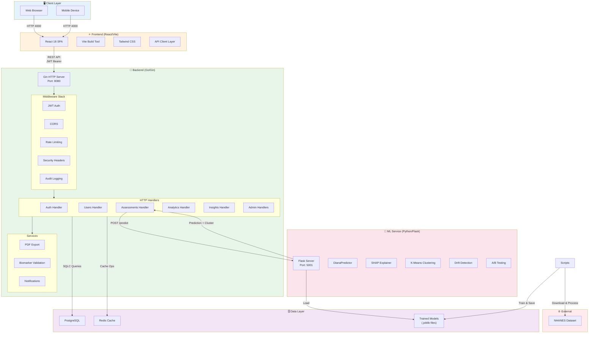

---

## Request Flow Diagrams

### 1. Authentication Flow

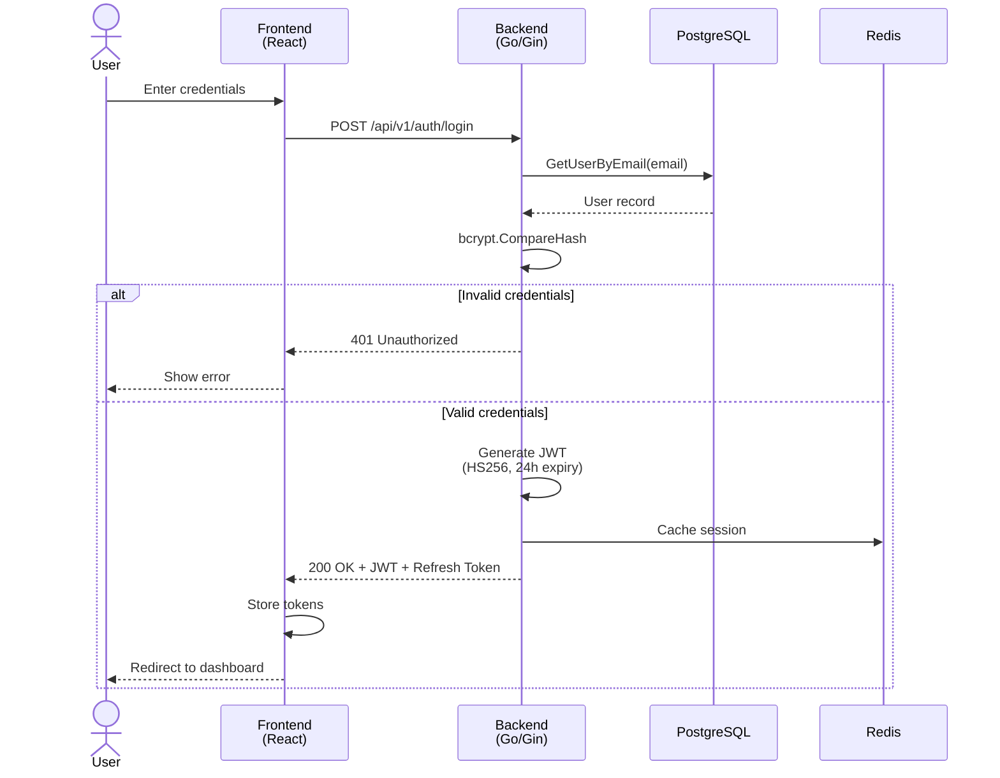

### 2. Assessment Creation Flow

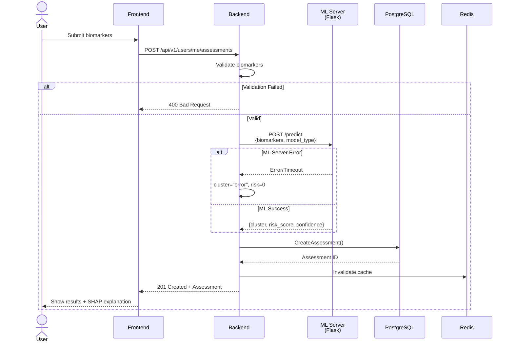

### 3. Admin Dashboard Flow

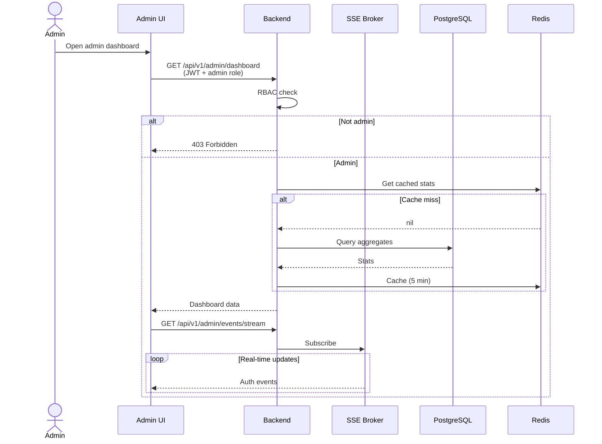

---

## Component Hierarchy

### Backend Package Structure

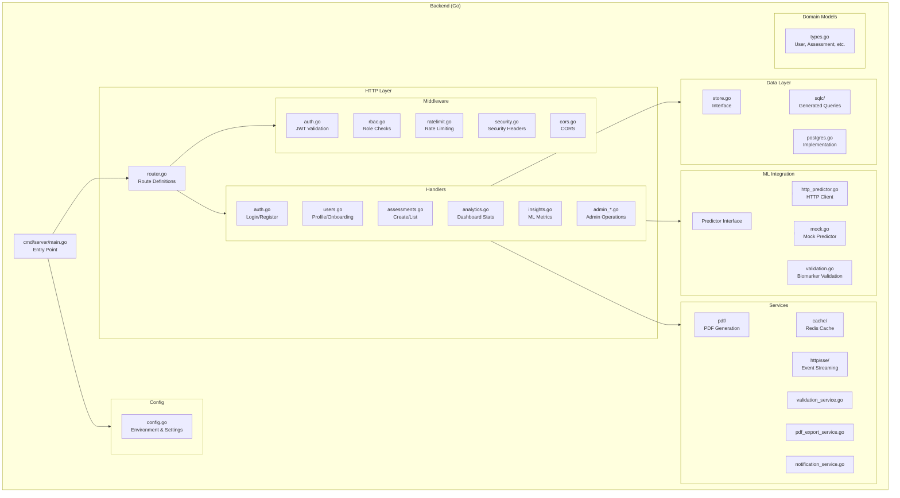

### Frontend Component Structure

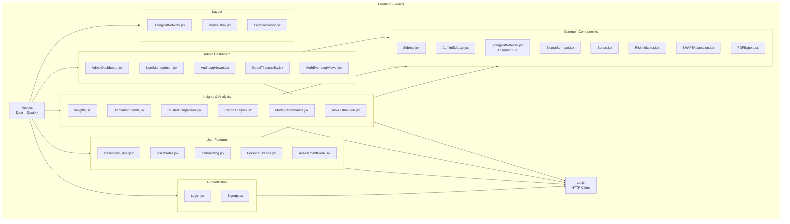

---

## Database Schema Overview

```mermaid
erDiagram
    USERS ||--o{ ASSESSMENTS : creates
    USERS ||--o{ REFRESH_TOKENS : has
    USERS ||--o{ AUDIT_EVENTS : generates
    USERS ||--o{ AUTH_EVENTS : generates
    USERS }o--o{ CLINICS : belongs_to
    ASSESSMENTS ||--o{ MODEL_RUNS : uses

    USERS {
        uuid id PK
        string email UK
        string password_hash
        string role
        boolean is_admin
        jsonb profile_data
        jsonb consent_settings
        boolean onboarding_completed
        timestamp created_at
        timestamp updated_at
        timestamp deleted_at
    }

    ASSESSMENTS {
        uuid id PK
        uuid user_id FK
        float hba1c
        float fbs
        float bmi
        float cholesterol
        float ldl
        float hdl
        float triglycerides
        float systolic_bp
        float diastolic_bp
        boolean family_history
        string activity_level
        string menopause_status
        string cluster
        float risk_score
        float confidence
        string model_version
        string dataset_hash
        string validation_status
        timestamp created_at
        timestamp updated_at
    }

    REFRESH_TOKENS {
        uuid id PK
        uuid user_id FK
        string token_hash
        timestamp expires_at
        timestamp created_at
    }

    AUDIT_EVENTS {
        uuid id PK
        uuid user_id FK
        string action
        string entity_type
        uuid entity_id
        jsonb details
        timestamp created_at
    }

    AUTH_EVENTS {
        uuid id PK
        uuid user_id FK
        string event_type
        string email
        string ip_address
        string user_agent
        boolean success
        jsonb metadata
        timestamp created_at
    }

    CLINICS {
        uuid id PK
        string name
        string code UK
        jsonb settings
        timestamp created_at
    }

    CLINIC_MEMBERS {
        uuid clinic_id FK
        uuid user_id FK
        string role
        timestamp joined_at
    }

    MODEL_RUNS {
        uuid id PK
        string model_version
        string dataset_hash
        float accuracy
        float precision
        float recall
        float f1_score
        jsonb confusion_matrix
        timestamp trained_at
        string trained_by
    }
```

---

## ML Pipeline Architecture

### Training & Inference Pipeline

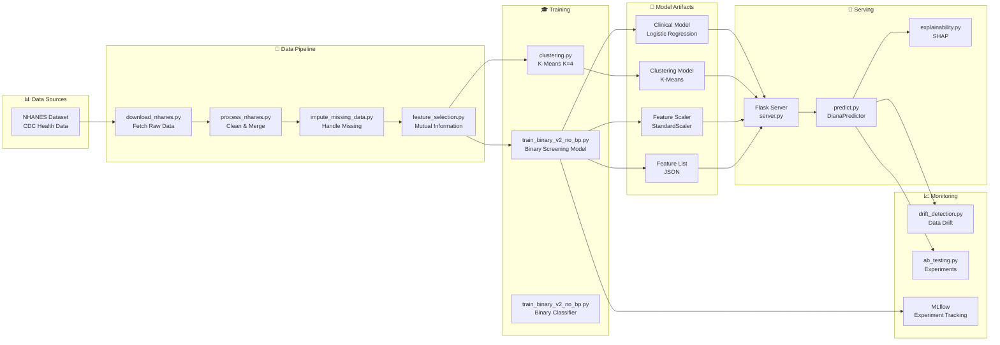

### ML Model Types

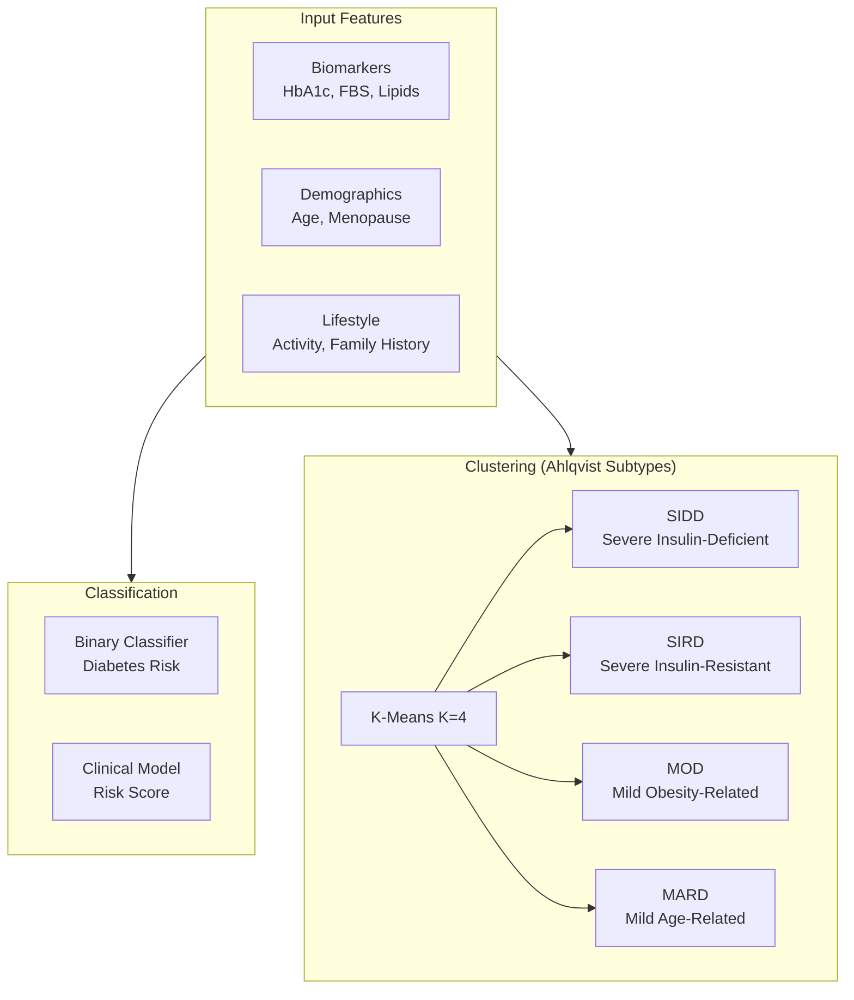

---

## Deployment Architecture

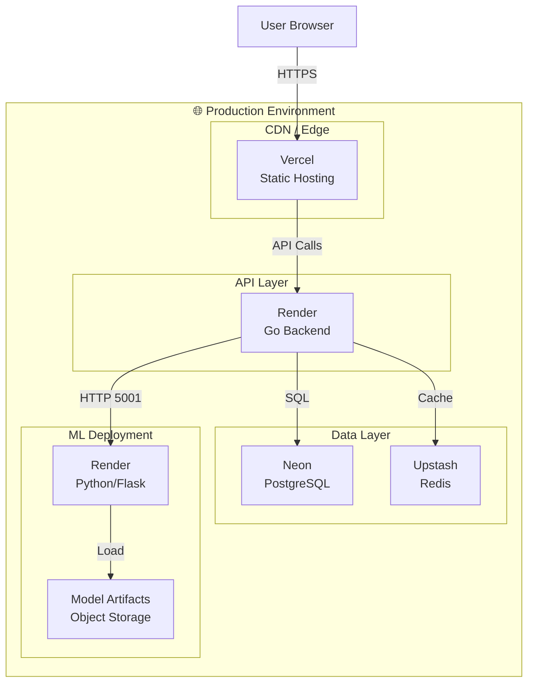

---

## API Endpoint Map

### Public Endpoints

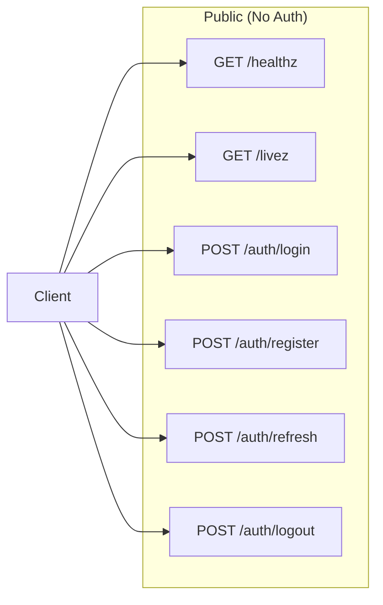

### Protected Endpoints

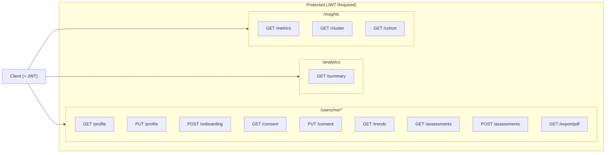

### Admin Endpoints

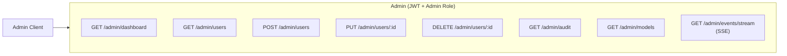

---

## Legend

| Symbol | Meaning |
|--------|---------|
| 🔵 Blue | Client Layer |
| 🟠 Orange | Frontend |
| 🟢 Green | Backend |
| 🩷 Pink | ML Service |
| 🟣 Purple | Data Layer |
| 🔴 Red | External/Error |

---

## Quick Reference

| Component | Port | Language | Framework |
|-----------|------|----------|-----------|
| Frontend | 4000 | JavaScript | React 18 + Vite |
| Backend | 8080 | Go 1.21+ | Gin |
| ML Server | 5001 | Python 3.10+ | Flask |
| PostgreSQL | 5432 | SQL | PostgreSQL 15+ |
| Redis | 6379 | - | Redis 7+ |

---

## Related Documentation

- [Detailed Architecture](./docs/01-architecture/detailed-architecture.md)
- [Backend Guide](./docs/02-guides/backend.md)
- [Frontend Guide](./docs/02-guides/frontend.md)
- [ML System](./docs/02-guides/ml-system.md)
- [Database Schema](./docs/02-guides/database.md)
- [Deployment Guide](./docs/06-operations/deployment.md)
