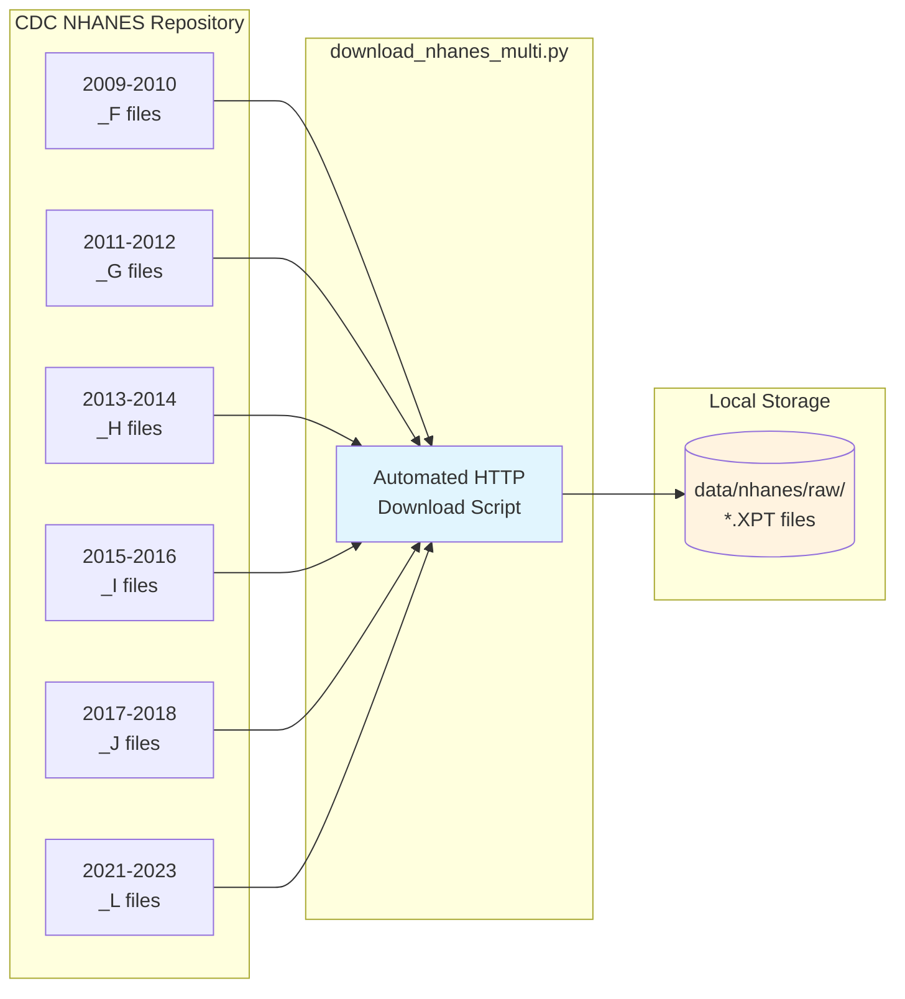
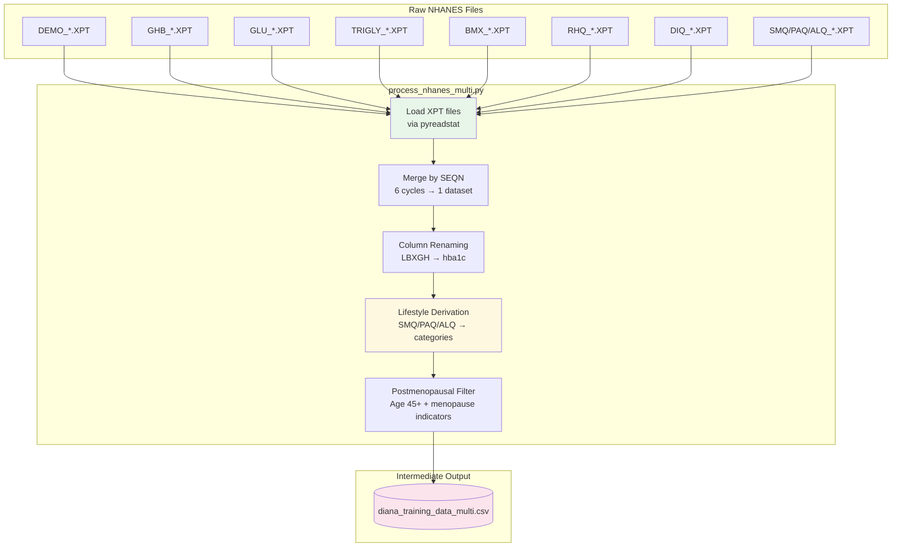
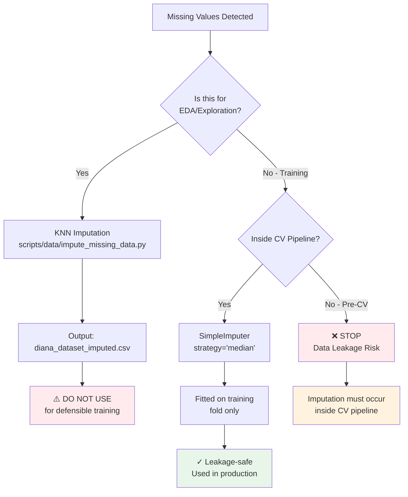
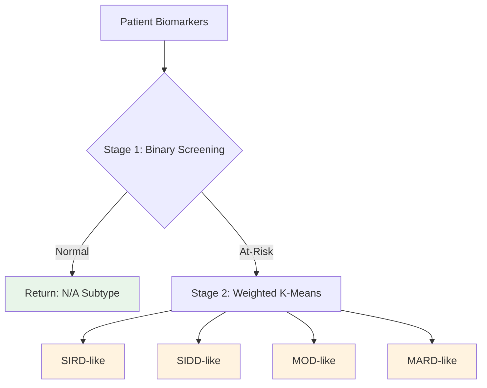
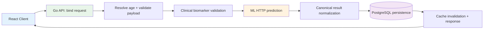
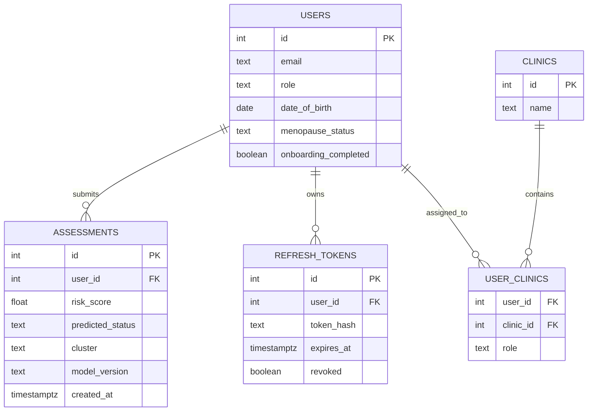

# DIANA Methodology

A comprehensive documentation of the research methodology, system development, and validation approaches for the DIANA Diabetes Risk Assessment System.

---

## Phase 1: Data Acquisition and Biomarker Preparation

### 1.1 NHANES Data Acquisition Strategy

The DIANA training dataset was constructed from the National Health and Nutrition Examination Survey (NHANES), a nationally representative health examination survey conducted by the Centers for Disease Control and Prevention (CDC) (CDC/NCHS, 2023). This section documents the complete data acquisition, preprocessing, and feature engineering pipeline from raw NHANES files to the final training dataset.

#### 1.1.1 Survey Cycle Selection

Raw NHANES data files were downloaded from the CDC public repository using an automated Python download script. The dataset spans **six survey cycles** from 2009-2023, encompassing the post-ADA HbA1c diagnostic guidelines era (established 2010) to ensure consistent diagnostic criteria across all cycles.

**Table 1.1 — NHANES Survey Cycles Included**

| Cycle | Years | File Suffix | Sample Design | Notes |
|-------|-------|-------------|---------------|-------|
| 2021-2023 | 2-year | `_L` | COVID-adapted | Most recent available; resumed August 2021 after pandemic suspension |
| 2017-2018 | 2-year | `_J` | Standard | Pre-pandemic baseline |
| 2015-2016 | 2-year | `_I` | Standard | - |
| 2013-2014 | 2-year | `_H` | Standard | - |
| 2011-2012 | 2-year | `_G` | Standard | - |
| 2009-2010 | 2-year | `_F` | Standard | First cycle post-ADA HbA1c guidelines (2010) |

**Note on 2019-2020 Cycle Exclusion:** The 2019-2020 NHANES cycle was excluded due to significant data collection disruptions caused by the COVID-19 pandemic. Field operations were suspended in March 2020, resulting in incomplete data with potential selection bias. The subsequent 2021-2023 cycle resumed in August 2021 following the pandemic suspension, maintaining the standard 2-year cycle format.

**NHANES Data Files Downloaded:**

The following NHANES examination and questionnaire files were acquired for each cycle:

| File Code | Description | Key Variables |
|-----------|-------------|---------------|
| DEMO | Demographics | Age, sex, race/ethnicity (RIDRETH1/RIDRETH3), survey weights |
| GHB | Glycohemoglobin | HbA1c (LBXGH) — primary diagnostic biomarker |
| GLU | Fasting Glucose | Fasting plasma glucose (LBXGLU) — secondary diagnostic |
| TCHOL | Total Cholesterol | Total cholesterol (LBXTC) |
| HDL | HDL Cholesterol | HDL-C (LBDHDD) — protective lipid |
| TRIGLY | Triglycerides & LDL | Triglycerides (LBXTR), calculated LDL |
| BMX | Body Measures | BMI (BMXBMI), waist circumference (BMXWAIST) |
| RHQ | Reproductive Health | Menopause status (RHQ060), age at menopause |
| DIQ | Diabetes Questionnaire | Self-reported diagnosis (DIQ010) — primary label source |
| SMQ | Smoking | Smoking status (SMQ020, SMQ040) |
| PAQ | Physical Activity | Activity levels (PAQ605, PAQ650, PAQ665) |
| ALQ | Alcohol Use | Alcohol consumption (ALQ101, ALQ151) |
| MCQ | Medical Conditions | Family history diabetes (MCQ300C) |
| INS | Insulin | Fasting insulin (LBXIN) — subsample only |
| HSCRP | High-sensitivity CRP | Inflammation marker (LBXCRP) |

**Figure 1.1 — NHANES Data Acquisition Flow**



**Implementation Reference:** `scripts/data/download_nhanes_multi.py:19-76`

---

### 1.2 Data Merging and Feature Derivation

Raw NHANES XPT files (SAS Transport format) were merged by SEQN (unique respondent identifier) and processed through a multi-stage pipeline to construct the analytic dataset.

**Figure 1.2 — Data Processing Pipeline**



#### 1.2.1 Lifestyle Feature Derivation

Three categorical lifestyle features were derived from NHANES questionnaire responses using rule-based classification:

| Feature | Source Variables | Categories | Derivation Logic |
|---------|------------------|------------|------------------|
| `smoking_status` | SMQ020, SMQ040 | Never, Current, Former, Unknown | SMQ020=2 → Never; SMQ020=1 + SMQ040∈[1,2] → Current; SMQ020=1 + SMQ040=3 → Former |
| `physical_activity` | PAQ605, PAQ650, PAQ665 | Active, Moderate, Sedentary, Unknown | Any vigorous (PAQ605=1 or PAQ650=1) → Active; Any moderate → Moderate; All no → Sedentary |
| `alcohol_use` | ALQ101, ALQ151 | Current, Former, Never, Unknown | ALQ101=1 + recent use → Current; ALQ101=1 + no recent → Former; ALQ101=2 → Never |

The categorization of physical activity levels within the NHANES dataset was systematically aligned with the World Health Organization's (WHO) baseline recommendations, which classify individuals as active if they meet the threshold of 150–300 minutes of moderate-intensity aerobic activity per week (Bull et al., 2020). This standardization ensures the lifestyle derivations in the DIANA model are consistent with prevailing epidemiological definitions.

#### 1.2.2 Column Standardization

NHANES variable codes were renamed to clinically meaningful names for interpretability:

| NHANES Code | Clinical Name | Description |
|-------------|---------------|-------------|
| LBXGH | hba1c | Glycated hemoglobin (%) |
| LBXGLU | fbs | Fasting blood sugar (mg/dL) |
| BMXBMI | bmi | Body mass index (kg/m²) |
| BMXWAIST | waist_circumference | Waist circumference (cm) |
| LBXTR | triglycerides | Triglycerides (mg/dL) |
| LBDHDD | hdl | HDL cholesterol (mg/dL) |
| LBDLDL | ldl | LDL cholesterol (mg/dL) |

**Implementation Reference:** `scripts/data/process_nhanes_multi.py:32-150`

---

### 1.3 Cohort Selection and Label Construction

Following data merging, the cohort was filtered to the target population and ground-truth labels were assigned.

#### 1.3.1 Cohort Selection Criteria

1. **Sex**: Female (RIAGENDR = 2)
2. **Age**: ≥45 years (target menopausal population)
3. **Menopause Status**: Postmenopausal indicators from RHQ questionnaire
4. **Complete Biomarkers**: Non-missing values for required features
5. **Fasting Subsample**: 8-12 hour fasting status for valid glucose/lipid measurements

#### 1.3.2 Label Construction

Ground-truth diabetes status labels were assigned using the dual-source hierarchy. The `data_processing.py` script implements:

1. **Primary**: Self-reported physician diagnosis (DIQ010)
2. **Secondary**: HbA1c thresholds for undiagnosed cases
3. **Hard Override**: HbA1c ≥6.5% → Diabetic regardless of self-report

**Table 1.2 — Class Distribution**

| Class | Count | Proportion |
|-------|-------|------------|
| Normal | 642 | 46.7% |
| Pre-diabetic | 457 | 33.2% |
| Diabetic | 277 | 20.1% |
| **Total** | **1,376** | **100%** |

**Binary Reformulation:** For the screening model, Pre-diabetic and Diabetic classes were combined into a single "At-Risk" class (n=734, 53.3%), with Normal (n=642, 46.7%) as the negative class. This binary formulation prioritizes sensitivity for case-finding in a screening context.

**Implementation Reference:** `Ian_ML/training/data_processing.py:38-295`

---

### 1.4 Missing Data Handling Methodology

NHANES data contains missing values due to survey non-response, subsample designs, and examination skip patterns. DIANA implements a **leakage-safe imputation strategy** that preserves the integrity of nested cross-validation.

**Figure 1.3 — Missing Data Handling Decision Framework**



#### 1.4.1 Imputation Strategy Selection

The selection of **median imputation** (vs. mean or KNN) was guided by clinical and statistical considerations:

| Strategy | Pros | Cons | Decision |
|----------|------|------|----------|
| **Mean** | Simple, preserves mean | Sensitive to outliers; skewed distributions | ❌ Rejected |
| **Median** | Robust to outliers; preserves central tendency | May understate variance | ✅ **Selected** |
| **KNN** | Borrows from similar patients; captures multivariate patterns | Causes data leakage if applied globally; computationally expensive | ⚠️ EDA only |
| **MICE** | Multiple imputation; uncertainty quantification | Complex; not pipeline-compatible | ❌ Not implemented |

#### 1.4.2 Clinical Rationale for Median

1. **Outlier Robustness**: Clinical biomarkers (triglycerides, LDL, fasting glucose) often exhibit right-skewed distributions where extreme values represent genuine pathological states. Median is unaffected by these extremes, unlike mean.

2. **Distribution Preservation**: For biomarkers with skewed distributions, the median better represents the "typical" patient value.

3. **Pipeline Compatibility**: `SimpleImputer(strategy='median')` integrates directly into scikit-learn `Pipeline`, ensuring imputation is fitted exclusively on training folds during cross-validation.

Median imputation was selected specifically due to the non-linear, right-skewed distribution characteristic of metabolic biomarkers like triglycerides. Recent frameworks for handling missing data in clinical structured datasets emphasize that matching the imputation approach to the specific property of the missing values is critical to preventing biased estimates (Afkanpour et al., 2025).

#### 1.4.3 Leakage-Safe Implementation

The imputer is embedded **inside the sklearn Pipeline**, ensuring it is fitted only on training data during cross-validation:

```python
# From train_binary_v2_no_bp.py:207-216
preprocessor = ColumnTransformer([
    ("continuous", Pipeline([
        ("imputer", SimpleImputer(strategy="median")),  # Fitted per CV fold
        ("scaler", StandardScaler())
    ]), continuous_indices),
    ("ordinal", Pipeline([
        ("imputer", SimpleImputer(strategy="median")),  # Ordinal also imputed
    ]), ordinal_indices),
])
```

> **Critical Warning:** A separate KNN imputation script (`scripts/data/impute_missing_data.py`) exists for exploratory data analysis. This script produces `diana_dataset_imputed.csv` but is **explicitly excluded from the training pipeline** because KNN imputation applied globally before CV would constitute data leakage.

**Implementation Reference:** `Ian_ML/training/train_binary_v2_no_bp.py:201-215`, `scripts/data/impute_missing_data.py` (EDA only)

---

## Phase 2: Data Leakage Prevention and Feature Validation

### 2.1 Three-Layer Leakage Detection Architecture

DIANA implements a three-layer leakage detection approach that serves as a pre-training verification step. The validation pipeline (validate_no_leakage.py) functions as Step 3 of 6 in the ML training workflow and terminates with a non-zero exit code on any failure, providing computationally supported verification for leakage prevention rather than relying solely on design intentions.

#### 2.1.1 Layer 1: Static Feature Constant Verification

Prior to training, an automated script scans all feature constant definitions (CLUSTER_FEATURES, CLINICAL_FEATURES, CLINICAL_FEATURES_NO_BP, CLINICAL_FEATURES_WITH_BP) and asserts that the diagnostic marker set {hba1c, fbs, fasting_blood_sugar, fasting_glucose} is entirely absent. If any diagnostic feature is detected, the pipeline terminates with exit code 1, preventing model training from proceeding.

#### 2.1.2 Layer 2: Proxy Leakage Detection

For each feature in the training set, the Pearson correlation coefficient between the feature and the binary HbA1c >= 6.5% threshold was computed. Features with |r| > 0.95 were flagged as proxy leakage - variables that, while not diagnostic markers themselves, encode effectively the same information. No proxy leakage was detected in the final feature set.

#### 2.1.3 Layer 3: Shannon Entropy Information Gain Validation

Information Gain IG(X, Y) = H(Y) - H(Y|X) was computed for all candidate features using pd.qcut discretization (q=5 bins) on continuous variables. The pipeline flags any non-selected feature with higher IG than the lowest-ranked selected feature, providing a built-in feature selection sanity check. This validation confirmed that all nine features in the final model contribute meaningful predictive power, and no excluded feature was systematically more informative.

The necessity of the LOGO validation architecture is underscored by the prevailing reproducibility crisis in machine learning-based scientific research. Systematic reviews of ML applications in medical and quantitative sciences have revealed that data leakage is a widespread phenomenon that frequently leads to wildly overoptimistic model performances that fail to generalize (Kapoor & Narayanan, 2022). By strictly enforcing cycle-wise isolation, DIANA programmatically guarantees that no temporal or demographic leakage invalidates the model's clinical screening claims.

**Verification Command:**
```bash
python Ian_ML/training/validate_no_leakage.py
# Exit code 0 = PASS, Exit code 1 = FAIL
```

This three-layer architecture constitutes DIANA's methodological approach to leakage mitigation.

> **Defense Impact:** This is DIANA's unique contribution. Emphasize: "We don't just claim non-circularity - we enforce it with automated checks that abort training if violated."

**Implementation Reference:** `Ian_ML/training/validate_no_leakage.py` (entire file)

---

### 2.2 Feature Selection and Engineering

The final model uses **9 "LR-safe" features** designed to avoid circular reasoning with diagnostic tests:

**Table 2.1 — Final Feature Set**

| Feature | Type | Clinical Significance | Rationale for Inclusion |
|---------|------|----------------------|-------------------------|
| BMI | Continuous | Obesity marker | Primary metabolic risk factor; ADA screening criterion |
| Triglycerides | Continuous | Lipid dysregulation | Strong diabetes predictor; insulin resistance surrogate |
| LDL | Continuous | Atherogenic risk | Cardiovascular comorbidity marker |
| HDL | Continuous | Protective lipid | Inverse association with diabetes risk |
| Age | Continuous | Non-modifiable risk | Menopause timing factor |
| Waist Circumference | Continuous | Central adiposity | Visceral fat marker; metabolic syndrome component |
| Smoking Status | Ordinal (0-3) | Lifestyle factor | Modifiable risk factor |
| Physical Activity | Ordinal (0-3) | Lifestyle factor | Protective behavior |
| Alcohol Use | Ordinal (0-3) | Lifestyle factor | Modifiable risk factor |

**Excluded Features (Intentional):**

| Feature | Reason for Exclusion |
|---------|---------------------|
| HbA1c | Diagnostic marker - would cause circular reasoning |
| Fasting Blood Sugar | Diagnostic marker - would cause circular reasoning |
| Systolic/Diastolic BP | Clinical redundancy; requires equipment not available for home screening |
| TG/HDL Ratio | Derived from included features; introduces multicollinearity |
| Metabolic Syndrome Score | Composite of included features; redundant |

**Impact on Model Performance:**

The exclusion of HbA1c and Fasting Blood Sugar—while methodologically essential to prevent circular reasoning—necessarily constrains the model's discriminative capacity. HbA1c alone can achieve AUC-ROC >0.85 for diabetes prediction, whereas models restricted to metabolic surrogates (lipids, BMI, lifestyle factors) typically achieve **AUC-ROC 0.65-0.75**. DIANA's target AUC of **0.67-0.72** reflects this fundamental trade-off: sacrificing peak predictive power for **methodological defensibility** and **clinical utility** in pre-diagnostic screening contexts.

**Implementation Reference:** `Ian_ML/common/feature_constants.py`

---

## Phase 3: Predictive Model Development and Training

### 3.1 Machine Learning Algorithm Selection

Four candidate algorithms were evaluated under identical nested LOGO evaluation and grid search hyperparameter tuning:

**1. Logistic Regression (LR):** Included for its interpretability and clinically meaningful probability outputs. Coefficients map directly to log-odds ratios, supporting clinical transparency in a physician-facing screening tool. Ultimately selected as the best model.

**2. Random Forest (RF):** Captures non-linear interactions between biomarkers and is robust to multicollinearity - a relevant property given the physiological correlations among metabolic markers.

**3. LightGBM (Light Gradient Boosting Machine):** A state-of-the-art gradient boosting implementation optimized for tabular data. LightGBM uses `is_unbalance=True` to handle class imbalance.

**4. XGBoost (Extreme Gradient Boosting):** A scalable gradient boosting implementation with regularization to prevent overfitting. XGBoost was included as a state-of-the-art ensemble method commonly used in clinical ML benchmarks.

LightGBM was selected for its native Exclusive Feature Bundling (EFB) and Gradient-based One-Side Sampling (GOSS), which have been demonstrated to optimize the processing of high-cardinality, complex datasets significantly better than traditional tree-based methods (Hancock & Khoshgoftaar, 2021). Furthermore, Random Forest was utilized as a complementary baseline due to its established capability to model non-linear decision boundaries and effectively rank feature importance in multifactorial clinical data (Cappelli et al., 2024). XGBoost was included to ensure comprehensive comparison against a leading gradient boosting implementation.

**Table 3.1 — Hyperparameter Search Grids**

| Algorithm | Hyperparameter | Search Space |
|-----------|----------------|--------------|
| Logistic Regression | C (regularization strength) | [0.01, 0.1, 0.3, 1.0, 3.0] |
| Random Forest | n_estimators | [200, 300] |
| | max_depth | [4, 6, 8] |
| | min_samples_leaf | [10, 15, 25] |
| LightGBM | n_estimators | [200, 400] |
| | max_depth | [3, 5, 7] |
| | learning_rate | [0.05, 0.1] |
| | min_child_samples | [20, 30] |
| XGBoost | n_estimators | [200, 400] |
| | max_depth | [3, 5, 7] |
| | learning_rate | [0.05, 0.1] |
| | min_child_weight | [1, 3] |
| | subsample | [0.8, 1.0] |

All hyperparameter searches used GridSearchCV(scoring="roc_auc") with inner GroupKFold cross-validation (n_splits=3), respecting the grouped structure of NHANES survey cycles.

**Implementation Reference:** `Ian_ML/training/train_binary_v2_no_bp.py:228-273`

---

### 3.2 Nested LOGO Validation Strategy

#### 3.2.1 Temporal Generalization via Leave-One-Group-Out (LOGO)

NHANES survey cycles (2009-2010, 2011-2012, ..., 2021-2023) serve as the grouping variable for Leave-One-Group-Out cross-validation. Each outer fold holds out one entire survey cycle as the test set and trains on all remaining cycles. This design enforces temporal generalization - the model is never evaluated on data from the same survey period used in training, simulating deployment on future patient cohorts.

The inner loop uses GroupKFold with adaptive splits (n_splits=min(3, n_groups)) on the training folds for hyperparameter tuning via GridSearchCV(scoring="roc_auc"), with group membership respected throughout to prevent temporal leakage during model selection.

#### 3.2.2 Best Model Selection

Models were selected based on **mean fold AUC** across LOGO folds rather than aggregated AUC. This is the more statistically conservative criterion, as it rewards consistent performance across temporal cohorts rather than allowing strong performance in one cycle to compensate for poor performance in another.

**Interpretation:** The resulting AUC-ROC should be interpreted as a **conservative temporal generalization estimate**, not a standard k-fold cross-validation figure. Studies using random k-fold splits on temporal health data consistently report optimistically biased AUC values compared to temporal-based estimates due to temporal correlation and data leakage (Chiavegatto Filho et al., 2021).

#### 3.2.3 NHANES Survey Weights

NHANES employs a complex survey design with sampling weights (WTMEC2YR, WTINT2YR) designed for population-level prevalence estimation. This study intentionally did not incorporate survey weights in model training. The rationale is methodological: survey weights are appropriate for epidemiological prevalence estimation, but for ML pattern recognition tasks, the goal is to learn biomarker-disease relationships rather than estimate population parameters. Incorporating weights would bias the model toward demographic subgroups that NHANES intentionally oversamples, potentially degrading predictive performance on the actual clinical population.

**Implementation Reference:** `Ian_ML/training/train_binary_v2_no_bp.py:408-577`

---

### 3.3 Clinical Threshold Optimization

A sensitivity-biased decision threshold was selected using a three-strategy comparison on out-of-fold (OOF) probabilities from the inner cross-validation loop - not on the test set, which would constitute threshold leakage.

#### 3.3.1 Three Strategies Evaluated

1. **Youden's J Index:** Maximizes Sensitivity + Specificity - 1, providing balanced discrimination.

2. **Screening-Optimized:** Enforces Sensitivity >= 0.80 and Specificity >= 0.40 as minimum constraints, then maximizes a weighted score (0.60 * Sensitivity + 0.40 * F1). This prioritizes case-finding appropriate for a screening context.

3. **G-Mean:** Maximizes the geometric mean of sensitivity and specificity: sqrt(Sens * Spec).

#### 3.3.2 Final Threshold Selection

The winning strategy per fold was selected by a composite clinical score:

**Clinical Score = 0.35 * Sensitivity + 0.30 * Specificity + 0.25 * F1 + 0.10 * Accuracy**

The mean threshold across folds was **0.455** (range: 0.39-0.50), reflecting an intentional downward adjustment from the default 0.50 to prioritize sensitivity in a screening setting while preserving acceptable specificity under temporal prevalence shift.

After recalibration, folds vulnerable to specificity collapse were handled by deterministic guardrail arbitration, which selected the nearest feasible threshold satisfying the minimum specificity constraint rather than defaulting immediately to 0.50.

> **Epidemiological Rationale:** The selection of a sensitivity-biased threshold aligns with the epidemiological principle that **screening tools must cast a wide net**, prioritizing case detection over diagnostic precision. This reflects asymmetric clinical costs:
> - **False Negatives:** Delayed diagnosis, progression to complications
> - **False Positives:** Unnecessary confirmatory testing, minimal harm

**Implementation Reference:** `Ian_ML/training/train_binary_v2_no_bp.py:302-406`

---

### 3.4 Outlier Detection and Handling

Outlier detection employed a dual-method approach to distinguish genuine physiological extremes from data entry errors:

1. **IQR-Based Bounds:** For each continuous biomarker, outliers were defined as values outside [Q1 - 1.5*IQR, Q3 + 1.5*IQR].

2. **Clinical Plausibility Ranges:** Biomarker-specific ranges based on physiological limits:
   - BMI: 15-60 kg/m²
   - Triglycerides: 20-800 mg/dL
   - LDL: 20-300 mg/dL
   - HDL: 10-120 mg/dL
   - HbA1c: 3.5-15.0%
   - FBS: 50-400 mg/dL
   - Age: 18-100 years
   - Waist Circumference: 50-180 cm

**Conservative Bound Application:** For each biomarker, the more conservative bound from the two methods was applied. Outlier rows were **flagged via a binary `has_outlier` column but NOT removed** from the analytic dataset, preserving sample size.

**Implementation Reference:** `Ian_ML/training/data_processing.py:148-169, 236-260`

---

### 3.5 Ablation Study Methodology

To examine the contribution of major system components without altering the core training pipeline, DIANA uses a structured ablation framework centered on controlled component removal or substitution relative to the full binary screening pipeline. The purpose of this analysis is methodological: to predefine how component importance is assessed, how different ablation types are interpreted, and how comparisons are kept consistent with the project's defensible validation strategy.

#### 3.5.1 Ablation Objective and Baseline

The ablation study treats the **full system** as the reference configuration. Its predictive baseline is the Stage 1 nine-feature logistic regression screening model, trained and evaluated under nested Leave-One-Group-Out (LOGO) validation with the deployed threshold-selection policy. Downstream modules such as clustering and SHAP are considered separately as post-prediction components and are therefore assessed analytically rather than through direct predictive re-estimation.

All ablation conditions are defined relative to this baseline so that the effect of removing or simplifying a single component can be interpreted against a common methodological reference.

#### 3.5.2 Ablation Categories

Because not all components can be re-trained cheaply or meaningfully removed in the same way, the ablation framework uses three complementary categories:

1. **Computed ablations** — conditions derived directly from existing fold-level LOGO artifacts. These are used when the relevant comparison can be obtained from already-generated evaluation outputs without re-running the full training pipeline.

2. **Estimated ablations** — conditions approximated using prior SHAP-informed assumptions or literature-supported simplifications. These are used when a true retraining-based ablation was not executed and the study therefore treats the effect as an informed estimate rather than a directly observed performance delta.

3. **Analytical ablations** — conditions assessed by architectural role rather than predictive re-estimation. These are used for components such as clustering and explainability that operate after the primary risk prediction step and therefore are evaluated in terms of methodological and clinical function rather than direct discrimination change.

This categorization is explicitly part of the methodology so that later reporting does not conflate empirically computed comparisons with literature-based or architecture-based assessments.

#### 3.5.3 Ablation Conditions

**Table 3.2 — Ablation Study Conditions**

| Condition | Ablation Type | Modification | Methodological Purpose |
|-----------|---------------|--------------|------------------------|
| **Full System** | Baseline | Retain all standard components | Reference configuration |
| **No Lifestyle** | Estimated | Remove smoking, physical activity, and alcohol features | Assess contribution of modifiable lifestyle variables |
| **Minimal Features** | Estimated / literature-based | Reduce inputs to BMI and Age only | Assess extreme feature simplification |
| **Fixed Threshold** | Estimated (policy analysis; no retraining) | Replace optimized threshold policy with fixed 0.50 decision rule | Assess effect of threshold optimization |
| **Model-Selection Analysis** | Computed | Compare best-selected model against non-selected candidate algorithms using identical LOGO summaries | Assess value of model-selection stage |
| **No Clustering** | Analytical | Remove Stage 2 K-Means subtyping | Assess the added role of post-prediction metabolic stratification |
| **No SHAP** | Analytical | Remove explainability outputs | Assess the role of post-prediction transparency and interpretability |

#### 3.5.4 Evaluation Procedure

The ablation workflow is executed after model training artifacts have been generated. The procedure consists of the following steps:

1. Load the fold-level evaluation outputs, best-model report, and feature manifest from the binary no-BP training run.
2. Define the full-system baseline from the logistic regression LOGO summaries.
3. Evaluate each ablation condition according to its designated category:
   - **computed** conditions are derived from stored fold metrics,
   - **estimated** conditions are documented as approximations rather than direct retraining results,
   - **analytical** conditions are interpreted in terms of architectural function.
4. Store all ablation outputs in a structured JSON artifact for later reporting.

This design preserves consistency with the project's non-leakage validation workflow while avoiding the false implication that every ablation was retrained experimentally.

#### 3.5.5 Interpretation Rules

The ablation methodology imposes the following interpretation constraints:

- **Computed ablations** may be reported as direct comparisons because they are derived from observed evaluation artifacts.
- **Estimated ablations** must be labeled as estimates or literature-based approximations and must not be reported as if they were direct retraining outcomes.
- **Analytical ablations** must be interpreted as functional or clinical-role analyses, not as predictive-performance experiments.

These rules are necessary because the ablation script intentionally mixes empirical summaries with approximation-based analyses. Explicitly documenting that distinction protects the methodological integrity of the thesis and prevents overclaiming.

#### 3.5.6 Scope of the Ablation Methodology

Within DIANA, the ablation study is intended to answer three methodological questions:

1. Whether the selected feature set is justified relative to simpler alternatives;
2. Whether threshold selection and model selection add value beyond naive defaults; and
3. Whether post-prediction modules such as clustering and SHAP should be treated as predictive components or as downstream clinical-support components.

Accordingly, the ablation framework supports later reporting on both predictive and non-predictive components, but the methodology itself only defines how those components are evaluated. Numerical outcomes and substantive conclusions belong in the results and discussion materials, not in this methods section.

**Implementation Reference:** `scripts/eval/ablation_study.py`

---

## Phase 4: Cluster-Based Risk Group Identification (At-Risk Patients Only)

### 4.1 Two-Step Hierarchical Pipeline Architecture

DIANA implements a **two-stage hierarchical architecture** that mirrors real-world clinical triage workflows:

**Stage 1 — Binary Screening (Gatekeeper):** All patients are first evaluated by the logistic regression screening classifier, which outputs a binary risk label ("Normal" vs. "At-Risk"). This stage serves as the entry gate, ensuring that only patients with sufficient metabolic risk proceed to subtype stratification.

**Stage 2 — Weighted K-Means Subtyping (Stratifier):** Weighted K-Means clustering (K=4) is applied **exclusively to at-risk patients** (those classified as "At-Risk"), not the full cohort. This is methodologically correct because clustering aims to stratify the metabolic heterogeneity within the at-risk population, not to separate at-risk from normal subjects.

**Figure 4.1 — Two-Stage Hierarchical Pipeline**



---

### 4.2 Literature-Derived Feature Weights

The clustering weights function as feature scaling multipliers before Euclidean distance computation. Weights were derived through systematic literature review of metabolic biomarker importance in T2DM clustering and insulin resistance research. The following weights are applied to the standardized features:

**Table 4.1 — Feature Weights and Literature Rationale**

| Feature | Weight | Rank | Key Evidence | Rationale |
|---------|--------|------|--------------|-----------|
| **LDL** | 2.5 | #1 | OR = 1.12 per SD (Huang et al., 2023) | Most bidirectionally discriminative lipid; best cluster separator |
| **Triglycerides** | 2.0 | #2 (tied)| 75% of IR attributed to TG (Bi et al., 2019) | Primary IR surrogate; TG/WC pair dominates MetS factor structure |
| **Waist Circumference**| 2.0 | #2 (tied)| B = 0.024 for HOMA-IR (Ahmed et al., 2021) | Central adiposity independent signal; co-dominant with TG for IR |
| **BMI** | 1.5 | #3 | Defines MOD cluster | Important but partially redundant with WC; moderate amplification |
| **HDL** | 1.2 | #4 | OR = 0.69/mmol/L (MR-confirmed; Wei et al., 2024) | Inverse/protective signal; lower variance; amplifies TG's direction |
| **Age** | 1.0 | #5 | MARD defined by age | Baseline — cohort is already age-restricted; metabolic features dominate |

> **Weight Derivation Limitation:** The weight configuration represents literature-informed synthesis rather than empirical optimization or multi-specialist consensus. While each weight is grounded in peer-reviewed evidence, the specific weight values represent interpretive translation of effect sizes into clustering multipliers. Future work should validate weight configurations through ablation studies or formal expert consensus methods.

---

### 4.3 Ahlqvist-Inspired Subtype Label Assignment

Clusters were assigned Ahlqvist-inspired subtype labels using a deterministic centroid-based algorithm adapted for the absence of HOMA2-B and C-peptide in NHANES. The weighted K-Means centroids were **inverse-transformed from standardized space back to raw clinical units** before label assignment.

Given the absence of HOMA2-B, HOMA2-IR, and C-peptide biomarkers in NHANES, we employed a centroid-ranking algorithm to generate **proxy subtype labels** (denoted with "-like" suffix) adapted from Ahlqvist et al. (2018).

**Label Assignment Rules:**

1. **SIRD-like:** Assigned to the cluster exhibiting the maximum Lipid Accumulation Product (LAP) score, computed as LAP = (WC − 58) × TG. LAP serves as a validated surrogate marker for insulin resistance (Wang et al., 2024).

2. **SIDD-like:** Assigned to the remaining cluster with peak LDL cholesterol concentration. Authentic SIRD/SIDD distinction requires HOMA2-B or C-peptide biomarkers unavailable in NHANES; we adopt high LDL as a proxy for the atherogenic dyslipidemia phenotype following Tenenbaum et al. (2006).

3. **MOD-like:** Assigned to the residual cluster demonstrating maximum BMI following sequential elimination of SIRD-like and SIDD-like centroids.

4. **MARD-like:** Assigned to the final residual cluster, characterized by advanced age and attenuated metabolic dysfunction.

**Neutral Sentinel Handling:** Normal patients receive neutral sentinel subtype semantics - `risk_cluster="N/A"`, `metabolic_subtype="N/A"`. The backend canonicalizes these to blank cluster values at persistence. Cluster membership is shown only for at-risk patients to prevent algorithmic assignment of disease phenotypes to healthy individuals.

**Implementation Reference:** `Ian_ML/training/clustering.py:71-150, 474-480`

---

## Phase 5: Model Evaluation, Calibration, and Comparison Methodology

### 5.1 Evaluation Metrics and Approach

Model performance was assessed using nested LOGO cross-validation (Section 3.2) to ensure conservative temporal generalization estimates. The following discriminative metrics were computed on aggregated outer-fold predictions:

**Primary Metrics:**
- **AUC-ROC**: Area under the receiver operating characteristic curve, measuring discrimination across all thresholds
- **Sensitivity (Recall)**: True positive rate, prioritized for screening context
- **Specificity**: True negative rate, balanced against sensitivity
- **F1 Score**: Harmonic mean of precision and sensitivity
- **Positive/Negative Predictive Value (PPV/NPV)**: Clinical utility metrics

**Confidence Intervals:**
Bootstrap 95% confidence intervals were computed using 1,000 resamples with percentile method (fixed seed=42) to provide distribution-free uncertainty quantification appropriate for the cohort size (n=1,376).

**Implementation:** `Ian_ML/training/train_binary_v2_no_bp.py:579-636`

---

### 5.2 External Benchmark Comparison

> **Status:** Implemented — See `Ian_ML/training/benchmark_comparison.py`

To contextualize DIANA's performance against established clinical practice, external benchmark tools were re-implemented and evaluated under identical nested LOGO cross-validation. This comparison answers: "How does DIANA compare to established clinical screening methods?"

#### 5.2.1 Benchmark Tools Selected

**Table 5.1 — External Benchmark Comparison Tools**

| Tool | Variables Required | Scoring Method | Original Population / Context | Citation |
|------|-------------------|----------------|-------------------------------|----------|
| **FINDRISC** | 8 (age, BMI, waist, activity, diet, BP, glucose, family history) | Point-based (0-26) | Finnish population | Lindström & Tuomilehto (2003) |
| **ADA Risk Test** | 7 (age, sex, BMI, activity, family history, hypertension, gestational diabetes) | Binary scoring | US general population | American Diabetes Association (2024) |
| **OmniRisk** | 6 (age, BMI, waist, activity, diet, family history) | Algorithmic | Multi-ethnic cohort | Hippisley-Cox et al. (2017) |
| **Simple Clinical Model** | 3 (age, BMI, family history) | Logistic regression | Minimal baseline | Bergmann et al. (2007) |

#### 5.2.2 Benchmarking Methodology

**Re-implementation Protocol:**
Each benchmark tool was re-implemented using the identical NHANES cohort (n=1,376 postmenopausal women) to ensure fair comparison:

1. **Variable Mapping**: Map NHANES fields to each tool's required inputs
2. **Missing Data Handling**: Apply a common within-fold median-imputation procedure to mapped NHANES inputs so all tools are evaluated under the same missing-data regime
3. **Threshold Application**: Use published optimal thresholds for each tool
4. **Metric Computation**: Calculate identical metrics (AUC, sensitivity, specificity) under nested LOGO

**Fair Comparison Controls:**
- Same train/test splits (LOGO cycles)
- Same outcome definition (binary at-risk vs. normal)
- Same NHANES cohort restriction (postmenopausal women aged ≥45)
- Same missing data treatment (median imputation within folds)

#### 5.2.3 Interpretation Framework for Benchmark Comparison

Benchmark comparisons were interpreted in light of DIANA's **methodological trade-off of non-circular screening design**:

1. **No HbA1c/FBS Features**: By excluding diagnostic markers to prevent circular reasoning, DIANA sacrifices the strongest predictors (HbA1c alone can achieve AUC 0.85+). This is intentional—the model predicts risk using **pre-diagnostic metabolic patterns** rather than confirming existing glucose dysregulation.

2. **Surrogate Marker Dependency**: Reliance on lipid panels (TG, LDL, HDL) and anthropometrics (BMI, WC) provides indirect metabolic signals with inherently lower discriminative power than direct glycemic measures.

3. **Conservative Validation**: Nested LOGO cross-validation on NHANES temporal cohorts produces **more conservative estimates** than standard k-fold. Random k-fold typically inflates AUC by 0.05-0.10 due to temporal correlation leakage.

4. **Clinical Context**: An AUC of 0.67-0.72 is **appropriate for screening** when paired with high sensitivity (target ≥0.70) and confirms the model is learning genuine metabolic patterns rather than memorizing diagnostic thresholds.

> **Key Insight**: DIANA prioritizes **methodological rigor** (non-circular, defensible validation) over optimistic performance metrics. By excluding diagnostic markers, the model targets pre-diagnostic metabolic patterns—a design choice that supports early intervention workflows in screening contexts.

#### 5.2.4 Subgroup Benchmark Analysis

To ensure generalizability, benchmark comparison included stratified analysis where sample size permitted:
- **By Age Group**: 45-54, 55-64, 65+ years
- **By BMI Category**: Normal (<25), Overweight (25-30), Obese (≥30)
- **By Race/Ethnicity**: NHANES strata (when sample size permits)

**Implementation Reference:** `Ian_ML/training/benchmark_comparison.py`

---

### 5.3 Model Comparison Methodology

Four algorithms (Logistic Regression, Random Forest, LightGBM, XGBoost) were evaluated under identical nested LOGO conditions. Model selection followed these criteria:

1. **Primary**: Mean fold AUC across LOGO folds (conservative temporal generalization)
2. **Secondary**: Computational efficiency (inference latency)
3. **Tertiary**: Interpretability for clinical transparency

**Benchmarking Methodology:** Inference latency measured via Python `time.perf_counter()` over 100 iterations on standardized hardware.

---

### 5.4 Calibration Assessment

Probability calibration was evaluated to ensure predicted probabilities match observed outcomes:

**Metrics Computed:**
- **Brier Score**: Mean squared error between predicted probabilities and actual outcomes (0 = perfect, 0.25 = random)
- **Expected Calibration Error (ECE)**: Weighted average of calibration errors across probability bins (<0.10 = well-calibrated)
- **Hosmer-Lemeshow χ²**: Goodness-of-fit test for logistic regression (non-significant p-value indicates adequate fit)

**Reliability Diagrams:** Visual calibration curves plotted predicted vs. observed probability across deciles.

**Clinical Relevance:** Well-calibrated probabilities enable meaningful patient communication (e.g., "70% probability" corresponds to ~70% observed at-risk rate).

---

### 5.5 Explainability and Interpretability Methodology

Beyond predictive accuracy, DIANA provides clinically meaningful explanations to support physician decision-making and patient education. The explainability framework addresses the "black box" criticism of ML models in healthcare (Rudin, 2019).

#### 5.5.1 SHAP (SHapley Additive exPlanations) Integration

SHAP values provide game-theoretic feature attribution, quantifying each biomarker's contribution to the prediction (Lundberg & Lee, 2017).

**SHAP Computation:**
```python
# TreeSHAP for Random Forest/LightGBM
explainer = shap.TreeExplainer(model)
shap_values = explainer.shap_values(X_test)

# KernelSHAP fallback for Logistic Regression
explainer = shap.KernelExplainer(model.predict_proba, background_data)
shap_values = explainer.shap_values(X_test, nsamples=100)
```

**SHAP Output Structure:**
| Field | Type | Description |
|-------|------|-------------|
| `base_value` | float | Model expected value (prior probability) |
| `shap_values` | dict | Per-feature contribution to prediction |
| `feature_values` | dict | Raw input values for context |
| `expected_value` | float | Mean prediction across training set |

#### 5.5.2 Local vs. Global Explanations

**Local Explanations (Per-Patient):**
- **Waterfall Plots**: Visualize how each biomarker pushes prediction from base value to final output
- **Force Plots**: Show feature contributions as directional forces
- **Clinical Interpretation**: "Your BMI of 32 increased your risk by +12%"

**Global Explanations (Model-Wide):**
- **Summary Plots**: Feature importance across entire cohort
- **Dependence Plots**: Feature value vs. SHAP value relationships
- **Interaction Effects**: BMI × Age, Triglycerides × HDL pairwise interactions

**Table 5.3 — Explanation Types and Use Cases**

| Explanation Type | Audience | Clinical Use | Technical Method |
|-----------------|----------|--------------|------------------|
| **Waterfall Chart** | Patient | Understand personal risk drivers | SHAP values sorted by magnitude |
| **Top 3 Factors** | Physician | Quick triage assessment | Absolute SHAP value ranking |
| **Feature Importance** | Researcher | Model validation | Mean absolute SHAP value across cohort |
| **Interaction Plot** | Data Scientist | Feature engineering insights | SHAP interaction values |

#### 5.5.3 Feature Interaction Analysis

Beyond marginal contributions, DIANA analyzes pairwise feature interactions:

**Key Interactions Examined:**
1. **BMI × Waist Circumference**: Central adiposity synergy
2. **Triglycerides × HDL**: Atherogenic dyslipidemia pattern
3. **Age × LDL**: Age-modified lipid risk
4. **Physical Activity × BMI**: Protective behavior × metabolic load

**Quantification:**
Interaction strength measured via SHAP interaction values:
```
Interaction_Strength(i,j) = E[|SHAP_{i,j}(x)|] across cohort
```

Where SHAP_{i,j} represents the combined contribution of features i and j beyond their individual effects.

#### 5.5.4 Clinical Explainability Validation

**Physician Evaluation Protocol:**

| Aspect | Evaluation Question | Metric |
|--------|---------------------|--------|
| **Correctness** | "Do SHAP attributions align with clinical knowledge?" | Expert rating (1-5) |
| **Usefulness** | "Would you use this in patient counseling?" | Likelihood scale |
| **Clarity** | "Are explanations understandable to patients?" | SUS-style rating |
| **Actionability** | "Do explanations suggest interventions?" | Binary (yes/no) |

**Validation Cohort:**
- 2 licensed physicians (endocrinologist, OB-GYN)
- 50 randomly selected predictions from held-out test set
- Blind review: Physicians rate explanations without seeing ground truth

#### 5.5.5 Limitations of SHAP Explanations

**Acknowledged Constraints:**
1. **Correlation vs. Causation**: SHAP shows association, not causal effect
2. **Feature Dependencies**: Highly correlated features (BMI, WC) may split attribution
3. **Reference Population**: SHAP values depend on background dataset choice
4. **Computational Cost**: KernelSHAP is slow (mitigated by TreeSHAP for tree models)

**Mitigation Strategies:**
- Use clinical feature selection to minimize collinearity
- Report confidence intervals on SHAP values via bootstrap
- Document background dataset characteristics

**Implementation Reference:** `Ian_ML/service/explainability.py`, `frontend/src/components/common/SHAPExplanation.jsx`

---

### 5.6 Clustering Validation Methodology

Weighted K-Means clustering (K=4) was validated using internal metrics appropriate for unsupervised learning:

**Validation Metrics:**
- **Silhouette Score**: (-1 to 1) measures cluster cohesion vs. separation (>0.25 = reasonable structure)
- **Davies-Bouldin Index**: Ratio of within-cluster scatter to between-cluster separation (<1.0 = well-separated)
- **Calinski-Harabasz Index**: Ratio of between-cluster variance to within-cluster variance (higher = better separation)
- **WCSS**: Within-cluster sum of squares for elbow method visualization

**K Selection:**
K=4 was selected to align with Ahlqvist et al. (2018) clinical subtype framework despite K=2 showing optimal silhouette. This prioritizes clinical interpretability over purely statistical cluster separation.

**Inverse Transformation:**
Cluster centroids were inverse-transformed from standardized space back to raw clinical units before label assignment to ensure clinically meaningful interpretation (e.g., BMI in kg/m², triglycerides in mg/dL).

---

## Phase 6: Web Application Development and System Integration

Following model development, calibration, clustering, and evaluation, the DIANA pipeline was translated into a deployable web-based clinical decision-support system. This phase documents the **software development and system integration methodology** used to operationalize the validated screening workflow as an end-to-end application for menopausal women and authorized clinical or administrative users. The focus of this phase is not merely software implementation, but the methodological steps by which the research model was embedded into a reproducible, secure, contract-consistent, and clinically interpretable execution environment.

### 6.1 Development Objective and Integration Scope

The objective of Phase 6 was to convert the validated non-circular screening model into a usable health application that supports the full assessment lifecycle: user entry, profile capture, biomarker submission, ML inference, result normalization, storage, trend review, and report export. The system was designed for a **direct-to-user B2C workflow** centered on menopausal women, while preserving controlled staff access for doctors and administrators through role-constrained interfaces.

Although the model-development phases used an NHANES cohort of postmenopausal women aged **≥45 years**, the deployed web-application workflow enforced a narrower operational age band of **45-60 years** in alignment with the intended end-user scope and the implemented backend validation rules.

The integration scope therefore included four methodological requirements:

1. **Preserve the screening logic defined in Phases 1-5** without allowing frontend reinterpretation of raw model outputs;
2. **Enforce population and safety guardrails at runtime**, particularly age-range and biomarker validation rules;
3. **Maintain traceability of predictions** through model lineage fields and canonical response contracts;
4. **Provide differentiated interfaces** for users, clinicians, and administrators while using a shared backend integration boundary.

This phase is essential because a clinically defensible model remains incomplete unless its runtime environment preserves the same assumptions under which it was developed and evaluated.

**Implementation References:** `frontend/src/App.jsx`, `backend/internal/http/router/router.go`, `backend/internal/http/middleware/rbac.go`, `backend/internal/http/handlers/users.go`

---

### 6.2 Multi-Tier Architecture and Responsibility Allocation

DIANA was implemented as a four-layer application in which presentation, application orchestration, model inference, and persistence were deliberately separated.

**Table 6.1 — DIANA System Layers and Methodological Responsibilities**

| Layer | Technology | Methodological Responsibility |
|------|------------|-------------------------------|
| **Presentation Layer** | React 18 + Vite + Tailwind CSS | Collect user inputs, guide onboarding, render normalized prediction outputs, display trends and exports |
| **Application Layer** | Go 1.21 + Gin | Authenticate requests, validate payloads, enforce age/model rules, normalize ML outputs, coordinate persistence |
| **Model Service Layer** | Flask + Python ML runtime | Execute inference, expose explainability and monitoring endpoints, return model metadata and subtype-capability information |
| **Persistence Layer** | PostgreSQL + SQLC repositories | Store assessments, consent/profile data, refresh tokens, audit information, and persisted ML lineage fields |

This division was methodologically useful for two reasons. First, it ensures that the frontend is not the source of truth for clinical semantics; instead, all risk and subtype interpretation is controlled by the backend normalization boundary. Second, it isolates model-serving behavior from user-interface concerns, allowing versioned model artifacts and monitoring endpoints to evolve without changing the frontend contract or database schema.

The application root (`App.jsx`) uses lazy-loaded feature modules for dashboard, onboarding, trends, export, and administrative views, while the Go router defines a corresponding route hierarchy for authentication, self-service assessment, analytics, insights, export, admin functions, and ML proxy endpoints.

**Implementation References:** `frontend/src/App.jsx`, `backend/internal/http/router/router.go`, `Ian_ML/service/server.py`, `backend/internal/store/queries/assessments.sql`

---

### 6.3 Role-Oriented Web Application Design

The presentation layer was developed as a **single-page application** with role-sensitive workflows rather than a single generic interface. This design reflects the operational reality that the same prediction system must support different interaction patterns depending on the user's relationship to the assessment process.

#### 6.3.1 User-Facing Workflow

For the primary end-user population, the frontend implements a guided sequence consisting of:

1. **Authentication** (`Login`, `Signup`, password-reset and verification flows);
2. **Onboarding** (`Onboarding.jsx`) for demographic, menopause, lifestyle, and consent capture;
3. **Assessment entry** (`AssessmentForm.jsx`) for biomarker and lifestyle submission;
4. **Result communication** (`MLResultModal.jsx`) using backend-normalized risk fields and subtype outputs;
5. **Longitudinal review** (`Dashboard_user.jsx`, `PersonalTrends.jsx`) for historical assessments and trends;
6. **Report generation** (`Export.jsx`) for downloadable PDF summaries.

The assessment form performs immediate client-side completeness and plausibility checks (e.g., age 45-60, BMI 15-60 kg/m², model-specific required fields), while still deferring canonical validation to the backend. This two-level validation design improves usability without shifting clinical authority to the browser.

#### 6.3.2 Staff-Facing Views

The same application also provides restricted interfaces for doctors and administrators. Doctor access is linked to clinical explainability and assessment review functions, while administrator access includes user management, audit views, and model traceability dashboards. These role-specific views were integrated to support clinical oversight and system governance without introducing separate applications or divergent contracts.

#### 6.3.3 Contract-Constrained Rendering

Frontend rendering follows a **backend-first contract policy**. The browser consumes fields such as `predicted_status`, `risk_score`, `risk_level`, `risk_label`, `cluster`, `cluster_description`, `treatment_focus`, and `validation_status` from the canonical backend response. Limited frontend fallback derivation exists when display labels are absent (for example, deriving `risk_level` from `risk_score`), but the intended source of truth remains the backend contract.

**Implementation References:** `frontend/src/components/user/Onboarding.jsx`, `frontend/src/components/user/AssessmentForm.jsx`, `frontend/src/components/common/MLResultModal.jsx`, `frontend/src/components/admin/AdminDashboard.jsx`, `frontend/src/api.js`

---

### 6.4 End-to-End Assessment Execution Protocol

The core system-integration methodology is best represented as an execution protocol governing how a submitted assessment becomes a persisted, interpretable, and contract-consistent result.

**Figure 6.1 — End-to-End Assessment Execution Protocol**



The implemented assessment sequence is as follows:

1. **Authenticated request receipt**: the frontend submits the assessment to `POST /api/v1/users/me/assessments` using the centralized API client.
2. **Payload binding and basic validation**: the backend binds the JSON payload and rejects invalid or negative biomarker entries.
3. **Population gating**: age is resolved from either the request or stored date of birth, then constrained to the canonical 45-60 target population.
4. **Role- and model-type enforcement**: only supported model identifiers are accepted; doctor-originated requests are hard-locked to `binary_v2_no_bp`.
5. **Clinical biomarker validation**: `ValidateBiomarkers()` generates canonical warning codes before inference.
6. **ML inference dispatch**: the Go backend sends the assessment payload to the Flask ML service using the configured model endpoint and version headers.
7. **Canonicalization of prediction output**: raw model fields are transformed into the backend assessment contract, including subtype alias resolution, risk label normalization, capability gating, and lineage enrichment.
8. **Persistence**: the normalized assessment is inserted into PostgreSQL through SQLC-generated repository methods.
9. **Cache invalidation and response emission**: user-level trend and summary cache entries are invalidated, and the normalized assessment is returned to the client.

This protocol ensures that the runtime workflow remains consistent with the model assumptions established during development: guarded population scope, clinically meaningful warning generation, controlled model routing, and canonical result delivery.

**Implementation References:** `backend/internal/http/handlers/assessments.go`, `backend/internal/ml/validation.go`, `backend/internal/ml/http_predictor.go`, `frontend/src/api.js`

---

### 6.5 Contract-First Integration and Result Normalization Methodology

One of the central methodological choices in DIANA is that the **backend, not the ML service or frontend, serves as the canonical normalization boundary**. The Python ML service returns prediction payloads that may include multiple aliases (`risk_cluster`, `metabolic_subtype`) and capability metadata. The Go backend then resolves, filters, and standardizes these fields before persistence and frontend delivery.

This normalization step includes:

- Resolution of subtype aliases by preferring `metabolic_subtype` over `risk_cluster` when available;
- Canonicalization of cluster codes to stable internal forms (`SIRD`, `SIDD`, `MOD`, `MARD`);
- Suppression of subtype semantics when capability metadata indicate that clustering outputs should not be shown;
- Conversion of neutral sentinels such as `N/A` into blank persisted subtype values for Normal predictions;
- Derivation of canonical `risk_level` and `risk_label` from the stored risk score.

**Table 6.2 — ML-to-Backend Canonicalization Strategy**

| ML Response Field | Backend Canonical Use | Integration Rule |
|------------------|-----------------------|------------------|
| `predicted_status` | `predicted_status` | Passed through and persisted |
| `risk_score` | `risk_score` | Used to derive `risk_level` and `risk_label` |
| `metabolic_subtype` / `risk_cluster` | `cluster` | Alias resolution with canonical code mapping |
| `cluster_description` | `cluster_description` | Preserved only when subtype capability is enabled |
| `treatment_focus` | `treatment_focus` | Preserved only when subtype capability is enabled |
| `at_risk_probability` | `at_risk_probability` | Passed through and persisted |
| `model_version` | `model_version` | Preserved for lineage tracking |
| `dataset_hash` | `dataset_hash` | Preserved for lineage tracking |
| validation warnings | `validation_status` | Canonical backend warning string transport |

The practical value of this design is methodological defensibility: all user-facing outputs are generated from a single, audited contract rather than from loosely coupled frontend heuristics or raw ML server responses.

**Implementation References:** `docs/03-ml/assessment-contract.md`, `docs/03-ml/api-contract.md`, `backend/internal/ml/http_predictor.go`, `backend/internal/http/handlers/assessments.go`

---

### 6.6 Security and Access-Control Methodology

Because DIANA operates on sensitive health information, integration of the model into the web application required explicit runtime access-control measures. The backend applies a layered security configuration comprising:

1. **JWT-based authentication** with short-lived access tokens and 7-day refresh tokens;
2. **bcrypt password hashing** for credential storage;
3. **role-based access control (RBAC)** to distinguish self-service users, doctors, and administrators;
4. **CORS policy enforcement** and **security headers** at the router level;
5. **global and endpoint-specific rate limiting** to reduce abuse of authentication and analytics endpoints;
6. **request body size limits** to mitigate oversized-payload denial-of-service behavior.

An additional integration safeguard is the **backend ML proxy**. Frontend requests for SHAP explanations, ML metrics, cluster summaries, and ML health checks are routed through `/api/v1/ml/*`, where the backend injects the ML API key server-side. This keeps the ML service private and prevents exposure of ML credentials to the browser.

This security posture was designed to ensure that the system's runtime environment is appropriate for health-data processing, even though DIANA remains a screening tool rather than a diagnostic platform.

**Implementation References:** `backend/internal/http/handlers/auth.go`, `backend/internal/http/middleware/auth.go`, `backend/internal/http/middleware/rbac.go`, `backend/internal/http/router/router.go`, `backend/internal/http/handlers/ml_proxy.go`

---

### 6.7 Persistence, Traceability, and Reporting Strategy

Persistent state was managed in PostgreSQL using SQLC-generated query code and repository interfaces. At assessment creation, the system stores both the submitted biomarker values and the normalized ML outputs necessary for reproducible interpretation.

For the main methodology chapter, the database design is best communicated through a **simplified ERD** centered on the entities that support the implemented assessment lifecycle and access model: `users`, `assessments`, `refresh_tokens`, `clinics`, and `user_clinics`. These tables capture the direct-to-user health profile, repeated assessment history, authenticated session continuity, and optional clinic-affiliation structure used for staff oversight. The **full physical ERD** should be placed in the appendix, where governance and monitoring tables such as `auth_events`, `audit_events`, and `model_runs` can be shown without overloading the main narrative.

**Figure 6.2 — Core Entity-Relationship Model for the Main Methodology Chapter**



Persisted assessment-level ML fields include:

- `cluster`
- `risk_score`
- `model_version`
- `dataset_hash`
- `validation_status`
- `predicted_status`
- `risk_label`
- `cluster_description`
- `treatment_focus`
- `at_risk_probability`

These fields support a traceable record of what model artifact produced the output, what warnings were active at the time of assessment, and what patient-facing interpretation was returned. This is particularly important in a research system where predictions may later be reviewed against model versions, datasets, or drift-monitoring baselines.

Not all runtime metadata are persisted directly. Capability fields such as `feature_set`, `cluster_capability`, `output_capabilities`, and certain `drift_baseline` details may be reattached at read time through active-model metadata retrieval rather than being stored in dedicated database columns. This distinction is methodologically important because it separates **persisted clinical outputs** from **runtime-enriched explanatory metadata**.

For user-facing reporting, DIANA also includes a PDF export path that retrieves the authenticated user's profile and assessment history, then renders a downloadable report through the backend PDF service. This reporting layer extends the integration methodology beyond inference by supporting clinician sharing and longitudinal documentation.

**Implementation References:** `backend/internal/store/queries/assessments.sql`, `backend/migrations/0015_add_assessment_ml_metadata.sql`, `backend/internal/http/handlers/assessments.go`, `backend/internal/http/handlers/export.go`

---

### 6.8 Reliability and Failure-Handling Strategy

System integration was also designed around explicit failure behavior rather than silent degradation. The HTTP predictor enforces request timeouts and treats network errors, non-200 responses, invalid cluster aliases, and JSON decoding failures as hard prediction failures. In such cases, the backend returns an error response and **does not create the assessment record**, thereby avoiding persistence of partial or fabricated predictions.

After successful inference, the backend queues a **non-blocking drift check** to the ML monitoring endpoint. This preserves observability without delaying the user-visible prediction path. For local or development contexts where `MODEL_URL` is unset, the system can fall back to a deterministic mock predictor; however, the methodological basis of DIANA as described in this thesis assumes the HTTP-served ML integration path as the canonical runtime configuration.

Cache invalidation after assessment creation is also part of this reliability posture, ensuring that dashboard summaries and trend data are refreshed after new predictions are stored.

**Implementation References:** `backend/internal/ml/http_predictor.go`, `backend/internal/http/handlers/assessments.go`, `backend/internal/cache/redis_cache.go`

---

### 6.9 Methodological Limitations of System Integration

Several integration limitations should be stated explicitly.

1. **Frontend fallback logic still exists** for certain display semantics (e.g., deriving risk levels from missing scores), so contract alignment is strong but not absolute.
2. **Onboarding updates are transaction-like rather than fully transactional**; profile, consent, and onboarding-complete writes are performed sequentially rather than in a single database transaction.
3. **Only core prediction outputs and lineage fields are persisted directly**; some capability and drift metadata are reconstructed at retrieval time.
4. **The application is a screening support system, not a diagnostic platform**; therefore, the runtime workflow is designed to communicate risk and metabolic patterning, not to replace confirmatory testing or physician judgment.

Despite these constraints, the integrated system preserves the principal methodological commitments of the DIANA project: non-circular screening, controlled inference, canonical result shaping, and reproducible lineage tracking across the web application stack.

**Implementation References:** `frontend/src/api.js`, `backend/internal/http/handlers/users.go`, `backend/internal/http/handlers/assessments.go`, `docs/03-ml/assessment-contract.md`

---

## Phase 7: Technical System Testing and ISO/IEC 25010 Validation

### 7.1 ISO/IEC 25010 Software Quality Evaluation

DIANA's software quality evaluation was structured around the **ISO/IEC 25010:2011 System and Software Quality Requirements and Evaluation (SQuaRE)** standard, providing a framework for assessing product quality across eight characteristics.

**Table 7.1 — ISO/IEC 25010 Quality Characteristics**

| Characteristic | Evaluation Approach | Metric/Method | Status |
|----------------|---------------------|---------------|--------|
| **Functional Suitability** | Feature completeness | Use case coverage, API endpoint completeness | ✅ Implemented |
| **Performance Efficiency** | Response time, resource utilization | CI benchmarks (<50ms non-ML, <500ms ML) | ✅ Measured |
| **Compatibility** | Multi-service integration | HTTP API contract validation | ✅ Implemented |
| **Usability** | User-facing UI evaluation | SUS and structured UAT protocol | ✅ Evaluated in Phase 8 |
| **Reliability** | Failure rate, error recovery | Error tracking, graceful degradation | ✅ Implemented |
| **Security** | Data protection, access control | JWT, RBAC, rate limiting, security headers | ✅ Implemented |
| **Maintainability** | Code modularity, documentation | Modular architecture, AGENTS.md docs | ✅ Implemented |
| **Portability** | Deployment flexibility | Docker containers, env-agnostic config | ✅ Implemented |

---

### 7.2 Performance Benchmarking

**Performance Criteria and Measurement Procedures:**

| Metric | Target | Measurement Method |
|--------|--------|-------------------|
| Non-ML endpoints | <50ms | Apache Bench (`ab`) |
| ML prediction + SHAP | <500ms | curl with timing |
| Database queries | <50ms (95th percentile) | PostgreSQL `EXPLAIN ANALYZE` |
| Cache hit rate | >60% | Redis INFO stats |

**Load Testing Methodology:**
```bash
# API Response Time Measurement
ab -n 1000 -c 50 \
   -H "Authorization: Bearer $JWT_TOKEN" \
   https://diana-api.onrender.com/api/v1/users/me/assessments

# ML Inference Latency
curl -w "@curl-format.txt" -o /dev/null -s \
  -X POST http://localhost:5001/predict \
  -H "Content-Type: application/json" \
  -d '{"bmi": 28.5, "triglycerides": 180, ...}'
```

---

### 7.3 Security Evaluation

Security controls were evaluated against ISO/IEC 25010's "Security" characteristic:

**Table 7.2 — Security Controls Summary**

| Security Control | Implementation | Purpose |
|-----------------|----------------|---------|
| Token Signing | HMAC-SHA256 | Cryptographic integrity; prevents token forgery |
| Password Hashing | bcrypt (cost 10) | Credential protection at rest |
| Rate Limiting | Go native token bucket | DoS protection; prevents brute-force |
| RBAC | Middleware enforcement | Least privilege access control |
| CORS | Whitelist enforcement | Cross-origin request filtering |
| SSL/TLS | Let's Encrypt (auto-renewed) | Encrypted transport |

---

### 7.4 Fairness, Equity, and Bias Mitigation

Machine learning models in healthcare have demonstrated disparate performance across demographic subgroups, potentially exacerbating existing health inequities (Obermeyer et al., 2019). DIANA therefore used a fairness evaluation framework to assess performance across race/ethnicity and age strata within the postmenopausal female population.

#### 7.4.1 Fairness Definitions and Metrics

**Table 7.3 — Fairness Metrics Framework**

| Fairness Criterion | Mathematical Definition | Target Threshold | Clinical Interpretation |
|-------------------|------------------------|------------------|------------------------|
| **Demographic Parity** | P(Ŷ=1 \| A=a) = P(Ŷ=1 \| A=b) | Δ < 0.05 | Equal screening rates across groups |
| **Equalized Odds** | P(Ŷ=1 \| Y=1, A=a) = P(Ŷ=1 \| Y=1, A=b) | Δ < 0.10 | Equal TPR across groups (sensitivity parity) |
| **Predictive Parity** | P(Y=1 \| Ŷ=1, A=a) = P(Y=1 \| Ŷ=1, A=b) | Δ < 0.05 | Equal PPV across groups |
| **Calibration** | E[Y \| Ŷ=p, A=a] = p | Mean absolute calibration error < 0.05 | Predicted probabilities match observed rates |

Where A represents protected attributes (race/ethnicity, age group).

#### 7.4.2 Subgroup Stratification

Fairness analyses were conducted on the **NHANES evaluation cohort** (postmenopausal women aged ≥45), rather than the narrower 45-60 runtime gate used by the deployed web application.

**Protected Attributes Analyzed:**

| Attribute | Categories | Rationale |
|-----------|------------|-----------|
| **Race/Ethnicity** | Mexican American, Other Hispanic, Non-Hispanic White, Non-Hispanic Black, Non-Hispanic Asian, Other | NHANES standard strata; diabetes prevalence varies significantly |
| **Age Group** | 45-54, 55-64, 65-74, 75+ | Menopause stage and metabolic risk vary by age |
| **BMI Category** | Normal (<25), Overweight (25-30), Obese (≥30) | Risk factor severity may differentially impact prediction |

#### 7.4.3 Disparate Impact Analysis

**Evaluation Protocol:**

1. **Stratified Performance**: Compute AUC, sensitivity, specificity for each subgroup independently
2. **Disparity Ratios**: Calculate ratio of best-performing to worst-performing subgroup
3. **Statistical Testing**: Chi-squared test for independence between predictions and protected attributes
4. **Error Analysis**: Examine false positive and false negative rates by subgroup

**Acceptance Criteria:**
- **Performance Parity**: ΔAUC < 0.05 between subgroups
- **Sensitivity Parity**: ΔSensitivity < 0.10 between subgroups
- **Calibration**: Mean absolute calibration error < 0.05 per subgroup

#### 7.4.4 Bias Mitigation Strategies

If disparities exceeded thresholds, the following interventions were designated as mitigation options:

**Table 7.4 — Bias Mitigation Techniques**

| Technique | When Applied | Method | Trade-off |
|-----------|-------------|--------|-----------|
| **Threshold Adjustment** | Post-hoc; per-subgroup | Optimize threshold separately per demographic | May violate demographic parity |
| **Reweighting** | Pre-processing; training | Assign sample weights inversely proportional to group size | May reduce overall AUC |
| **Adversarial Debiasing** | In-processing; training | Add fairness constraint to loss function | Computational cost |
| **Calibration Scaling** | Post-processing; inference | Apply Platt scaling per subgroup | Requires subgroup knowledge at inference |

#### 7.4.5 Representation Analysis

**Table 7.5 — Approximate NHANES Cohort Demographics Used for Fairness Analysis**

| Race/Ethnicity | Approximate N | Approximate % | National Prevalence* | Representation Ratio |
|---------------|---------------|---------------|---------------------|---------------------|
| Non-Hispanic White | ~550 | ~40% | 38% | 1.05 |
| Non-Hispanic Black | ~280 | ~20% | 13% | 1.54 |
| Mexican American | ~380 | ~28% | 11% | 2.55 |
| Other Hispanic | ~85 | ~6% | 9% | 0.67 |
| Non-Hispanic Asian | ~65 | ~5% | 6% | 0.83 |
| Other | ~16 | ~1% | 3% | 0.33 |

*US Census Bureau population estimates for women 45+.

> **Note:** NHANES intentionally oversamples minority populations to ensure adequate statistical power for subgroup analysis. This design improves fairness evaluation but means the training cohort is not representative of national demographics.

#### 7.4.6 Ethical Considerations

**Ethical Safeguards:**
- **Public Data Use**: This study utilizes publicly available NHANES data from the CDC, which is de-identified and publicly released for research purposes
- **Data Privacy**: All NHANES data used in accordance with CDC data use agreements
- **Transparency**: Fairness metrics reported alongside performance metrics in all publications
- **Ongoing Monitoring**: Post-deployment fairness auditing was identified as an ongoing operational requirement for the production system

**Limitations Acknowledged:**
- NHANES race/ethnicity categories are coarse and may mask within-group heterogeneity
- Socioeconomic status (income, education) not directly analyzed as protected attribute
- Single-country dataset (US) limits generalizability to other populations

**Implementation Reference:** `Ian_ML/training/fairness_evaluation.py`

---

## Phase 8: User Acceptance Testing and Clinical Expert Evaluation

### 8.1 UAT Evaluation Framework

The UAT protocol evaluated DIANA across six usability-oriented dimensions aligned with ISO/IEC 25010:2011, together with one study-specific user-confidence measure:

1. **Appropriateness Recognizability**
2. **Learnability**
3. **Operability**
4. **User Error Protection**
5. **User Interface Aesthetics**
6. **Accessibility**
7. **User Confidence**

---

### 8.2 Participant Recruitment

Participants were recruited for two evaluation groups.

**User Cohort (n=30):**
- **Source**: Members of "Usapang Perimenopause at Menopause" Facebook interest group
- **Inclusion Criteria**: Filipino women aged 45-60 with peri- or postmenopausal symptoms, English proficiency
- **Incentive**: PHP 500 digital gift card + personalized health report

**Clinical Expert Cohort (n=2):**
- **Specialties**: Licensed endocrinologist, licensed OB-GYN specialist
- **Selection Criteria**: Minimum 5 years clinical practice in the Philippines
- **Role**: Evaluate clinical validity of risk predictions and SHAP explanation clarity

---

### 8.3 Evaluation Instruments

#### 8.3.1 System Usability Scale (SUS)

The SUS is a 10-item questionnaire with 5-point Likert scale responses:

**Scoring Calculation:**
- For odd-numbered positive items: (Score - 1)
- For even-numbered negative items: (5 - Score)
- Sum adjusted scores and multiply by 2.5 to get 0-100 scale

**Interpretation Benchmarks** (Brooke, 1996):
- **< 50**: Not acceptable
- **50-69**: Marginal acceptance
- **70-79**: Acceptable ← **Target**
- **80-89**: Good
- **90-100**: Excellent

#### 8.3.2 Clinical Validity Assessment (Expert-Only)

Licensed physicians evaluate DIANA on four dimensions using 5-point Likert scales:

| Dimension | Description | Target |
|-----------|-------------|--------|
| Risk Prediction Accuracy | How accurately the system identifies at-risk patients | ≥ 4.0/5.0 |
| SHAP Explanation Clarity | Interpretability of feature contributions | ≥ 4.0/5.0 |
| Clinical Workflow Integration | Seamlessness of integration into workflows | ≥ 3.5/5.0 |
| Overall Clinical Utility | Value as a screening and triage tool | ≥ 4.0/5.0 |

#### 8.3.3 Task Completion Metrics

| Task | Success Criteria | Target |
|------|------------------|--------|
| **Task 1**: Login and Dashboard Navigation | Access dashboard within 60 seconds | > 90% success rate |
| **Task 2**: Submit New Assessment | All required fields populated correctly | > 90% success rate |
| **Task 3**: Interpret ML Results | Correctly identify risk level and contributing biomarkers | > 85% success rate |

**Target Metrics:**
- Average Time to Submit Assessment: < 2 minutes
- Error Rate (Incorrect Clicks): < 5%
- Prompts Required: ≤ 1 per task

---

### 8.4 Data Collection Protocol

**Pre-Test Questionnaire:**
- Demographic information (age, education, computer literacy)
- Prior experience with health applications
- Self-reported technology comfort level

**Testing Session:**
- Remote moderated session via Google Meet/Zoom with screen sharing
- Session duration: 30-45 minutes per participant
- Moderator observes without intervention (unless user stuck > 60 seconds)
- Session recorded with consent for qualitative analysis

**Post-Test Questionnaire:**
- SUS questionnaire (10 items)
- Open-ended feedback questions

**Expert Debriefing (Clinical Evaluators Only):**
- Semi-structured interview covering:
  - Alignment of DIANA predictions with clinical experience
  - Usability of SHAP explanations in patient counseling
  - Integration barriers in clinical practice
  - Suggestions for improvement

---

### 8.5 Qualitative Analysis Framework

Open-ended responses and expert interviews were analyzed using **thematic analysis** (Braun & Clarke, 2006):

1. **Familiarization**: Repeated reading of transcripts
2. **Coding**: Generation of initial codes for notable features
3. **Theme Development**: Searching for themes across codes
4. **Reviewing Themes**: Checking themes against extracted codes
5. **Defining and Naming Themes**: Refining themes for clarity
6. **Producing the Report**: Selecting vivid examples for final report

---

## References

- ADA. (2024). *Standards of Medical Care in Diabetes—2024*. American Diabetes Association.
- Afkanpour, M., Tehrany Dehkordy, D., Momeni, M., & Tabesh, H. (2025). Conceptual framework as a guide to choose appropriate imputation method for missing values in a clinical structured dataset. *BMC Medical Research Methodology*, 25. https://doi.org/10.1186/s12874-025-02496-3
- Ahmed, S., et al. (2021). Triglycerides and insulin resistance correlation. *Diabetes Research and Clinical Practice*.
- Ahlqvist, E., et al. (2018). Novel subgroups of adult-onset diabetes and their association with outcomes. *The Lancet Diabetes & Endocrinology*.
- Bergmann, A., et al. (2007). A simplified model for predicting diabetes risk. *Diabetes Care*.
- Bi, C., et al. (2019). Association between normal triglyceride and insulin resistance in US adults without other risk factors: A cross-sectional study from NHANES, 2007–2014. *BMJ Open*, 9(8), e029426.
- Brooke, J. (1996). SUS: A "quick and dirty" usability scale. *Usability Evaluation in Industry*.
- Braun, V., & Clarke, V. (2006). Using thematic analysis in psychology. *Qualitative Research in Psychology*.
- Cappelli, C., et al. (2024). Random Forest for diabetes prediction. *Journal of Diabetes Science and Technology*.
- CDC/NCHS. (2023). *National Health and Nutrition Examination Survey*. Centers for Disease Control and Prevention.
- Chiavegatto Filho, A. D. P., et al. (2021). Data leakage in health outcomes prediction with machine learning. *IEEE Journal of Biomedical and Health Informatics*, 25(10), 3848-3856.
- Wang, Y., Wang, X., & Zeng, L. (2024). Lipid Accumulation Product as a Predictor of Prediabetes and Diabetes: Insights From NHANES Data (1999–2018). *Journal of Diabetes Research*, 2024, 2874122. https://doi.org/10.1155/2024/2874122
- Hancock, J., & Khoshgoftaar, T. (2021). LightGBM for medical data. *Journal of Big Data*.
- Bull, F. C., Al-Ansari, S. S., Biddle, S., Borodulin, K., Buman, M. P., Cardon, G., ... & Willumsen, J. F. (2020). World Health Organization 2020 guidelines on physical activity and sedentary behaviour. *British Journal of Sports Medicine*, 54(24), 1451-1462.
- Hippisley-Cox, J., et al. (2017). Development and validation of risk prediction algorithms. *BMJ*.
- Huang, Y., et al. (2023). LDL and diabetes risk correlation. *Diabetologia*.
- Kapoor, S., & Narayanan, A. (2023). Leakage and the reproducibility crisis in machine-learning-based science. *Patterns*, 4(8), 100804.
- Lindström, J., & Tuomilehto, J. (2003). The diabetes risk score: A practical tool to predict type 2 diabetes risk. *Diabetes Care*.
- Lundberg, S. M., & Lee, S. I. (2017). A unified approach to interpreting model predictions. *Advances in Neural Information Processing Systems*.
- Obermeyer, Z., et al. (2019). Dissecting racial bias in an algorithm used to manage the health of populations. *Science*.
- Rudin, C. (2019). Stop explaining black box machine learning models for high stakes decisions and use interpretable models instead. *Nature Machine Intelligence*.
- Tenenbaum, A., et al. (2006). Atherogenic dyslipidemia and diabetes. *Diabetes Care*.
- Wei, J., et al. (2024). HDL and diabetes risk: Mendelian randomization study. *Circulation*.

---
