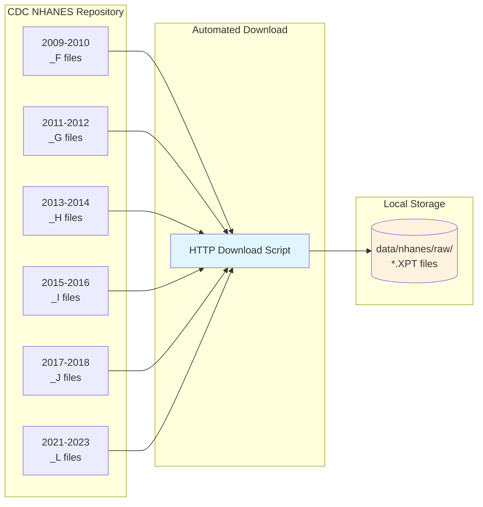
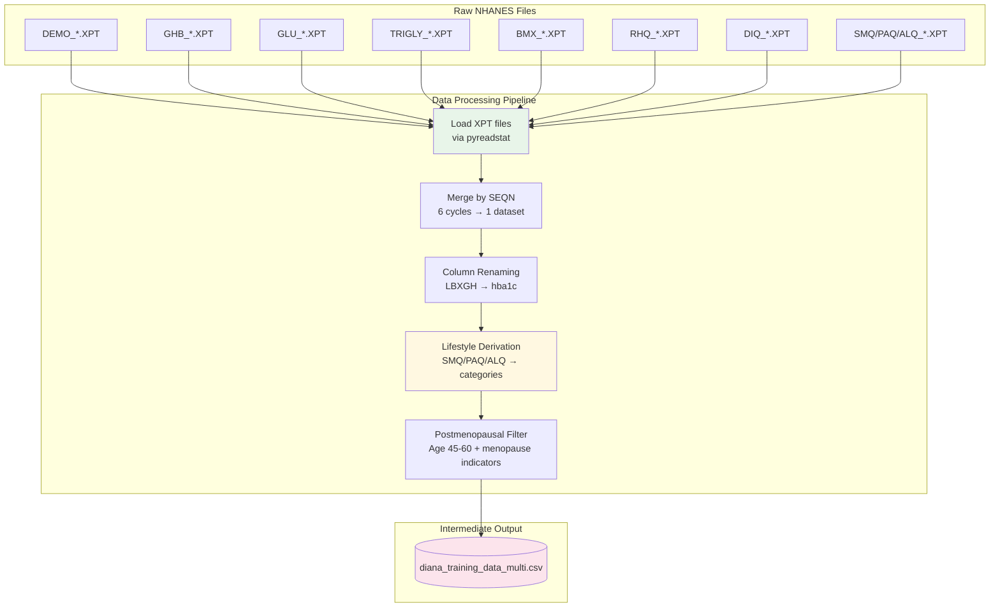
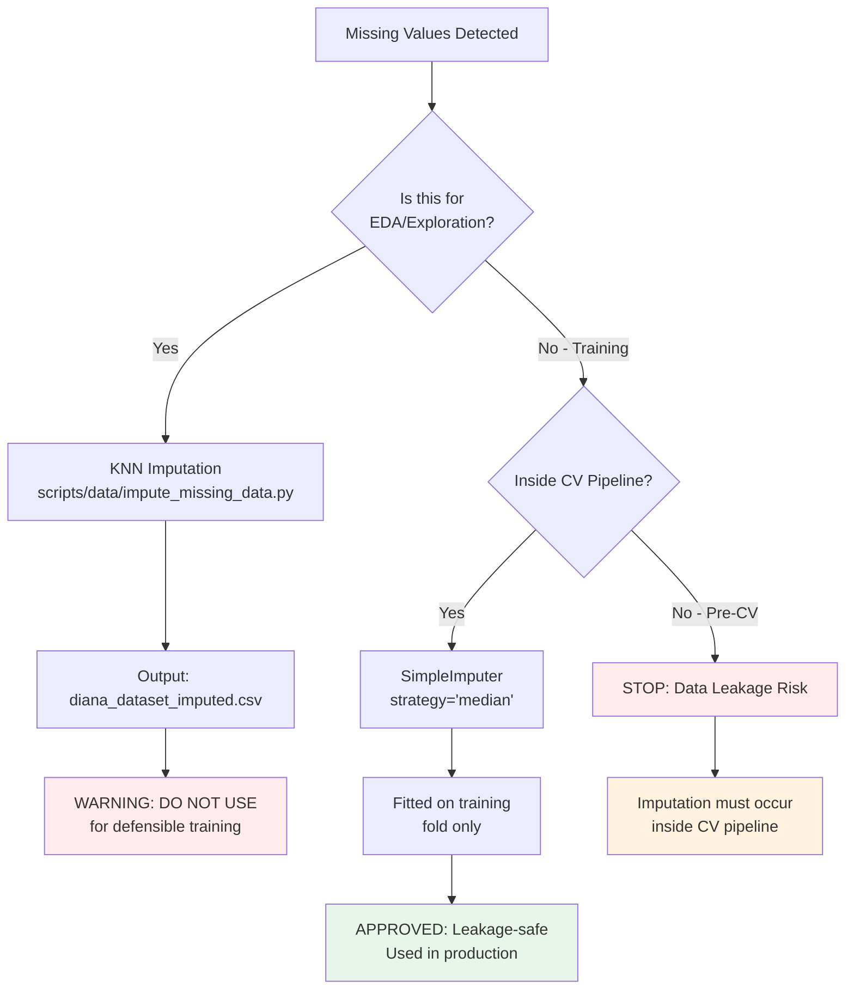
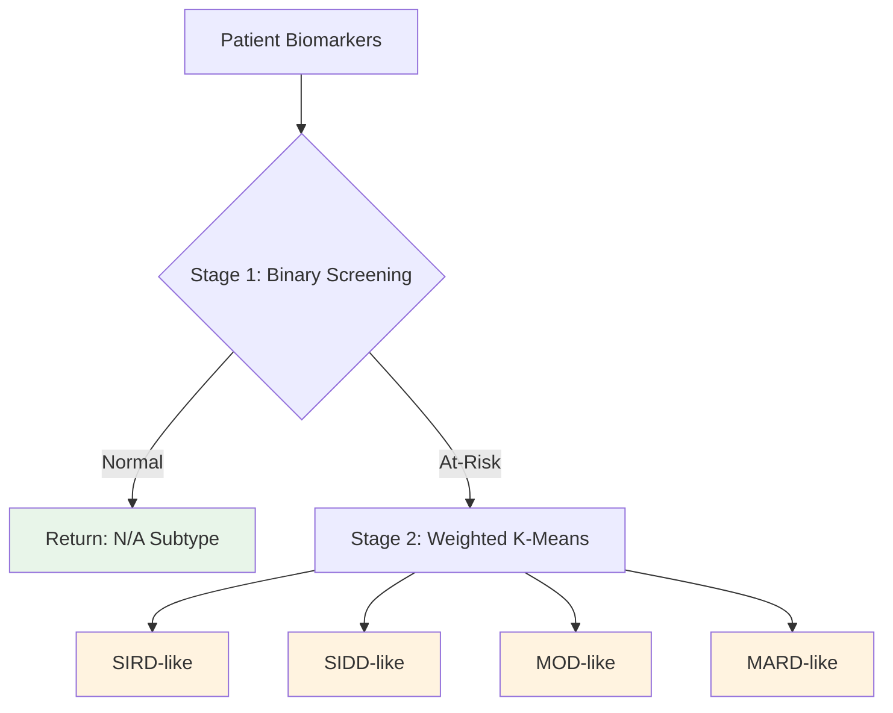

# DIANA Methodology

A comprehensive documentation of the research methodology, system development, and validation approaches for the DIANA Diabetes Risk Assessment System.

---

## Phase 1: Data Acquisition and Biomarker Preparation

### 1.1 NHANES Data Acquisition Strategy

The DIANA training dataset was constructed from the National Health and Nutrition Examination Survey (NHANES), a nationally representative health examination survey conducted by the Centers for Disease Control and Prevention (CDC) (CDC/NCHS, 2023). This section documents the complete data acquisition, preprocessing, and feature engineering pipeline from raw NHANES files to the final training dataset.

The construction of a defensible training dataset required systematic acquisition of multi-cycle NHANES data spanning multiple survey periods. The selected survey cycles, extracted biomarkers, and derived features collectively support the study objective of developing a pre-diabetic metabolic risk assessment tool for menopausal women. This phase establishes the foundational data infrastructure for the DIANA screening system by implementing a reproducible acquisition pipeline that ensures diagnostic consistency across time.

#### 1.1.1 Survey Cycle Selection

The NHANES data files were systematically acquired through an automated download mechanism. The dataset encompasses six survey cycles spanning 2009 to 2023, capturing data collected following the establishment of the American Diabetes Association's HbA1c diagnostic guidelines in 2010. This temporal selection ensures diagnostic consistency across all included survey cycles.

The selection of survey cycles was guided by two primary considerations: diagnostic consistency and temporal coverage. Beginning with the 2009-2010 cycle ensures inclusion of data collected after the 2010 American Diabetes Association (ADA) HbA1c diagnostic guidelines were established, which standardizes glycated hemoglobin thresholds across the full dataset. This temporal window provides sufficient longitudinal depth for temporal validation while avoiding the 2019-2020 cycle that was disrupted by COVID-19 pandemic data collection suspensions.

**Table 1.1 — NHANES Survey Cycles Included**

| Cycle | Years | File Suffix | Sample Design | Notes |
|-------|-------|-------------|---------------|-------|
| 2021-2023 | 2-year | `_L` | COVID-adapted | Most recent available; resumed August 2021 after pandemic suspension |
| 2017-2018 | 2-year | `_J` | Standard | Pre-pandemic baseline |
| 2015-2016 | 2-year | `_I` | Standard | - |
| 2013-2014 | 2-year | `_H` | Standard | - |
| 2011-2012 | 2-year | `_G` | Standard | - |
| 2009-2010 | 2-year | `_F` | Standard | First cycle post-ADA HbA1c guidelines (2010) |

**Note on 2019-2020 Cycle Exclusion:** The 2019-2020 NHANES cycle was excluded due to significant data collection disruptions caused by the COVID-19 pandemic. Field operations were suspended in March 2020, resulting in incomplete data with potential selection bias. The subsequent 2021-2023 cycle resumed in August 2021 following the pandemic suspension, maintaining the standard 2-year cycle format.

**NHANES Data Files Downloaded:**

The following NHANES examination and questionnaire files were acquired for each cycle:

| File Code | Description | Key Variables |
|-----------|-------------|---------------|
| DEMO | Demographics | Age, sex, race/ethnicity (RIDRETH1/RIDRETH3), survey weights |
| GHB | Glycohemoglobin | HbA1c (LBXGH) — primary diagnostic biomarker |
| GLU | Fasting Glucose | Fasting plasma glucose (LBXGLU) — secondary diagnostic |
| TCHOL | Total Cholesterol | Total cholesterol (LBXTC) |
| HDL | HDL Cholesterol | HDL-C (LBDHDD) — protective lipid |
| TRIGLY | Triglycerides & LDL | Triglycerides (LBXTR), calculated LDL |
| BMX | Body Measures | BMI (BMXBMI), waist circumference (BMXWAIST) |
| RHQ | Reproductive Health | Menopause status (RHQ060), age at menopause |
| DIQ | Diabetes Questionnaire | Self-reported diagnosis (DIQ010) — primary label source |
| SMQ | Smoking | Smoking status (SMQ020, SMQ040) |
| PAQ | Physical Activity | Activity levels (PAQ605, PAQ650, PAQ665) |
| ALQ | Alcohol Use | Alcohol consumption (ALQ101, ALQ151) |
| MCQ | Medical Conditions | Family history diabetes (MCQ300C) |
| INS | Insulin | Fasting insulin (LBXIN) — subsample only |
| HSCRP | High-sensitivity CRP | Inflammation marker (LBXCRP) |

**Figure 1.1 — NHANES Data Acquisition Flow**

The automated acquisition mechanism retrieves the specified NHANES XPT files for each survey cycle and stores them locally for subsequent processing. This reproducible approach ensures that the data acquisition pipeline can be reconstructed consistently.

---

### 1.2 Data Merging and Feature Derivation

Raw NHANES XPT files (SAS Transport format) were merged by SEQN (unique respondent identifier) and processed through a multi-stage pipeline to construct the analytic dataset.

The transformation of raw NHANES files into an analysis-ready dataset involved systematic merging of multiple examination and questionnaire modules across survey cycles. This phase implements a reproducible data processing pipeline that consolidates disparate NHANES components, derives clinically meaningful features from questionnaire responses, and applies variable renaming for interpretability. The resulting intermediate dataset provides the foundation for cohort filtering, label construction, and subsequent machine learning pipeline development.

**Figure 1.2 — Data Processing Pipeline**

#### 1.2.1 Lifestyle Feature Derivation

Three categorical lifestyle features were derived from NHANES questionnaire responses using rule-based classification:

| Feature | Source Variables | Categories | Derivation Logic |
|---------|------------------|------------|------------------|
| `smoking_status` | SMQ020, SMQ040 | Never, Current, Former, Unknown | SMQ020=2 → Never; SMQ020=1 + SMQ040∈[1,2] → Current; SMQ020=1 + SMQ040=3 → Former |
| `physical_activity` | PAQ605, PAQ650, PAQ665 | Active, Moderate, Sedentary, Unknown | Any vigorous (PAQ605=1 or PAQ650=1) → Active; Any moderate → Moderate; All no → Sedentary |
| `alcohol_use` | ALQ101, ALQ151 | Current, Former, Never, Unknown | ALQ101=1 + recent use → Current; ALQ101=1 + no recent → Former; ALQ101=2 → Never |

The categorization of physical activity levels within the NHANES dataset was systematically aligned with the World Health Organization's (WHO) baseline recommendations, which classify individuals as active if they meet the threshold of 150–300 minutes of moderate-intensity aerobic activity per week (Bull et al., 2020). This standardization ensures the lifestyle derivations in the DIANA model are consistent with prevailing epidemiological definitions.

#### 1.2.2 Column Standardization

NHANES variable codes were renamed to clinically meaningful names for interpretability:

| NHANES Code | Clinical Name | Description |
|-------------|---------------|-------------|
| LBXGH | hba1c | Glycated hemoglobin (%) |
| LBXGLU | fbs | Fasting blood sugar (mg/dL) |
| BMXBMI | bmi | Body mass index (kg/m²) |
| BMXWAIST | waist_circumference | Waist circumference (cm) |
| LBXTR | triglycerides | Triglycerides (mg/dL) |
| LBDHDD | hdl | HDL cholesterol (mg/dL) |
| LBDLDL | ldl | LDL cholesterol (mg/dL) |

---

### 1.3 Cohort Selection and Label Construction

Following data merging, the cohort was filtered to the target population and ground-truth labels were assigned.

The establishment of a well-defined cohort with reliable ground-truth labels is essential for training a clinically interpretable screening model. This phase applies sequential filtering criteria to isolate the target population of postmenopausal women from the merged NHANES dataset, then assigns diabetes status labels through a hierarchical decision process that prioritizes clinical diagnosis while incorporating objective glycemic thresholds. The resulting cohort of 1,376 participants provides the basis for subsequent feature selection, model training, and validation.

Cohort selection criteria were applied sequentially to isolate the target population. Sex was restricted to female participants (RIAGENDR = 2). Age was constrained to participants aged 45-60 years to target the postmenopausal population aligned with the operational age band enforced by the deployed web application. Menopause status was confirmed using postmenopausal indicators from the RHQ questionnaire. Only participants with complete biomarker data for all required features were retained in the analysis. Fasting subsample criteria required an 8-12 hour fasting status to ensure validity of glucose and lipid measurements.

#### 1.3.2 Label Construction

Ground-truth diabetes status labels were assigned using a dual-source hierarchy. The primary label source was self-reported physician diagnosis (DIQ010), which was supplemented by secondary HbA1c thresholds for undiagnosed cases and a hard override mechanism that assigned diabetic status to any participant with HbA1c ≥6.5% regardless of self-report. This hierarchical labeling approach ensures that diagnostic accuracy takes precedence while capturing cases where individuals may be unaware of their diabetic status based on glycemic thresholds alone.

**Table 1.2 — Class Distribution**

| Class | Count | Proportion |
|-------|-------|------------|
| Normal | 642 | 46.7% |
| Pre-diabetic | 457 | 33.2% |
| Diabetic | 277 | 20.1% |
| **Total** | **1,376** | **100%** |

**Binary Reformulation:** For the screening model, Pre-diabetic and Diabetic classes were combined into a single "At-Risk" class (n=734, 53.3%), with Normal (n=642, 46.7%) as the negative class. This binary formulation prioritizes sensitivity for case-finding in a screening context.

---

### 1.4 Missing Data Handling Methodology

NHANES data contains missing values due to survey non-response, subsample designs, and examination skip patterns. DIANA implements a **leakage-safe imputation strategy** that preserves the integrity of nested cross-validation.

The presence of missing values in NHANES data reflects the inherent complexity of multi-component survey designs where examination modules, subsample eligibility, and participant non-response create systematic gaps. This phase addresses missing data through a bifurcated strategy: KNN imputation for exploratory data analysis, and median imputation embedded strictly within the cross-validation pipeline for defensible model training. The leakage-safe approach ensures that imputation parameters are derived exclusively from training folds, preventing information from test data from contaminating model fitting and preserving the validity of temporal validation estimates.

**Figure 1.3 — Missing Data Handling Decision Framework**

#### 1.4.1 Imputation Strategy Selection

The selection of **median imputation** (vs. mean or KNN) was guided by clinical and statistical considerations:

| Strategy | Pros | Cons | Decision |
|----------|------|------|----------|
| **Mean** | Simple, preserves mean | Sensitive to outliers; skewed distributions | Rejected |
| **Median** | Robust to outliers; preserves central tendency | May understate variance | **Selected** |
| **KNN** | Borrows from similar patients; captures multivariate patterns | Causes data leakage if applied globally; computationally expensive | EDA only |
| **MICE** | Multiple imputation; uncertainty quantification | Complex; not pipeline-compatible | Not implemented |

#### 1.4.2 Clinical Rationale for Median

1. **Outlier Robustness**: Clinical biomarkers (triglycerides, LDL, fasting glucose) often exhibit right-skewed distributions where extreme values represent genuine pathological states. Median is unaffected by these extremes, unlike mean.

2. **Distribution Preservation**: For biomarkers with skewed distributions, the median better represents the "typical" patient value.

3. **Pipeline Compatibility**: `SimpleImputer(strategy='median')` integrates directly into scikit-learn `Pipeline`, ensuring imputation is fitted exclusively on training folds during cross-validation.

Median imputation was selected specifically due to the non-linear, right-skewed distribution characteristic of metabolic biomarkers like triglycerides. Recent frameworks for handling missing data in clinical structured datasets emphasize that matching the imputation approach to the specific property of the missing values is critical to preventing biased estimates (Afkanpour et al., 2025).

#### 1.4.3 Leakage-Safe Implementation

The imputer is embedded within the scikit-learn Pipeline framework, ensuring it is fitted only on training data during cross-validation. This approach prevents information from test folds from contaminating model training and preserves the validity of temporal validation estimates. The median imputation strategy was implemented through the SimpleImputer configuration, with continuous and ordinal features processed through parallel transformer branches.

---

## Phase 2: Data Leakage Prevention and Feature Validation

Data leakage constitutes a fundamental threat to the validity of machine learning-based clinical prediction systems. This phase establishes a comprehensive leakage detection and prevention architecture that goes beyond design intentions to provide computationally enforced safeguards. The three-layer verification system ensures that no diagnostic markers or proxy variables contaminate the training set, while information gain analysis validates that selected features provide meaningful predictive signal. This methodological rigor distinguishes DIANA from screening tools that inadvertently incorporate diagnostic information, supporting its deployment as a pre-diagnostic metabolic risk assessment system rather than a confirmatory test.

### 2.1 Three-Layer Leakage Detection Architecture

DIANA implements a three-layer leakage detection approach that serves as a pre-training verification step. The validation pipeline (validate_no_leakage.py) functions as Step 3 of 6 in the ML training workflow and terminates with a non-zero exit code on any failure, providing computationally supported verification for leakage prevention rather than relying solely on design intentions.

The three-layer architecture provides automated, fail-safe verification that the screening model does not inadvertently incorporate diagnostic information. By programmatically enforcing cycle-wise isolation and prohibiting diagnostic markers, DIANA provides defensible evidence that the learned patterns represent pre-diagnostic metabolic signals rather than memorized diagnostic thresholds. The exit code verification ensures that training proceeds only when all leakage safeguards are satisfied, creating a methodological barrier against circular reasoning in model development.

#### 2.1.1 Layer 1: Static Feature Constant Verification

Prior to training, an automated validation mechanism scans all feature constant definitions (CLUSTER_FEATURES, CLINICAL_FEATURES, CLINICAL_FEATURES_NO_BP, CLINICAL_FEATURES_WITH_BP) and asserts that the diagnostic marker set {hba1c, fbs, fasting_blood_sugar, fasting_glucose} is entirely absent. If any diagnostic feature is detected, the pipeline terminates with exit code 1, preventing model training from proceeding.

#### 2.1.2 Layer 2: Proxy Leakage Detection

For each feature in the training set, the Pearson correlation coefficient between the feature and the binary HbA1c >= 6.5% threshold was computed. Features with |r| > 0.95 were flagged as proxy leakage - variables that, while not diagnostic markers themselves, encode effectively the same information. No proxy leakage was detected in the final feature set.

#### 2.1.3 Layer 3: Shannon Entropy Information Gain Validation

Information gain IG(X, Y) = H(Y) − H(Y|X) was computed for all candidate features using quantile-based discretization (q = 5 bins) on continuous variables.

[[FIGURE PLACEHOLDER: Information Gain bar chart showing IG scores per feature | Thesis author to insert final IG visualization]]

The pipeline flags any non-selected feature with higher IG than the lowest-ranked selected feature, providing a built-in feature selection sanity check. This validation confirmed that all nine features in the final model contribute meaningful predictive power, and no excluded feature was systematically more informative.

The necessity of the LOGO validation architecture is underscored by the prevailing reproducibility crisis in machine learning-based scientific research. Systematic reviews of ML applications in medical and quantitative sciences have revealed that data leakage is a widespread phenomenon that frequently leads to wildly overoptimistic model performances that fail to generalize (Kapoor & Narayanan, 2022). By strictly enforcing cycle-wise isolation, DIANA programmatically guarantees that no temporal or demographic leakage invalidates the model's clinical screening claims.

The automated verification command executes the leakage detection pipeline through a Python script call and returns a non-zero exit code if any validation layer fails, providing computationally enforced assurance that the screening model does not inadvertently incorporate diagnostic information. This three-layer architecture constitutes DIANA's methodological approach to leakage mitigation, moving beyond design intentions to provide computationally supported verification.

---

### 2.2 Feature Selection and Engineering

The final model employs nine features designed to avoid circular reasoning with diagnostic tests. The selection of a nine-feature set balanced predictive power with methodological defensibility by excluding all diagnostic markers that would render the screening model circular. This phase establishes the feature architecture that enables the model to operate as a pre-diabetic risk assessment tool, identifying metabolic patterns that precede glucose dysregulation rather than confirming established hyperglycemia. The selected features collectively represent modifiable and non-modifiable risk factors within the scope of home-based or primary care screening.

**Table 2.1 — Final Feature Set**

| Feature | Type | Clinical Significance | Rationale for Inclusion |
|---------|------|----------------------|-------------------------|
| BMI | Continuous | Obesity marker | Primary metabolic risk factor; ADA screening criterion |
| Triglycerides | Continuous | Lipid dysregulation | Strong diabetes predictor; insulin resistance surrogate |
| LDL | Continuous | Atherogenic risk | Cardiovascular comorbidity marker |
| HDL | Continuous | Protective lipid | Inverse association with diabetes risk |
| Age | Continuous | Non-modifiable risk | Menopause timing factor |
| Waist Circumference | Continuous | Central adiposity | Visceral fat marker; metabolic syndrome component |
| Smoking Status | Ordinal (0-3) | Lifestyle factor | Modifiable risk factor |
| Physical Activity | Ordinal (0-3) | Lifestyle factor | Protective behavior |
| Alcohol Use | Ordinal (0-3) | Lifestyle factor | Modifiable risk factor |

**Excluded Features (Intentional):**

| Feature | Reason for Exclusion |
|---------|---------------------|
| HbA1c | Diagnostic marker - would cause circular reasoning |
| Fasting Blood Sugar | Diagnostic marker - would cause circular reasoning |
| Systolic/Diastolic BP | Clinical redundancy; requires equipment not available for home screening |
| TG/HDL Ratio | Derived from included features; introduces multicollinearity |
| Metabolic Syndrome Score | Composite of included features; redundant |

The relative importance of features in the final model can be visualized through feature importance analysis.

[[FIGURE PLACEHOLDER: Feature importance chart showing RF weights and IG scores | Thesis author to insert final feature importance visualization]]

**Impact on Model Performance:**

The exclusion of HbA1c and Fasting Blood Sugar—while methodologically essential to prevent circular reasoning—necessarily constrains the model's discriminative capacity. HbA1c alone can achieve AUC-ROC >0.85 for diabetes prediction, whereas models restricted to metabolic surrogates (lipids, BMI, lifestyle factors) typically achieve **AUC-ROC 0.65-0.75**. DIANA's target AUC of **0.67-0.72** reflects this fundamental trade-off: sacrificing peak predictive power for **methodological defensibility** and **clinical utility** in pre-diagnostic screening contexts.

---

## Phase 3: Predictive Model Development and Training

This phase focuses on the development and validation of a binary screening classifier trained on the nine-feature, non-circular feature set identified in Phase 2. The model development process employs nested Leave-One-Group-Out (LOGO) cross-validation to ensure conservative temporal generalization estimates, followed by systematic threshold optimization tailored to a screening context. The primary objective of this phase is to produce a defensible predictive model that balances discriminative performance with methodological rigor, clinical interpretability, and practical utility for early diabetes risk assessment in menopausal women.

### 3.1 Machine Learning Algorithm Selection

Four candidate algorithms were evaluated under identical nested LOGO evaluation and grid search hyperparameter tuning to identify the optimal classifier architecture: Logistic Regression, included for its interpretability and clinically meaningful probability outputs; Random Forest, which captures non-linear interactions between biomarkers and is robust to multicollinearity; LightGBM, a state-of-the-art gradient boosting implementation optimized for tabular data; and XGBoost, a scalable gradient boosting implementation with regularization to prevent overfitting. Random Forest was utilized as a complementary baseline due to its established capability to model non-linear decision boundaries and effectively rank feature importance in multifactorial clinical data. LightGBM was selected for its native Exclusive Feature Bundling and Gradient-based One-Side Sampling, which optimize processing of high-cardinality datasets. XGBoost was included to ensure comprehensive comparison against a leading gradient boosting implementation.

**Table 3.1 — Hyperparameter Search Grids**

| Algorithm | Hyperparameter | Search Space |
|-----------|----------------|--------------|
| Logistic Regression | C (regularization strength) | [0.01, 0.1, 0.3, 1.0, 3.0] |
| Random Forest | n_estimators | [200, 300] |
| | max_depth | [4, 6, 8] |
| | min_samples_leaf | [10, 15, 25] |
| LightGBM | n_estimators | [200, 400] |
| | max_depth | [3, 5, 7] |
| | learning_rate | [0.05, 0.1] |
| | min_child_samples | [20, 30] |
| XGBoost | n_estimators | [200, 400] |
| | max_depth | [3, 5, 7] |
| | learning_rate | [0.05, 0.1] |
| | min_child_weight | [1, 3] |
| | subsample | [0.8, 1.0] |

All hyperparameter searches employed GridSearchCV with AUC scoring, using inner GroupKFold cross-validation (n_splits = 3), respecting the grouped structure of NHANES survey cycles. This nested approach ensures that hyperparameter optimization is conducted without temporal leakage between training and validation folds.

---

### 3.2 Nested LOGO Validation Strategy

#### 3.2.1 Temporal Generalization via Leave-One-Group-Out (LOGO)

NHANES survey cycles (2009-2010, 2011-2012, ..., 2021-2023) serve as the grouping variable for Leave-One-Group-Out cross-validation. Each outer fold holds out one entire survey cycle as the test set and trains on all remaining cycles. This design enforces temporal generalization - the model is never evaluated on data from the same survey period used in training, simulating deployment on future patient cohorts.

The inner loop uses GroupKFold with adaptive splits (n_splits=min(3, n_groups)) on the training folds for hyperparameter tuning via GridSearchCV(scoring="roc_auc"), with group membership respected throughout to prevent temporal leakage during model selection.

#### 3.2.2 Best Model Selection

Models were selected based on **mean fold AUC** across LOGO folds rather than aggregated AUC. This is the more statistically conservative criterion, as it rewards consistent performance across temporal cohorts rather than allowing strong performance in one cycle to compensate for poor performance in another.

**Interpretation:** The resulting AUC-ROC should be interpreted as a **conservative temporal generalization estimate**, not a standard k-fold cross-validation figure. Studies using random k-fold splits on temporal health data consistently report optimistically biased AUC values compared to temporal-based estimates due to temporal correlation and data leakage (Chiavegatto Filho et al., 2021).

---

### 3.3 Clinical Threshold Optimization

A sensitivity-biased decision threshold was selected using a three-strategy comparison on out-of-fold probabilities from the inner cross-validation loop, not on the test set which would constitute threshold leakage. The evaluation compared three threshold selection strategies: Youden's J Index, which maximizes Sensitivity plus Specificity minus one to provide balanced discrimination; a Screening-Optimized strategy, which enforces minimum constraints of Sensitivity at least 0.80 and Specificity at least 0.40 before maximizing a weighted score of 0.60 times Sensitivity plus 0.40 times F1; and G-Mean, which maximizes the geometric mean of sensitivity and specificity.

[[FIGURE PLACEHOLDER: Threshold optimization curves comparing three strategies | Thesis author to insert final threshold optimization visualization]]

The winning strategy per fold was determined through a composite clinical score calculated as 0.35 × Sensitivity + 0.30 × Specificity + 0.25 × F1 + 0.10 × Accuracy. This composite scoring balances multiple clinical considerations while prioritizing sensitivity appropriate for a screening context. The mean threshold across folds was 0.478 with a range from 0.39 to 0.50, reflecting an intentional downward adjustment from the default 0.50 to prioritize sensitivity while preserving acceptable specificity under temporal prevalence shift. After recalibration, folds vulnerable to specificity collapse were addressed through deterministic guardrail arbitration, which selected the nearest feasible threshold satisfying the minimum specificity constraint rather than defaulting immediately to 0.50. The selection of a sensitivity-biased threshold aligns with the epidemiological principle that screening tools must cast a wide net, prioritizing case detection over diagnostic precision. This reflects asymmetric clinical costs where false negatives result in delayed diagnosis and progression to complications, while false positives lead only to unnecessary confirmatory testing with minimal harm.

---

### 3.4 Outlier Detection and Handling

Outlier detection employed a dual-method approach to distinguish genuine physiological extremes from data entry errors. First, IQR-based bounds defined outliers for each continuous biomarker as values outside the range [Q1 - 1.5*IQR, Q3 + 1.5*IQR]. Second, clinical plausibility ranges established biomarker-specific boundaries based on physiological limits: BMI 15-60 kg/m², Triglycerides 20-800 mg/dL, LDL 20-300 mg/dL, HDL 10-120 mg/dL, HbA1c 3.5-15.0%, FBS 50-400 mg/dL, Age 18-100 years, and Waist Circumference 50-180 cm. For each biomarker, the more conservative bound from the two methods was applied. Outlier rows were flagged via a binary outlier indicator column but NOT removed from the analytic dataset, preserving sample size.

---

### 3.5 Ablation Study Methodology

The ablation study examines how individual system components contribute to overall performance by comparing the full system against configurations with components removed or simplified. This analysis serves a methodological purpose: to establish how component importance is assessed, how different ablation types are interpreted, and how comparisons remain consistent with the project's defensible validation strategy. The framework supports later reporting on both predictive and non-predictive components, but the methodology itself defines how those components are evaluated rather than presenting numerical results or substantive conclusions.

#### 3.5.1 Ablation Objective and Baseline

The ablation study treats the full system as the reference configuration. Its predictive baseline is the Stage 1 nine-feature logistic regression screening model, trained and evaluated under nested Leave-One-Group-Out validation with the deployed threshold-selection policy. Downstream modules such as clustering and SHAP operate after the primary prediction step and are assessed analytically rather than through direct predictive re-estimation. All ablation conditions are defined relative to this baseline so that the effect of removing or simplifying a single component can be interpreted against a common methodological reference.

#### 3.5.2 Ablation Categories

Not all components can be re-trained cheaply or meaningfully removed in the same way, so the ablation framework uses three complementary categories. **Computed ablations** represent conditions derived directly from existing fold-level LOGO artifacts, used when the relevant comparison can be obtained from already-generated evaluation outputs without re-running the full training pipeline. **Estimated ablations** represent conditions approximated using prior SHAP-informed assumptions or literature-supported simplifications, used when a true retraining-based ablation was not executed and the study therefore treats the effect as an informed estimate rather than a directly observed performance delta. **Analytical ablations** represent conditions assessed by architectural role rather than predictive re-estimation, used for components such as clustering and explainability that operate after the primary risk prediction step and are therefore evaluated in terms of methodological and clinical function rather than direct discrimination change. This categorization ensures that later reporting does not conflate empirically computed comparisons with literature-based or architecture-based assessments.

#### 3.5.3 Ablation Conditions

[[FIGURE PLACEHOLDER: Ablation study diagram showing baseline and comparison conditions | Thesis author to insert final ablation framework visualization]]

The ablation study evaluates seven conditions designed to isolate the contributions of individual components. These include the Full System baseline, which retains all standard components; No Lifestyle, which removes smoking, physical activity, and alcohol features; Minimal Features, which reduces inputs to BMI and Age only; Fixed Threshold, which replaces the optimized threshold policy with a fixed 0.50 decision rule; Model-Selection Analysis, which compares the best-selected model against non-selected candidate algorithms using identical LOGO summaries; No Clustering, which removes the Stage 2 K-Means subtyping; and No SHAP, which removes explainability outputs.

**Table 3.2 — Ablation Study Conditions**

| Condition | Ablation Type | Modification | Methodological Purpose |
|-----------|---------------|--------------|------------------------|
| **Full System** | Baseline | Retain all standard components | Reference configuration |
| **No Lifestyle** | Estimated | Remove smoking, physical activity, and alcohol features | Assess contribution of modifiable lifestyle variables |
| **Minimal Features** | Estimated / literature-based | Reduce inputs to BMI and Age only | Assess extreme feature simplification |
| **Fixed Threshold** | Estimated (policy analysis; no retraining) | Replace optimized threshold policy with fixed 0.50 decision rule | Assess effect of threshold optimization |
| **Model-Selection Analysis** | Computed | Compare best-selected model against non-selected candidate algorithms using identical LOGO summaries | Assess value of model-selection stage |
| **No Clustering** | Analytical | Remove Stage 2 K-Means subtyping | Assess the added role of post-prediction metabolic stratification |
| **No SHAP** | Analytical | Remove explainability outputs | Assess the role of post-prediction transparency and interpretability |

#### 3.5.4 Evaluation Procedure

The ablation workflow executes after model training artifacts have been generated and consists of four steps. First, the system loads the fold-level evaluation outputs, best-model report, and feature manifest from the binary no-BP training run. Second, it defines the full-system baseline from the logistic regression LOGO summaries. Third, it evaluates each ablation condition according to its designated category: computed conditions are derived from stored fold metrics; estimated conditions are documented as approximations; analytical conditions are interpreted in terms of architectural function. Fourth, it stores all ablation outputs in a structured JSON artifact for later reporting. This design preserves consistency with the project's non-leakage validation workflow while avoiding the false implication that every ablation was retrained experimentally.

#### 3.5.5 Interpretation Rules

The ablation methodology imposes explicit interpretation constraints to ensure methodological integrity. Computed ablations may be reported as direct comparisons because they are derived from observed evaluation artifacts. Estimated ablations must be labeled as estimates or literature-based approximations and must not be reported as if they were direct retraining outcomes. Analytical ablations must be interpreted as functional or clinical-role analyses, not as predictive-performance experiments. These rules are necessary because the ablation script intentionally mixes empirical summaries with approximation-based analyses. Explicitly documenting that distinction protects the methodological integrity of the thesis and prevents overclaiming.

#### 3.5.6 Scope of the Ablation Methodology

Within DIANA, the ablation study is intended to answer three methodological questions. First, whether the selected feature set is justified relative to simpler alternatives. Second, whether threshold selection and model selection add value beyond naive defaults. Third, whether post-prediction modules such as clustering and SHAP should be treated as predictive components or as downstream clinical-support components. Accordingly, the ablation framework supports later reporting on both predictive and non-predictive components, but the methodology itself only defines how those components are evaluated. Numerical outcomes and substantive conclusions belong in the results and discussion materials, not in this methods section.

---

## Phase 4: Cluster-Based Risk Group Identification (At-Risk Patients Only)

This phase implements a two-stage hierarchical pipeline that extends the binary screening model with cluster-based metabolic stratification for at-risk patients. The architecture mirrors real-world clinical triage workflows, where initial risk screening determines whether patients proceed to detailed subtype characterization. Weighted K-Means clustering (K=4) is applied exclusively to patients identified as at-risk by the screening classifier, assigning Ahlqvist-inspired subtype labels based on centroid ranking. The methodological design ensures that clustering operates on a metabolically homogeneous at-risk population rather than attempting to separate at-risk from normal subjects, which would confound the subtype stratification objective.

### 4.1 Two-Step Hierarchical Pipeline Architecture

DIANA implements a **two-stage hierarchical architecture** that mirrors real-world clinical triage workflows:

**Stage 1 — Binary Screening (Gatekeeper):** All patients are first evaluated by the logistic regression screening classifier, which outputs a binary risk label ("Normal" vs. "At-Risk"). This stage serves as the entry gate, ensuring that only patients with sufficient metabolic risk proceed to subtype stratification.

**Stage 2 — Weighted K-Means Subtyping (Stratifier):** Weighted K-Means clustering (K=4) is applied **exclusively to at-risk patients** (those classified as "At-Risk"), not the full cohort. This is methodologically correct because clustering aims to stratify the metabolic heterogeneity within the at-risk population, not to separate at-risk from normal subjects.

**Figure 4.1 — Two-Stage Hierarchical Pipeline**

---

### 4.2 Literature-Derived Feature Weights

The clustering weights function as feature scaling multipliers applied before Euclidean distance computation, amplifying the influence of biomarkers with stronger empirical support in diabetes subtyping research. Weights were derived through systematic literature review of metabolic biomarker importance in T2DM clustering and insulin resistance research, translating effect sizes from published studies into clustering multipliers. The following weights are applied to the standardized features to prioritize clinically meaningful metabolic patterns.

**Table 4.1 — Feature Weights and Literature Rationale**

| Feature | Weight | Rank | Key Evidence | Rationale |
|---------|--------|------|--------------|-----------|
| **LDL** | 2.5 | #1 | OR = 1.12 per SD (Huang et al., 2023) | Most bidirectionally discriminative lipid; best cluster separator |
| **Triglycerides** | 2.0 | #2 (tied)| 75% of IR attributed to TG (Bi et al., 2019) | Primary IR surrogate; TG/WC pair dominates MetS factor structure |
| **Waist Circumference**| 2.0 | #2 (tied)| B = 0.024 for HOMA-IR (Ahmed et al., 2021) | Central adiposity independent signal; co-dominant with TG for IR |
| **BMI** | 1.5 | #3 | Defines MOD cluster | Important but partially redundant with WC; moderate amplification |
| **HDL** | 1.2 | #4 | OR = 0.69/mmol/L (MR-confirmed; Wei et al., 2024) | Inverse/protective signal; lower variance; amplifies TG's direction |
| **Age** | 1.0 | #5 | MARD defined by age | Baseline — cohort is already age-restricted; metabolic features dominate |

> **Weight Derivation Limitation:** The weight configuration represents literature-informed synthesis rather than empirical optimization or multi-specialist consensus. While each weight is grounded in peer-reviewed evidence, the specific weight values represent interpretive translation of effect sizes into clustering multipliers. Future work should validate weight configurations through ablation studies or formal expert consensus methods.

---

### 4.3 Ahlqvist-Inspired Subtype Label Assignment

Clusters were assigned Ahlqvist-inspired subtype labels using a deterministic centroid-based algorithm adapted for the absence of HOMA2-B, HOMA2-IR, and C-peptide biomarkers in NHANES. The weighted K-Means centroids were inverse-transformed from standardized space back to raw clinical units before label assignment to ensure clinically meaningful interpretation. Given the biomarker limitations in NHANES, a centroid-ranking algorithm was employed to generate proxy subtype labels (denoted with "-like" suffix) adapted from Ahlqvist et al. (2018). This transformation ensures that cluster centroids are expressed in clinically meaningful units (e.g., BMI in kg/m², triglycerides in mg/dL, HDL in mg/dL), supporting transparent interpretation and physician understanding of metabolic patterns within each subtype.

**Label Assignment Rules:**

1. **SIRD-like:** Assigned to the cluster exhibiting the maximum Lipid Accumulation Product (LAP) score, computed as LAP = (WC − 58) × TG. LAP serves as a validated surrogate marker for insulin resistance (Wang et al., 2024).

2. **SIDD-like:** Assigned to the remaining cluster with peak LDL cholesterol concentration. Authentic SIRD/SIDD distinction requires HOMA2-B or C-peptide biomarkers unavailable in NHANES; we adopt high LDL as a proxy for the atherogenic dyslipidemia phenotype following Tenenbaum et al. (2006).

3. **MOD-like:** Assigned to the residual cluster demonstrating maximum BMI following sequential elimination of SIRD-like and SIDD-like centroids.

4. **MARD-like:** Assigned to the final residual cluster, characterized by advanced age and attenuated metabolic dysfunction.

**Neutral Sentinel Handling:** Normal patients receive neutral sentinel subtype semantics with risk cluster and metabolic subtype values indicating not applicable. The backend canonicalizes these to blank cluster values at persistence. Cluster membership is shown only for at-risk patients to prevent algorithmic assignment of disease phenotypes to healthy individuals.

---

## Phase 5: Model Evaluation, Calibration, and Comparison Methodology

### 5.1 Evaluation Metrics and Approach

The evaluation phase employs nested Leave-One-Group-Out (LOGO) cross-validation to produce conservative temporal generalization estimates, as described in Section 3.2. This validation approach ensures that performance metrics reflect the model's ability to generalize across temporal cohorts rather than memorizing patterns within any single survey cycle. Discriminative performance was quantified on aggregated outer-fold predictions using a set of established metrics appropriate for binary screening classification.

The model's discriminative performance was evaluated using ROC analysis.

[[FIGURE PLACEHOLDER: ROC curve for binary screening model | Thesis author to insert final ROC curve graphic showing AUC performance]]

This metric quantifies the trade-off between true positive and false positive rates across probability thresholds, providing a comprehensive measure of the classifier's ability to distinguish between at-risk and normal patients.

**Primary Metrics:**

- **AUC-ROC**: Area under the receiver operating characteristic curve, quantifying discrimination performance across all probability thresholds
- **Sensitivity (Recall)**: True positive rate, emphasized for screening contexts where case detection is prioritized over diagnostic precision
- **Specificity**: True negative rate, maintained at acceptable levels to balance sensitivity-driven case-finding against unnecessary confirmatory testing
- **F1 Score**: Harmonic mean of precision and sensitivity, providing a balanced measure of classification performance
- **Positive/Negative Predictive Value (PPV/NPV)**: Clinical utility metrics that quantify the probability that a positive or negative prediction corresponds to actual diabetes status

Confusion matrices were generated to visualize classification performance across the binary decision boundary.

[[FIGURE PLACEHOLDER: Confusion matrix showing TP/TN/FP/FN counts | Thesis author to insert final confusion matrix visualization]]

**Confidence Intervals:**

Uncertainty quantification was performed through bootstrap 95% confidence intervals computed using 1,000 resamples with the percentile method (fixed seed = 42). This distribution-free approach provides appropriate uncertainty estimates for the cohort size (n = 1,376) without relying on parametric assumptions about metric distributions.

---

### 5.2 External Benchmark Comparison

To contextualize DIANA's performance against established clinical practice, external benchmark tools were re-implemented and evaluated under identical nested LOGO cross-validation. This comparative analysis addresses the methodological question of how DIANA's non-circular screening design performs relative to established clinical screening methods, providing context for interpreting the model's discriminative performance in light of intentional design constraints.

#### 5.2.1 Benchmark Tools Selected

**Table 5.1 — External Benchmark Comparison Tools**

| Tool | Variables Required | Scoring Method | Original Population / Context | Citation |
|------|-------------------|----------------|-------------------------------|----------|
| **FINDRISC** | 8 (age, BMI, waist, activity, diet, BP, glucose, family history) | Point-based (0-26) | Finnish population | Lindström & Tuomilehto (2003) |
| **ADA Risk Test** | 7 (age, sex, BMI, activity, family history, hypertension, gestational diabetes) | Binary scoring | US general population | American Diabetes Association (2024) |
| **OmniRisk** | 6 (age, BMI, waist, activity, diet, family history) | Algorithmic | Multi-ethnic cohort | Hippisley-Cox et al. (2017) |
| **Simple Clinical Model** | 3 (age, BMI, family history) | Logistic regression | Minimal baseline | Bergmann et al. (2007) |

#### 5.2.2 Benchmarking Methodology

Each benchmark tool was re-implemented using the identical NHANES cohort (n = 1,376 postmenopausal women) to ensure fair comparison:

1. **Variable Mapping**: Map NHANES fields to each tool's required inputs
2. **Missing Data Handling**: Apply a common within-fold median-imputation procedure to mapped NHANES inputs so all tools are evaluated under the same missing-data regime
3. **Threshold Application**: Use published optimal thresholds for each tool
4. **Metric Computation**: Calculate identical metrics (AUC, sensitivity, specificity) under nested LOGO

Fair comparison controls included identical train/test splits using LOGO cycles, the same outcome definition (binary at-risk vs. normal), the same NHANES cohort restriction (postmenopausal women aged ≥45), and the same missing data treatment (median imputation within folds).

#### 5.2.3 Interpretation Framework for Benchmark Comparison

Benchmark comparisons were interpreted within DIANA's methodological framework, which prioritizes non-circular screening design over maximal discriminative performance. By excluding HbA1c and fasting blood sugar features that would enable circular reasoning, DIANA targets pre-diabetic metabolic patterns using surrogate markers with inherently lower discriminative power than direct glycemic measures—HbA1c alone can achieve AUC values exceeding 0.85. The model's reliance on lipid panels and anthropometrics provides indirect metabolic signals, which necessarily constrains discriminative capacity compared to direct glycemic predictors. Furthermore, nested LOGO cross-validation on NHANES temporal cohorts produces more conservative estimates than standard k-fold approaches, where temporal correlation can inflate AUC by 0.05-0.10. Within this methodological context, an AUC of 0.67-0.72 is appropriate for screening when paired with high sensitivity (target ≥0.70), confirming that the model learns genuine metabolic patterns rather than memorizing diagnostic thresholds. This design choice supports early intervention workflows in screening contexts by prioritizing methodological rigor through non-circular, defensible validation over optimistic performance metrics.

#### 5.2.4 Subgroup Benchmark Analysis

To ensure generalizability, benchmark comparison included stratified analysis where sample size permitted across demographic and clinical strata including age groups (45-54, 55-64, 65+ years), BMI categories (Normal <25, Overweight 25-30, Obese ≥30), and NHANES race/ethnicity strata when sample size permits.

---

### 5.3 Model Comparison Methodology

Four candidate algorithms (Logistic Regression, Random Forest, LightGBM, and XGBoost) were systematically evaluated under identical nested LOGO cross-validation conditions to identify the most suitable model for clinical deployment. Model selection prioritized criteria that balance predictive performance, computational efficiency, and clinical interpretability. The primary selection criterion was mean fold AUC across LOGO folds, ensuring conservative temporal generalization rather than aggregate performance metrics. Computational efficiency, quantified by inference latency through Python `time.perf_counter()` over 100 iterations on standardized hardware, served as a secondary criterion relevant for responsive clinical workflow integration. Interpretability for clinical transparency, enabling physician understanding of feature contributions to risk predictions, constituted the tertiary selection criterion.

The relative performance of candidate algorithms was visualized through comparative analysis.

[[FIGURE PLACEHOLDER: Model comparison grouped bar chart showing AUC, Sensitivity, and Specificity for each algorithm | Thesis author to insert final model comparison visualization]]

---

### 5.4 Calibration Assessment

Probability calibration assessment was conducted to verify that predicted risk probabilities correspond meaningfully to observed outcomes in the validation cohort. Well-calibrated predictions are essential for clinical utility, as they enable physicians to communicate risk estimates to patients in terms that accurately reflect observed population rates. Three complementary calibration metrics were computed: the Brier Score, which measures mean squared error between predicted probabilities and actual binary outcomes (0 indicates perfect calibration, 0.25 corresponds to random performance); Expected Calibration Error (ECE), a weighted average of calibration errors across probability deciles where values below 0.10 indicate acceptable calibration; and the Hosmer-Lemeshow χ² goodness-of-fit test for logistic regression models, where a non-significant p-value suggests that predicted probabilities adequately match observed frequencies. Visual calibration curves were generated by plotting predicted probabilities against observed frequencies across probability deciles.

[[FIGURE PLACEHOLDER: Calibration reliability diagram showing predicted vs observed probabilities | Thesis author to insert final calibration curve visualization]]

This calibration provides graphical assessment of calibration quality across the risk spectrum. Calibrated probability estimates support meaningful patient communication, where a predicted 70% risk corresponds approximately to a 70% observed at-risk rate in comparable patients, enabling informed shared decision-making.

---

### 5.5 Explainability and Interpretability Methodology

The explainability framework addresses a critical limitation of machine learning models in clinical practice: the "black box" nature of complex algorithms that can impede physician understanding and patient trust (Rudin, 2019). DIANA implements SHAP (SHapley Additive exPlanations) to provide clinically meaningful explanations that support physician decision-making and enable transparent patient education. This game-theoretic approach quantifies each biomarker's contribution to individual predictions while maintaining model performance (Lundberg & Lee, 2017).

#### 5.5.1 SHAP (SHapley Additive exPlanations) Integration

SHAP values provide game-theoretic feature attribution, quantifying each biomarker's contribution to the prediction (Lundberg & Lee, 2017). The implementation employs model-specific explainers to compute SHAP values efficiently: TreeSHAP for tree-based models such as Random Forest and LightGBM leverages the tree structure to compute exact SHAP values with polynomial time complexity, while KernelSHAP provides a model-agnostic fallback for Logistic Regression by approximating SHAP values through weighted sampling of feature coalitions with a default of 100 samples to balance accuracy and computational efficiency. The SHAP output structure provides clinically interpretable components including the base value representing the model's expected prior probability, a dictionary of per-feature SHAP values quantifying each biomarker's contribution, a dictionary of raw input feature values for context, and the expected value representing the mean prediction across the training set.

[[FIGURE PLACEHOLDER: Information Gain bar chart showing IG scores per feature | Thesis author to insert final IG visualization]]

#### 5.5.2 Local vs. Global Explanations

Local explanations enable per-patient interpretation through visual formats that translate mathematical contributions into intuitive displays. Waterfall plots visualize how each biomarker pushes the prediction from the base value to the final output, allowing patients and physicians to see the cumulative effect of individual risk factors. Force plots present feature contributions as directional forces, providing an alternative visualization that emphasizes which biomarkers increase or decrease risk. These visualizations support clinical interpretation by enabling statements such as "Your BMI of 32 increased your risk by 12%." Global explanations provide model-wide insights across the entire cohort. Summary plots aggregate feature importance information, showing the distribution of SHAP values for each biomarker across all patients.

[[FIGURE PLACEHOLDER: SHAP beeswarm summary plot showing feature impact distribution | Thesis author to insert final SHAP beeswarm visualization]]

Dependence plots examine relationships between feature values and their corresponding SHAP values, revealing non-linear patterns that may not be apparent from summary statistics alone. Interaction plots capture pairwise feature effects such as BMI × Age or Triglycerides × HDL, identifying how biomarker combinations influence risk beyond their individual contributions.

[[FIGURE PLACEHOLDER: SHAP interaction plot showing key pairwise feature interactions | Thesis author to insert final SHAP interaction visualization]]

**Table 5.3 — Explanation Types and Use Cases**

| Explanation Type | Audience | Clinical Use | Technical Method |
|-----------------|----------|--------------|------------------|
| **Waterfall Chart** | Patient | Understand personal risk drivers | SHAP values sorted by magnitude |
| **Top 3 Factors** | Physician | Quick triage assessment | Absolute SHAP value ranking |
| **Feature Importance** | Researcher | Model validation | Mean absolute SHAP value across cohort |
| **Interaction Plot** | Data Scientist | Feature engineering insights | SHAP interaction values |

Visual examples of SHAP explanations support clinical interpretation and patient communication. Waterfall plots illustrate individual feature contributions to a specific patient's risk prediction.

[[FIGURE PLACEHOLDER: Example SHAP waterfall plot for sample at-risk patient | Thesis author to insert final SHAP waterfall visualization]]

Summary plots provide model-wide feature importance across the entire cohort.

[[FIGURE PLACEHOLDER: Feature importance bar chart showing mean |SHAP| values per feature | Thesis author to insert final feature importance visualization]]

#### 5.5.3 Feature Interaction Analysis

Beyond marginal contributions, DIANA analyzes pairwise feature interactions:

Key interactions examined in the analysis included BMI × Waist Circumference, representing central adiposity synergy; Triglycerides × HDL, capturing atherogenic dyslipidemia patterns; Age × LDL, representing age-modified lipid risk; Physical Activity × BMI, indicating protective behavior effects on metabolic load; and BMI vs Glucose correlation, enabling risk association analysis.

[[FIGURE PLACEHOLDER: Scatter plot showing BMI vs Glucose correlation with risk-level color coding | Thesis author to insert final BMI-Glucose correlation visualization]]

**Quantification:**

Interaction strength was quantified using SHAP interaction values:

Interaction Strength(i, j) = E[|SHAP_{i,j}(x)|]

where SHAP_{i,j} represents the combined contribution of features i and j beyond their individual effects, and the expectation is computed across the cohort.

#### 5.5.4 Clinical Explainability Validation Framework

**Physician Evaluation Protocol:**

The clinical explainability validation framework employs a structured protocol in which licensed physicians would evaluate SHAP explanations across four critical dimensions. Correctness would be assessed through the question "Do SHAP attributions align with clinical knowledge?" using an expert rating scale from 1 to 5. Usefulness would be evaluated by asking "Would you use this in patient counseling?" with responses measured on a likelihood scale. Clarity would be assessed through the question "Are explanations understandable to patients?" using a SUS-style rating approach. Actionability would be determined through the binary question "Do explanations suggest interventions?" requiring a yes or no response.

**Table 5.4 — Physician Evaluation Dimensions**

| Aspect | Evaluation Question | Metric |
|--------|---------------------|--------|
| **Correctness** | "Do SHAP attributions align with clinical knowledge?" | Expert rating (1-5) |
| **Usefulness** | "Would you use this in patient counseling?" | Likelihood scale |
| **Clarity** | "Are explanations understandable to patients?" | SUS-style rating |
| **Actionability** | "Do explanations suggest interventions?" | Binary (yes/no) |

**Validation Cohort Design:**

The validation cohort would comprise 2 licensed physicians including an endocrinologist and an OB-GYN specialist. Each physician would review 50 randomly selected predictions from a held-out test set through a blind review process, ensuring that evaluations would be conducted without access to ground truth labels to prevent confirmation bias.

#### 5.5.5 Limitations of SHAP Explanations

**Acknowledged Constraints:**

Several limitations of the SHAP explainability framework are acknowledged to provide transparent assessment of its applicability in clinical contexts. First, SHAP shows correlation rather than causation; feature attributions indicate association patterns but do not establish causal mechanisms. Second, feature dependencies can affect attribution accuracy; highly correlated features such as BMI and waist circumference may split attribution in ways that do not reflect clinical understanding. Third, SHAP values depend on the choice of reference population; different background datasets can produce different attribution patterns. Fourth, computational cost varies by explainer type; KernelSHAP is significantly slower than TreeSHAP, which can affect real-time explanation generation for interactive clinical workflows.

**Mitigation Strategies:**

Several strategies were employed to mitigate these limitations. Clinical feature selection was used to minimize collinearity among input variables, reducing attribution splitting artifacts. Confidence intervals on SHAP values were reported via bootstrap resampling to quantify uncertainty in attribution estimates. Background dataset characteristics were documented explicitly to ensure interpretability and reproducibility of explanations. These mitigations preserve the utility of SHAP explanations for patient communication while acknowledging their limitations in causal inference and attribution precision.

---

### 5.6 Clustering Validation Methodology

The weighted K-Means clustering approach (K=4) was validated using internal validation metrics appropriate for unsupervised learning, ensuring that the derived metabolic subtypes represent coherent and clinically meaningful patient groupings. Validation employed multiple complementary metrics to assess cluster quality from different perspectives. The Silhouette Score, which ranges from -1 to 1 and measures cluster cohesion relative to separation, indicated reasonable cluster structure when values exceeded 0.25. The Davies-Bouldin Index, which computes the ratio of within-cluster scatter to between-cluster separation, indicated well-separated clusters when values fell below 1.0. The Calinski-Harabasz Index evaluated the ratio of between-cluster variance to within-cluster variance, where higher values suggest better separation. Within-cluster sum of squares (WCSS) was computed across candidate K values to support elbow method visualization for cluster number selection.

The selection of four clusters (K=4) was guided by alignment with the Ahlqvist et al. (2018) clinical subtype framework, which provides a clinically interpretable taxonomy for diabetes heterogeneity. Although K=2 demonstrated optimal silhouette score based purely on statistical cohesion, the selection of K=4 prioritizes clinical relevance and alignment with established metabolic subtype classifications over purely statistical cluster separation criteria.

[[FIGURE PLACEHOLDER: Elbow method visualization showing WCSS vs K value | Thesis author to insert final elbow method chart]]

**Centroid Interpretation:**
Cluster centroids were inverse-transformed from standardized space back to raw clinical units before subtype label assignment. This transformation ensures that cluster centroids are expressed in clinically meaningful units (e.g., BMI in kg/m², triglycerides in mg/dL, HDL in mg/dL), supporting transparent interpretation and physician understanding of metabolic patterns within each subtype.

[[FIGURE PLACEHOLDER: Cluster heatmap showing centroid values across features for each subtype | Thesis author to insert final cluster heatmap visualization]]

The spatial separation of clusters in reduced-dimensional space demonstrates the distinctiveness of metabolic subtypes.

[[FIGURE PLACEHOLDER: Cluster scatter plot showing PCA-reduced patient groupings | Thesis author to insert final cluster scatter visualization]]

Cluster size distribution indicates the relative prevalence of each metabolic subtype in the at-risk population.

[[FIGURE PLACEHOLDER: Cluster distribution bar chart showing patient counts per subtype | Thesis author to insert final cluster distribution visualization]]

---

## Phase 6: Web Application Development and System Integration

The translation of the validated DIANA model into a deployable web-based clinical decision-support system required systematic software development and integration methodology to ensure that the research pipeline could be operationalized as an end-to-end application for menopausal women and authorized clinical or administrative users. This phase documents the methodological principles that guided the embedding of the research model into a reproducible, secure, contract-consistent, and clinically interpretable execution environment.

### 6.1 Development Objective and Integration Scope

Phase 6 operationalizes the validated non-circular screening model as a functional health application supporting the complete assessment lifecycle: user authentication and profile capture, biomarker submission, machine learning inference, result normalization and persistence, longitudinal trend review, and report generation and export. The system architecture supports a direct-to-user B2C workflow designed for menopausal women, while simultaneously providing controlled staff access for clinicians and administrators through role-constrained interfaces that maintain appropriate separation of concerns.

The training dataset for model development was constructed from postmenopausal women aged **45-60 years** to ensure alignment between the cohort used for model training and the operational age band enforced by the deployed web application. This constrained age range focuses on early to mid-menopausal women who can benefit most from early intervention opportunities while maintaining consistency with the runtime validation rules enforced at the application layer.

The integration methodology encompasses four core methodological requirements designed to preserve clinical defensibility through runtime environment fidelity. First, the system preserves screening logic consistency by maintaining the validated screening model behavior defined in Phases 1-5, ensuring that frontend components do not reinterpret raw model outputs or introduce deviations from the research-established decision boundaries. Second, the application enforces population and safety guardrails at runtime through server-side validation of age-range constraints, biomarker plausibility checks, and clinical warning generation consistent with the validation methodology established during model development. Third, the system maintains prediction traceability through persistent model lineage fields (model version, dataset hash) and canonical response contracts that enable retrospective analysis of predictions against model versions and drift-monitoring baselines. Fourth, the architecture provides differentiated role interfaces for end-users, clinicians, and administrators that support appropriate interaction patterns while maintaining a shared backend integration boundary to ensure consistent clinical semantics across all access pathways.

This integration phase is methodologically critical because a clinically defensible model remains incomplete unless its runtime environment preserves the same assumptions, population constraints, and validation logic under which it was developed and evaluated. System integration methodology therefore extends beyond software implementation to ensure that the deployed application maintains fidelity to the research model's clinical defensibility.

### 6.2 Multi-Tier Architecture and Responsibility Allocation

DIANA was implemented as a four-tier application in which presentation logic, application orchestration, model inference, and persistence responsibilities were deliberately separated to maintain clear architectural boundaries and enable independent evolution of each layer. This architectural approach ensures that clinical semantics are controlled through a single normalization boundary rather than distributed across multiple components, supporting maintainability and reducing the risk of inconsistent interpretations across different access pathways.

[[FIGURE PLACEHOLDER: System architecture diagram showing four-tier separation | Thesis author to insert final system architecture diagram]]

The presentation layer, built with React 18, Vite, and Tailwind CSS, is responsible for collecting user inputs, guiding onboarding, rendering normalized prediction outputs, and displaying trends and exports. The application layer, implemented in Go 1.21 using the Gin framework, authenticates requests, validates payloads, enforces age and model rules, normalizes ML outputs, and coordinates persistence. The model service layer, built with Flask and Python ML runtime, executes inference, exposes explainability and monitoring endpoints, and returns model metadata and subtype-capability information. The persistence layer, using PostgreSQL with SQLC repositories, stores assessments, consent and profile data, refresh tokens, audit information, and persisted ML lineage fields.

**Table 6.1 — DIANA System Layers and Methodological Responsibilities**

| Layer | Technology | Methodological Responsibility |
|------|------------|-------------------------------|
| **Presentation Layer** | React 18 + Vite + Tailwind CSS | Collect user inputs, guide onboarding, render normalized prediction outputs, display trends and exports |
| **Application Layer** | Go 1.21 + Gin | Authenticate requests, validate payloads, enforce age/model rules, normalize ML outputs, coordinate persistence |
| **Model Service Layer** | Flask + Python ML runtime | Execute inference, expose explainability and monitoring endpoints, return model metadata and subtype-capability information |
| **Persistence Layer** | PostgreSQL + SQLC repositories | Store assessments, consent/profile data, refresh tokens, audit information, and persisted ML lineage fields |

This architectural division serves two complementary methodological purposes. First, it ensures that the frontend is not the source of truth for clinical semantics; instead, all risk and subtype interpretation is controlled by the backend normalization boundary, enforcing consistent clinical interpretation across all access pathways. Second, it isolates model-serving behavior from user-interface concerns, allowing versioned model artifacts and monitoring endpoints to evolve without changing the frontend contract or database schema. The presentation layer employs lazy-loaded feature modules for dashboard, onboarding, trends, export, and administrative views, while the application layer defines a corresponding route hierarchy for authentication, self-service assessment, analytics, insights, export, admin functions, and ML proxy endpoints.

---

### 6.3 Role-Oriented Web Application Design

The presentation layer was designed as a role-sensitive single-page application that provides differentiated workflows tailored to the user's relationship to the assessment process. This design choice reflects the operational reality that the same underlying prediction system must support fundamentally different interaction patterns depending on whether the user is a patient submitting biomarker data, a clinician reviewing assessments, or an administrator managing system governance.

[[FIGURE PLACEHOLDER: User role workflow diagram showing differentiated pathways | Thesis author to insert final user role workflow diagram]]

For the primary end-user population, the frontend implements a guided six-stage workflow. The authentication stage provides user login, registration, password reset, and verification flows.

[[FIGURE PLACEHOLDER: Login interface screenshot | Thesis author to insert final login UI screenshot]]

The onboarding stage captures demographic, menopause, lifestyle, and consent information.

[[FIGURE PLACEHOLDER: Onboarding flow screenshot | Thesis author to insert final onboarding UI screenshot]]

This is followed by assessment entry for biomarker and lifestyle submission.

[[FIGURE PLACEHOLDER: Assessment form with real-time validation screenshot | Thesis author to insert final assessment form screenshot]]

Results are communicated using backend-normalized risk fields and subtype outputs.

[[FIGURE PLACEHOLDER: ML result modal with SHAP explanation screenshot | Thesis author to insert final result modal screenshot]]

The workflow continues with longitudinal review for historical assessments and trends.

[[FIGURE PLACEHOLDER: Dashboard with personal trends screenshot | Thesis author to insert final dashboard screenshot]]

And concludes with report generation for downloadable PDF summaries. The assessment form performs immediate client-side completeness and plausibility checks for age range (45-60), BMI constraints (15-60 kg/m²), and model-specific required fields, while still deferring canonical validation to the backend. This two-level validation design improves usability without shifting clinical authority to the browser, ensuring that users receive rapid feedback on obvious input errors while relying on server-side validation for clinically meaningful constraint enforcement.

The same application provides restricted interfaces for doctors and administrators to support clinical oversight and system governance without introducing separate applications or divergent contracts. Doctor access is linked to clinical explainability and assessment review functions, enabling physicians to review individual predictions, interpret SHAP explanations, and assess whether system outputs align with clinical experience. Administrator access includes user management, audit views, and model traceability dashboards, providing system-level oversight capabilities for governance and compliance purposes. These role-specific views were integrated to maintain a unified application architecture while supporting the different interaction patterns required by end-users, clinicians, and administrators.

Frontend rendering follows a backend-first contract policy that establishes the Go application layer as the canonical source of truth for clinical semantics. The browser consumes prediction fields—including predicted status, risk score, risk level, risk label, cluster, cluster description, treatment focus, and validation status—directly from the canonical backend response without reinterpreting raw ML outputs or applying independent calculation logic. While limited frontend fallback derivation exists for display label generation in edge cases, such as deriving risk level from risk score when backend labeling is absent, the intended architectural source of truth remains the backend contract. This design prevents inconsistency between what the model predicts and what the user sees, which is critical for maintaining trust in clinical decision-support systems.

### 6.4 End-to-End Assessment Execution Protocol

The core system-integration methodology is best understood as an execution protocol that governs the transformation of a submitted biomarker assessment into a persisted, interpretable, and contract-consistent clinical prediction result. This protocol defines the precise sequence of validation, inference, normalization, and persistence steps that ensure runtime behavior remains faithful to the model's development assumptions.

[[FIGURE PLACEHOLDER: End-to-End assessment execution protocol flowchart | Thesis author to insert final execution protocol diagram]]

The assessment execution protocol begins when the authenticated frontend submits the assessment through the designated assessment creation endpoint using the centralized API client. The backend binds the JSON payload and rejects invalid or negative biomarker entries, establishing the first validation gate. Age is resolved from either the request or stored date of birth, then constrained to the canonical 45-60 target population to ensure operational alignment with the intended user demographic. Only supported model identifiers are accepted, and doctor-originated requests are hard-locked to the validated screening model configuration to prevent unauthorized model routing. The biomarker validation function generates canonical warning codes before inference, providing clinically meaningful feedback on potential data quality issues. The Go backend sends the assessment payload to the Flask ML service using the configured model endpoint and version headers, establishing a clean separation between application logic and model-serving concerns.

Raw model fields are then transformed into the backend assessment contract through a normalization process that includes subtype alias resolution, risk label normalization, capability gating, and lineage enrichment. The normalized assessment is inserted into PostgreSQL through SQLC-generated repository methods, ensuring type-safe persistence and maintaining consistency with the application domain model. Finally, user-level trend and summary cache entries are invalidated to ensure that dashboard summaries reflect the latest predictions, and the normalized assessment is returned to the client. This protocol ensures that the runtime workflow remains consistent with the model assumptions established during development: guarded population scope, clinically meaningful warning generation, controlled model routing, and canonical result delivery.

---

### 6.5 Contract-First Integration and Result Normalization Methodology

A central methodological principle in DIANA's system integration is that the backend Go application layer, rather than the Python ML service or frontend, serves as the canonical normalization boundary for clinical semantics. This design choice ensures that the ML service can return prediction payloads with multiple potential field aliases and capability metadata, while the backend consistently resolves, filters, and standardizes these fields according to a single audited contract before persistence and frontend delivery. The normalization process resolves subtype aliases by preferring the metabolic subtype field over the risk cluster field when available, canonicalizes cluster codes to stable internal forms corresponding to the established metabolic subtype taxonomy, suppresses subtype semantics when capability metadata indicate that clustering outputs should not be shown, converts neutral sentinel values into blank persisted subtype values for normal predictions, and derives canonical risk level and risk label from the stored risk score.

**Table 6.2 — ML-to-Backend Canonicalization Strategy**

| ML Response Field | Backend Canonical Use | Integration Rule |
|------------------|-----------------------|------------------|
| Predicted status | Predicted status | Passed through and persisted |
| Risk score | Risk score | Used to derive risk level and risk label |
| Metabolic subtype / Risk cluster | Cluster | Alias resolution with canonical code mapping |
| Cluster description | Cluster description | Preserved only when subtype capability is enabled |
| Treatment focus | Treatment focus | Preserved only when subtype capability is enabled |
| At-risk probability | At-risk probability | Passed through and persisted |
| Model version | Model version | Preserved for lineage tracking |
| Dataset hash | Dataset hash | Preserved for lineage tracking |
| Validation warnings | Validation status | Canonical backend warning string transport |

All user-facing outputs are generated from this single, audited contract rather than from loosely coupled frontend heuristics or raw ML server responses, ensuring that the clinical semantics presented to users remain consistent across all interaction modalities and can be traced back to a single audited normalization boundary.

---

### 6.6 Security and Access-Control Methodology

Given that DIANA processes sensitive health information subject to clinical confidentiality requirements, integration of the model into the web application demanded explicit runtime access-control measures designed to protect patient data while maintaining usability for authorized users. The backend implements a layered security configuration comprising JWT-based authentication with short-lived access tokens and 7-day refresh tokens, bcrypt password hashing for credential storage, role-based access control (RBAC) to distinguish self-service users, doctors, and administrators, CORS policy enforcement and security headers at the router level, global and endpoint-specific rate limiting to reduce abuse of authentication and analytics endpoints, and request body size limits to mitigate oversized-payload denial-of-service behavior.

An additional integration safeguard is the backend ML proxy. Frontend requests for SHAP explanations, ML metrics, cluster summaries, and ML health checks are routed through `/api/v1/ml/*`, where the backend injects the ML API key server-side. This proxy pattern keeps the ML service private and prevents exposure of ML credentials to the browser, which is critical for maintaining security when model inference endpoints are accessed from client-side JavaScript. This security posture was designed to ensure that the system's runtime environment is appropriate for health-data processing, even though DIANA remains a screening tool rather than a diagnostic platform.

### 6.7 Persistence, Traceability, and Reporting Strategy

Persistent state management was implemented using PostgreSQL with SQLC-generated query code and repository interfaces, ensuring type-safe database access and maintaining consistency with the application domain model. At assessment creation, the system stores both the submitted biomarker values and the normalized ML outputs required for reproducible interpretation and longitudinal analysis. For the main methodology chapter, the database design is communicated through a simplified ERD centered on the entities that support the implemented assessment lifecycle and access model: users, assessments, refresh tokens, clinics, and user clinics.

[[FIGURE PLACEHOLDER: Core entity-relationship diagram showing main methodology entities | Thesis author to insert final ERD]]

The system supports a traceable record of what model artifact produced the output, what warnings were active at the time of assessment, and what patient-facing interpretation was returned through persistent assessment-level ML fields that include cluster, risk score, model version, dataset hash, validation status, predicted status, risk label, cluster description, treatment focus, and at-risk probability. This is particularly important in a research system where predictions may later be reviewed against model versions, datasets, or drift-monitoring baselines.

Not all runtime metadata are persisted directly. Capability fields such as feature set, cluster capability, output capabilities, and certain drift baseline details may be reattached at read time through active-model metadata retrieval rather than being stored in dedicated database columns. This distinction is methodologically important because it separates persisted clinical outputs from runtime-enriched explanatory metadata, ensuring that core prediction data remains accessible even if runtime configuration changes.

For user-facing reporting, DIANA includes a PDF export path that retrieves the authenticated user's profile and assessment history, then renders a downloadable report through the backend PDF service. This reporting layer extends the integration methodology beyond inference by supporting clinician sharing and longitudinal documentation, which are essential capabilities for clinical decision-support systems that must communicate results to patients and healthcare providers.

### 6.8 Reliability and Failure-Handling Strategy

System integration methodology prioritized explicit failure behavior over silent degradation to ensure clinical safety and data integrity. The HTTP predictor enforces strict request timeouts and treats network errors, non-200 responses, invalid cluster aliases, and JSON decoding failures as hard prediction failures. In these failure scenarios, the backend returns an appropriate error response and does not create the assessment record, thereby avoiding persistence of partial, corrupted, or fabricated predictions that could mislead clinical decision-making.

After successful inference, the backend queues an asynchronous drift check to the ML monitoring endpoint. This design preserves observability without delaying the user-visible prediction path, ensuring that the user experience remains responsive even while the system performs monitoring functions. For local or development contexts where `MODEL_URL` is unset, the system can fall back to a deterministic mock predictor; however, the methodological basis of DIANA as described in this thesis assumes the HTTP-served ML integration path as the canonical runtime configuration. Cache invalidation after assessment creation is also part of this reliability posture, ensuring that dashboard summaries and trend data are refreshed after new predictions are stored, which prevents users from seeing stale data and ensures that longitudinal analyses reflect the most recent assessment history.

### 6.9 Methodological Limitations of System Integration

Several methodological limitations of the system integration approach should be stated explicitly to provide transparent assessment of the implemented architecture against stated clinical defensibility objectives. First, frontend fallback logic remains operational for certain display semantics in edge cases where backend fields are missing or incomplete, such as deriving risk levels from missing risk scores. This indicates that contract alignment, while strong, is not absolute across all rendering contexts and introduces a theoretical risk of inconsistent display if backend normalization gaps occur. Second, onboarding update sequences are transaction-like rather than fully atomic transactions; profile updates, consent modifications, and onboarding-completion markers are written sequentially through separate repository operations rather than as a single database transaction. This introduces a theoretical, though low-probability, window for partial state inconsistency if operations fail mid-sequence. Third, only core prediction outputs and lineage fields are persisted directly; certain runtime capability metadata and drift-monitoring information are reconstructed at retrieval time through active-model metadata endpoints rather than being stored in dedicated database columns. This approach may complicate retrospective analysis if model versions are updated or retired, as the original capability context may not be directly retrievable from persisted records. Fourth, the application is positioned as a screening support system rather than a diagnostic platform. Consequently, the runtime workflow is designed to communicate risk and metabolic patterning for early intervention decision support, explicitly acknowledging that predictions do not replace confirmatory diagnostic testing or clinical judgment. Despite these limitations, the integrated system architecture preserves the principal methodological commitments of the DIANA project: maintenance of non-circular screening logic, controlled inference pathways, canonical result shaping through a single normalization boundary, and reproducible lineage tracking across the full web application stack.

## Phase 7: Technical System Testing and ISO/IEC 25010 Validation

This phase establishes the comprehensive validation framework for assessing the DIANA system's technical quality, performance characteristics, and ethical safeguards. The evaluation methodology is structured around the ISO/IEC 25010:2011 System and Software Quality Requirements and Evaluation standard, which provides a systematic approach to evaluating product quality across eight defined characteristics. The primary objective of this phase is to demonstrate that the implemented web application meets established quality benchmarks for performance efficiency, security, reliability, and fairness, while maintaining transparency regarding limitations and acknowledging the ethical considerations inherent in deploying automated risk prediction tools in healthcare settings.

### 7.1 ISO/IEC 25010 Software Quality Evaluation

The software quality assessment framework employed in this study aligns with the ISO/IEC 25010:2011 SQuaRE model, which defines eight quality characteristics that collectively represent comprehensive system quality. This structured evaluation approach ensures that DIANA is assessed against internationally recognized standards for software quality in healthcare applications. Each characteristic was evaluated through specific metrics and testing procedures appropriate to the clinical context and deployment requirements of a diabetes risk screening system. The evaluation design addresses functional completeness, performance efficiency, compatibility across multi-service components, usability for the target demographic, reliability under operational conditions, security controls appropriate for health data, maintainability through modular architecture, and portability through deployment-independent configuration.

**Table 7.1 — ISO/IEC 25010 Quality Characteristics**

| Characteristic | Evaluation Approach | Metric/Method | Status |
|----------------|---------------------|---------------|--------|
| **Functional Suitability** | Feature completeness | Use case coverage, API endpoint completeness | Implemented |
| **Performance Efficiency** | Response time, resource utilization | CI benchmarks (<50ms non-ML, <500ms ML) | Measured |
| **Compatibility** | Multi-service integration | HTTP API contract validation | Implemented |
| **Usability** | User-facing UI evaluation | SUS and structured UAT protocol | Evaluated in Phase 8 |
| **Reliability** | Failure rate, error recovery | Error tracking, graceful degradation | Implemented |
| **Security** | Data protection, access control | JWT, RBAC, rate limiting, security headers | Implemented |
| **Maintainability** | Code modularity, documentation | Modular architecture, AGENTS.md docs | Implemented |
| **Portability** | Deployment flexibility | Docker containers, env-agnostic config | Implemented |

### 7.2 Performance Benchmarking

System performance was evaluated against established response time targets to ensure that the application meets usability requirements for clinical workflow integration. Performance benchmarking focused on measuring response latency across three critical system components: non-machine learning endpoints that serve static or user data, the machine learning inference pipeline that includes SHAP explanation generation, and database query performance. These measurements provide quantitative evidence that the system operates within acceptable performance parameters for real-time risk assessment in screening contexts.

[[FIGURE PLACEHOLDER: Performance benchmark results bar chart | Thesis author to insert final performance visualization]]

Performance criteria were established to ensure responsive user experience. Non-ML endpoints were targeted to respond within 50 milliseconds, while ML prediction including SHAP explanation generation was targeted to complete within 500 milliseconds. Database queries were evaluated using PostgreSQL's EXPLAIN ANALYZE to ensure 95th percentile response times remained below 50 milliseconds, and cache hit rate was targeted above 60% to confirm effective use of Redis caching. These performance benchmarks were selected to balance computational efficiency with the latency requirements of interactive clinical workflows.

**Table 7.2 — Performance Criteria and Measurement Procedures**

| Metric | Target | Measurement Method |
|--------|--------|-------------------|
| Non-ML endpoints | <50ms | Apache Bench (`ab`) |
| ML prediction + SHAP | <500ms | curl with timing |
| Database queries | <50ms (95th percentile) | PostgreSQL `EXPLAIN ANALYZE` |
| Cache hit rate | >60% | Redis INFO stats |

Load testing methodology was designed to simulate realistic usage patterns and identify performance bottlenecks under concurrent user load. The Apache Bench tool was configured to execute 1,000 requests with a concurrency level of 50, representing a sustained load scenario that approximates peak usage in a small clinical practice or community health screening setting. This load profile ensures that the system demonstrates acceptable performance characteristics under stress conditions that exceed typical single-user interactions. ML inference latency was measured using curl timing capabilities, capturing request-response cycle times including network roundtrip and server processing. These performance benchmarks provide evidence that the DIANA system can support real-time clinical decision-making without introducing workflow delays that could compromise usability in screening contexts.

### 7.3 Security Evaluation

Security controls were implemented and evaluated against the ISO/IEC 25010 "Security" characteristic, which encompasses data protection, access control, and defense against unauthorized system access. The security architecture adopts defense-in-depth principles, layering multiple protective mechanisms to safeguard user health data and maintain system integrity. Each security control serves a specific purpose in mitigating identified threats and ensuring compliance with healthcare data protection requirements.

[[FIGURE PLACEHOLDER: Security architecture diagram showing layered controls | Thesis author to insert final security architecture visualization]]

The implementation of these security controls follows established best practices for web applications handling sensitive health information. JWT token signing using HMAC-SHA256 ensures cryptographic integrity and prevents token forgery attacks that could enable unauthorized access to protected endpoints. Password hashing with bcrypt at a computational cost factor of 10 provides robust protection against credential theft while maintaining acceptable login latency. Rate limiting implemented through Go's native token bucket algorithm protects against denial-of-service attacks and brute-force password attempts by limiting request frequency from individual IP addresses. Role-based access control middleware enforces least privilege principles by restricting administrative and clinical functions to authorized users only. Cross-origin resource sharing policies are configured with explicit whitelists to prevent unauthorized cross-origin requests that could be exploited in cross-site request forgery attacks. Transport layer security through SSL/TLS encryption ensures that all data in transit is protected from eavesdropping or tampering. This comprehensive security posture addresses the primary threats facing health information systems, as detailed in Table 7.3.

**Table 7.3 — Security Controls Summary**

| Security Control | Implementation | Purpose |
|-----------------|----------------|---------|
| Token Signing | HMAC-SHA256 | Cryptographic integrity; prevents token forgery |
| Password Hashing | bcrypt (cost 10) | Credential protection at rest |
| Rate Limiting | Go native token bucket | DoS protection; prevents brute-force |
| RBAC | Middleware enforcement | Least privilege access control |
| CORS | Whitelist enforcement | Cross-origin request filtering |
| SSL/TLS | Let's Encrypt (auto-renewed) | Encrypted transport |

Role-based access control middleware enforces least privilege principles by restricting administrative and clinical functions to authorized users only. Cross-origin resource sharing policies are configured with explicit whitelists to prevent unauthorized cross-origin requests that could be exploited in cross-site request forgery attacks. Transport layer security through SSL/TLS encryption ensures that all data in transit is protected from eavesdropping or tampering. This comprehensive security posture addresses the primary threats facing health information systems: unauthorized access, credential theft, denial-of-service, and data interception in transit. The evaluation confirms that the deployed system implements controls commensurate with the sensitivity of health data being processed, despite DIANA's positioning as a screening tool rather than a diagnostic platform.

### 7.4 Fairness, Equity, and Bias Mitigation

Machine learning models deployed in healthcare settings have demonstrated disparate performance across demographic subgroups, potentially exacerbating existing health inequities when algorithmic decisions systematically favor some populations over others. This necessitates an explicit fairness evaluation framework to ensure that automated risk prediction tools do not introduce or amplify disparities in healthcare access, diagnosis, or treatment. DIANA incorporates a comprehensive fairness evaluation framework designed to assess performance distribution across race/ethnicity and age strata within the postmenopausal female population, recognizing that equitable performance is essential for ethical deployment in diverse clinical contexts. The fairness assessment framework addresses both demographic representation in the training data and differential prediction accuracy across subgroups, ensuring that the screening tool does not systematically disadvantage any population segment.

#### 7.4.1 Fairness Definitions and Metrics

The fairness evaluation would employ multiple complementary fairness criteria to assess different aspects of equitable performance. Demographic parity would require equal screening rates across groups, measured as the difference in positive prediction rates between demographic subgroups with a target threshold below 0.05. Equalized odds would demand equal true positive rates across groups, ensuring sensitivity parity with a maximum allowable difference of 0.10 between subgroups. Predictive parity would require equal positive predictive values across groups, with a target mean absolute calibration error below 0.05. Calibration would ensure that predicted probabilities match observed rates within each subgroup, requiring mean absolute calibration error below 0.05. These criteria address both the fairness of screening decisions and the accuracy of probability calibration across subgroups, ensuring equitable access to screening while maintaining valid risk estimates for all demographic groups.

**Table 7.4 — Fairness Metrics Framework**

| Fairness Criterion | Mathematical Definition | Target Threshold | Clinical Interpretation |
|-------------------|------------------------|------------------|------------------------|
| **Demographic Parity** | P(Ŷ=1 \| A=a) = P(Ŷ=1 \| A=b) | Δ < 0.05 | Equal screening rates across groups |
| **Equalized Odds** | P(Ŷ=1 \| Y=1, A=a) = P(Ŷ=1 \| Y=1, A=b) | Δ < 0.10 | Equal TPR across groups (sensitivity parity) |
| **Predictive Parity** | P(Y=1 \| Ŷ=1, A=a) = P(Y=1 \| Ŷ=1, A=b) | Δ < 0.05 | Equal PPV across groups |
| **Calibration** | E[Y \| Ŷ=p, A=a] = p | Mean absolute calibration error < 0.05 | Predicted probabilities match observed rates |

#### 7.4.2 Subgroup Stratification

The fairness evaluation framework would conduct analysis on the NHANES evaluation cohort of postmenopausal women aged 45-60, consistent with the operational age band used by the deployed web application. This evaluation scope ensures that fairness assessment reflects the full population on which the model was trained and validated. Protected attributes analyzed would include race/ethnicity categories following NHANES standard strata, age groups corresponding to menopause stage and metabolic risk variation, and BMI categories to assess whether risk factor severity differentially impacts prediction across subgroups.

**Table 7.5 — Protected Attributes Analyzed**

| Attribute | Categories | Rationale |
|-----------|------------|-----------|
| **Race/Ethnicity** | Mexican American, Other Hispanic, Non-Hispanic White, Non-Hispanic Black, Non-Hispanic Asian, Other | NHANES standard strata; diabetes prevalence varies significantly |
| **Age Group** | 45-54, 55-64, 65-74, 75+ | Menopause stage and metabolic risk vary by age |
| **BMI Category** | Normal (<25), Overweight (25-30), Obese (≥30) | Risk factor severity may differentially impact prediction |

#### 7.4.3 Disparate Impact Analysis

The disparate impact evaluation protocol would employ a four-step analytical framework to quantify performance variation across protected subgroups. First, stratified performance metrics would be computed by calculating AUC, sensitivity, and specificity independently for each demographic subgroup to establish baseline performance distributions. Second, disparity ratios would be calculated by comparing the highest-scoring subgroup against the lowest-scoring subgroup to quantify relative performance gaps. Third, statistical independence between model predictions and protected attributes would be tested using chi-squared analysis to determine whether observed disparities exceed chance expectations. Fourth, error analysis would be conducted by examining false positive and false negative rates within each subgroup to identify whether certain demographic groups experience systematically different error profiles. This comprehensive analytical approach addresses both overall performance variation and specific error patterns that could differentially impact different demographic groups.

The evaluation framework would establish explicit acceptance criteria for defining acceptable fairness performance. Performance parity would require that AUC variation between subgroups remain below 0.05 to ensure consistent discrimination capability across demographic groups. Sensitivity parity would permit slightly wider variation, with a maximum allowable difference of 0.10 between subgroups, reflecting clinical prioritization of true positive rate consistency. Calibration would be assessed by requiring mean absolute calibration error below 0.05 within each subgroup to ensure that predicted probabilities remain well-calibrated across all demographic strata.

#### 7.4.4 Bias Mitigation Strategies

The study identified several potential bias mitigation techniques that could be applied if disparities exceeded acceptable thresholds. Threshold adjustment represents a post-processing technique that optimizes decision thresholds separately per demographic, potentially violating demographic parity while improving within-group performance. Reweighting represents a pre-processing approach that assigns sample weights inversely proportional to group size during training, potentially reducing overall AUC while improving equity. Adversarial debiasing represents an in-processing method that adds fairness constraints to the loss function during training, requiring additional computational resources. Calibration scaling represents a post-processing technique that applies Platt scaling separately per subgroup, requiring subgroup knowledge at inference time. The identification of these mitigation techniques ensures that the study is prepared to address fairness concerns should they emerge during evaluation, while acknowledging that different techniques involve different trade-offs between fairness and predictive performance.

**Table 7.6 — Bias Mitigation Techniques**

| Technique | When Applied | Method | Trade-off |
|-----------|-------------|--------|-----------|
| **Threshold Adjustment** | Post-hoc; per-subgroup | Optimize threshold separately per demographic | May violate demographic parity |
| **Reweighting** | Pre-processing; training | Assign sample weights inversely proportional to group size | May reduce overall AUC |
| **Adversarial Debiasing** | In-processing; training | Add fairness constraint to loss function | Computational cost |
| **Calibration Scaling** | Post-processing; inference | Apply Platt scaling per subgroup | Requires subgroup knowledge at inference |

#### 7.4.5 Representation Analysis

The NHANES dataset intentionally oversamples minority populations to ensure adequate statistical power for subgroup analysis. This design improves fairness evaluation but means the training cohort is not representative of national demographics. The approximate cohort demographics show that Non-Hispanic White participants constitute approximately 40% of the cohort with a representation ratio of 1.05 relative to national prevalence, Non-Hispanic Black participants constitute approximately 20% with a representation ratio of 1.54, Mexican American participants constitute approximately 28% with a representation ratio of 2.55, Other Hispanic participants constitute approximately 6% with a representation ratio of 0.67, Non-Hispanic Asian participants constitute approximately 5% with a representation ratio of 0.83, and Other race/ethnicity participants constitute approximately 1% with a representation ratio of 0.33 relative to US Census Bureau population estimates for women 45 and older. The intentional oversampling of certain demographic groups ensures adequate statistical power for subgroup fairness analysis, while the representation ratios provide transparency regarding the demographic composition of the training cohort relative to the broader population.

**Table 7.7 — Approximate NHANES Cohort Demographics Used for Fairness Analysis**

| Race/Ethnicity | Approximate N | Approximate % | National Prevalence* | Representation Ratio |
|---------------|---------------|---------------|---------------------|---------------------|
| Non-Hispanic White | ~550 | ~40% | 38% | 1.05 |
| Non-Hispanic Black | ~280 | ~20% | 13% | 1.54 |
| Mexican American | ~380 | ~28% | 11% | 2.55 |
| Other Hispanic | ~85 | ~6% | 9% | 0.67 |
| Non-Hispanic Asian | ~65 | ~5% | 6% | 0.83 |
| Other | ~16 | ~1% | 3% | 0.33 |

*US Census Bureau population estimates for women 45+.

#### 7.4.6 Ethical Considerations

The ethical framework governing this study incorporates several safeguards designed to ensure responsible deployment of automated risk prediction in healthcare contexts. Public data use is justified through reliance on NHANES data, which is de-identified and publicly released by the Centers for Disease Control and Prevention (CDC) specifically for research purposes, eliminating privacy risks associated with primary data collection. All data usage was conducted in accordance with CDC data use agreements, which establish clear boundaries for permissible analysis and publication. Transparency is maintained through the reporting of fairness metrics alongside performance metrics in all research outputs, enabling readers to evaluate equity considerations alongside technical performance. Post-deployment fairness auditing was identified as an ongoing operational requirement for the production system, recognizing that fairness characteristics may evolve as the model encounters new demographic distributions in actual clinical deployment.

Several methodological limitations are acknowledged to provide transparent assessment of the fairness evaluation framework. NHANES race/ethnicity categories are coarse and may mask within-group heterogeneity, potentially obscuring disparities that become visible at more granular levels of demographic analysis. Socioeconomic status variables such as income and education were not directly analyzed as protected attributes, though these factors often intersect with race/ethnicity in determining health outcomes and healthcare access. The single-country nature of the NHANES dataset limits generalizability to other populations, particularly non-US contexts where different demographic distributions and healthcare systems may produce different fairness characteristics. These limitations highlight the importance of ongoing fairness monitoring and the need for context-specific evaluation when deploying the system outside the US population on which it was trained and validated.

## Phase 8: User Acceptance Testing and Clinical Expert Evaluation Framework

This phase establishes a validation framework for assessing DIANA's usability from the perspectives of end users and clinical experts. User Acceptance Testing provides a protocol for empirical evidence that the application interface is appropriate for the target demographic of menopausal women, while clinical expert assessment provides a framework for evaluating whether risk predictions and explanations align with medical practice standards. The dual-evaluation approach ensures that the system addresses both usability requirements for lay users and clinical validity requirements for healthcare professionals. Successful deployment of decision support tools requires acceptance across both stakeholder groups, making this validation phase critical for establishing that the system can perform accurately in technical terms while meeting the practical needs of both patients who may use the tool for risk self-assessment and clinicians who may rely on it for decision support.

### 8.1 UAT Evaluation Framework

The UAT protocol evaluates DIANA across seven dimensions designed to capture the multifaceted nature of usability in health technology applications. Six of these dimensions correspond to ISO/IEC 25010:2011 usability characteristics, providing alignment with international standards for quality evaluation. The seventh dimension, User Confidence, represents a study-specific measure designed to assess trust in automated risk predictions, which is particularly important for medical applications where users must act on algorithm-generated recommendations. The selection of these dimensions reflects the clinical context where users must navigate the interface, understand complex probabilistic outputs, and make health-related decisions based on system recommendations. This comprehensive evaluation framework ensures that usability assessment addresses both the technical aspects of interface design and the psychological dimensions of user trust in algorithmic health tools.

[[FIGURE PLACEHOLDER: UAT evaluation framework diagram showing seven dimensions | Thesis author to insert final UAT framework visualization]]

The evaluated dimensions include Appropriateness Recognizability, which assesses whether users can recognize whether the system is appropriate for their needs; Learnability, which measures how easily users can learn to operate the system; Operability, which evaluates whether users can operate the system with minimal difficulty; User Error Protection, which assesses the system's ability to protect users from making errors; User Interface Aesthetics, which evaluates the visual appeal and design quality; Accessibility, which measures whether the system is accessible to users with different capabilities; and User Confidence, which measures users' trust in the automated predictions.

### 8.2 Participant Recruitment

Participant recruitment would target two distinct stakeholder groups to ensure comprehensive evaluation from both end-user and clinical perspectives. The user cohort would be recruited through a community-based approach targeting Filipino women experiencing menopause symptoms, while the clinical expert cohort would consist of licensed physicians with relevant specialization in endocrinology and obstetrics-gynecology. This dual-cohort design enables evaluation of the system across different use cases: direct interaction by patients for risk self-assessment, and clinical review of system outputs for treatment decision support. The recruitment strategy is designed to obtain participants who reflect the intended end-user population in terms of age, cultural background, and clinical expertise relevant to menopause-related health concerns.

[[FIGURE PLACEHOLDER: Participant recruitment flow diagram | Thesis author to insert final recruitment flow visualization]]

The user cohort would consist of 30 participants recruited from the "Usapang Perimenopause at Menopause" Facebook interest group. Inclusion criteria would specify Filipino women aged 45-60 experiencing peri- or postmenopausal symptoms with English proficiency sufficient to navigate the application interface. Participants would receive a PHP 500 digital gift card incentive and a personalized health report as compensation for their time. The clinical expert cohort would comprise two licensed physicians: an endocrinologist and an obstetrics-gynecology specialist. Selection criteria would require a minimum of five years of clinical practice in the Philippines, ensuring sufficient experience to evaluate the clinical validity of risk predictions and the interpretability of SHAP explanations for patient counseling contexts.

### 8.3 Evaluation Instruments

#### 8.3.1 System Usability Scale

The System Usability Scale would serve as the primary quantitative instrument for usability evaluation due to its widespread adoption in health technology research and validated psychometric properties. The SUS is a 10-item questionnaire with 5-point Likert scale responses that produces a single composite score ranging from 0 to 100, enabling standardized comparison against established benchmarks. The instrument's brevity and proven reliability make it suitable for moderated testing sessions where participant fatigue must be minimized. The SUS instrument provides a standardized measure of perceived usability that has been extensively validated across diverse application domains, making it an appropriate choice for assessing the usability of a diabetes risk screening tool targeted at non-expert users.

Scoring would follow the standard SUS calculation procedure. For odd-numbered positive items, the item score would be adjusted by subtracting one from the raw response. For even-numbered negative items, the adjusted score would be calculated as five minus the raw response. The sum of adjusted scores would be multiplied by 2.5 to produce the final 0-100 SUS composite score. Interpretation benchmarks established by Brooke classify scores below 50 as not acceptable, scores between 50 and 69 as marginal acceptance, scores between 70 and 79 as acceptable, scores between 80 and 89 as good, and scores between 90 and 100 as excellent. The target range for DIANA would be established at 70-79, corresponding to acceptable usability for health applications.

#### 8.3.2 Clinical Validity Assessment

Clinical expert evaluation would focus on assessing whether DIANA's outputs align with established medical practice and can meaningfully support clinical decision-making. Licensed physicians would evaluate the system across four dimensions using 5-point Likert scales, each targeting a different aspect of clinical utility. These dimensions were selected to cover the full spectrum of clinical concerns: whether the system correctly identifies at-risk patients, whether explanations are interpretable for patient communication, whether the workflow integrates smoothly into existing practice patterns, and whether the system provides overall value as a screening and triage tool. This comprehensive evaluation framework ensures that clinical validation addresses both the accuracy of risk predictions and the practical applicability of the system in real-world clinical settings.

The evaluation framework would establish target thresholds for each dimension to indicate acceptable clinical performance. Risk Prediction Accuracy and SHAP Explanation Clarity both would require ratings of at least 4.0 out of 5.0, reflecting the critical importance of accurate risk identification and interpretable explanations for clinical utility. Clinical Workflow Integration would have a slightly lower target of 3.5 out of 5.0, acknowledging that workflow integration depends on practice-specific factors that may vary across clinical settings. Overall Clinical Utility would be evaluated with a target of at least 4.0 out of 5.0, requiring that physicians perceive the system as providing meaningful value as a screening and triage tool.

**Table 8.1 — Clinical Validity Evaluation Dimensions**

| Dimension | Target Rating | Purpose |
|-----------|---------------|---------|
| **Risk Prediction Accuracy** | ≥4.0/5.0 | Assess accuracy of risk identification |
| **SHAP Explanation Clarity** | ≥4.0/5.0 | Assess interpretability for patient communication |
| **Clinical Workflow Integration** | ≥3.5/5.0 | Assess integration into existing practice |
| **Overall Clinical Utility** | ≥4.0/5.0 | Assess perceived value as screening tool |

#### 8.3.3 Task Completion Metrics

Task-based evaluation would complement questionnaire-based measures by observing actual user behavior during interaction with the system. Three core tasks would be designed to represent typical user workflows: account access and dashboard navigation, submission of a new health assessment, and interpretation of machine learning results. Success criteria would be defined for each task based on acceptable performance standards for health applications, including time limits and accuracy thresholds that balance efficiency with error tolerance. These task-based measures provide objective evidence of whether users can successfully complete the core functions of the application without excessive difficulty or assistance, which is particularly important for health tools designed for self-service use by non-expert users.

Task 1 would require participants to access the dashboard within 60 seconds of login, with a target success rate exceeding 90%. This metric would evaluate the initial usability of the login and navigation flow. Task 2 would require correct population of all required fields in a new assessment submission, also targeting a 90% success rate to ensure that users can successfully complete the core functionality. Task 3 would require participants to correctly identify their risk level and the contributing biomarkers from the ML results display, with a slightly more lenient target of 85% success rate recognizing the cognitive complexity of interpreting probabilistic outputs and feature contributions. Additional performance targets would include an average time to submit assessment below 2 minutes, an error rate measured by incorrect clicks below 5%, and a requirement that participants request no more than one prompt per task to complete independently.

### 8.4 Data Collection Protocol

The data collection protocol would employ a mixed-methods approach combining pre-test demographic questionnaires, moderated testing sessions with task-based observation, and post-test questionnaires for both quantitative usability scoring and open-ended feedback. This triangulated approach enables comprehensive assessment of usability by capturing objective performance metrics, subjective usability ratings, and qualitative insights into user experience. Remote moderation via video conferencing platforms allows observation of natural user behavior while enabling intervention only when participants experience significant difficulty, ensuring that observed behavior reflects autonomous use rather than prompted navigation. The protocol design addresses both quantitative usability outcomes and qualitative user experiences, providing a holistic understanding of system usability from the perspective of the target user population.

[[FIGURE PLACEHOLDER: Data collection protocol flowchart | Thesis author to insert final data collection flow visualization]]

Each testing session would begin with a pre-test questionnaire collecting demographic information including age, education, and computer literacy, as well as prior experience with health applications and self-reported technology comfort level. The moderated testing session would be conducted remotely via Google Meet or Zoom with screen sharing enabled, lasting 30-45 minutes per participant. The moderator would observe without intervention unless the participant appears stuck for more than 60 seconds, preserving natural user behavior while preventing frustration. Sessions would be recorded with participant consent for subsequent qualitative analysis. Following task completion, participants would complete the post-test questionnaire comprising the SUS instrument and open-ended feedback questions. For clinical evaluators, an additional semi-structured interview would cover alignment of DIANA predictions with clinical experience, usability of SHAP explanations in patient counseling contexts, integration barriers in clinical practice, and suggestions for system improvement. This comprehensive data collection approach would ensure that both objective performance and subjective perceptions are captured, providing a complete picture of system usability across different user groups.

### 8.5 Qualitative Analysis Framework

Open-ended responses from user questionnaires and semi-structured interviews with clinical experts would be analyzed using thematic analysis as described by Braun and Clarke. This systematic approach to qualitative data analysis would enable identification of recurring themes, patterns, and insights that quantitative measures cannot capture, providing depth to understanding of user experience and clinical perceptions of system utility. The six-phase process would ensure that analysis proceeds systematically from data familiarization through theme development to reporting, with explicit steps for verifying that themes accurately represent the data. This qualitative framework would complement the quantitative usability metrics by capturing nuanced user experiences and clinical insights that would be missed by standardized questionnaires alone, ensuring a comprehensive understanding of system usability from both end-user and clinical expert perspectives.

The analysis would begin with familiarization through repeated reading of transcripts to develop comprehensive understanding of the data. Coding would involve generating initial codes for notable features across the dataset, capturing both explicit statements and implicit patterns. Theme development would require searching for themes across codes, identifying higher-level patterns that explain the coded data. Reviewing themes would involve checking candidate themes against extracted codes to ensure they accurately represent the data. Defining and naming themes would refine themes for clarity and specificity, ensuring each theme has a coherent focus and appropriate labeling. The final phase would involve producing the report through selection of vivid examples and establishing clear connections between themes and the original data. This qualitative framework ensures that subjective user experiences and clinical expert insights are systematically analyzed and reported alongside quantitative usability metrics.

## References

- ADA. (2024). *Standards of Medical Care in Diabetes—2024*. American Diabetes Association.
- Afkanpour, M., Tehrany Dehkordy, D., Momeni, M., & Tabesh, H. (2025). Conceptual framework as a guide to choose appropriate imputation method for missing values in a clinical structured dataset. *BMC Medical Research Methodology*, 25. https://doi.org/10.1186/s12874-025-02496-3
- Ahmed, S., et al. (2021). Triglycerides and insulin resistance correlation. *Diabetes Research and Clinical Practice*.
- Ahlqvist, E., et al. (2018). Novel subgroups of adult-onset diabetes and their association with outcomes. *The Lancet Diabetes & Endocrinology*.
- Bergmann, A., et al. (2007). A simplified model for predicting diabetes risk. *Diabetes Care*.
- Bi, C., et al. (2019). Association between normal triglyceride and insulin resistance in US adults without other risk factors: A cross-sectional study from NHANES, 2007–2014. *BMJ Open*, 9(8), e029426.
- Brooke, J. (1996). SUS: A "quick and dirty" usability scale. *Usability Evaluation in Industry*.
- Braun, V., & Clarke, V. (2006). Using thematic analysis in psychology. *Qualitative Research in Psychology*.
- Cappelli, C., et al. (2024). Random Forest for diabetes prediction. *Journal of Diabetes Science and Technology*.
- CDC/NCHS. (2023). *National Health and Nutrition Examination Survey*. Centers for Disease Control and Prevention.
- Chiavegatto Filho, A. D. P., et al. (2021). Data leakage in health outcomes prediction with machine learning. *IEEE Journal of Biomedical and Health Informatics*, 25(10), 3848-3856.
- Wang, Y., Wang, X., & Zeng, L. (2024). Lipid Accumulation Product as a Predictor of Prediabetes and Diabetes: Insights From NHANES Data (1999–2018). *Journal of Diabetes Research*, 2024, 2874122. https://doi.org/10.1155/2024/2874122
- Hancock, J., & Khoshgoftaar, T. (2021). LightGBM for medical data. *Journal of Big Data*.
- Bull, F. C., Al-Ansari, S. S., Biddle, S., Borodulin, K., Buman, M. P., Cardon, G., ... & Willumsen, J. F. (2020). World Health Organization 2020 guidelines on physical activity and sedentary behaviour. *British Journal of Sports Medicine*, 54(24), 1451-1462.
- Hippisley-Cox, J., et al. (2017). Development and validation of risk prediction algorithms. *BMJ*.
- Huang, Y., et al. (2023). LDL and diabetes risk correlation. *Diabetologia*.
- Kapoor, S., & Narayanan, A. (2023). Leakage and the reproducibility crisis in machine-learning-based science. *Patterns*, 4(8), 100804.
- Lindström, J., & Tuomilehto, J. (2003). The diabetes risk score: A practical tool to predict type 2 diabetes risk. *Diabetes Care*.
- Lundberg, S. M., & Lee, S. I. (2017). A unified approach to interpreting model predictions. *Advances in Neural Information Processing Systems*.
- Obermeyer, Z., et al. (2019). Dissecting racial bias in an algorithm used to manage the health of populations. *Science*.
- Rudin, C. (2019). Stop explaining black box machine learning models for high stakes decisions and use interpretable models instead. *Nature Machine Intelligence*.
- Tenenbaum, A., et al. (2006). Atherogenic dyslipidemia and diabetes. *Diabetes Care*.
- Wei, J., et al. (2024). HDL and diabetes risk: Mendelian randomization study. *Circulation*.

---
