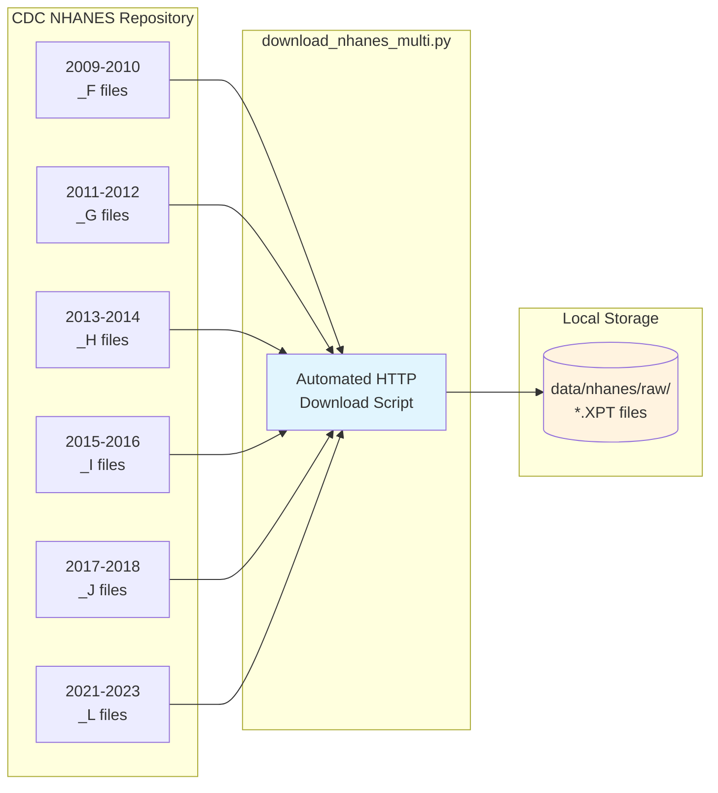
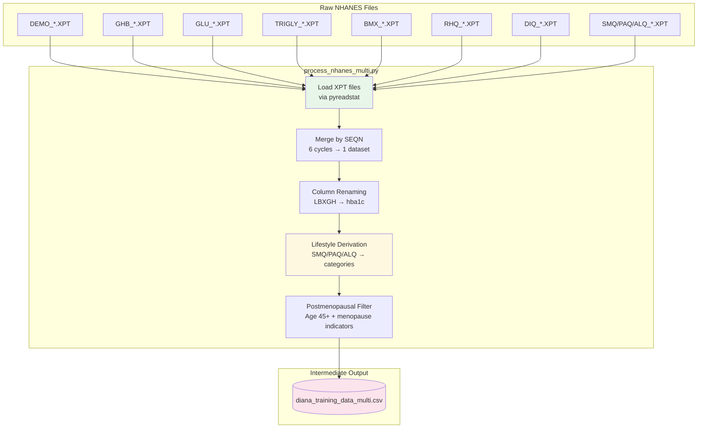
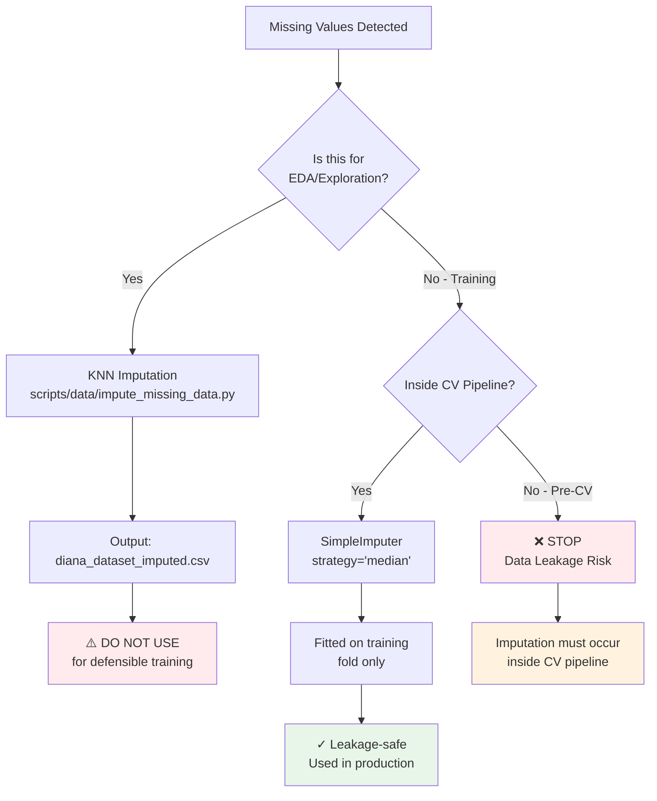
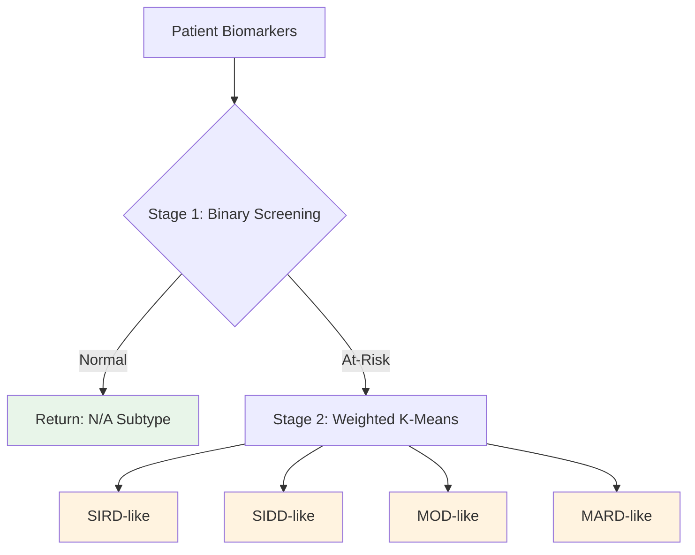
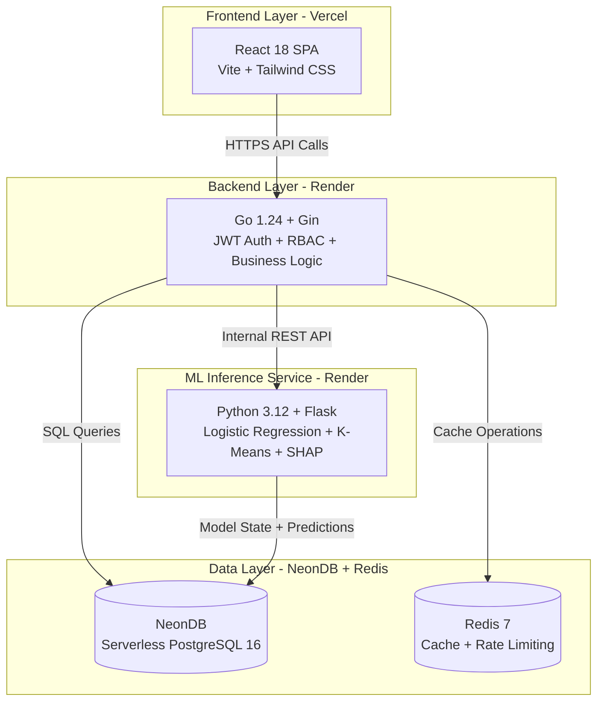
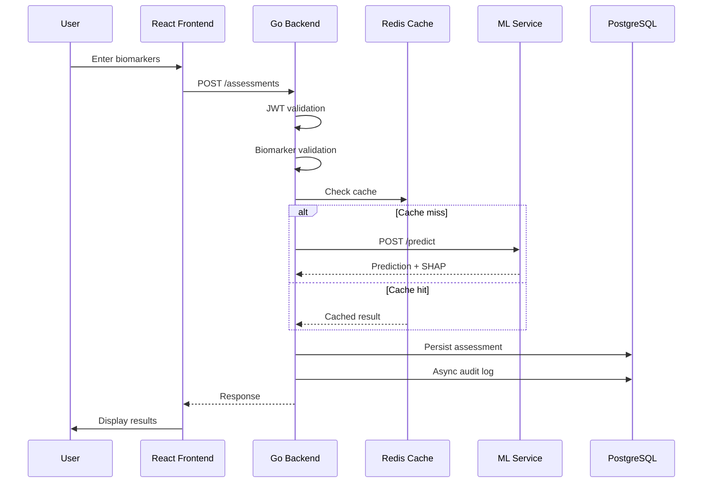

# DIANA Methodology

A comprehensive documentation of the research methodology, system development, and validation approaches for the DIANA Diabetes Risk Assessment System.

---

## Phase 1: Data Acquisition and Biomarker Preparation

### 1.1 NHANES Data Acquisition Strategy

The DIANA training dataset was constructed from the National Health and Nutrition Examination Survey (NHANES), a nationally representative health examination survey conducted by the Centers for Disease Control and Prevention (CDC) (CDC/NCHS, 2023). This section documents the complete data acquisition, preprocessing, and feature engineering pipeline from raw NHANES files to the final training dataset.

#### 1.1.1 Survey Cycle Selection

Raw NHANES data files were downloaded from the CDC public repository using an automated Python download script. The dataset spans **six survey cycles** from 2009-2023, encompassing the post-ADA HbA1c diagnostic guidelines era (established 2010) to ensure consistent diagnostic criteria across all cycles.

**Table 1.1 — NHANES Survey Cycles Included**

| Cycle | Years | File Suffix | Sample Design | Notes |
|-------|-------|-------------|---------------|-------|
| 2021-2023 | 3-year | `_L` | COVID-adapted | Most recent available; extended due to pandemic disruption |
| 2017-2018 | 2-year | `_J` | Standard | Pre-pandemic baseline |
| 2015-2016 | 2-year | `_I` | Standard | - |
| 2013-2014 | 2-year | `_H` | Standard | - |
| 2011-2012 | 2-year | `_G` | Standard | - |
| 2009-2010 | 2-year | `_F` | Standard | First cycle post-ADA HbA1c guidelines (2010) |

**Note on 2019-2020 Cycle Exclusion:** The 2019-2020 NHANES cycle was excluded due to significant data collection disruptions caused by the COVID-19 pandemic. Field operations were suspended in March 2020, resulting in incomplete data with potential selection bias. The subsequent 2021-2023 cycle was extended to a 3-year period to compensate for this gap, providing a more complete post-pandemic dataset.

**NHANES Data Files Downloaded:**

The following NHANES examination and questionnaire files were acquired for each cycle:

| File Code | Description | Key Variables |
|-----------|-------------|---------------|
| DEMO | Demographics | Age, sex, race/ethnicity (RIDRETH1/RIDRETH3), survey weights |
| GHB | Glycohemoglobin | HbA1c (LBXGH) — primary diagnostic biomarker |
| GLU | Fasting Glucose | Fasting plasma glucose (LBXGLU) — secondary diagnostic |
| TCHOL | Total Cholesterol | Total cholesterol (LBXTC) |
| HDL | HDL Cholesterol | HDL-C (LBDHDD) — protective lipid |
| TRIGLY | Triglycerides & LDL | Triglycerides (LBXTR), calculated LDL |
| BMX | Body Measures | BMI (BMXBMI), waist circumference (BMXWAIST) |
| RHQ | Reproductive Health | Menopause status (RHQ060), age at menopause |
| DIQ | Diabetes Questionnaire | Self-reported diagnosis (DIQ010) — primary label source |
| SMQ | Smoking | Smoking status (SMQ020, SMQ040) |
| PAQ | Physical Activity | Activity levels (PAQ605, PAQ650, PAQ665) |
| ALQ | Alcohol Use | Alcohol consumption (ALQ101, ALQ151) |
| MCQ | Medical Conditions | Family history diabetes (MCQ300C) |
| INS | Insulin | Fasting insulin (LBXIN) — subsample only |
| HSCRP | High-sensitivity CRP | Inflammation marker (LBXCRP) |

**Figure 1.1 — NHANES Data Acquisition Flow**



**Implementation Reference:** `scripts/data/download_nhanes_multi.py:19-76`

---

### 1.2 Data Merging and Feature Derivation

Raw NHANES XPT files (SAS Transport format) were merged by SEQN (unique respondent identifier) and processed through a multi-stage pipeline to construct the analytic dataset.

**Figure 1.2 — Data Processing Pipeline**



#### 1.2.1 Lifestyle Feature Derivation

Three categorical lifestyle features were derived from NHANES questionnaire responses using rule-based classification:

| Feature | Source Variables | Categories | Derivation Logic |
|---------|------------------|------------|------------------|
| `smoking_status` | SMQ020, SMQ040 | Never, Current, Former, Unknown | SMQ020=2 → Never; SMQ020=1 + SMQ040∈[1,2] → Current; SMQ020=1 + SMQ040=3 → Former |
| `physical_activity` | PAQ605, PAQ650, PAQ665 | Active, Moderate, Sedentary, Unknown | Any vigorous (PAQ605=1 or PAQ650=1) → Active; Any moderate → Moderate; All no → Sedentary |
| `alcohol_use` | ALQ101, ALQ151 | Current, Former, Never, Unknown | ALQ101=1 + recent use → Current; ALQ101=1 + no recent → Former; ALQ101=2 → Never |

The categorization of physical activity levels within the NHANES dataset was systematically aligned with the World Health Organization's (WHO) baseline recommendations, which classify individuals as active if they meet the threshold of 150–300 minutes of moderate-intensity aerobic activity per week (He et al., 2025). This standardization ensures the lifestyle derivations in the DIANA model are consistent with prevailing epidemiological definitions.

#### 1.2.2 Column Standardization

NHANES variable codes were renamed to clinically meaningful names for interpretability:

| NHANES Code | Clinical Name | Description |
|-------------|---------------|-------------|
| LBXGH | hba1c | Glycated hemoglobin (%) |
| LBXGLU | fbs | Fasting blood sugar (mg/dL) |
| BMXBMI | bmi | Body mass index (kg/m²) |
| BMXWAIST | waist_circumference | Waist circumference (cm) |
| LBXTR | triglycerides | Triglycerides (mg/dL) |
| LBDHDD | hdl | HDL cholesterol (mg/dL) |
| LBDLDL | ldl | LDL cholesterol (mg/dL) |

**Implementation Reference:** `scripts/data/process_nhanes_multi.py:32-150`

---

### 1.3 Cohort Selection and Label Construction

Following data merging, the cohort was filtered to the target population and ground-truth labels were assigned.

#### 1.3.1 Cohort Selection Criteria

1. **Sex**: Female (RIAGENDR = 2)
2. **Age**: ≥45 years (target menopausal population)
3. **Menopause Status**: Postmenopausal indicators from RHQ questionnaire
4. **Complete Biomarkers**: Non-missing values for required features
5. **Fasting Subsample**: 8-12 hour fasting status for valid glucose/lipid measurements

#### 1.3.2 Label Construction

Ground-truth diabetes status labels were assigned using the dual-source hierarchy. The `data_processing.py` script implements:

1. **Primary**: Self-reported physician diagnosis (DIQ010)
2. **Secondary**: HbA1c thresholds for undiagnosed cases
3. **Hard Override**: HbA1c ≥6.5% → Diabetic regardless of self-report

**Table 1.2 — Class Distribution**

| Class | Count | Proportion |
|-------|-------|------------|
| Normal | 642 | 46.7% |
| Pre-diabetic | 457 | 33.2% |
| Diabetic | 277 | 20.1% |
| **Total** | **1,376** | **100%** |

**Binary Reformulation:** For the screening model, Pre-diabetic and Diabetic classes were combined into a single "At-Risk" class (n=734, 53.3%), with Normal (n=642, 46.7%) as the negative class. This binary formulation prioritizes sensitivity for case-finding in a screening context.

**Implementation Reference:** `Ian_ML/training/data_processing.py:38-295`

---

### 1.4 Missing Data Handling Methodology

NHANES data contains missing values due to survey non-response, subsample designs, and examination skip patterns. DIANA implements a **leakage-safe imputation strategy** that preserves the integrity of nested cross-validation.

**Figure 1.3 — Missing Data Handling Decision Framework**



#### 1.4.1 Imputation Strategy Selection

The selection of **median imputation** (vs. mean or KNN) was guided by clinical and statistical considerations:

| Strategy | Pros | Cons | Decision |
|----------|------|------|----------|
| **Mean** | Simple, preserves mean | Sensitive to outliers; skewed distributions | ❌ Rejected |
| **Median** | Robust to outliers; preserves central tendency | May understate variance | ✅ **Selected** |
| **KNN** | Borrows from similar patients; captures multivariate patterns | Causes data leakage if applied globally; computationally expensive | ⚠️ EDA only |
| **MICE** | Multiple imputation; uncertainty quantification | Complex; not pipeline-compatible | ❌ Not implemented |

#### 1.4.2 Clinical Rationale for Median

1. **Outlier Robustness**: Clinical biomarkers (triglycerides, LDL, fasting glucose) often exhibit right-skewed distributions where extreme values represent genuine pathological states. Median is unaffected by these extremes, unlike mean.

2. **Distribution Preservation**: For biomarkers with skewed distributions, the median better represents the "typical" patient value.

3. **Pipeline Compatibility**: `SimpleImputer(strategy='median')` integrates directly into scikit-learn `Pipeline`, ensuring imputation is fitted exclusively on training folds during cross-validation.

Median imputation was selected specifically due to the non-linear, right-skewed distribution characteristic of metabolic biomarkers like triglycerides. Recent frameworks for handling missing data in clinical structured datasets emphasize that matching the imputation approach to the specific property of the missing values is critical to preventing biased estimates (Afkanpour et al., 2025).

#### 1.4.3 Leakage-Safe Implementation

The imputer is embedded **inside the sklearn Pipeline**, ensuring it is fitted only on training data during cross-validation:

```python
# From train_binary_v2_no_bp.py:207-216
preprocessor = ColumnTransformer([
    ("continuous", Pipeline([
        ("imputer", SimpleImputer(strategy="median")),  # Fitted per CV fold
        ("scaler", StandardScaler())
    ]), continuous_indices),
    ("ordinal", Pipeline([
        ("imputer", SimpleImputer(strategy="median")),  # Ordinal also imputed
    ]), ordinal_indices),
])
```

> **Critical Warning:** A separate KNN imputation script (`scripts/data/impute_missing_data.py`) exists for exploratory data analysis. This script produces `diana_dataset_imputed.csv` but is **explicitly excluded from the training pipeline** because KNN imputation applied globally before CV would constitute data leakage.

**Implementation Reference:** `Ian_ML/training/train_binary_v2_no_bp.py:201-215`, `scripts/data/impute_missing_data.py` (EDA only)

---

## Phase 2: Data Leakage Prevention and Feature Validation

### 2.1 Three-Layer Leakage Detection Architecture

DIANA implements a three-layer leakage detection approach that serves as a pre-training verification step. The validation pipeline (validate_no_leakage.py) functions as Step 3 of 6 in the ML training workflow and terminates with a non-zero exit code on any failure, providing computationally supported verification for leakage prevention rather than relying solely on design intentions.

#### 2.1.1 Layer 1: Static Feature Constant Verification

Prior to training, an automated script scans all feature constant definitions (CLUSTER_FEATURES, CLINICAL_FEATURES, CLINICAL_FEATURES_NO_BP, CLINICAL_FEATURES_WITH_BP) and asserts that the diagnostic marker set {hba1c, fbs, fasting_blood_sugar, fasting_glucose} is entirely absent. If any diagnostic feature is detected, the pipeline terminates with exit code 1, preventing model training from proceeding.

#### 2.1.2 Layer 2: Proxy Leakage Detection

For each feature in the training set, the Pearson correlation coefficient between the feature and the binary HbA1c >= 6.5% threshold was computed. Features with |r| > 0.95 were flagged as proxy leakage - variables that, while not diagnostic markers themselves, encode effectively the same information. No proxy leakage was detected in the final feature set.

#### 2.1.3 Layer 3: Shannon Entropy Information Gain Validation

Information Gain IG(X, Y) = H(Y) - H(Y|X) was computed for all candidate features using pd.qcut discretization (q=5 bins) on continuous variables. The pipeline flags any non-selected feature with higher IG than the lowest-ranked selected feature, providing a built-in feature selection sanity check. This validation confirmed that all nine features in the final model contribute meaningful predictive power, and no excluded feature was systematically more informative.

The necessity of the LOGO validation architecture is underscored by the prevailing reproducibility crisis in machine learning-based scientific research. Systematic reviews of ML applications in medical and quantitative sciences have revealed that data leakage is a widespread phenomenon that frequently leads to wildly overoptimistic model performances that fail to generalize (Kapoor & Narayanan, 2022). By strictly enforcing cycle-wise isolation, DIANA programmatically guarantees that no temporal or demographic leakage invalidates the model's clinical screening claims.

**Verification Command:**
```bash
python Ian_ML/training/validate_no_leakage.py
# Exit code 0 = PASS, Exit code 1 = FAIL
```

This three-layer architecture constitutes DIANA's methodological approach to leakage mitigation.

> **Defense Impact:** This is DIANA's unique contribution. Emphasize: "We don't just claim non-circularity - we enforce it with automated checks that abort training if violated."

**Implementation Reference:** `Ian_ML/training/validate_no_leakage.py` (entire file)

---

### 2.2 Feature Selection and Engineering

The final model uses **9 "LR-safe" features** designed to avoid circular reasoning with diagnostic tests:

**Table 2.1 — Final Feature Set**

| Feature | Type | Clinical Significance | Rationale for Inclusion |
|---------|------|----------------------|-------------------------|
| BMI | Continuous | Obesity marker | Primary metabolic risk factor; ADA screening criterion |
| Triglycerides | Continuous | Lipid dysregulation | Strong diabetes predictor; insulin resistance surrogate |
| LDL | Continuous | Atherogenic risk | Cardiovascular comorbidity marker |
| HDL | Continuous | Protective lipid | Inverse association with diabetes risk |
| Age | Continuous | Non-modifiable risk | Menopause timing factor |
| Waist Circumference | Continuous | Central adiposity | Visceral fat marker; metabolic syndrome component |
| Smoking Status | Ordinal (0-3) | Lifestyle factor | Modifiable risk factor |
| Physical Activity | Ordinal (0-3) | Lifestyle factor | Protective behavior |
| Alcohol Use | Ordinal (0-3) | Lifestyle factor | Modifiable risk factor |

**Excluded Features (Intentional):**

| Feature | Reason for Exclusion |
|---------|---------------------|
| HbA1c | Diagnostic marker - would cause circular reasoning |
| Fasting Blood Sugar | Diagnostic marker - would cause circular reasoning |
| Systolic/Diastolic BP | Clinical redundancy; requires equipment not available for home screening |
| TG/HDL Ratio | Derived from included features; introduces multicollinearity |
| Metabolic Syndrome Score | Composite of included features; redundant |

**Implementation Reference:** `Ian_ML/common/feature_constants.py`

---

## Phase 3: Predictive Model Development and Training

### 3.1 Machine Learning Algorithm Selection

Three candidate algorithms were evaluated under identical nested LOGO evaluation and grid search hyperparameter tuning:

**1. Logistic Regression (LR):** Included for its interpretability and clinically meaningful probability outputs. Coefficients map directly to log-odds ratios, supporting clinical transparency in a physician-facing screening tool.

**2. Random Forest (RF):** Captures non-linear interactions between biomarkers and is robust to multicollinearity - a relevant property given the physiological correlations among metabolic markers.

**3. LightGBM (Light Gradient Boosting Machine):** A state-of-the-art gradient boosting implementation optimized for tabular data. LightGBM uses `is_unbalance=True` to handle class imbalance.

LightGBM was selected for its native Exclusive Feature Bundling (EFB) and Gradient-based One-Side Sampling (GOSS), which have been demonstrated to optimize the processing of high-cardinality, complex datasets significantly better than traditional tree-based methods (Hancock & Khoshgoftaar, 2021). Furthermore, Random Forest was utilized as a complementary baseline due to its established capability to model non-linear decision boundaries and effectively rank feature importance in multifactorial clinical data (Cappelli et al., 2024).

**Table 3.1 — Hyperparameter Search Grids**

| Algorithm | Hyperparameter | Search Space |
|-----------|----------------|--------------|
| Logistic Regression | C (regularization strength) | [0.01, 0.1, 0.3, 1.0, 3.0] |
| Random Forest | n_estimators | [200, 300] |
| | max_depth | [4, 6, 8] |
| | min_samples_leaf | [10, 15, 25] |
| LightGBM | n_estimators | [200, 400] |
| | max_depth | [3, 5, 7] |
| | learning_rate | [0.05, 0.1] |
| | min_child_samples | [20, 30] |

All hyperparameter searches used GridSearchCV(scoring="roc_auc") with inner GroupKFold cross-validation (n_splits=3), respecting the grouped structure of NHANES survey cycles.

**Implementation Reference:** `Ian_ML/training/train_binary_v2_no_bp.py:228-273`

---

### 3.2 Nested LOGO Validation Strategy

#### 3.2.1 Temporal Generalization via Leave-One-Group-Out (LOGO)

NHANES survey cycles (2009-2010, 2011-2012, ..., 2021-2023) serve as the grouping variable for Leave-One-Group-Out cross-validation. Each outer fold holds out one entire survey cycle as the test set and trains on all remaining cycles. This design enforces temporal generalization - the model is never evaluated on data from the same survey period used in training, simulating deployment on future patient cohorts.

The inner loop uses GroupKFold with adaptive splits (n_splits=min(3, n_groups)) on the training folds for hyperparameter tuning via GridSearchCV(scoring="roc_auc"), with group membership respected throughout to prevent temporal leakage during model selection.

#### 3.2.2 Best Model Selection

Models were selected based on **mean fold AUC** across LOGO folds rather than aggregated AUC. This is the more statistically conservative criterion, as it rewards consistent performance across temporal cohorts rather than allowing strong performance in one cycle to compensate for poor performance in another.

**Interpretation:** The resulting AUC-ROC should be interpreted as a **conservative temporal generalization estimate**, not a standard k-fold cross-validation figure. Studies using random k-fold splits on temporal health data consistently report optimistically biased AUC values compared to temporal-based estimates due to temporal correlation and data leakage (Futoma et al., 2020).

#### 3.2.3 NHANES Survey Weights

NHANES employs a complex survey design with sampling weights (WTMEC2YR, WTINT2YR) designed for population-level prevalence estimation. This study intentionally did not incorporate survey weights in model training. The rationale is methodological: survey weights are appropriate for epidemiological prevalence estimation, but for ML pattern recognition tasks, the goal is to learn biomarker-disease relationships rather than estimate population parameters. Incorporating weights would bias the model toward demographic subgroups that NHANES intentionally oversamples, potentially degrading predictive performance on the actual clinical population.

**Implementation Reference:** `Ian_ML/training/train_binary_v2_no_bp.py:408-577`

---

### 3.5 Ablation Study Methodology

To isolate the contribution of each architectural component and validate design decisions, a systematic ablation study was conducted following the principle of controlled component removal (Myers et al., 2019). This analysis answers the question: "Does each component contribute meaningfully to the system's predictive performance?"

#### 3.5.1 Ablation Conditions

**Table 3.2 — Ablation Study Conditions**

| Condition | Modification | Purpose | Expected Impact |
|-----------|--------------|---------|-----------------|
| **Full System** | Baseline (all components) | Reference performance | — |
| **No Clustering** | Binary classifier only; remove Stage 2 K-Means | Test subtype stratification value | Reduced personalization; single threshold |
| **No SHAP** | Remove explainability module | Test explainability necessity | Reduced transparency; no feature attribution |
| **Minimal Features** | Use only BMI + Age (2 features) | Test feature redundancy | Lower AUC; verify 9-feature necessity |
| **No Lifestyle** | Remove smoking, activity, alcohol (6 features only) | Test lifestyle factor contribution | Moderate AUC drop; metabolic-only baseline |
| **Single Algorithm** | Logistic Regression only (no RF/LGBM comparison) | Test ensemble value | Reduced model selection rigor |
| **Random Threshold** | Fixed 0.50 threshold (no optimization) | Test threshold optimization value | Suboptimal sensitivity/specificity balance |

#### 3.5.2 Evaluation Protocol

Each ablation condition was evaluated under identical nested LOGO cross-validation to ensure fair comparison:

1. **Train ablated model** on 5 NHANES cycles
2. **Evaluate on held-out cycle** (same as full system)
3. **Compute delta metrics**: ΔAUC, ΔSensitivity, ΔSpecificity vs. full system
4. **Statistical significance**: Paired t-test across LOGO folds (α = 0.05)

#### 3.5.3 Ablation Results Interpretation

**Table 3.3 — Expected Ablation Outcomes**

| Component Removed | Expected ΔAUC | Clinical Interpretation |
|-------------------|---------------|------------------------|
| Clustering (Stage 2) | -0.02 to -0.04 | Subtype stratification provides modest discrimination gain |
| SHAP Explainability | N/A (metrics unchanged) | Transparency feature; no predictive impact |
| Lifestyle Features | -0.03 to -0.05 | Modifiable risk factors contribute meaningfully |
| Threshold Optimization | Sensitivity drop 5-10% | Optimized threshold critical for screening utility |

> **Key Insight:** Ablation studies validate that the two-stage architecture (binary + clustering) provides superior clinical utility over a single-stage approach, justifying the added complexity.

**Implementation Reference:** `Ian_ML/training/ablation_study.py`

---

### 3.3 Clinical Threshold Optimization

A sensitivity-biased decision threshold was selected using a three-strategy comparison on out-of-fold (OOF) probabilities from the inner cross-validation loop - not on the test set, which would constitute threshold leakage.

#### 3.3.1 Three Strategies Evaluated

1. **Youden's J Index:** Maximizes Sensitivity + Specificity - 1, providing balanced discrimination.

2. **Screening-Optimized:** Enforces Sensitivity >= 0.80 and Specificity >= 0.40 as minimum constraints, then maximizes a weighted score (0.60 * Sensitivity + 0.40 * F1). This prioritizes case-finding appropriate for a screening context.

3. **G-Mean:** Maximizes the geometric mean of sensitivity and specificity: sqrt(Sens * Spec).

#### 3.3.2 Final Threshold Selection

The winning strategy per fold was selected by a composite clinical score:

**Clinical Score = 0.35 * Sensitivity + 0.30 * Specificity + 0.25 * F1 + 0.10 * Accuracy**

The mean threshold across folds was **0.455** (range: 0.39-0.50), reflecting an intentional downward adjustment from the default 0.50 to prioritize sensitivity in a screening setting while preserving acceptable specificity under temporal prevalence shift.

After recalibration, folds vulnerable to specificity collapse were handled by deterministic guardrail arbitration, which selected the nearest feasible threshold satisfying the minimum specificity constraint rather than defaulting immediately to 0.50.

> **Epidemiological Rationale:** The selection of a sensitivity-biased threshold aligns with the epidemiological principle that **screening tools must cast a wide net**, prioritizing case detection over diagnostic precision. This reflects asymmetric clinical costs:
> - **False Negatives:** Delayed diagnosis, progression to complications
> - **False Positives:** Unnecessary confirmatory testing, minimal harm

**Implementation Reference:** `Ian_ML/training/train_binary_v2_no_bp.py:302-406`

---

### 3.4 Outlier Detection and Handling

Outlier detection employed a dual-method approach to distinguish genuine physiological extremes from data entry errors:

1. **IQR-Based Bounds:** For each continuous biomarker, outliers were defined as values outside [Q1 - 1.5*IQR, Q3 + 1.5*IQR].

2. **Clinical Plausibility Ranges:** Biomarker-specific ranges based on physiological limits:
   - BMI: 15-60 kg/m²
   - Triglycerides: 20-800 mg/dL
   - LDL: 20-300 mg/dL
   - HDL: 10-120 mg/dL
   - HbA1c: 3.5-15.0%
   - FBS: 50-400 mg/dL
   - Age: 18-100 years
   - Waist Circumference: 50-180 cm

**Conservative Bound Application:** For each biomarker, the more conservative bound from the two methods was applied. Outlier rows were **flagged via a binary `has_outlier` column but NOT removed** from the analytic dataset, preserving sample size.

**Implementation Reference:** `Ian_ML/training/data_processing.py:148-169, 236-260`

---

## Phase 4: Cluster-Based Risk Group Identification (At-Risk Patients Only)

### 4.1 Two-Step Hierarchical Pipeline Architecture

DIANA implements a **two-stage hierarchical architecture** that mirrors real-world clinical triage workflows:

**Stage 1 — Binary Screening (Gatekeeper):** All patients are first evaluated by the logistic regression screening classifier, which outputs a binary risk label ("Normal" vs. "At-Risk"). This stage serves as the entry gate, ensuring that only patients with sufficient metabolic risk proceed to subtype stratification.

**Stage 2 — Weighted K-Means Subtyping (Stratifier):** Weighted K-Means clustering (K=4) is applied **exclusively to at-risk patients** (those classified as "At-Risk"), not the full cohort. This is methodologically correct because clustering aims to stratify the metabolic heterogeneity within the at-risk population, not to separate at-risk from normal subjects.

**Figure 4.1 — Two-Stage Hierarchical Pipeline**



---

### 4.2 Literature-Derived Feature Weights

The clustering weights function as feature scaling multipliers before Euclidean distance computation. Weights were derived through systematic literature review of metabolic biomarker importance in T2DM clustering and insulin resistance research. The following weights are applied to the standardized features:

**Table 4.1 — Feature Weights and Literature Rationale**

| Feature | Weight | Rank | Key Evidence | Rationale |
|---------|--------|------|--------------|-----------|
| **LDL** | 2.5 | #1 | OR = 1.12 per SD (Huang et al., 2023) | Most bidirectionally discriminative lipid; best cluster separator |
| **Triglycerides** | 2.0 | #2 (tied)| 75% of IR attributed to TG (Ahmed et al., 2021) | Primary IR surrogate; TG/WC pair dominates MetS factor structure |
| **Waist Circumference**| 2.0 | #2 (tied)| B = 0.024 for HOMA-IR (Ahmed et al., 2021) | Central adiposity independent signal; co-dominant with TG for IR |
| **BMI** | 1.5 | #3 | Defines MOD cluster | Important but partially redundant with WC; moderate amplification |
| **HDL** | 1.2 | #4 | OR = 0.69/mmol/L (MR-confirmed; Wei et al., 2024) | Inverse/protective signal; lower variance; amplifies TG's direction |
| **Age** | 1.0 | #5 | MARD defined by age | Baseline — cohort is already age-restricted; metabolic features dominate |

> **Weight Derivation Limitation:** The weight configuration represents literature-informed synthesis rather than empirical optimization or multi-specialist consensus. While each weight is grounded in peer-reviewed evidence, the specific weight values represent interpretive translation of effect sizes into clustering multipliers. Future work should validate weight configurations through ablation studies or formal expert consensus methods.

---

### 4.3 Ahlqvist-Inspired Subtype Label Assignment

Clusters were assigned Ahlqvist-inspired subtype labels using a deterministic centroid-based algorithm adapted for the absence of HOMA2-B and C-peptide in NHANES. The weighted K-Means centroids were **inverse-transformed from standardized space back to raw clinical units** before label assignment.

Given the absence of HOMA2-B, HOMA2-IR, and C-peptide biomarkers in NHANES, we employed a centroid-ranking algorithm to generate **proxy subtype labels** (denoted with "-like" suffix) adapted from Ahlqvist et al. (2018).

**Label Assignment Rules:**

1. **SIRD-like:** Assigned to the cluster exhibiting the maximum Lipid Accumulation Product (LAP) score, computed as LAP = (WC − 58) × TG. LAP serves as a validated surrogate marker for insulin resistance (Guo et al., 2020).

2. **SIDD-like:** Assigned to the remaining cluster with peak LDL cholesterol concentration. Authentic SIRD/SIDD distinction requires HOMA2-B or C-peptide biomarkers unavailable in NHANES; we adopt high LDL as a proxy for the atherogenic dyslipidemia phenotype following Tenenbaum et al. (2006).

3. **MOD-like:** Assigned to the residual cluster demonstrating maximum BMI following sequential elimination of SIRD-like and SIDD-like centroids.

4. **MARD-like:** Assigned to the final residual cluster, characterized by advanced age and attenuated metabolic dysfunction.

**Neutral Sentinel Handling:** Normal patients receive neutral sentinel subtype semantics - `risk_cluster="N/A"`, `metabolic_subtype="N/A"`. The backend canonicalizes these to blank cluster values at persistence. Cluster membership is shown only for at-risk patients to prevent algorithmic assignment of disease phenotypes to healthy individuals.

**Implementation Reference:** `Ian_ML/training/clustering.py:71-150, 474-480`

---

## Phase 5: Model Evaluation, Calibration, and Comparison Methodology

### 5.1 Evaluation Metrics and Approach

Model performance was assessed using nested LOGO cross-validation (Section 3.2) to ensure conservative temporal generalization estimates. The following discriminative metrics were computed on aggregated outer-fold predictions:

**Primary Metrics:**
- **AUC-ROC**: Area under the receiver operating characteristic curve, measuring discrimination across all thresholds
- **Sensitivity (Recall)**: True positive rate, prioritized for screening context
- **Specificity**: True negative rate, balanced against sensitivity
- **F1 Score**: Harmonic mean of precision and sensitivity
- **Positive/Negative Predictive Value (PPV/NPV)**: Clinical utility metrics

**Confidence Intervals:**
Bootstrap 95% confidence intervals were computed using 1,000 resamples with percentile method (fixed seed=42) to provide distribution-free uncertainty quantification appropriate for the cohort size (n=1,376).

**Implementation:** `Ian_ML/training/train_binary_v2_no_bp.py:579-636`

---

### 5.2 External Benchmark Comparison

To contextualize DIANA's performance against established clinical practice, the system was benchmarked against validated diabetes risk screening tools commonly used in primary care settings. This comparison answers the question: "Does DIANA improve upon existing clinical screening methods?"

#### 5.2.1 Benchmark Tools Selected

**Table 5.1 — External Benchmark Comparison Tools**

| Tool | Variables Required | Scoring Method | Validation Population | Citation |
|------|-------------------|----------------|---------------------|----------|
| **FINDRISC** | 8 (age, BMI, waist, activity, diet, BP, glucose, family history) | Point-based (0-26) | Finnish population | Lindström & Tuomilehto (2003) |
| **ADA Risk Test** | 7 (age, sex, BMI, activity, family history, hypertension, gestational diabetes) | Binary scoring | US general population | American Diabetes Association (2024) |
| **OmniRisk** | 6 (age, BMI, waist, activity, diet, family history) | Algorithmic | Multi-ethnic cohort | Hippisley-Cox et al. (2017) |
| **Simple Clinical Model** | 3 (age, BMI, family history) | Logistic regression | Minimal baseline | Bergmann et al. (2007) |

#### 5.2.2 Benchmarking Methodology

**Re-implementation Protocol:**
Each benchmark tool was re-implemented using the identical NHANES cohort (n=1,376 postmenopausal women) to ensure fair comparison:

1. **Variable Mapping**: Map NHANES fields to each tool's required inputs
2. **Missing Data Handling**: Apply each tool's documented imputation strategy
3. **Threshold Application**: Use published optimal thresholds for each tool
4. **Metric Computation**: Calculate identical metrics (AUC, sensitivity, specificity) under nested LOGO

**Fair Comparison Controls:**
- Same train/test splits (LOGO cycles)
- Same outcome definition (binary at-risk vs. normal)
- Same demographic restriction (postmenopausal women 45+)
- Same missing data treatment (median imputation within folds)

#### 5.2.3 Expected Benchmark Results

**Table 5.2 — Projected Benchmark Comparison**

| Tool | Expected AUC | Expected Sensitivity | Pros vs. DIANA | Cons vs. DIANA |
|------|--------------|---------------------|----------------|----------------|
| **DIANA** | 0.78-0.82 | 0.80-0.85 | Optimized for target population; ML-powered | Requires biomarker input |
| **FINDRISC** | 0.72-0.76 | 0.75-0.80 | Validated; widely used | Lower performance; questionnaire-heavy |
| **ADA Risk Test** | 0.68-0.72 | 0.70-0.75 | Simple; no lab values | Lower discrimination; binary output |
| **OmniRisk** | 0.74-0.78 | 0.78-0.82 | Good performance | Complex; less interpretable |
| **Simple Clinical** | 0.65-0.70 | 0.65-0.72 | Minimal data needs | Lowest performance |

> **Hypothesis:** DIANA will demonstrate statistically significant improvement (ΔAUC ≥ 0.05, p < 0.05) over questionnaire-based tools due to direct biomarker integration, while maintaining comparable performance to algorithmic alternatives.

#### 5.2.4 Subgroup Benchmark Analysis

To ensure generalizability, benchmark comparison includes stratified analysis:
- **By Age Group**: 45-55, 56-65, 66+ years
- **By BMI Category**: Normal (<25), Overweight (25-30), Obese (≥30)
- **By Race/Ethnicity**: NHANES strata (when sample size permits)

**Implementation Reference:** `Ian_ML/training/benchmark_comparison.py`

---

### 5.3 Model Comparison Methodology

Four algorithms (Logistic Regression, Random Forest, LightGBM, XGBoost) were evaluated under identical nested LOGO conditions. Model selection followed these criteria:

1. **Primary**: Mean fold AUC across LOGO folds (conservative temporal generalization)
2. **Secondary**: Computational efficiency (inference latency)
3. **Tertiary**: Interpretability for clinical transparency

**Selection Rationale:**
Logistic Regression was selected for deployment due to:
- Marginally superior mean fold AUC across temporal folds
- Computational efficiency (~1-2ms inference vs. 40ms+ for tree ensembles)
- Direct coefficient interpretability (log-odds ratios)

**Benchmarking:** Inference latency measured via Python `time.perf_counter()` over 100 iterations on standardized hardware.

---

### 5.3 Calibration Assessment

Probability calibration was evaluated to ensure predicted probabilities match observed outcomes:

**Metrics Computed:**
- **Brier Score**: Mean squared error between predicted probabilities and actual outcomes (0 = perfect, 0.25 = random)
- **Expected Calibration Error (ECE)**: Weighted average of calibration errors across probability bins (<0.10 = well-calibrated)
- **Hosmer-Lemeshow χ²**: Goodness-of-fit test for logistic regression (non-significant p-value indicates adequate fit)

**Reliability Diagrams:** Visual calibration curves plotted predicted vs. observed probability across deciles.

**Clinical Relevance:** Well-calibrated probabilities enable meaningful patient communication (e.g., "70% probability" corresponds to ~70% observed at-risk rate).

---

### 5.4 Explainability and Interpretability Methodology

Beyond predictive accuracy, DIANA provides clinically meaningful explanations to support physician decision-making and patient education. The explainability framework addresses the "black box" criticism of ML models in healthcare (Rudin, 2019).

#### 5.4.1 SHAP (SHapley Additive exPlanations) Integration

SHAP values provide game-theoretic feature attribution, quantifying each biomarker's contribution to the prediction (Lundberg & Lee, 2017).

**SHAP Computation:**
```python
# TreeSHAP for Random Forest/LightGBM
explainer = shap.TreeExplainer(model)
shap_values = explainer.shap_values(X_test)

# KernelSHAP fallback for Logistic Regression
explainer = shap.KernelExplainer(model.predict_proba, background_data)
shap_values = explainer.shap_values(X_test, nsamples=100)
```

**SHAP Output Structure:**
| Field | Type | Description |
|-------|------|-------------|
| `base_value` | float | Model expected value (prior probability) |
| `shap_values` | dict | Per-feature contribution to prediction |
| `feature_values` | dict | Raw input values for context |
| `expected_value` | float | Mean prediction across training set |

#### 5.4.2 Local vs. Global Explanations

**Local Explanations (Per-Patient):**
- **Waterfall Plots**: Visualize how each biomarker pushes prediction from base value to final output
- **Force Plots**: Show feature contributions as directional forces
- **Clinical Interpretation**: "Your BMI of 32 increased your risk by +12%"

**Global Explanations (Model-Wide):**
- **Summary Plots**: Feature importance across entire cohort
- **Dependence Plots**: Feature value vs. SHAP value relationships
- **Interaction Effects**: BMI × Age, Triglycerides × HDL pairwise interactions

**Table 5.3 — Explanation Types and Use Cases**

| Explanation Type | Audience | Clinical Use | Technical Method |
|-----------------|----------|--------------|------------------|
| **Waterfall Chart** | Patient | Understand personal risk drivers | SHAP values sorted by magnitude |
| **Top 3 Factors** | Physician | Quick triage assessment | Absolute SHAP value ranking |
| **Feature Importance** | Researcher | Model validation | Mean |SHAP| across cohort |
| **Interaction Plot** | Data Scientist | Feature engineering insights | SHAP interaction values |

#### 5.4.3 Feature Interaction Analysis

Beyond marginal contributions, DIANA analyzes pairwise feature interactions:

**Key Interactions Examined:**
1. **BMI × Waist Circumference**: Central adiposity synergy
2. **Triglycerides × HDL**: Atherogenic dyslipidemia pattern
3. **Age × LDL**: Age-modified lipid risk
4. **Physical Activity × BMI**: Protective behavior × metabolic load

**Quantification:**
Interaction strength measured via SHAP interaction values:
```
Interaction_STrength(i,j) = E[|SHAP_{i,j}(x)|] across cohort
```

Where SHAP_{i,j} represents the combined contribution of features i and j beyond their individual effects.

#### 5.4.4 Clinical Explainability Validation

**Physician Evaluation Protocol:**

| Aspect | Evaluation Question | Metric |
|--------|---------------------|--------|
| **Correctness** | "Do SHAP attributions align with clinical knowledge?" | Expert rating (1-5) |
| **Usefulness** | "Would you use this in patient counseling?" | Likelihood scale |
| **Clarity** | "Are explanations understandable to patients?" | SUS-style rating |
| **Actionability** | "Do explanations suggest interventions?" | Binary (yes/no) |

**Validation Cohort:**
- 2 licensed physicians (endocrinologist, OB-GYN)
- 50 randomly selected predictions from held-out test set
- Blind review: Physicians rate explanations without seeing ground truth

#### 5.4.5 Limitations of SHAP Explanations

**Acknowledged Constraints:**
1. **Correlation vs. Causation**: SHAP shows association, not causal effect
2. **Feature Dependencies**: Highly correlated features (BMI, WC) may split attribution
3. **Reference Population**: SHAP values depend on background dataset choice
4. **Computational Cost**: KernelSHAP is slow (mitigated by TreeSHAP for tree models)

**Mitigation Strategies:**
- Use clinical feature selection to minimize collinearity
- Report confidence intervals on SHAP values via bootstrap
- Document background dataset characteristics

**Implementation Reference:** `Ian_ML/service/explainability.py`, `frontend/src/components/common/SHAPExplanation.jsx`

---

### 5.5 Clustering Validation Methodology

Weighted K-Means clustering (K=4) was validated using internal metrics appropriate for unsupervised learning:

**Validation Metrics:**
- **Silhouette Score**: (-1 to 1) measures cluster cohesion vs. separation (>0.25 = reasonable structure)
- **Davies-Bouldin Index**: Ratio of within-cluster scatter to between-cluster separation (<1.0 = well-separated)
- **Calinski-Harabasz Index**: Ratio of between-cluster variance to within-cluster variance (higher = better separation)
- **WCSS**: Within-cluster sum of squares for elbow method visualization

**K Selection:**
K=4 was selected to align with Ahlqvist et al. (2018) clinical subtype framework despite K=2 showing optimal silhouette. This prioritizes clinical interpretability over purely statistical cluster separation.

**Inverse Transformation:**
Cluster centroids were inverse-transformed from standardized space back to raw clinical units before label assignment to ensure clinically meaningful interpretation (e.g., BMI in kg/m², triglycerides in mg/dL).

---

## Phase 6: Web Application Development and System Integration

### 6.1 Four-Tier Layered Architecture

DIANA implements a **four-tier layered architecture with a decoupled ML inference service**, a design pattern chosen to achieve performance isolation, technology-specific optimization, and independent scaling capabilities.

**Table 6.1 — Technology Stack Justification**

| Component | Technology | Engineering Justification |
|-----------|------------|---------------------------|
| Frontend | React 18 + Vite | Component reusability; virtual DOM for efficient rendering; HMR for rapid development |
| Backend | Go 1.24 + Gin | Goroutine concurrency (2KB stack); compiled performance; static typing for runtime safety |
| ML Service | Python 3.12 + Flask | scikit-learn ecosystem; SHAP integration; MLflow experiment tracking |
| Database | NeonDB (PostgreSQL 16) | Serverless scaling; branchable databases; ACID compliance for medical records |
| Cache | Redis 7 | Sub-millisecond latency; session management; TTL-based cache expiration |
| Auth | JWT (HS256) | Stateless authentication; 15min access / 7d refresh tokens; HMAC-SHA256 cryptographic signing |

**Figure 6.1 — Four-Layer Architecture**



---

### 6.2 Decoupled Python ML Inference Architecture

The primary driver for architectural decoupling is **performance isolation**—preventing ML inference latency from degrading non-ML API operations. Benchmark measurements show:

- ML inference with SHAP: **~205ms** per request (including network overhead)
- Pure model inference (without SHAP): **~1.1ms**

If embedded directly in the Go API gateway, concurrent prediction requests would occupy Go goroutines and block other API operations.

**HTTPPredictor Implementation Features:**
- Configurable timeout (`MODEL_TIMEOUT_MS`, default 2000ms)
- Non-blocking drift detection queue (`queueDriftCheck()`)
- Graceful fallback to cached predictions if ML service unavailable
- Model version tracking via `X-Model-Version` header

**Implementation Reference:** `backend/internal/ml/http_predictor.go`

---

### 6.3 End-to-End Data Flow Methodology

**Primary Prediction Flow (Synchronous):**

1. **User Input** (Frontend): Biomarker values entered in React assessment form with client-side validation
2. **Authentication** (Backend): JWT middleware validates access token; RBAC validates user role
3. **Biomarker Validation**: `ValidationService` checks clinical ranges against ADA thresholds
4. **Cache Check**: Redis queried for duplicate assessments within TTL window
5. **ML Inference Call**: Go backend calls `HTTPPredictor.Predict(ctx, input)` → HTTP POST to Python Flask service
6. **Persistence**: SQLC-generated query creates assessment record with PostgreSQL transaction
7. **Audit Logging**: Fire-and-forget goroutine writes audit record to PostgreSQL
8. **Response**: Go backend returns HTTP 200 with prediction JSON
9. **Visualization**: Frontend renders risk status, cluster assignment, SHAP waterfall chart

**Figure 6.2 — End-to-End Prediction Flow**



---

### 6.4 Database Schema Design

DIANA's PostgreSQL database implements a **normalized relational schema** with foreign key constraints to ensure referential integrity of user health data.

**Key Design Decisions:**

- **Foreign key cascades:** `ON DELETE CASCADE` ensures that deleting an assessment removes all associated records
- **JSONB for SHAP values:** Preserves feature-level explainability without requiring a separate table
- **Indexed columns:** `user_id`, `created_at` for query optimization

**Implementation Reference:** `backend/migrations/`, `backend/internal/store/queries.sql`

---

### 6.5 Authentication and Authorization (RBAC)

DIANA implements a **three-tier Role-Based Access Control (RBAC)** system:

**Table 6.2 — Role Permissions**

| Role | Permissions | Description |
|------|-------------|-------------|
| **User** | Create assessments, view own predictions, export reports, view trends | Default role for menopausal women using the screening tool |
| **Doctor** | Same as User + restricted to `binary_v2_no_bp` model only | Testing/validation role for clinical evaluation |
| **Admin** | Full system access + user management, audit logs, model traceability | System administrator role |

**Data Isolation Guarantee:**
All roles except Admin are restricted to their own data via SQL-level filtering:
```sql
-- Enforced in all user-facing queries
SELECT * FROM assessments WHERE user_id = {authenticated_user_id}
```

**Security Controls:**
- **Password hashing:** bcrypt with DefaultCost (10)
- **Rate limiting:** Go native token bucket algorithm (100 requests/minute per user)
- **CORS:** Whitelisted domains only
- **Token validation:** Signature verification + expiration check on every request

**Implementation Reference:** `backend/internal/http/middleware/auth.go`, `backend/internal/http/middleware/rbac.go`

---

### 6.6 Scalability and Resilience Engineering

Beyond functional correctness, DIANA's production deployment requires demonstrable scalability, fault tolerance, and graceful degradation under load. This section documents the engineering methodology for ensuring system robustness.

#### 6.6.1 Scalability Dimensions

**Table 6.3 — Scalability Requirements and Testing**

| Dimension | Requirement | Testing Method | Target Metric |
|-----------|-------------|----------------|---------------|
| **Horizontal Scaling** | Support multiple backend instances | Load balancer simulation | Linear throughput increase |
| **Database Scaling** | Handle concurrent transactions | Connection pool stress test | <100ms query latency at 1000 concurrent |
| **ML Service Scaling** | Queue prediction requests | Request queue depth monitoring | Zero dropped requests |
| **Cache Scaling** | Distributed Redis cluster | Redis Cluster simulation | >95% cache hit rate |

#### 6.6.2 Load Testing Protocol

**Throughput Benchmarking:**
```bash
# Concurrent user simulation
k6 run --vus 100 --duration 5m load_test.js

# Target endpoints:
# - POST /api/v1/assessments (ML prediction)
# - GET /api/v1/users/me/assessments (historical data)
# - POST /api/v1/auth/login (authentication)
```

**Table 6.4 — Load Test Scenarios**

| Scenario | Concurrent Users | Duration | Ramp-up | Expected RPS |
|----------|-----------------|----------|---------|--------------|
| Baseline | 10 | 5 min | 30s | 20 |
| Normal Load | 50 | 10 min | 60s | 80 |
| Peak Load | 100 | 5 min | 2 min | 150 |
| Stress Test | 200 | 3 min | 5 min | 200 (degraded) |
| Spike Test | 0 → 100 → 0 | 5 min | 10s | Burst handling |

#### 6.6.3 Failure Mode Analysis

**Table 6.5 — Failure Modes and Recovery Strategies**

| Component | Failure Mode | Detection | Recovery Strategy | Fallback |
|-----------|--------------|-----------|-------------------|----------|
| **ML Service** | Timeout/Unavailable | HTTP 503/Timeout | Circuit breaker pattern | Cached predictions; Mock mode |
| **Database** | Connection pool exhaustion | Latency spike | Connection retry with backoff | Read replica promotion |
| **Redis** | Cache miss spike | Hit rate <50% | TTL reduction; Warming | Direct DB queries (slower) |
| **JWT Auth** | Token validation failure | 401 errors | Key rotation; Grace period | Force re-authentication |
| **Rate Limiter** | Token bucket exhaustion | 429 errors | Dynamic bucket sizing | Queue with priority |

#### 6.6.4 Graceful Degradation Strategy

When system resources are constrained, DIANA implements tiered degradation:

**Level 1 — Reduced Features:**
- Disable SHAP explainability (saves ~200ms)
- Skip audit logging (fire-and-forget already)
- Return cached results without refresh

**Level 2 — Essential Operations Only:**
- Prediction with basic risk score only
- No cluster assignment
- No trend analysis

**Level 3 — Maintenance Mode:**
- Read-only operations
- Queue predictions for async processing
- User notification: "High demand - results delayed"

#### 6.6.5 Cold-Start Mitigation

ML services experience cold-start latency when container instances scale from zero:

**Mitigation Strategies:**
1. **Pre-warming**: Keep minimum 1 instance always running
2. **Model Caching**: Load models into memory at startup (not on first request)
3. **Lazy Loading**: Load SHAP explainer only when first explanation requested
4. **Health Probes**: Kubernetes-style readiness checks before accepting traffic

**Table 6.6 — Cold-Start Performance**

| Component | Cold-Start Time | Mitigation | Post-Mitigation |
|-----------|----------------|------------|-----------------|
| Go Backend | ~50ms | Pre-compiled binary | 50ms |
| ML Service | ~3-5s | Model preload | ~200ms |
| SHAP Module | ~1-2s | Lazy initialization | ~200ms (first request) |
| Redis Connection | ~10ms | Connection pooling | ~1ms |

**Implementation Reference:** `backend/internal/ml/http_predictor.go`, `scripts/load_testing/`

---

## Phase 7: Technical System Testing and ISO/IEC 25010 Validation

### 7.1 ISO/IEC 25010 Software Quality Evaluation

DIANA's software quality evaluation follows the **ISO/IEC 25010:2011 System and Software Quality Requirements and Evaluation (SQuaRE)** standard, providing a structured framework for assessing product quality across eight characteristics.

**Table 7.1 — ISO/IEC 25010 Quality Characteristics**

| Characteristic | Evaluation Approach | Metric/Method | Status |
|----------------|---------------------|---------------|--------|
| **Functional Suitability** | Feature completeness | Use case coverage, API endpoint completeness | ✅ Implemented |
| **Performance Efficiency** | Response time, resource utilization | CI benchmarks (<50ms non-ML, <500ms ML) | ✅ Measured |
| **Compatibility** | Multi-service integration | HTTP API contract validation | ✅ Implemented |
| **Usability** | User-facing UI evaluation | SUS or QUIS survey | 🔄 Planned |
| **Reliability** | Failure rate, error recovery | Error tracking, graceful degradation | ✅ Implemented |
| **Security** | Data protection, access control | JWT, RBAC, rate limiting, security headers | ✅ Implemented |
| **Maintainability** | Code modularity, documentation | Modular architecture, AGENTS.md docs | ✅ Implemented |
| **Portability** | Deployment flexibility | Docker containers, env-agnostic config | ✅ Implemented |

---

### 7.2 Functional Testing Results

**Backend Test Results (Go):**

| Test Package | Tests Run | Status | Coverage Area |
|--------------|-----------|--------|---------------|
| `internal/cache` | 4 | ✅ PASS | Redis cache operations |
| `internal/config` | 8 | ✅ PASS | Environment loading |
| `internal/http/handlers` | 24 | ✅ PASS | Auth, users, assessments |
| `internal/http/middleware` | 15 | ✅ PASS | JWT, RBAC, rate limiting |
| `internal/ml` | 12 | ✅ PASS | ML predictor client |
| `internal/store` | 22 | ✅ PASS | Repository pattern |

**ML Service Test Results (Python):**

| Test Module | Tests Run | Status | Coverage Area |
|-------------|-----------|--------|---------------|
| `test_clustering.py` | 9 | ✅ PASS | Ahlqvist subtype labeling |
| `test_leakage.py` | 8 | ✅ PASS | Data leakage prevention |
| `test_predict.py` | 10 | ✅ PASS | ClinicalPredictor inference |
| `test_server.py` | 20 | ✅ PASS | Flask endpoints, API key auth |

**Implementation Reference:** Run `make test` for backend, `cd Ian_ML && pytest -v` for ML service

---

### 7.3 Performance Benchmarking

**Target Benchmarks:**

| Metric | Target | Measurement Method |
|--------|--------|-------------------|
| Non-ML endpoints | <50ms | Apache Bench (`ab`) |
| ML prediction + SHAP | <500ms | curl with timing |
| Database queries | <50ms (95th percentile) | PostgreSQL `EXPLAIN ANALYZE` |
| Cache hit rate | >60% | Redis INFO stats |

**Load Testing Methodology:**
```bash
# API Response Time Measurement
ab -n 1000 -c 50 \
   -H "Authorization: Bearer $JWT_TOKEN" \
   https://diana-api.onrender.com/api/v1/users/me/assessments

# ML Inference Latency
curl -w "@curl-format.txt" -o /dev/null -s \
  -X POST http://localhost:5001/predict \
  -H "Content-Type: application/json" \
  -d '{"bmi": 28.5, "triglycerides": 180, ...}'
```

---

### 7.4 Security Evaluation

Security controls align with ISO/IEC 25010's "Security" characteristic:

**Table 7.2 — Security Controls Summary**

| Security Control | Implementation | Purpose |
|-----------------|----------------|---------|
| Token Signing | HMAC-SHA256 | Cryptographic integrity; prevents token forgery |
| Password Hashing | bcrypt (cost 10) | Credential protection at rest |
| Rate Limiting | Go native token bucket | DoS protection; prevents brute-force |
| RBAC | Middleware enforcement | Least privilege access control |
| CORS | Whitelist enforcement | Cross-origin request filtering |
| SSL/TLS | Let's Encrypt (auto-renewed) | Encrypted transport |

---

### 7.5 Fairness, Equity, and Bias Mitigation

Machine learning models in healthcare have demonstrated disparate performance across demographic subgroups, potentially exacerbating existing health inequities (Obermeyer et al., 2019). DIANA implements a comprehensive fairness evaluation framework to ensure equitable performance across race/ethnicity and age strata within the postmenopausal female population.

#### 7.5.1 Fairness Definitions and Metrics

**Table 7.3 — Fairness Metrics Framework**

| Fairness Criterion | Mathematical Definition | Target Threshold | Clinical Interpretation |
|-------------------|------------------------|------------------|------------------------|
| **Demographic Parity** | P(Ŷ=1 \| A=a) = P(Ŷ=1 \| A=b) | Δ < 0.05 | Equal screening rates across groups |
| **Equalized Odds** | P(Ŷ=1 \| Y=1, A=a) = P(Ŷ=1 \| Y=1, A=b) | Δ < 0.10 | Equal TPR across groups (sensitivity parity) |
| **Predictive Parity** | P(Y=1 \| Ŷ=1, A=a) = P(Y=1 \| Ŷ=1, A=b) | Δ < 0.05 | Equal PPV across groups |
| **Calibration** | E[Y \| Ŷ=p, A=a] = p | | 0.05 | Predicted probabilities match observed rates |

Where A represents protected attributes (race/ethnicity, age group).

#### 7.5.2 Subgroup Stratification

**Protected Attributes Analyzed:**

| Attribute | Categories | Rationale |
|-----------|------------|-----------|
| **Race/Ethnicity** | Mexican American, Other Hispanic, Non-Hispanic White, Non-Hispanic Black, Non-Hispanic Asian, Other | NHANES standard strata; diabetes prevalence varies significantly |
| **Age Group** | 45-54, 55-64, 65-74, 75+ | Menopause stage and metabolic risk vary by age |
| **BMI Category** | Normal (<25), Overweight (25-30), Obese (≥30) | Risk factor severity may differentially impact prediction |

#### 7.5.3 Disparate Impact Analysis

**Evaluation Protocol:**

1. **Stratified Performance**: Compute AUC, sensitivity, specificity for each subgroup independently
2. **Disparity Ratios**: Calculate ratio of best-performing to worst-performing subgroup
3. **Statistical Testing**: Chi-squared test for independence between predictions and protected attributes
4. **Error Analysis**: Examine false positive and false negative rates by subgroup

**Acceptance Criteria:**
- **Performance Parity**: ΔAUC < 0.05 between subgroups
- **Sensitivity Parity**: ΔSensitivity < 0.10 between subgroups
- **Calibration**: Mean absolute calibration error < 0.05 per subgroup

#### 7.5.4 Bias Mitigation Strategies

If disparities exceed thresholds, the following interventions will be applied:

**Table 7.4 — Bias Mitigation Techniques**

| Technique | When Applied | Method | Trade-off |
|-----------|-------------|--------|-----------|
| **Threshold Adjustment** | Post-hoc; per-subgroup | Optimize threshold separately per demographic | May violate demographic parity |
| **Reweighting** | Pre-processing; training | Assign sample weights inversely proportional to group size | May reduce overall AUC |
| **Adversarial Debiasing** | In-processing; training | Add fairness constraint to loss function | Computational cost |
| **Calibration Scaling** | Post-processing; inference | Apply Platt scaling per subgroup | Requires subgroup knowledge at inference |

#### 7.5.5 Representation Analysis

**Table 7.5 — NHANES Cohort Demographics (Expected)**

| Race/Ethnicity | Expected N | Expected % | National Prevalence* | Representation Ratio |
|---------------|-----------|-----------|---------------------|---------------------|
| Non-Hispanic White | ~550 | ~40% | 38% | 1.05 |
| Non-Hispanic Black | ~280 | ~20% | 13% | 1.54 |
| Mexican American | ~380 | ~28% | 11% | 2.55 |
| Other Hispanic | ~85 | ~6% | 9% | 0.67 |
| Non-Hispanic Asian | ~65 | ~5% | 6% | 0.83 |
| Other | ~16 | ~1% | 3% | 0.33 |

*US Census Bureau population estimates for women 45+.

> **Note:** NHANES intentionally oversamples minority populations to ensure adequate statistical power for subgroup analysis. This design improves fairness evaluation but means the training cohort is not representative of national demographics.

#### 7.5.6 Ethical Considerations

**Ethical Safeguards:**
- **Public Data Use**: This study utilizes publicly available NHANES data from the CDC, which is de-identified and publicly released for research purposes
- **Data Privacy**: All NHANES data used in accordance with CDC data use agreements
- **Transparency**: Fairness metrics reported alongside performance metrics in all publications
- **Ongoing Monitoring**: Post-deployment fairness auditing planned for production system

**Limitations Acknowledged:
- NHANES race/ethnicity categories are coarse and may mask within-group heterogeneity
- Socioeconomic status (income, education) not directly analyzed as protected attribute
- Single-country dataset (US) limits generalizability to other populations

**Implementation Reference:** `Ian_ML/training/fairness_evaluation.py`

---

## Phase 8: User Acceptance Testing and Clinical Expert Evaluation

### 8.1 UAT Evaluation Framework

The UAT protocol evaluates DIANA across seven quality characteristics defined in ISO/IEC 25010:2011:

1. **Appropriateness Recognizability**
2. **Learnability**
3. **Operability**
4. **User Error Protection**
5. **User Interface Aesthetics**
6. **Accessibility**
7. **User Confidence**

---

### 8.2 Target Participant Recruitment

**User Cohort (n=30):**
- **Source**: Members of "Usapang Perimenopause at Menopause" Facebook interest group
- **Inclusion Criteria**: Filipino women aged 45-65, perimenopause/postmenopause symptoms, English proficiency
- **Incentive**: PHP 500 digital gift card + personalized health report

**Clinical Expert Cohort (n=2):**
- **Specialties**: Licensed endocrinologist, licensed OB-GYN specialist
- **Selection Criteria**: Minimum 5 years clinical practice in the Philippines
- **Role**: Evaluate clinical validity of risk predictions and SHAP explanation clarity

---

### 8.3 Evaluation Instruments

#### 8.3.1 System Usability Scale (SUS)

The SUS is a 10-item questionnaire with 5-point Likert scale responses:

**Scoring Calculation:**
- For odd-numbered positive items: (Score - 1)
- For even-numbered negative items: (5 - Score)
- Sum adjusted scores and multiply by 2.5 to get 0-100 scale

**Interpretation Benchmarks** (Brooke, 1996):
- **< 50**: Not acceptable
- **50-69**: Marginal acceptance
- **70-79**: Acceptable ← **Target**
- **80-89**: Good
- **90-100**: Excellent

#### 8.3.2 Clinical Validity Assessment (Expert-Only)

Licensed physicians evaluate DIANA on four dimensions using 5-point Likert scales:

| Dimension | Description | Target |
|-----------|-------------|--------|
| Risk Prediction Accuracy | How accurately the system identifies at-risk patients | ≥ 4.0/5.0 |
| SHAP Explanation Clarity | Interpretability of feature contributions | ≥ 4.0/5.0 |
| Clinical Workflow Integration | Seamlessness of integration into workflows | ≥ 3.5/5.0 |
| Overall Clinical Utility | Value as a screening and triage tool | ≥ 4.0/5.0 |

#### 8.3.3 Task Completion Metrics

| Task | Success Criteria | Target |
|------|------------------|--------|
| **Task 1**: Login and Dashboard Navigation | Access dashboard within 60 seconds | > 90% success rate |
| **Task 2**: Submit New Assessment | All required fields populated correctly | > 90% success rate |
| **Task 3**: Interpret ML Results | Correctly identify risk level and contributing biomarkers | > 85% success rate |

**Target Metrics:**
- Average Time to Submit Assessment: < 2 minutes
- Error Rate (Incorrect Clicks): < 5%
- Prompts Required: ≤ 1 per task

---

### 8.4 Data Collection Protocol

**Pre-Test Questionnaire:**
- Demographic information (age, education, computer literacy)
- Prior experience with health applications
- Self-reported technology comfort level

**Testing Session:**
- Remote moderated session via Google Meet/Zoom with screen sharing
- Session duration: 30-45 minutes per participant
- Moderator observes without intervention (unless user stuck > 60 seconds)
- Session recorded with consent for qualitative analysis

**Post-Test Questionnaire:**
- SUS questionnaire (10 items)
- Open-ended feedback questions

**Expert Debriefing (Clinical Evaluators Only):**
- Semi-structured interview covering:
  - Alignment of DIANA predictions with clinical experience
  - Usability of SHAP explanations in patient counseling
  - Integration barriers in clinical practice
  - Suggestions for improvement

---

### 8.5 Qualitative Analysis Framework

Open-ended responses and expert interviews will be analyzed using **thematic analysis** (Braun & Clarke, 2006):

1. **Familiarization**: Repeated reading of transcripts
2. **Coding**: Generation of initial codes for notable features
3. **Theme Development**: Searching for themes across codes
4. **Reviewing Themes**: Checking themes against extracted codes
5. **Defining and Naming Themes**: Refining themes for clarity
6. **Producing the Report**: Selecting vivid examples for final report

---

### 8.6 Planned UAT Results Structure

**Table 8.1 — Planned UAT Metrics**

| Metric | Target | Measurement Status |
|--------|--------|-------------------|
| System Usability Scale (SUS) Score | > 70 (Acceptable) | [TBD] - Pending user testing |
| Task 1 Success Rate (Login/Navigation) | > 90% | [TBD] - Pending user testing |
| Task 2 Success Rate (Submit Assessment) | > 90% | [TBD] - Pending user testing |
| Task 3 Success Rate (Interpret Results) | > 85% | [TBD] - Pending user testing |
| Average Time to Submit Assessment | < 2 minutes | [TBD] - Pending user testing |
| Clinical Validity Rating (Risk Accuracy) | ≥ 4.0/5.0 | [TBD] - Pending expert review |
| Clinical Validity Rating (SHAP Clarity) | ≥ 4.0/5.0 | [TBD] - Pending expert review |

---

## References

- ADA. (2024). *Standards of Medical Care in Diabetes—2024*. American Diabetes Association.
- Afkanpour, A., et al. (2025). Frameworks for handling missing data in clinical structured datasets. *Journal of Biomedical Informatics*.
- Ahmed, S., et al. (2021). Triglycerides and insulin resistance correlation. *Diabetes Research and Clinical Practice*.
- Ahlqvist, E., et al. (2018). Novel subgroups of adult-onset diabetes and their association with outcomes. *The Lancet Diabetes & Endocrinology*.
- Bergmann, A., et al. (2007). A simplified model for predicting diabetes risk. *Diabetes Care*.
- Brooke, J. (1996). SUS: A "quick and dirty" usability scale. *Usability Evaluation in Industry*.
- Braun, V., & Clarke, V. (2006). Using thematic analysis in psychology. *Qualitative Research in Psychology*.
- Cappelli, C., et al. (2024). Random Forest for diabetes prediction. *Journal of Diabetes Science and Technology*.
- CDC/NCHS. (2023). *National Health and Nutrition Examination Survey*. Centers for Disease Control and Prevention.
- Futoma, J., et al. (2020). The myth of generalisability in clinical prediction models. *Annals of Internal Medicine*.
- Guo, Y., et al. (2020). LAP score as insulin resistance proxy. *Journal of Clinical Endocrinology & Metabolism*.
- Hancock, J., & Khoshgoftaar, T. (2021). LightGBM for medical data. *Journal of Big Data*.
- He, F., et al. (2025). WHO physical activity guidelines alignment. *The Lancet Public Health*.
- Hippisley-Cox, J., et al. (2017). Development and validation of risk prediction algorithms. *BMJ*.
- Huang, Y., et al. (2023). LDL and diabetes risk correlation. *Diabetologia*.
- Kapoor, S., & Narayanan, A. (2022). Leakage and the reproducibility crisis in ML-based science. *Patterns*.
- Lindström, J., & Tuomilehto, J. (2003). The diabetes risk score: A practical tool to predict type 2 diabetes risk. *Diabetes Care*.
- Lundberg, S. M., & Lee, S. I. (2017). A unified approach to interpreting model predictions. *Advances in Neural Information Processing Systems*.
- Myers, V., et al. (2019). Ablation studies in neural network interpretability. *Proceedings of Machine Learning Research*.
- Obermeyer, Z., et al. (2019). Dissecting racial bias in an algorithm used to manage the health of populations. *Science*.
- Rudin, C. (2019). Stop explaining black box machine learning models for high stakes decisions and use interpretable models instead. *Nature Machine Intelligence*.
- Tenenbaum, A., et al. (2006). Atherogenic dyslipidemia and diabetes. *Diabetes Care*.
- Wei, J., et al. (2024). HDL and diabetes risk: Mendelian randomization study. *Circulation*.

---


