# Database Schema Diagram

## Overview

DIANA uses **PostgreSQL 16** with **SQLC** for type-safe query generation. The database supports a direct-to-consumer (B2C) platform for menopausal women at risk of Type 2 Diabetes Mellitus (T2DM).

**Key Technologies:**
- PostgreSQL 16 (running in Docker)
- SQLC v1.30.0 - Type-safe SQL code generator
- Goose - Database migration tool
- pgx/v5 - PostgreSQL driver for Go

---

## Entity Relationship Diagram (Mermaid)

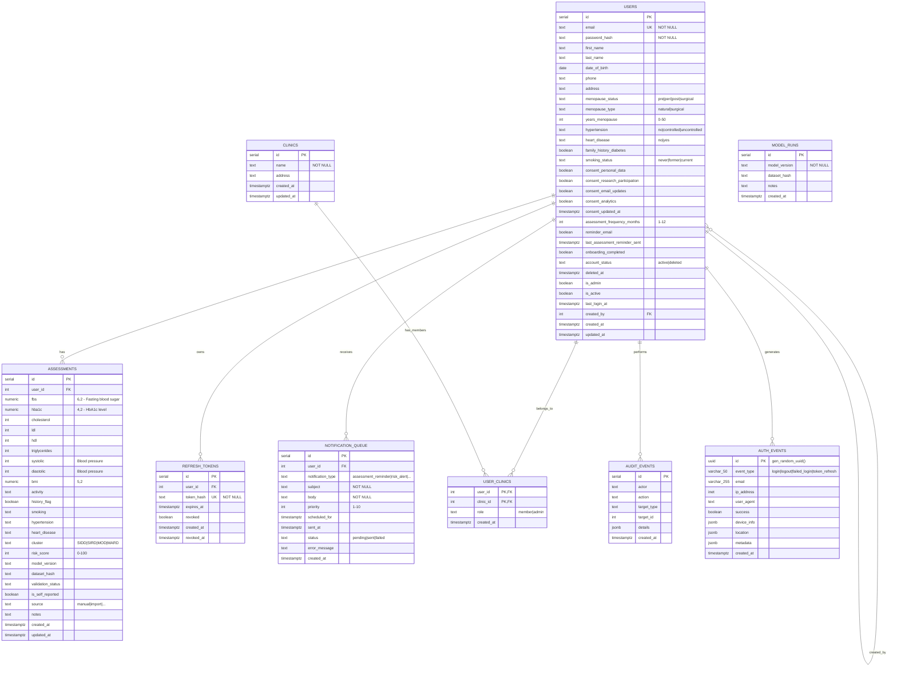

---

## Data Flow Diagram

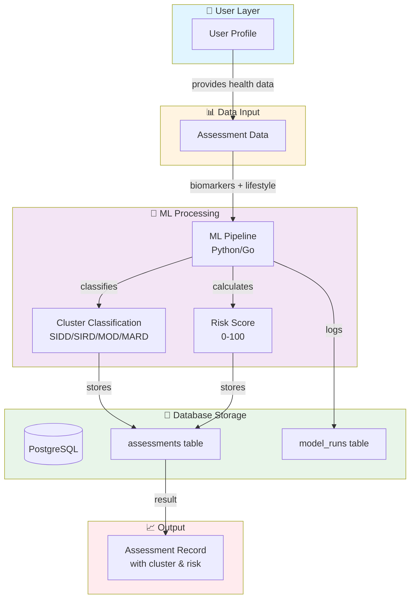

---

## Table Relationships

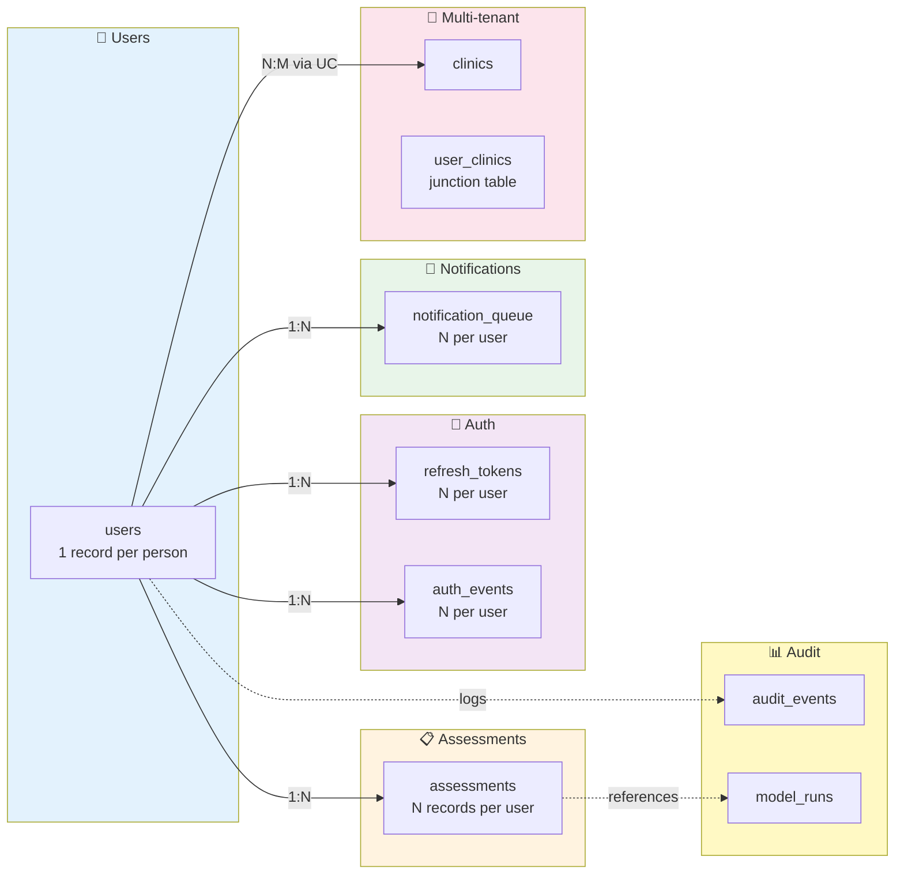

---

## Schema Overview by Category

### Core User Data

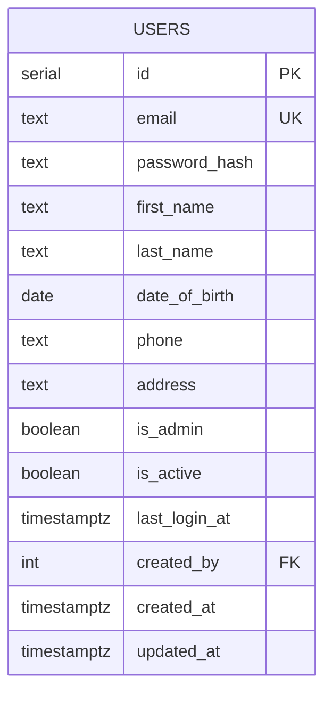

### Health Profile

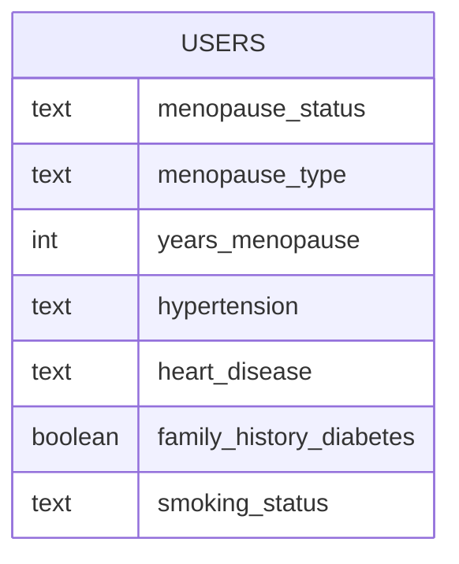

### Consent & Privacy (GDPR)

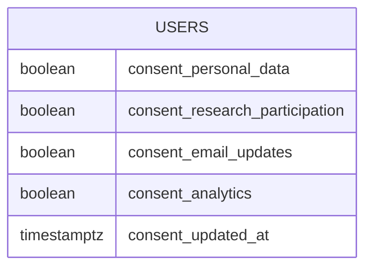

### Account Management

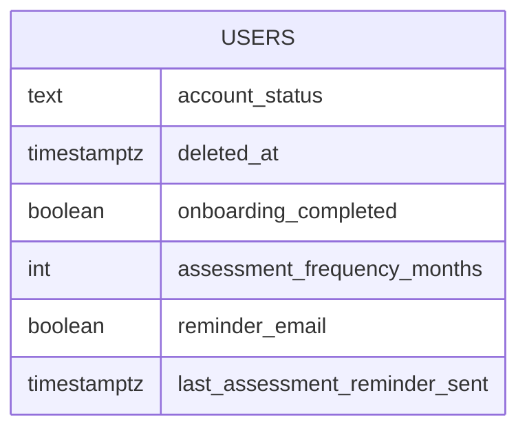

### Assessment Data

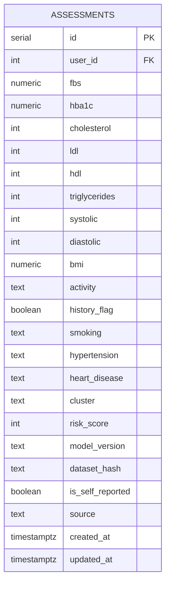

---

## T2DM Clusters Explained

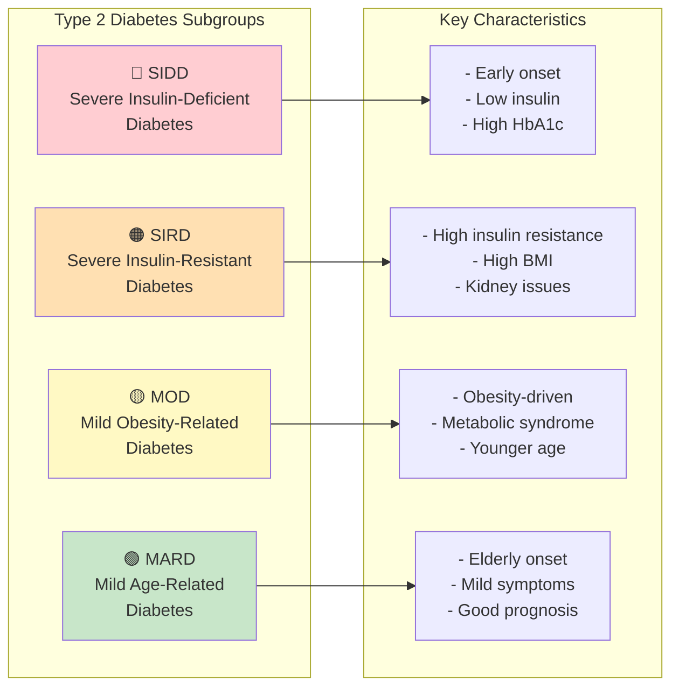

---

## Migration Timeline

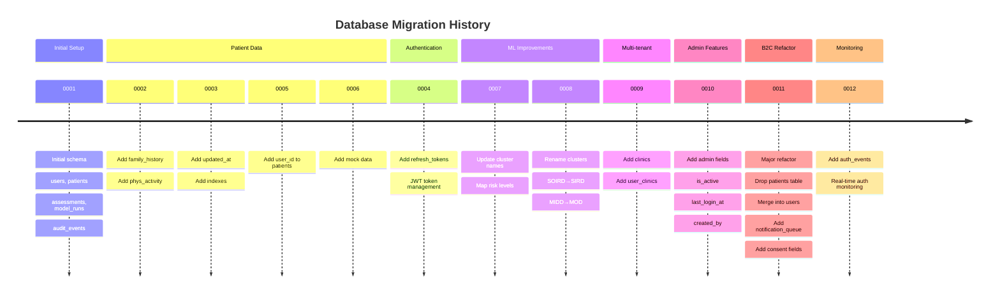

---

## Index Strategy

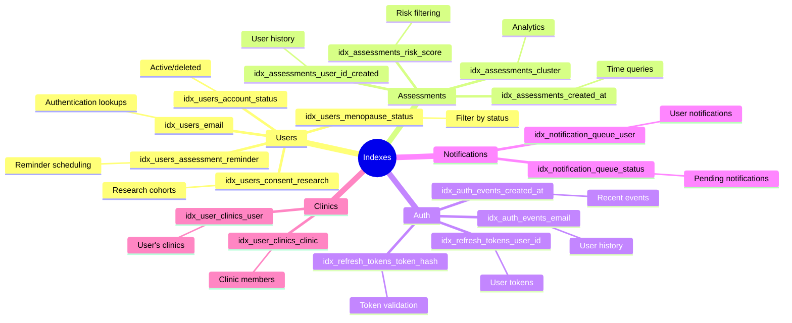

---

## Table Descriptions

### 1. `users`

The central user table storing both authentication and health profile information. Following migration 0011, this table combines user account data with menopausal health profile data (previously in a separate `patients` table).

**Key Features:**
- Soft deletion via `account_status` and `deleted_at`
- Comprehensive consent management (GDPR compliant)
- Menopausal health tracking
- Admin capabilities via `is_admin` flag
- Self-referential `created_by` for admin-created accounts

**Constraints:**
- `menopause_status`: 'pre', 'peri', 'post', 'surgical'
- `menopause_type`: 'natural', 'surgical'
- `years_menopause`: 0-50
- `hypertension`: 'no', 'controlled', 'uncontrolled'
- `heart_disease`: 'no', 'yes'
- `smoking_status`: 'never', 'former', 'current'
- `account_status`: 'active', 'deleted'
- `assessment_frequency_months`: 1-12

---

### 2. `assessments`

Stores health assessment data and ML-generated risk predictions. Each assessment belongs to a user and contains biomarker values along with computed T2DM cluster classification.

**Key Features:**
- Links to ML model runs via `model_version` and `dataset_hash`
- Supports both self-reported and clinical data
- T2DM cluster classification (SIDD, SIRD, MOD, MARD)
- Risk score calculation (0-100)

**T2DM Clusters:**
- **SIDD**: Severe Insulin-Deficient Diabetes
- **SIRD**: Severe Insulin-Resistant Diabetes
- **MOD**: Mild Obesity-Related Diabetes
- **MARD**: Mild Age-Related Diabetes

---

### 3. `clinics`

Multi-tenant support for clinic/organization management. Users can belong to multiple clinics with different roles.

---

### 4. `user_clinics`

Junction table implementing many-to-many relationship between users and clinics.

**Roles:**
- `member`: Regular clinic member
- `admin`: Clinic administrator

---

### 5. `refresh_tokens`

JWT refresh token management for secure authentication.

**Security Features:**
- Token hashes stored (never raw tokens)
- Expiration tracking
- Revocation capability
- Automatic cleanup via `expires_at` index

---

### 6. `notification_queue`

Scheduled notification system for user engagement.

**Notification Types:**
- `assessment_reminder`: Periodic assessment reminders
- `risk_alert`: High-risk notifications
- `monthly_summary`: Monthly health summaries
- `educational`: Educational content

---

### 7. `model_runs`

Tracks ML model executions for reproducibility and auditing.

---

### 8. `audit_events`

General audit logging for administrative actions.

---

### 9. `auth_events`

Real-time authentication monitoring for security dashboards.

**Event Types:**
- `login`: Successful login
- `logout`: User logout
- `failed_login`: Failed authentication attempt
- `token_refresh`: JWT token refresh

---

## Migration History

| Migration | File | Description |
|-----------|------|-------------|
| 0001 | `0001_init.sql` | Initial schema: users, patients, assessments, model_runs, audit_events |
| 0002 | `0002_add_family_history_and_phys_activity.sql` | Add family_history, phys_activity to patients |
| 0003 | `0003_add_updated_at_and_indexes.sql` | Add updated_at to assessments + indexes |
| 0004 | `0004_add_refresh_tokens.sql` | Create refresh_tokens table |
| 0005 | `0005_add_patient_user_id.sql` | Add user_id FK to patients |
| 0006 | `0006_add_mock_data.sql` | Seed data with demo users and patients |
| 0007 | `0007_update_cluster_names.sql` | Map risk levels to T2DM clusters |
| 0008 | `0008_update_cluster_names.sql` | Rename SOIRD→SIRD, MIDD→MOD |
| 0009 | `0009_add_clinics.sql` | Add clinics and user_clinics tables |
| 0010 | `0010_admin_features.sql` | Add is_active, last_login_at, created_by to users |
| 0011 | `0011_refactor_users_to_menopausal.sql` | **MAJOR**: B2B→B2C refactor, drop patients table, extend users |
| 0012 | `0012_add_auth_events.sql` | Add auth_events table for real-time monitoring |

**Location:** `backend/migrations/`

**Run migrations:**
```bash
cd backend
goose -dir migrations postgres "$DB_DSN" up
```

**Or via Makefile:**
```bash
make db_up
```

---

## SQLC Configuration

SQLC generates type-safe Go code from SQL queries.

**Configuration:** `backend/sqlc.yaml`

**Query Files:** `backend/internal/store/queries/*.sql`

**Generated Files:** `backend/internal/store/sqlc/*.sql.go`

| File | Purpose |
|------|---------|
| `users.sql.go` | User CRUD operations |
| `assessments.sql.go` | Assessment operations |
| `clinics.sql.go` | Clinic operations |
| `audit_events.sql.go` | Audit log queries |
| `model_runs.sql.go` | Model run tracking |
| `admin_users.sql.go` | Admin user management |
| `cohort.sql.go` | Cohort analysis queries |
| `refresh_tokens.sql.go` | Token management |
| `notification_queue.sql.go` | Notification operations |

**Generate Go code:**
```bash
cd backend
sqlc generate
```

**Or via Makefile:**
```bash
make sqlc
```

---

## Important Notes

1. **B2C Transition**: Migration 0011 was a major refactor transitioning from a B2B clinician-patient model to a direct-to-consumer platform. The `patients` table was dropped and its fields merged into `users`.

2. **Soft Deletion**: Users are never hard-deleted. Use `account_status = 'deleted'` and `deleted_at` timestamp for GDPR compliance.

3. **Consent Management**: Multiple consent flags track user preferences for data usage, research participation, and communications.

4. **T2DM Clusters**: Cluster values represent diabetes subgroups based on research by Ahlqvist et al. (2018).

5. **Assessment Frequency**: Users can set reminder frequency (1-12 months) for reassessment notifications.

6. **Self-Referential**: The `created_by` field allows admins to create accounts for other users.
