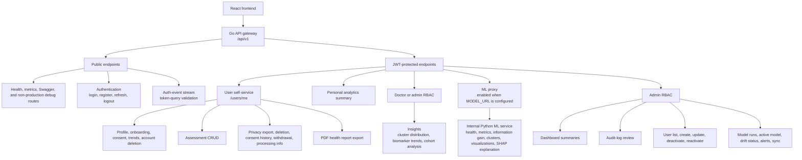
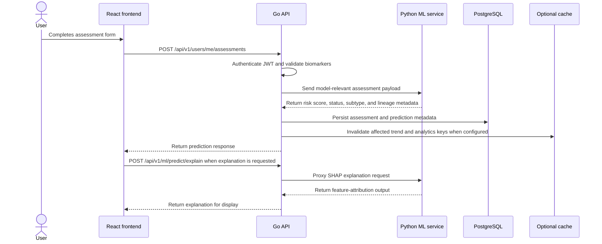

# DIANA Chapter 3+4 Academic Wording Bank

This file contains copy-paste-ready academic prose for Chapter 3 and Chapter 4 only. The wording follows the formal, procedural tone of the provided draft while preserving the corrected technical facts from `docs/07-research/thesis-drafts/ch3+4.md`. It is a writing aid rather than a second source of truth; tables, figures, exact citations, and final evidence placeholders should still be checked against the canonical Chapter 3+4 draft before manuscript assembly.

---

## Panelist-Facing Tables

The following tables are designed for panel review. They summarize the methodological decisions, implementation evidence, results, and remaining limitations most likely to be examined during thesis defense. They may be copied into Chapter 3, Chapter 4, or an appendix, depending on the required manuscript format.

**Table WB-1. Panel Review Evidence Map for Chapter 3 and Chapter 4**

| Panel Review Concern | Evidence to Present | Where It Belongs | Defense Point |
|---|---|---|---|
| Whether the model is circular | HbA1c and fasting blood sugar were used for label construction but excluded from model predictors | Chapter 3, data leakage prevention | The model estimates risk from non-diagnostic metabolic, anthropometric, and lifestyle variables rather than from the diagnostic criteria themselves |
| Whether the cohort is correctly defined | Final analytic cohort of 1,376 postmenopausal women; binary at-risk class contains 734 cases and normal class contains 642 cases | Chapter 3, population of the study | The binary formulation is aligned with the screening objective because pre-diabetic and diabetic cases are combined as users needing follow-up |
| Whether temporal validation was used | Nested Leave-One-Group-Out validation by NHANES survey release | Chapter 3, model validation; Chapter 4, performance results | Holding out entire survey releases is more conservative than random splitting and tests temporal robustness within NHANES |
| Whether the selected model is justified | Logistic Regression achieved the strongest mean fold AUC while preserving interpretability and efficient inference | Chapter 4, model comparison | Selection was based on both performance and suitability for clinical explanation, not AUC alone |
| Whether subtype labels are overclaimed | Weighted K-Means labels are described as SIRD-like, SIDD-like, MOD-like, and MARD-like heuristic proxy patterns | Chapter 3, clustering; Chapter 4, clustering results | Subtypes are descriptive and hypothesis-generating, not validated biological diagnoses or treatment directives |
| Whether system claims match implementation | React frontend, Go backend, Python ML service, PostgreSQL persistence, optional Redis-compatible cache support, ML proxy, privacy routes, admin routes, and model lineage metadata | Chapter 3, system architecture | The manuscript should report implemented workflows without claiming clinical certification |
| Whether evaluation evidence is complete | Backend, ML, and frontend tests pass; an initial doctor review is complete as qualitative face-validity evidence; external live checks support bounded TLS, CORS, and service-exposure claims; Redis-dependent integration evidence, formal UAT, scored expert-panel review, accessibility audit, production load testing, runtime database TLS evidence, host-firewall rule evidence, live ML-service API-key enforcement, route-based frontend navigation, and production-hardened browser-token handling remain incomplete | Chapter 4, functional testing and limitations | The chapter should distinguish technical verification and qualitative expert feedback from pending user, clinical, and operator-level deployment evidence |

**Table WB-2. Recommended Chapter 3 Methodology Tables**

| Table Title | Purpose for Panelists | Essential Content |
|---|---|---|
| NHANES Survey Releases Included in the Study | Shows the temporal source of the dataset and justifies cycle grouping | 2009-2010, 2011-2012, 2013-2014, 2015-2016, 2017-2018, and the August 2021-August 2023 post-pandemic release; exclude disrupted 2019-2020 |
| Final Class Distribution | Makes the study population and binary reformulation transparent | Normal = 642; pre-diabetic = 457; diabetic = 277; at-risk binary class = 734; total = 1,376 |
| NHANES File Groups and Key Variables | Demonstrates that variables came from standard NHANES data files | DEMO, GHB, GLU, TCHOL, HDL, TRIGLY, BMX, RHQ, DIQ, SMQ, PAQ, ALQ, MCQ, INS, and HSCRP where available |
| Core Feature Mapping | Connects NHANES variable codes to clinical names | LBXGH to HbA1c, LBXGLU to fasting blood sugar, BMXBMI to BMI, BMXWAIST to waist circumference, LBXTR to triglycerides, LBDHDD to HDL, LBDLDL to LDL |
| Leakage Prevention Safeguards | Shows how the study avoided inflated performance | Diagnostic-feature scan, proxy-correlation screen, and information-gain review |
| Candidate Model and Validation Design | Explains why the model comparison is fair | Logistic Regression, Random Forest, LightGBM, and XGBoost evaluated under nested LOGO validation |
| System Architecture and API Surface | Lets panelists inspect whether the application claims are implemented | Frontend, backend, ML service, database, cache, authentication, assessment routes, privacy routes, admin routes, and ML proxy |

**Table WB-3. Core Study Variables and Their Methodological Roles**

| Variable or Variable Group | Study Role | Included as Predictor? | Methodological Note |
|---|---|---:|---|
| HbA1c | Reference-label construction and clinical interpretation | No | Excluded from predictors to avoid circular prediction |
| Fasting blood sugar or fasting glucose | Clinical interpretation and diagnostic context | No | Excluded from predictors for the same leakage-prevention reason |
| Triglycerides | Binary model input and clustering feature | Yes | Non-diagnostic metabolic marker used for screening and subtype context |
| HDL cholesterol | Binary model input and clustering feature | Yes | Inverse lipid-risk marker; used in the metabolic-syndrome serving guardrail |
| LDL cholesterol | Binary model input and clustering feature | Yes | Atherogenic lipid marker emphasized in weighted clustering |
| BMI | Binary model input and clustering feature | Yes | Obesity-related anthropometric marker |
| Waist circumference | Binary model input and clustering feature | Yes | Central adiposity marker; may be imputed at serving time when missing |
| Age | Binary model input and clustering feature | Yes | Cohort-restricted demographic predictor; not amplified in clustering |
| Smoking, physical activity, and alcohol use | Binary model inputs | Yes | Lifestyle proxies derived from NHANES questionnaire responses |
| Insulin, TG/HDL ratio, blood pressure, and composite scores | Reviewed candidate or contextual variables | No | Excluded because of subsample availability, redundancy, accessibility concerns, or interpretability constraints |

**Table WB-4. Model Development and Validation Summary**

| Methodological Component | Implementation in DIANA | Reason for Inclusion |
|---|---|---|
| Outcome reformulation | Pre-diabetic and diabetic classes combined into one at-risk class | Matches the screening goal of identifying users who may need follow-up |
| Feature exclusion rule | HbA1c and fasting blood sugar excluded from predictor set | Prevents circular prediction and inflated performance |
| Missing-data strategy | Median imputation fitted within cross-validation folds | Prevents leakage from validation or test folds into preprocessing |
| Temporal validation | Leave-One-Group-Out validation by NHANES release | Evaluates robustness across survey periods rather than random within-cycle splits |
| Candidate algorithms | Logistic Regression, Random Forest, LightGBM, and XGBoost | Provides interpretable, ensemble, and gradient-boosting comparisons under one framework |
| Model-selection criterion | Mean fold AUC with interpretability and deployment considerations | Avoids selecting a model based only on pooled performance |
| Threshold policy | Youden's J, screening-optimized, and geometric-mean thresholds evaluated from out-of-fold probabilities; optimized mean threshold of 0.465 with guardrail nearest-feasible arbitration in 1 of 6 folds | Supports screening sensitivity while controlling specificity collapse |
| Subtype module | Weighted K-Means on at-risk cases only, K = 4 | Adds heuristic metabolic pattern context after binary screening |
| Explainability | SHAP explanations requested through the explainability flow | Supports transparent discussion of patient-level risk drivers |

## Panelist-Facing Mermaid Figures

The following figures are copy-paste-ready Mermaid diagrams for Chapter 3. They are most useful where a table would otherwise become a long inventory of relationships. Retain numeric result tables for measured values, but use these figures to explain methodological flow, system architecture, API access boundaries, and the assessment request sequence.

**Figure WB-1. Methodological Flow from NHANES Data to the Integrated DIANA System**

Copy-ready lead-in sentence: Figure WB-1 summarizes the methodological progression from secondary data acquisition to model development, system integration, and planned user and expert evaluation.

```mermaid
flowchart LR
    A["NHANES releases<br/>2009-2018 and 2021-2023"] --> B["Postmenopausal cohort filtering<br/>final analytic n = 1,376"]
    B --> C["Reference-label construction<br/>DIQ010 plus HbA1c thresholds"]
    C --> D["Leakage-safe preprocessing<br/>diagnostic predictors excluded"]
    D --> E["Nested temporal validation<br/>Leave-One-Group-Out by NHANES release"]
    E --> F["Candidate model comparison<br/>LR, RF, LightGBM, XGBoost"]
    F --> G["Selected screening model<br/>Logistic Regression"]
    G --> H["Threshold optimization<br/>mean threshold = 0.465"]
    H --> I["At-risk subtyping<br/>weighted K-Means, K = 4"]
    I --> J["Explainability layer<br/>feature-attribution output when available"]
    J --> K["Integrated web application<br/>React, Go, Python ML, PostgreSQL, optional cache support"]
    K --> L["Technical verification and planned evaluation<br/>tests, user acceptance testing, expert review, accessibility, load testing"]
```

Copy-ready figure interpretation: The methodological pipeline separates label construction from predictor selection before model training. Diagnostic glycemic markers are retained for reference-label construction and clinical interpretation but are excluded from the predictor set. The final screening model, threshold policy, cluster module, and explainability workflow are then integrated into the web application and evaluated through technical tests and planned user and expert review.

**Figure WB-2. DIANA API Surface and Access-Control Boundaries**

Copy-ready lead-in sentence: Figure WB-2 may be used in place of a long API-surface table when the manuscript needs to emphasize route grouping, authentication boundaries, and administrative separation.

Copy-ready figure interpretation: The API surface is organized around a public boundary, an authenticated user boundary, doctor/admin insight routes, ML proxy routes, and admin-only routes. This structure supports separation between self-service health workflows, system administration, model traceability, and internal ML-service access.

**Figure WB-3. Assessment Creation and Explanation Sequence**

Copy-ready lead-in sentence: Figure WB-3 illustrates how a user-submitted assessment moves through authentication, validation, ML inference, persistence, optional cache invalidation, and optional SHAP explanation.

Copy-ready figure interpretation: The sequence shows that the frontend does not call the Python ML service directly. The Go backend remains the controlled integration point for authentication, validation, ML-service communication, database persistence, optional cache invalidation, and response shaping.

**Table WB-5. Chapter 4 Headline Results for Panel Reading**

Copy-ready anchor sentence: The final Logistic Regression screening model demonstrated acceptable discrimination under nested LOGO validation, achieving a pooled out-of-fold AUC-ROC of **0.7366** (95% CI: **0.710-0.763**) and a sensitivity of **0.7480** (95% CI: **0.717-0.776**) at the optimized screening threshold of **0.465**. Specificity was **0.590**, and the F1 score of **0.710** indicates a moderate precision-recall trade-off at the selected threshold.

| Result Area | Main Finding | Interpretation for the Manuscript |
|---|---|---|
| Binary screening discrimination | Pooled AUC-ROC of **0.7366** (95% CI: **0.710-0.763**) | Acceptable internal temporal discrimination for an exploratory screening-support model |
| Sensitivity | sensitivity of **0.7480** (95% CI: **0.717-0.776**) | Central estimate and confidence interval lower bound meet the screening target under internal temporal validation |
| Specificity | 0.590 | Provides a more balanced profile than highly sensitive but low-specificity reconstructed comparators |
| Screening threshold | 0.465 | Lower than 0.50 because the system prioritizes early identification |
| Selected model | Logistic Regression | Chosen for mean fold AUC, interpretability, stable probability output, and efficient inference |
| Calibration | Brier score = 0.2087; ECE = 0.0563; Hosmer-Lemeshow statistic = 24.75 | Probabilities are usable for risk support but should not be presented as exact individualized disease probabilities |
| Clustering | K = 4 weighted K-Means on the at-risk subset | Provides descriptive metabolic subtype context, not biological subtype diagnosis |
| Technical testing | Backend Go suite passed, ML suite passed with 275 tests, frontend coverage suite passed with 232 tests | Supports implemented system functionality while leaving Redis integration evidence, UAT, accessibility, route-based navigation, browser-token hardening, and load testing as remaining gaps |

The fold-level AUC range of **0.711-0.788** across the six held-out NHANES survey releases indicates that no single temporal fold collapsed below the acceptable discrimination target.

**Table WB-5A. Confidence Interval Summary**

| Metric | Point Estimate | 95% CI Lower | 95% CI Upper | Target |
|---|---:|---:|---:|---|
| Sensitivity | 0.7480 | 0.717 | 0.776 | >= 0.70 |
| Pooled AUC-ROC | 0.7366 | 0.710 | 0.763 | >= 0.70 |

**Table WB-5B. Threshold Mode Distribution**

| Threshold Mode | Fold Count | Interpretation |
|---|---:|---|
| Youden's J | 5/6 | Primary strategy balancing sensitivity and specificity |
| Guardrail Nearest Feasible | 1/6 | Safety fallback selecting the nearest feasible threshold under temporal shift |
| Guardrail Shift Floor | 0/6 | Hard minimum-threshold shift was not used by the selected Logistic Regression model |

**Table WB-5C. Calibration Metrics**

| Metric | Value | Interpretation |
|---|---:|---|
| **Brier Score** | **0.2087** | Moderate combined calibration/discrimination loss; lower values are better |
| **Expected Calibration Error (ECE)** | **0.0563** | Approximately six percentage-point average calibration gap |
| **Hosmer-Lemeshow χ²** | **24.75** | Moderate fit; should be interpreted cautiously because the statistic is sensitive to sample size and binning |

**Table WB-6. Candidate Model Comparison for Copy-Paste Use**

Copy-ready AUC reporting note: The model-comparison table reports mean fold AUC-ROC values averaged across the six LOGO test releases, whereas the headline performance table reports pooled out-of-fold AUC-ROC computed from all held-out predictions combined. This is why Logistic Regression is shown as 0.736 in the model-comparison table and 0.7366 in the headline pooled estimate; the two values summarize the same validation run using different aggregation methods.

| Algorithm | Mean Fold AUC-ROC | Pooled AUC 95% CI | Sensitivity | Sens 95% CI | Specificity | F1 | Mean Threshold | Manuscript Interpretation |
|---|---:|---|---:|---|---:|---:|---:|---|
| Logistic Regression | 0.736 | 0.710-0.763 | 0.748 | 0.717-0.776 | 0.605 | 0.711 | 0.465 | Selected for deployment because it provided the strongest mean fold AUC and the most defensible interpretability profile |
| Random Forest | 0.716 | -- | 0.732 | -- | 0.600 | 0.702 | 0.485 | Competitive non-linear ensemble baseline but did not exceed Logistic Regression |
| LightGBM | 0.712 | -- | 0.724 | -- | 0.603 | 0.696 | 0.475 | Gradient-boosting model with acceptable discrimination but weaker balance |
| XGBoost | 0.713 | -- | 0.730 | -- | 0.589 | 0.699 | 0.655 | Higher sensitivity but lower specificity, making it less suitable as the selected screening model |

Copy-ready inference sentence: Logistic Regression also demonstrated efficient inference: LR inference averages **0.62 ms** in the benchmarked environment, compared with **13.09 ms** for RF and **0.25 ms** for LightGBM. These timing results should be interpreted as local inference benchmarks rather than production load-test results.

**Table WB-6A. Information Gain Feature Rankings**

| Rank | Feature | Type | IG | IG% | In Model? |
|---:|---|---|---:|---:|---|
| 1 | CRP | Numeric | 0.502669 | 50.43% | No |
| 2 | Fasting Insulin | Numeric | 0.378539 | 37.98% | No |
| 3 | HDL | Numeric | 0.090256 | 9.05% | Yes |
| 4 | TG/HDL Ratio | Numeric | 0.086469 | 8.67% | No |
| 5 | Waist Circumference | Numeric | 0.084017 | 8.43% | Yes |
| 6 | Systolic BP | Numeric | 0.080274 | 8.05% | No |
| 7 | Triglycerides | Numeric | 0.066976 | 6.72% | Yes |
| 8 | Diastolic BP | Numeric | 0.061783 | 6.20% | No |
| 9 | BMI | Numeric | 0.058757 | 5.89% | Yes |
| 10 | Metabolic Syndrome Score | Numeric | 0.046720 | 4.69% | No |
| 11 | LDL | Numeric | 0.044970 | 4.51% | Yes |
| 12 | BMI Category | Numeric | 0.034278 | 3.44% | No |
| 13 | Total Cholesterol | Numeric | 0.028459 | 2.86% | No |
| 14 | Alcohol Use (encoded) | Ordinal | 0.018244 | 1.83% | Yes |
| 15 | Physical Activity (encoded) | Ordinal | 0.007360 | 0.74% | Yes |
| 16 | Age | Numeric | 0.004261 | 0.43% | Yes |
| 17 | Smoking Status (encoded) | Ordinal | 0.004023 | 0.40% | Yes |

**Table WB-7. At-Risk Cluster Distribution and Centroid Summary**

| Subtype | Count | Percentage of At-Risk Cases | BMI | Triglycerides | LDL | HDL | Age | Waist Circumference | Interpretation |
|---|---:|---:|---:|---:|---:|---:|---:|---:|---|
| SIRD-like | 77 | 10.5% | 32.25 | 335.16 | 109.53 | 41.73 | 54.51 | 107.66 | High triglyceride and central-adiposity pattern; heuristic insulin-resistance-like proxy |
| SIDD-like | 199 | 27.1% | 29.01 | 148.26 | 166.15 | 52.01 | 54.95 | 98.64 | LDL-dominant atherogenic pattern; not a direct replication of insulin-deficient diabetes |
| MOD-like | 226 | 30.8% | 42.05 | 119.64 | 113.13 | 51.95 | 54.27 | 123.53 | Obesity-dominant pattern; severe obesity in this cohort despite the MOD-like label |
| MARD-like | 232 | 31.6% | 28.25 | 97.78 | 102.55 | 62.40 | 55.42 | 94.98 | Residual milder metabolic pattern within the at-risk cohort |

**Table WB-8. Technical Evidence and Remaining Readiness Gaps**

| Evidence Area | Current Status | How to Report It |
|---|---|---|
| Backend tests | Passed in the current verification run | Report as technical verification of backend handlers, middleware, ML integration, services, PDF generation, and data access behavior |
| ML service tests | 275 tests passed | Report as verification of prediction, leakage prevention, clustering, drift utilities, SHAP-related behavior, production API-key configuration failure behavior, and clinical scenarios |
| Frontend unit and contract coverage suite | 232 tests passed | Report as verification of selected UI behavior, API contract assumptions, and broad source coverage smoke tests |
| Frontend coverage threshold | Coverage gates passed with 71.26 percent line and statement coverage, 60.55 percent branch coverage, and 44.24 percent function coverage | Report as current frontend technical verification under the configured source coverage policy |
| Redis integration tests | Environment dependent | Avoid claiming full Redis integration verification unless run with a Redis service |
| UAT and expert review | Community UAT is pending; the completed doctor review is qualitative face-validity evidence, not a scored expert-panel result | Keep SUS, task success rates, ratings, and quotations as placeholders until data collection is complete |
| Accessibility audit | Readiness features implemented, formal contrast and assistive-technology audit pending | Present as accessibility readiness, not WCAG certification |
| Production load testing | Not yet completed | Avoid production-scale readiness claims until concurrent load evidence is collected |

**Table WB-8A. Internal Benchmark Reconstruction Results**

| Tool | AUC-ROC | Sensitivity | Specificity | Interpretation |
|---|---:|---:|---:|---|
| FINDRISC-like upper-bound | 0.849 (±0.035) | 0.842 | 0.703 | Optimistic comparator using glycemic proxy |
| DIANA | 0.737 [0.710-0.763] | 0.748 | 0.590 | Non-circular and optimized for NHANES postmenopausal cohort |
| OmniRisk (Approximated) | 0.688 (±0.025) | 0.926 | 0.289 | Very high sensitivity with low specificity |
| Simple Clinical Model | 0.677 (±0.021) | 0.944 | 0.222 | Minimal feature model with low specificity |
| ADA Risk Test reconstruction | 0.597 (±0.033) | 0.931 | 0.193 | Limited discrimination under this reconstruction |

**Table WB-9. Panelist Questions and Defensible Answers**

| Likely Panel Question | Short Defensible Answer |
|---|---|
| Why not include HbA1c or fasting blood sugar as predictors? | They were used to construct or interpret the reference label, so including them as predictors would create circular performance and undermine the screening objective. |
| Why combine pre-diabetic and diabetic cases? | DIANA is designed as a screening and triage-support tool; both groups represent users who may require confirmatory testing or clinical review. |
| Why use LOGO validation instead of random k-fold validation? | LOGO holds out entire NHANES releases, reducing within-cycle leakage and testing whether the model generalizes across survey periods. |
| Why select Logistic Regression over more complex models? | It achieved the best mean fold AUC while preserving interpretability, stable probability outputs, and efficient deployment. |
| Are the subtype labels clinically diagnostic? | No. The labels are Ahlqvist-inspired heuristic proxy patterns generated from accessible metabolic features and should not guide treatment by themselves. |
| Is the system clinically validated? | No. The current evidence supports an internally validated screening-support prototype with initial qualitative doctor face-validity feedback; external validation, community UAT, scored expert-panel review, and prospective evaluation remain future work. |
| Can the system replace physician judgment? | No. The system supports risk discussion and follow-up decisions but does not diagnose diabetes or replace clinical judgment. |

---

## Chapter 3: Methodology

### 3.1 Research Design

This study used a quantitative, system-development research design to develop and evaluate DIANA, a predictive model-based web application for Type 2 Diabetes risk screening among postmenopausal women. The quantitative component focused on the construction of a machine learning model using selected metabolic, anthropometric, and lifestyle variables derived from the National Health and Nutrition Examination Survey (NHANES). The system-development component focused on integrating the trained model into a web-based application that presents risk predictions, metabolic subtype context, and explainability outputs.

The methodological design was structured to address two requirements. First, the predictive model had to estimate diabetes risk without using diagnostic biomarkers as predictor variables, thereby preventing circular prediction. Second, the application had to present model outputs in a clinically interpretable format suitable for screening support. To satisfy these requirements, the study combined data preprocessing, leakage validation, supervised classification, weighted clustering, model explainability, web application development, and software quality evaluation.

The research design does not position DIANA as a diagnostic system. Instead, the system is treated as a screening and triage-support tool. A positive or elevated-risk result indicates that a user's profile resembles metabolic patterns associated with prediabetes or diabetes risk in the NHANES-derived cohort. Confirmatory testing and clinical interpretation remain necessary before any diagnostic conclusion can be made.

### 3.2 Research Locale

The primary modeling dataset was obtained from the NHANES public data repository maintained by the Centers for Disease Control and Prevention. NHANES served as the data locale for model construction because it provides standardized demographic, laboratory, examination, and questionnaire data across multiple survey cycles. Six NHANES releases were used: 2009-2010, 2011-2012, 2013-2014, 2015-2016, 2017-2018, and 2021-2023. The 2019-2020 cycle was excluded because field operations were disrupted by the COVID-19 pandemic. The 2021-2023 files were treated as the August 2021-August 2023 post-pandemic release rather than as a standard biennial NHANES release.

For planned user acceptance testing, the intended user locale consists of online communities of Filipino women discussing perimenopause and menopause-related health concerns. The source chapter identifies the "Usapang Perimenopause at Menopause" Facebook interest group as the target recruitment setting. This online locale provides access to potential end users who may evaluate the application's usability, clarity, and practical relevance. Formal recruitment and feedback collection should proceed only after administrative permission, consent procedures, and data privacy requirements are satisfied.

### 3.3 Population of the Study

The modeling population consisted of postmenopausal women represented in NHANES. The final analytic cohort contained 1,376 postmenopausal women who satisfied the study's demographic, reproductive-health, and data-availability criteria. The cohort was restricted to female respondents within the target menopausal age range, with postmenopausal indicators derived from reproductive health questionnaire responses. Reproductive health filtering used RHQ031, which identifies respondents who reported no menstrual period during the past 12 months.

The final binary modeling cohort contained 734 at-risk cases and 642 normal cases. At-risk status was defined by combining pre-diabetic and diabetic reference labels into a single screening-positive class. This binary formulation was selected because the system's screening objective is to identify individuals who may benefit from confirmatory testing or clinical review.

The planned user-evaluation population consists of menopausal or postmenopausal women who can interact with the DIANA application and provide structured usability feedback. The planned clinical-evaluation population consists of licensed medical professionals, particularly from endocrinology and obstetrics-gynecology, who can review the plausibility, interpretability, and clinical relevance of the system's risk outputs. Since formal UAT and expert review have not yet been completed, these populations should be described as planned evaluation groups unless empirical data are collected before submission.

### 3.4 Data Gathering Tools and Procedures

The study used secondary data from NHANES. Raw NHANES XPT files were acquired from the CDC public repository and processed through an automated Python pipeline. The collected files included demographic data, glycohemoglobin records, fasting glucose records, total cholesterol records, HDL cholesterol records, triglyceride and LDL records, body-measurement records, reproductive health questionnaire responses, diabetes questionnaire responses, smoking variables, physical activity variables, alcohol-use variables, family-history variables, insulin records where available, and high-sensitivity CRP records where available.

The data collection focused on variables relevant to metabolic health in postmenopausal women. HbA1c and fasting blood sugar were collected for reference-label construction and clinical interpretation but were excluded from the predictive feature set. This distinction was essential to prevent the model from learning the same diagnostic thresholds used to define the outcome. The final screening predictors were non-diagnostic metabolic, anthropometric, and lifestyle features, including triglycerides, HDL cholesterol, LDL cholesterol, BMI, waist circumference, age, smoking status, physical activity, and alcohol use.

Raw NHANES records were linked using SEQN, the unique respondent identifier. After merging, the pipeline standardized variable names into clinically interpretable terms. For example, LBXGH was mapped to HbA1c, LBXGLU to fasting blood sugar, BMXBMI to BMI, BMXWAIST to waist circumference, LBXTR to triglycerides, LBDHDD to HDL cholesterol, and LBDLDL to LDL cholesterol. Lifestyle features were derived from questionnaire items through rule-based classification. Smoking status was classified using SMQ020 and SMQ040, physical activity using PAQ605, PAQ650, and PAQ665, and alcohol use using ALQ variables.

The physical activity variable was treated as a simplified categorical proxy rather than a complete measurement of guideline adherence. This limitation exists because NHANES questionnaire responses do not consistently provide complete minute-by-minute activity records for all respondents. Therefore, the variable was used to represent broad lifestyle activity categories, not exact World Health Organization weekly activity thresholds.

### 3.5 Ground-Truth Label Construction

Ground-truth labels were constructed using a dual-source hierarchy. The primary criterion was DIQ010, the NHANES diabetes questionnaire item that records whether a respondent had been told by a physician that she had diabetes or borderline diabetes. Respondents reporting physician-diagnosed diabetes were labeled diabetic, while respondents reporting borderline diabetes were labeled pre-diabetic.

For respondents without self-reported diabetes or borderline diabetes, American Diabetes Association HbA1c thresholds were applied. HbA1c values of 6.5 percent or higher were labeled diabetic, values from 5.7 to 6.4 percent were labeled pre-diabetic, and values below 5.7 percent were labeled normal. A hard override was applied so that any record with HbA1c of 6.5 percent or higher was labeled diabetic regardless of self-reported status. This rule reduced the likelihood that undiagnosed biochemical diabetes would be mislabeled as normal.

The agreement between DIQ010-derived labels and HbA1c-threshold labels was 94.1 percent, corresponding to 1,295 of 1,376 records. The remaining 5.9 percent reflected discordance between self-report and a single biochemical measurement. These discordant records may represent undiagnosed cases, recall error, treatment effects, timing differences, or biological and laboratory variability. For this reason, the study label is best interpreted as an operational reference label rather than as a perfect clinical diagnosis.

### 3.6 Software Methodology

The development of DIANA followed an iterative, phase-based software methodology. This structure allowed the study to move systematically from raw data acquisition to model development, application integration, technical validation, and planned clinical/user evaluation. The methodology was designed to maintain traceability between the dataset, the trained model, the deployed service, and the user-facing application.

The software methodology was organized into the following phases:

Phase 1: Data Acquisition and Biomarker Preparation.

Phase 2: Automated Data Leakage Prevention and Feature Validation.

Phase 3: Predictive Model Development and Training.

Phase 4: Clinical Threshold Optimization.

Phase 5: Cluster-Based Risk Group Identification.

Phase 6: Model Explainability and Clinical Decision Support.

Phase 7: Web Application Development and System Integration.

Phase 8: System Testing and Technical Validation.

Phase 9: User Acceptance Testing, Accessibility Readiness, and Expert Feedback.

Each phase produced a defined output. The early phases produced the analytic dataset and validated feature set. The middle phases produced the binary classifier, threshold policy, weighted clustering artifact, explainability workflow, and performance metrics. The later phases produced the integrated web application, test evidence, and planned user and clinical evaluation framework.

### 3.7 Phase 1: Data Acquisition and Biomarker Preparation

This phase executed the extraction, cleaning, integration, and standardization of NHANES records. The automated pipeline acquired six survey releases from 2009 to 2023, excluding the incomplete 2019-2020 cycle and treating 2021-2023 as the August 2021-August 2023 post-pandemic release. The raw files were merged by SEQN to form a unified respondent-level dataset.

Following record integration, the preprocessing pipeline derived the target postmenopausal cohort and standardized clinical feature names. The pipeline retained variables needed for label construction, predictive modeling, clustering, and system display. HbA1c and fasting blood sugar were preserved for label construction but were not included as predictor inputs. This distinction established the foundation for the study's non-circular prediction design.

Missing values were handled using a leakage-safe strategy. Median imputation was embedded inside the cross-validation pipeline, ensuring that imputation parameters were fitted only on training folds. K-nearest-neighbor imputation was restricted to exploratory analysis and was not used for model training because global imputation before cross-validation would expose information from validation or test folds.

At inference time, missing waist circumference was handled by a separate serving-layer guardrail. When waist circumference was unavailable but BMI was present, the ML service estimated waist circumference as BMI multiplied by 3.33. This rule was introduced to reduce the face-validity problem created when population-median imputation assigns an implausibly high waist value to a low-BMI user. Because this rule creates a train-serving difference, it should be presented as a pragmatic usability safeguard rather than as a validated clinical estimator.

Outlier handling used clinical plausibility ranges rather than automatic row deletion. Values outside plausible clinical bounds were flagged through an outlier indicator, but records were retained. This approach preserved genuine extreme metabolic profiles that may be clinically meaningful. In the final cohort, 35 of 1,376 records, or 2.5 percent, had at least one flagged outlier.

### 3.8 Phase 2: Automated Data Leakage Prevention and Feature Validation

This phase enforced the computational safeguards required to protect the validity of the predictive modeling pipeline. Before classifier training, the system executed a three-layer leakage validation procedure. The first layer scanned feature definitions to confirm that diagnostic markers such as HbA1c, fasting blood sugar, fasting glucose, or related aliases were absent from the classifier and clustering feature sets. If any diagnostic feature was detected, the training sequence would terminate.

The second layer performed proxy leakage detection. For each non-diagnostic candidate feature, the pipeline computed its Pearson correlation with the HbA1c diagnostic threshold. Features with absolute correlation greater than 0.95 would be flagged as proxy leakage because they could indirectly encode the diagnostic outcome. In the verified feature set, no proxy leakage was detected.

The third layer computed Shannon entropy information gain as a feature-relevance check. This step helped identify which variables contributed discriminatory information toward the binary at-risk outcome. The information-gain results were not treated as an automatic inclusion rule. Variables such as derived ratios, composite scores, incomplete subsample variables, or less accessible clinical measurements were reviewed and excluded when they conflicted with the study's goals of non-redundancy, accessibility, and non-circularity.

### 3.9 Phase 3: Predictive Model Development and Training

This phase trained and evaluated candidate binary screening classifiers. Four algorithms were evaluated under the same nested temporal-validation framework: Logistic Regression, Random Forest, LightGBM, and XGBoost. Logistic Regression served as the interpretable linear baseline. Random Forest provided a non-linear ensemble baseline. LightGBM and XGBoost provided gradient-boosting benchmarks for structured tabular prediction.

Hyperparameter optimization was performed using grid search with AUC-ROC as the scoring metric. The inner loop used grouped cross-validation so that NHANES survey-cycle boundaries were respected during model selection. The outer loop used Leave-One-Group-Out validation, holding out one complete survey cycle at a time. This design prevented the model from training and testing on data from the same survey period and provided a conservative estimate of temporal generalization.

The final model was selected based on mean fold AUC across LOGO folds rather than relying only on pooled aggregate performance. This criterion favored models that performed consistently across survey cycles. Logistic Regression was selected for deployment because it achieved the strongest mean fold AUC while preserving interpretability, stable probability outputs, and efficient inference.

NHANES survey weights were not incorporated into model training. The survey weights are designed primarily for population-level prevalence estimation and nationally representative descriptive inference, whereas this study trained a prediction model for an analytic postmenopausal cohort. This decision should be reported explicitly as a methodological choice rather than omitted. Future weighted sensitivity analyses remain appropriate because deployment performance may differ when the target population differs from the analytic cohort.

### 3.10 Phase 4: Clinical Threshold Optimization

This phase established the decision threshold used to convert predicted probabilities into binary screening classifications. The threshold was optimized for a screening context rather than defaulting to the conventional 0.50 probability boundary. Because missed at-risk cases may delay confirmatory testing, the thresholding strategy prioritized sensitivity while maintaining a minimum specificity constraint.

Youden's J was included because it is a conventional threshold-selection criterion that maximizes sensitivity plus specificity minus one. In this study, however, Youden's J was not treated as an automatic final threshold. DIANA is a screening-support system, so the clinical consequences are asymmetric: a false negative may delay confirmatory testing and preventive counseling, while a false positive mainly prompts follow-up review. For this reason, Youden's J was evaluated as one candidate operating point alongside a screening-optimized rule and the geometric mean of sensitivity and specificity.

Three threshold strategies were evaluated using out-of-fold probabilities: Youden's J, a screening-optimized rule, and the geometric mean of sensitivity and specificity. The screening-optimized rule prioritized sensitivity while enforcing a minimum specificity constraint. The geometric-mean rule provided a balance-oriented alternative for folds where sensitivity and specificity diverged. A composite clinical score was then used to select the fold-specific strategy:

`Clinical Score = 0.35 * Sensitivity + 0.30 * Specificity + 0.25 * F1 + 0.10 * Accuracy`

The final mean threshold was 0.465. This downward adjustment from 0.50 reflected the screening objective of early case identification. The threshold was not manually chosen after viewing test performance; it was derived from out-of-fold predictions within the validation workflow.

A deterministic guardrail was implemented to prevent specificity collapse under temporal prevalence shift. If a selected threshold produced high sensitivity but inadequate specificity, the algorithm searched for a feasible threshold satisfying minimum operating constraints or reverted toward a safer threshold. In the final Logistic Regression model, guardrail nearest-feasible arbitration was activated in 1 of 6 LOGO folds.

The serving layer also includes a rule-based Metabolic Syndrome risk guardrail. The rule evaluates triglycerides of at least 150 mg/dL, HDL cholesterol below 50 mg/dL, BMI of at least 25, and waist circumference of at least 80 cm. When three or more criteria are met, the at-risk probability is raised to at least 0.65. When two criteria are met, the at-risk probability is increased by 0.15 and capped at 0.95. This rule should be described as an engineered safety heuristic for preventing implausibly low risk estimates in metabolically concordant high-risk profiles, not as an independently validated clinical rule.

**Copy-Paste Table: Executable ML Safeguards and Medical Rationale**

| Safeguard | Implementation | Medical or Methodological Rationale |
|---|---|---|
| Diagnostic leakage gate | Training is blocked if HbA1c, fasting blood sugar, fasting glucose, or related aliases appear in classifier or clustering feature lists | Prevents the model from learning the same glycemic criteria used to construct the reference label |
| Nested temporal validation | Inner grouped cross-validation performs model selection; outer LOGO validation holds out one NHANES release at a time | Reduces optimistic bias and tests stability across survey periods |
| Youden's J candidate threshold | Evaluates the threshold that maximizes sensitivity plus specificity minus one | Provides a standard diagnostic-threshold baseline for comparison |
| Screening-optimized threshold | Prioritizes sensitivity while enforcing a minimum specificity floor | Reflects the screening priority of reducing missed at-risk cases without excessive false-positive inflation |
| Geometric-mean threshold | Balances sensitivity and specificity through their geometric mean | Provides an alternative when operating characteristics are uneven across folds |
| Guardrail arbitration | Raises or replaces unstable low thresholds when specificity collapses under high-sensitivity selections | Protects against fold-specific prevalence shift producing a threshold that over-flags normal profiles |
| Metabolic-syndrome serving guardrail | Raises low model probability when triglycerides, HDL, BMI, and waist circumference show concordant metabolic risk | Prevents implausibly low risk outputs for metabolically concordant high-risk profiles; requires further ablation and clinical review |

### 3.11 Phase 5: Cluster-Based Risk Group Identification

This phase implemented the second stage of the DIANA inference pipeline. The first stage classifies a user as normal or at risk. Only users classified as at risk proceed to the weighted K-Means subtyping stage. This gating mechanism prevents the system from assigning disease-pattern subtype labels to users classified as normal.

Weighted K-Means clustering was trained exclusively on the at-risk subset of 734 cases. The clustering features included triglycerides, LDL cholesterol, HDL cholesterol, BMI, waist circumference, and age. Feature weights were applied before distance computation to emphasize clinically relevant dimensions. LDL received the highest weight as an atherogenic lipid differentiator. Triglycerides and waist circumference were strongly weighted because of their relationship to insulin resistance and central adiposity. BMI served as an obesity-pattern anchor, HDL as an inverse lipid-risk marker, and age as a baseline variable.

Cluster centroids were inverse-transformed from standardized space back to raw clinical units before interpretation. This ensured that subtype labels were assigned using clinically meaningful values. The resulting subtype labels were Ahlqvist-inspired proxy labels: SIRD-like, SIDD-like, MOD-like, and MARD-like. The term "Ahlqvist-inspired" should be retained because DIANA does not implement the original biological subtype framework directly. The original framework used variables such as GAD antibody status and HOMA2 estimates of beta-cell function and insulin resistance, while DIANA uses accessible non-glycemic screening features and deliberately excludes HbA1c and fasting blood sugar from predictor inputs. Therefore, the labels describe phenotypic similarity to known metabolic patterns rather than validated biological subtype membership.

The SIDD-like label requires special caution. True SIDD classification requires beta-cell function markers such as HOMA2-B or C-peptide, which were unavailable in the NHANES feature set used by DIANA. In this study, SIDD-like is therefore interpreted as an atherogenic or lipid-driven proxy label based primarily on elevated LDL patterns rather than as a true insulin-deficiency subtype diagnosis. The SAID category should not be assigned because autoimmune markers were unavailable. These labels are heuristic, hypothesis-generating descriptors, not treatment directives or substitutes for clinical judgment.

### 3.12 Phase 6: Model Explainability and Clinical Decision Support

This phase added explainability to the prediction workflow. Although Logistic Regression provides coefficient-level interpretability, the system also uses SHapley Additive exPlanations (SHAP) to provide patient-level feature attribution. SHAP values indicate how each feature pushes the prediction toward or away from the at-risk class.

The explainability workflow supports both cohort-level and patient-level interpretation. Cohort-level plots summarize the relative influence of features across the dataset. Patient-level waterfall plots show the contribution of individual biomarkers and lifestyle variables to a specific prediction. This design helps convert a numeric probability into a clinically discussable explanation.

SHAP explanations are generated through the explainability endpoint and displayed in the frontend when available. They are not persisted as JSONB fields in the assessment table. The database stores prediction metadata, including risk score, predicted status, model version, dataset hash, and subtype context, while detailed SHAP outputs remain transient explanation artifacts.

The implementation also includes graceful degradation when detailed SHAP output is unavailable. In that case, the frontend displays an explanation-unavailable panel and states that no feature-level SHAP values are shown in fallback mode. This behavior preserves the screening result while avoiding fabricated feature attributions.

In addition to the reported model metrics, DIANA implements several safety and traceability controls around the ML workflow. These controls make the methodology executable in the codebase rather than treating leakage prevention, explanation handling, drift awareness, and model lineage as documentation-only claims.

**Copy-Paste Table: ML Safety and Traceability Controls**

| Control | Implemented Behavior | Methodological Value |
|---|---|---|
| Leakage validation gate | Diagnostic features such as HbA1c and fasting blood sugar are blocked from classifier and clustering feature sets before training | Reduces circular prediction risk |
| Feature-contract management | Shared feature constants and model artifact feature files document the active clinical and clustering feature contracts | Reduces training-serving mismatch risk after earlier feature-count drift |
| SHAP fallback behavior | If detailed SHAP output is unavailable, the frontend shows an explanation-unavailable state instead of fabricated feature attributions | Preserves transparency without inventing explanations |
| Drift monitoring hooks | Prediction workflows can queue non-blocking drift checks, and administrative routes expose drift status and alerts | Supports post-deployment monitoring without changing the immediate risk result |
| Model lineage metadata | Assessments store prediction metadata such as model version, dataset hash, status, risk score, subtype context, and drift-baseline information where available | Supports traceability between a displayed result and the model artifact that generated it |

### 3.13 Phase 7: Web Application Development and System Integration

This phase integrated the predictive model into the DIANA web application. The system was implemented as a four-tier application architecture consisting of a React frontend, a Go backend API, a Python ML inference service, and a PostgreSQL persistence layer with optional cache support. The frontend uses React 18 and Vite. The backend uses Go 1.25 with Gin. The ML service uses Python 3.12 with Flask. The database layer uses PostgreSQL 16. The backend contains Redis-compatible cache handlers for trends, analytics, and cluster-distribution responses, but Redis-dependent integration evidence should be reported separately because those tests require a running Redis service. The repository supports production-oriented reverse-proxy deployment through Caddy and Docker Compose/Nginx artifacts, while the manuscript should distinguish checked configuration from the exact live host state. Rate limiting is implemented separately through Go token-bucket middleware.

The Go backend and Python ML service were decoupled to isolate ML inference and explanation tasks from routine API operations. The backend forwards validated assessment input to the ML service, receives prediction and lineage metadata, persists the result, invalidates affected cache entries when caching is configured, and returns the response to the frontend. If `MODEL_URL` is unset during local development, the router can select a mock predictor. In production-oriented flows, prediction failures are propagated as structured errors rather than hidden behind an undocumented fallback.

The implemented API surface supports the assessment workflow through authenticated user, assessment, export, and administrative routes. Core user routes include profile retrieval and update, onboarding, consent settings, trend retrieval, account deletion, assessment creation, assessment retrieval, assessment update, and assessment deletion under `/api/v1/users/me`. Administrative user-management routes under `/api/v1/admin/users` support listing, creation, retrieval, update, deactivation, and reactivation of users. The ML proxy exposes health, information-gain, clustering, visualization, and explainability routes, with detailed SHAP explanation requested through `/api/v1/ml/predict/explain`.

The frontend workflow includes authentication, dashboard review, assessment entry, result display, SHAP explanation, trend visualization, and export support. The assessment form collects demographic, biomarker, anthropometric, lifestyle, and family-history inputs. The result modal displays risk probability, risk label, subtype context when applicable, model version, and dataset lineage. The trend view allows users to review longitudinal biomarker and risk-score changes across assessments.

The frontend should be described as a functional research prototype rather than a finalized clinical product shell. Navigation is implemented through application state and tab selection rather than URL-addressable React Router routes, so deep linking and browser back-button workflows are limited. Authentication uses Bearer tokens stored through guarded browser `localStorage` to support the cross-origin API flow. This is acceptable for prototype demonstration and testing, but a production clinical deployment should harden this design through route-based navigation, stronger browser-token protections, formal XSS review, and a deployment-compatible HttpOnly cookie or session strategy where feasible.

### 3.14 Phase 8: System Testing and Technical Validation

This phase verified the system across backend, ML service, and frontend layers. Backend tests covered configuration, caching, HTTP handlers, middleware, ML integration, data models, services, PDF generation, and data access behavior. Table-driven assessment handler tests validated age-boundary enforcement, missing-waist handling for ML imputation, advisory warnings for out-of-range HbA1c, and successful end-to-end assessment creation.

The ML service test suite covered clustering behavior, leakage prevention, prediction endpoints, API authentication, production API-key configuration failure behavior, drift utilities, SHAP-related functionality, threshold optimization, and clinical scenario checks. The frontend Vitest coverage suite covered API contracts, assessment form behavior, authentication flows, selected UI components, and broad source coverage smoke tests. The test results support the claim that the implemented system performs the core screening workflow, while Redis integration evidence, route-based navigation, browser-token hardening, formal UAT, scored expert-panel review, accessibility audit, production load testing, runtime database TLS evidence, host-firewall rule evidence, and live ML-service API-key enforcement remain readiness gaps.

### 3.15 User Evaluation and Expert Review Methodology

The planned user evaluation follows an ISO/IEC 25010-informed usability framework. The evaluation protocol includes appropriateness recognizability, learnability, operability, user error protection, interface aesthetics, accessibility, and user confidence. Planned user participants will complete core tasks such as logging in, navigating the dashboard, submitting an assessment, and interpreting prediction results.

The expert-review procedure asks licensed clinical evaluators to assess risk-output plausibility, SHAP explanation clarity, clinical workflow fit, and perceived utility. An initial doctor review has been completed as qualitative face-validity feedback, not as a formal scored expert-panel study. Because community UAT and scored expert-panel review have not yet been completed, the manuscript should not report SUS scores, task success rates, expert mean ratings, or community-user quotations as completed empirical results.

---

## Chapter 4: Results and Discussion

### 4.1 Binary Screening Model Performance

The final Logistic Regression screening model demonstrated acceptable discrimination under nested LOGO validation. The model achieved a pooled out-of-fold AUC-ROC of 0.7366 with a 95 percent confidence interval of 0.710 to 0.763. At the optimized screening threshold of 0.465, sensitivity was 0.748 with a 95 percent confidence interval of 0.717 to 0.776, specificity was 0.590, and F1 score was 0.710.

The reported confidence intervals were computed using 1,000 bootstrap resamples, the percentile method, and a fixed random seed of 42. Bootstrap samples containing fewer than two outcome classes were excluded from confidence-interval computation. This procedure provides distribution-free uncertainty estimates appropriate for the modest sample size and the temporal validation design.

The fold-level AUC values ranged from 0.711 to 0.788 across the six held-out NHANES survey cycles. This range indicates that no single temporal fold collapsed below the acceptable discrimination target. The result supports the interpretation that the classifier learned repeatable metabolic risk patterns across NHANES releases. However, because the evaluation remains internal to NHANES, the result should be treated as temporal validation rather than external clinical validation.

The sensitivity estimate is clinically relevant but should be interpreted cautiously. The point estimate exceeded the screening target of 0.70, and the lower bound of the confidence interval was 0.717. This supports the screening objective under internal temporal validation while still requiring prospective and external validation.

At the threshold-policy level, Youden's J was selected in 5 of 6 LOGO folds, while guardrail nearest-feasible arbitration was activated in 1 of 6 folds. This distribution indicates that the final threshold policy was not a simple default cutoff; it combined conventional discrimination-based selection with a safety mechanism for folds vulnerable to specificity collapse.

Medically, this means that the deployed threshold policy prioritized early identification without allowing the model to classify too many normal profiles as at risk in unstable folds. Youden's J was retained when the fold-level operating point produced an acceptable sensitivity-specificity balance. In the 2021-2023 fold, guardrail arbitration selected the nearest feasible threshold to limit specificity collapse under a high-sensitivity operating point. This adjustment changed the classification threshold, not the trained model coefficients.

### 4.2 Information Gain and Feature Relevance

Information Gain analysis was used to examine feature relevance before final model interpretation. The final model retained triglycerides, HDL cholesterol, LDL cholesterol, BMI, waist circumference, age, smoking status, physical activity, and alcohol use. Several excluded variables had high information gain, including CRP, fasting insulin, TG/HDL ratio, blood pressure variables, and metabolic syndrome score. These variables were reviewed but excluded for methodological reasons.

Derived variables such as TG/HDL ratio and metabolic syndrome score were excluded because they duplicate information already present in selected features. Including both composites and their component variables could distort interpretation and inflate apparent feature importance. Blood pressure variables were excluded to preserve the self-screening accessibility goal of the system. This feature-selection process prioritized non-circularity, interpretability, accessibility, and practical deployment.

### 4.3 Model Comparison

The candidate algorithms were compared under the same nested LOGO validation framework. Logistic Regression achieved the highest pooled AUC and the highest mean fold AUC at approximately 0.736. Random Forest achieved a mean fold AUC of 0.716, LightGBM achieved 0.712, and XGBoost achieved 0.713. Although the non-linear models produced competitive sensitivity, Logistic Regression provided the strongest discrimination with the clearest interpretability profile.

Logistic Regression was selected because it provided the most appropriate balance of performance and interpretability for a screening-support system. Its coefficients can be interpreted more directly than those of ensemble models, and its probability outputs are suitable for threshold optimization and SHAP-based explanation. This made Logistic Regression more defensible for a health-related decision-support workflow than a more complex model with only marginal performance differences.

### 4.4 Calibration Analysis

Calibration analysis assessed whether predicted probabilities aligned with observed outcomes. The Logistic Regression model produced a Brier score of 0.2087, an expected calibration error of 0.0563, and a Hosmer-Lemeshow statistic of 24.75 across the full analytic cohort of 1,376 records. These results indicate moderate probability alignment rather than perfect calibration.

The calibrated probabilities should therefore be communicated as approximate risk-support estimates. A high predicted probability should prompt confirmatory testing, clinical review, or preventive counseling, but it should not be interpreted as a confirmed diagnosis or exact individualized disease probability.

### 4.5 Clustering Validation and Subtype Distribution

Weighted K-Means clustering with K = 4 was evaluated on the at-risk subset of 734 cases. The clustering produced a silhouette score of 0.1762, Davies-Bouldin index of 1.5950, and Calinski-Harabasz index of 154.32. These metrics indicate modest separation, which is expected in overlapping metabolic phenotypes.

The K = 4 solution was retained to preserve the Ahlqvist-inspired four-pattern interpretation. This decision prioritized clinically interpretable subtype context rather than maximizing internal clustering metrics alone. The modest silhouette score must be acknowledged as a limitation because it indicates overlapping cluster boundaries.

The cluster distribution showed metabolic heterogeneity within the at-risk class. MARD-like was the largest cluster with 232 cases, or 31.6 percent of the at-risk subset. MOD-like contained 226 cases, or 30.8 percent. SIDD-like contained 199 cases, or 27.1 percent. SIRD-like contained 77 cases, or 10.5 percent. These findings suggest that at-risk participants were not metabolically uniform, although longitudinal progression cannot be inferred from the cross-sectional dataset.

Centroid analysis further clarified subtype interpretation. The MOD-like centroid had a BMI of approximately 42.05, indicating severe obesity in this cohort rather than moderate obesity. The SIRD-like centroid was characterized by high triglycerides, low HDL cholesterol, and elevated waist circumference, while the SIDD-like centroid was distinguished by elevated LDL cholesterol. Since assignments are based on weighted distance to centroids, subtype outputs should be understood as geometric pattern assignments rather than rule-based clinical diagnoses.

The Ahlqvist-inspired interpretation should therefore be read as subtype-context support rather than as biological subtype validation. DIANA does not assign SAID because autoimmune markers are unavailable, and the SIDD-like group is interpreted as lipid-driven or atherogenic rather than as confirmed insulin-deficient diabetes. The cluster results support the presence of heterogeneous metabolic patterns among at-risk users, but they do not establish treatment categories.

### 4.6 Leakage Validation Results

The leakage validation pipeline confirmed that diagnostic glycemic variables were absent from the classifier and clustering feature lists. It also confirmed that no retained non-diagnostic feature exceeded the proxy-leakage threshold of |r| > 0.95 with the HbA1c diagnostic threshold. The highest observed proxy correlation was triglycerides at r = 0.3241, which remained far below the leakage threshold.

This result supports the central methodological claim of the study. DIANA's discrimination was not produced by using HbA1c or fasting blood sugar as predictors. Instead, the model estimated at-risk status from metabolic, anthropometric, and lifestyle variables that were separate from the diagnostic markers used in label construction.

### 4.7 Functional Testing Results

Functional testing verified the implemented system across backend, frontend, and ML service layers. The backend Go test suite passed in the current verification run and covered configuration, caching, HTTP handlers, middleware, ML integration, models, services, PDF generation, and store behavior. Assessment handler tests verified critical clinical guardrails, including target age-boundary enforcement, missing waist-circumference acceptance for ML imputation, out-of-range HbA1c warning behavior, and successful assessment creation.

The Python ML service test suite passed with 275 tests. These tests covered clustering, leakage prevention, feature parity, prediction behavior, server endpoints, API authentication, production API-key configuration failure behavior, drift scheduling, SHAP background behavior, threshold optimization, and clinical scenario validation. The frontend unit and contract coverage suite passed with 232 tests.

The current frontend coverage run met the configured source coverage gates, with 71.26 percent line and statement coverage, 60.55 percent branch coverage, and 44.24 percent function coverage. Remaining technical-readiness gaps should therefore be reported as Redis integration evidence, formal UAT, scored expert-panel review, accessibility audit, and production load testing rather than as an unresolved frontend coverage gate.

### 4.8 UI Workflow Integration

The implemented DIANA workflow begins with user authentication and proceeds to dashboard review, biomarker data entry, prediction generation, result display, explainability review, trend visualization, and report export. The dashboard presents recent assessments and risk summaries. The assessment form collects demographics, biomarkers, anthropometric measures, lifestyle variables, and family-history context.

After form submission, the backend validates the request, sends the relevant assessment payload to the ML service, receives prediction and lineage metadata, persists the assessment, invalidates affected cache keys, and returns the result to the frontend. The result display presents risk probability, risk category, subtype context when available, model version, and dataset lineage. SHAP explanations are requested separately and displayed only when explanation outputs are available.

This workflow demonstrates that the model was not evaluated only as an isolated algorithm. It was integrated into a functioning screening-support application with authentication, persistence, visualization, and report-generation capabilities.

For the final manuscript, this section should be paired with verified screenshots captured from the running application. Candidate figures include the dashboard, assessment form with validation, result modal with SHAP explanation, SHAP waterfall detail, and personal trends visualization. Synthetic screenshots or fabricated SHAP values should not be inserted.

### 4.9 System Performance and Deployment Readiness

The system architecture separates routine API operations from ML inference and explanation generation. The Go backend manages authentication, validation, persistence, caching, and response orchestration, while the Python ML service performs prediction, clustering, explainability, and monitoring-related functions. This separation reduces the risk that computationally heavier ML operations will degrade ordinary application interactions.

The documented performance measurements indicate that pure model inference is approximately 1.1 ms, while service interaction and explanation-related overhead produce an approximate end-to-end latency of 205 ms in the measured environment. These values support the feasibility of interactive use. However, production load testing with concurrent users has not yet been completed, so stronger claims about deployment-scale performance should remain pending.

### 4.10 User Acceptance Testing and Expert Feedback

The UAT protocol and expert review framework were defined but had not yet been executed at the time of manuscript preparation. The planned user evaluation follows ISO/IEC 25010 usability characteristics, including appropriateness recognizability, learnability, operability, user error protection, interface aesthetics, accessibility, and user confidence.

The planned user tasks include login and dashboard navigation, assessment submission, and interpretation of ML results and SHAP explanation. The planned expert review will evaluate risk-output plausibility, explanation clarity, workflow fit, and perceived utility. Since formal data collection has not yet been completed, SUS scores, task success rates, expert ratings, and expert quotations should remain marked as pending rather than reported as completed findings.

Internal walkthroughs identified several areas for improvement, including the visibility of medical-history fields, SHAP legend clarity, mobile assessment-form usability, and explanation of Ahlqvist-inspired proxy subtype labels. These findings reflect development review rather than formal UAT results.

The final manuscript should retain placeholders for the UAT date, participant count, System Usability Scale score, task success rates, time-on-task results, error rate, user confidence score, clinical face-validity ratings, and signed expert observations until those data have been collected. Reporting these values before formal collection would overstate the evidence base.

### 4.11 UI/UX Design and Accessibility Readiness

The interface applies visual organization principles to support comprehension of clinical information. Related fields are grouped together, risk categories use consistent visual styling, and charts present longitudinal patterns through continuous visual trends. Risk status is communicated through both color and text labels to reduce dependence on color alone.

The application includes accessibility-oriented features such as ARIA labels, keyboard-accessible controls, responsive layouts, and visible status text. However, formal automated contrast testing and assistive-technology testing have not yet been completed. Therefore, this section should be framed as accessibility readiness rather than WCAG conformance certification.

The frontend also applies device-aware performance tiering. High-capability devices receive full animations and richer chart behavior, while lower-capability devices receive reduced visual complexity. This adaptation supports broader usability across desktop and mobile hardware.

### 4.12 External Benchmark Comparison

DIANA was compared with reconstructed screening baselines under the same NHANES cohort, binary outcome definition, and LOGO validation framework where sufficient variables were available. The FINDRISC-like upper-bound comparator achieved the highest AUC at 0.849, but this implementation used an elevated-glucose or HbA1c proxy for the history-of-high-blood-glucose component. This makes the FINDRISC-like result an optimistic, partially circular upper-bound comparator rather than a faithful non-circular validation.

DIANA achieved a pooled AUC-ROC of 0.737, sensitivity of 0.748, and specificity of 0.590. Compared with OmniRisk, which achieved an AUC-ROC of 0.688, sensitivity of 0.926, and specificity of 0.289, DIANA showed a more balanced sensitivity-specificity profile. The Simple Clinical comparator achieved an AUC-ROC of 0.677, sensitivity of 0.944, and specificity of 0.222, while the ADA Risk Test reconstruction achieved an AUC-ROC of 0.597, sensitivity of 0.931, and specificity of 0.193. These tools identified many at-risk cases but did so with substantially lower specificity, which would increase the number of false-positive referrals in a screening workflow.

These benchmark results should be interpreted as internal contextual comparisons, not as proof of superiority over published tools. Some published tools require variables unavailable in NHANES or require approximation. Therefore, the benchmark analysis supports contextual interpretation but does not replace external head-to-head validation.

### 4.13 Study Limitations

Several limitations constrain interpretation of the study. First, all model development and validation were conducted within NHANES. Although LOGO validation provides evidence of temporal robustness across survey cycles, it does not replace validation in an independent clinical cohort or prospective deployment setting. Second, the reference label is operational rather than a definitive diagnostic gold standard because it combines self-reported physician diagnosis with single-measurement glycemic thresholds.

Third, the subtype module uses weighted K-Means clustering and Ahlqvist-inspired labels as heuristic descriptions rather than validated biological subtypes. True biological subtype validation would require autoimmune markers, beta-cell function markers, insulin-resistance estimates, longitudinal outcomes, and independent clinical datasets. Fourth, deployment guardrails such as waist-circumference imputation and metabolic syndrome risk floors require further ablation, calibration, and clinical review. Fifth, formal community UAT, scored expert-panel review, accessibility testing, and production load testing remain incomplete; the completed doctor review provides qualitative face-validity feedback only. Sixth, the live deployment audit supports bounded public-exposure, TLS, CORS, and backend-mediated ML access claims, but runtime database TLS mode, actual host firewall rules, and live ML-service API-key enforcement still require operator-level configuration evidence and retesting. Seventh, the frontend uses state-driven tab navigation rather than URL-addressable routing, and browser-token storage remains a prototype security tradeoff that should be hardened before clinical production use.

For these reasons, DIANA should be presented as a screening-support prototype with promising internal validation, not as a clinically validated diagnostic system.

### 4.14 Chapter Synthesis

The results demonstrate that DIANA provides a technically implemented and methodologically conservative screening-support workflow for diabetes risk stratification among postmenopausal women. Its strongest methodological contribution is the separation of diagnostic label construction from predictor inputs, supported by an automated leakage validation pipeline. The final Logistic Regression model achieved acceptable discrimination under conservative temporal validation while preserving interpretability and deployment simplicity.

The weighted clustering module and SHAP explainability layer add clinical context to the binary risk output, but both require careful interpretation. The subtype labels are heuristic and hypothesis-generating, and SHAP values support transparency rather than causal explanation. Overall, DIANA should be understood as a triage-support system that can help identify users who may benefit from confirmatory testing and clinical review. Future work should prioritize external validation, prospective evaluation, formal UAT, expert clinical review, accessibility assessment, production load testing, and calibration in the intended deployment population.
