# Chapter 3: Methodology

### 3.1 Research Design

This study used a quantitative, system-development research design to develop and evaluate DIANA, a web-based screening-support system for Type 2 Diabetes risk stratification among postmenopausal women. The quantitative component focused on constructing and validating a predictive model using metabolic, anthropometric, demographic, and lifestyle variables derived from the National Health and Nutrition Examination Survey (NHANES). The system-development component focused on integrating the trained model into a working web application capable of presenting risk predictions, metabolic pattern context, model traceability, and explainability outputs.

The methodological design was structured around two central requirements. First, the predictive model had to estimate risk without using diagnostic glycemic biomarkers as predictor variables, thereby avoiding circular prediction. HbA1c and fasting blood sugar were used for reference-label construction and clinical interpretation, but they were excluded from the model feature set. Second, the system had to present model outputs in a form appropriate for screening support rather than diagnosis. For this reason, DIANA reports risk probability, risk category, subtype context, and feature-attribution information as decision-support outputs that require confirmatory testing and clinical interpretation, consistent with health-AI governance principles that emphasize oversight, accountability, and appropriate human use (World Health Organization, 2021).

DIANA is therefore not positioned as a diagnostic device. A screen-positive result indicates that a user's profile resembles metabolic patterns associated with prediabetes or diabetes risk in the NHANES-derived postmenopausal cohort. The result should prompt follow-up discussion, confirmatory laboratory testing, or preventive counseling where appropriate, but it does not establish a clinical diagnosis by itself.

#### Methodological Phases

The methodology was organized into eight sequential phases. Phase 1 covered data acquisition and biomarker preparation, including NHANES file acquisition, cohort filtering, variable mapping, reference-label construction, missing-data handling, and clinical plausibility checks. Phase 2 applied feature selection using Information Gain and entropy-based relevance analysis while enforcing diagnostic-leakage prevention. Phase 3 implemented cluster-based risk group identification through weighted K-Means clustering for at-risk profiles. Phase 4 covered predictive model development and training using candidate machine-learning algorithms under a nested temporal-validation framework. Phase 5 defined model testing, evaluation, and comparison procedures, including discrimination, threshold selection, calibration, and benchmark-comparison methods.

Phase 6 covered web application integration and visualization development, including frontend assessment workflows, backend API orchestration, ML-service integration, explainability output handling, trend visualization, and report-generation support. Phase 7 covered system testing and technical validation across backend, ML, frontend, security, deployment-readiness, and accessibility-readiness components. Phase 8 covered the doctor's evaluation and expert-review procedure, in which a licensed physician reviewer used the prototype and assessed risk-output plausibility, feature usefulness, clinical workflow fit, and the clarity of explanation and subtype-weighting logic. The methodological phases describe how the study was conducted; the corresponding empirical findings and validation evidence are reported in Chapter 4.

**Eight-Phase Methodological Framework**

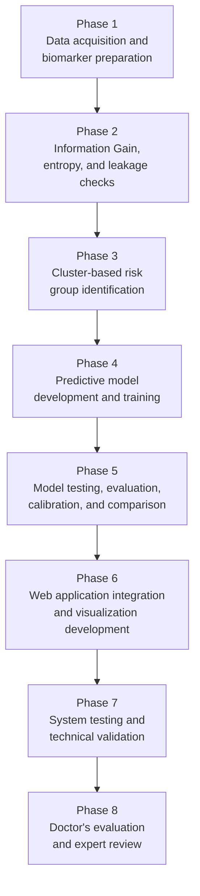

The phase alignment across the manuscript is summarized as follows.

| Phase | Primary Methodology Section | Corresponding Results or Evidence Section |
|---|---|---|
| Phase 1: Data acquisition and biomarker preparation | 3.2-3.6 | 4.6 |
| Phase 2: Feature selection using Information Gain and entropy | 3.7-3.8 | 4.2 and 4.6 |
| Phase 3: Cluster-based risk group identification | 3.10 | 4.5 |
| Phase 4: Predictive model development and training | 3.8 | 4.1 and 4.3 |
| Phase 5: Model testing, evaluation, and comparison | 3.8-3.9 | 4.1, 4.3, 4.4, and 4.12 |
| Phase 6: Web application integration and visualization development | 3.11-3.12 | 4.8 |
| Phase 7: System testing and technical validation | 3.13 | 4.7, 4.9, and 4.11 |
| Phase 8: Doctor's evaluation | 3.14 | 4.10 |

Section 3.15 provides the cross-cutting data analysis procedure used to summarize the quantitative model evidence, cluster evidence, benchmark evidence, and system-evaluation evidence reported in Chapter 4.

The figures used in Chapter 3 are limited to methodological and system-design diagrams: the eight-phase framework, overall pipeline, two-stage screening and subtyping workflow, four-tier architecture, and assessment sequence. Quantitative model artifacts and application screenshots are presented in Chapter 4 so that visual evidence remains separated from procedural design.

**Figure 3.1. Methodological Flow from NHANES Data to the Integrated DIANA System**

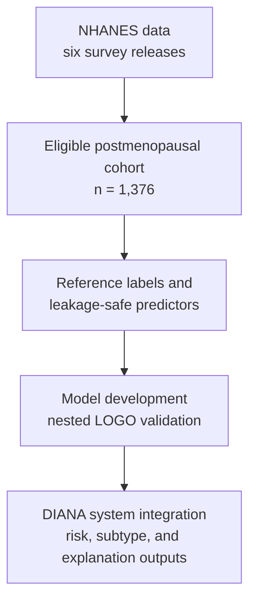

Figure 3.1 summarizes the main methodological pathway used in the study. Detailed procedures for feature selection, model comparison, threshold optimization, subtype assignment, explainability, and system testing are discussed in the succeeding sections.

### 3.2 Research Locale

The primary data locale for model development was the NHANES public data repository maintained by the Centers for Disease Control and Prevention. NHANES was selected because it provides standardized demographic, laboratory, examination, and questionnaire data across repeated survey releases (Centers for Disease Control and Prevention, National Center for Health Statistics [CDC/NCHS], 2024a). The modeling dataset used six NHANES releases: 2009-2010, 2011-2012, 2013-2014, 2015-2016, 2017-2018, and 2021-2023. The 2019-2020 cycle was excluded because NHANES field operations were disrupted by the COVID-19 pandemic. The 2021-2023 files were treated as the August 2021-August 2023 post-pandemic release rather than as a standard biennial NHANES release (CDC/NCHS, 2024b).

**Table 3.1. NHANES Survey Releases Included in the Study**

| Release | File Suffix | Sample Design | Methodological Use |
|---|---|---|---|
| 2009-2010 | `_F` | Standard 2-year release | Earliest post-2010 glycemic-guideline period used in this study |
| 2011-2012 | `_G` | Standard 2-year release | Temporal validation group |
| 2013-2014 | `_H` | Standard 2-year release | Temporal validation group |
| 2015-2016 | `_I` | Standard 2-year release | Temporal validation group |
| 2017-2018 | `_J` | Standard 2-year release | Pre-pandemic temporal validation group |
| 2021-2023 | `_L` | August 2021-August 2023 post-pandemic release | Most recent available release after pandemic suspension |

For planned user acceptance testing, the target recruitment locale consists of online communities of Filipino women discussing perimenopause and menopause-related health concerns. The source protocol identifies the "Usapang Perimenopause at Menopause" Facebook interest group as the intended recruitment setting. Formal recruitment will proceed only after permission from group administrators, informed consent, privacy safeguards, and the final testing protocol are completed.

### 3.3 Population of the Study

The modeling population consisted of postmenopausal women represented in NHANES. The final analytic cohort contained 1,376 postmenopausal women who satisfied the study's demographic, reproductive-health, and fasting-laboratory data-availability criteria. The cohort was restricted to female respondents within the target menopausal age range, with postmenopausal status derived from reproductive-health questionnaire responses. Reproductive-health filtering used RHQ031, which identifies respondents who reported no menstrual period during the past 12 months (CDC/NCHS, 2024c).

The multiclass reference distribution consisted of 642 normal cases, 457 pre-diabetic cases, and 277 diabetic cases. For the deployed screening model, pre-diabetic and diabetic cases were combined into a single at-risk class. This binary reformulation produced 734 at-risk cases and 642 normal cases. The binary formulation reflects the intended use of DIANA as a screening and triage-support tool: the system is designed to identify individuals who may benefit from confirmatory testing or clinical review rather than to assign a definitive diagnosis.

**Table 3.2. Final Class Distribution**

| Class | Count | Proportion |
|---|---:|---:|
| Normal | 642 | 46.7% |
| Pre-diabetic | 457 | 33.2% |
| Diabetic | 277 | 20.1% |
| Total | 1,376 | 100.0% |
| Binary at-risk class (Pre-diabetic + Diabetic) | 734 | 53.3% |

The planned user-evaluation population consists of menopausal or postmenopausal women who can interact with the DIANA application and provide structured usability feedback. The clinical expert-review population consists of licensed medical professionals who can review risk-output plausibility, feature usefulness, SHAP explanation clarity, and clinical workflow fit. Formal community user acceptance testing has not yet been completed; however, an initial hands-on doctor expert review was completed and is reported as qualitative face-validity evidence rather than as external clinical validation.

### 3.4 Data Gathering Tools and Procedures

This study used secondary data from NHANES. Raw XPT files were acquired from the CDC public repository and processed through an automated Python data pipeline using public NHANES documentation and codebooks as the source of file and variable definitions (CDC/NCHS, 2024a). The collected files included demographic records, glycohemoglobin records, fasting glucose records, total cholesterol records, HDL cholesterol records, triglyceride and LDL records, body-measurement records, blood-pressure records, reproductive-health questionnaire responses, diabetes questionnaire responses, smoking variables, physical-activity variables, alcohol-use variables, family-history variables, insulin records where available, and high-sensitivity CRP records where available.

The refreshed data pipeline used a cycle-specific active manifest containing 91 expected NHANES XPT files across the six included releases. The downloader verified that each active file was a SAS transport file rather than an HTML error page or incomplete response by checking the XPT header, minimum file size, and metadata readability. A post-download verification run confirmed that all 91 active XPT files were present and readable. Thirty-one older raw XPT files from excluded 2003-2008 cycles were present in the raw-data folder but were ignored by the active manifest and were not used in the final analytic dataset.

**Table 3.3. NHANES File Groups and Key Variables**

| File Group | Description | Key Variables Used |
|---|---|---|
| DEMO | Demographics | Age, sex, race/ethnicity, survey weights |
| GHB | Glycohemoglobin | HbA1c (LBXGH), used for reference-label construction |
| GLU | Fasting glucose | Fasting plasma glucose (LBXGLU), used for clinical interpretation |
| TCHOL | Total cholesterol | Total cholesterol (LBXTC) |
| HDL | HDL cholesterol | HDL cholesterol (LBDHDD) |
| TRIGLY | Triglycerides and LDL | Triglycerides (LBXTR or LBXTLG), calculated LDL cholesterol |
| BPX/BPXO | Blood pressure examination | Systolic and diastolic blood pressure where available |
| BMX | Body measurements | BMI (BMXBMI), waist circumference (BMXWAIST) |
| RHQ | Reproductive health | Postmenopausal filter using RHQ031 |
| DIQ | Diabetes questionnaire | Self-reported diabetes or borderline diabetes (DIQ010) |
| SMQ | Smoking questionnaire | Smoking status derived from SMQ020 and SMQ040 |
| PAQ | Physical activity questionnaire | Activity categories derived from PAQ605, PAQ650, PAQ665, and 2021-2023 PAQ equivalents |
| ALQ | Alcohol questionnaire | Alcohol-use categories derived from ALQ101/ALQ120Q/ALQ120U/ALQ130 and 2017+ ALQ equivalents |
| MCQ | Medical conditions | Family history of diabetes where available |
| INS | Insulin | Fasting insulin, available only in subsamples |
| HSCRP | High-sensitivity CRP | Inflammation marker (LBXHSCRP) where available |

Raw NHANES records were linked through SEQN, the unique respondent identifier. After merging, the pipeline standardized NHANES variable codes into clinically interpretable feature names based on public NHANES codebooks. For example, LBXGH was mapped to HbA1c, LBXGLU to fasting blood sugar, BMXBMI to BMI, BMXWAIST to waist circumference, LBXTR or LBXTLG to triglycerides, LBDHDD to HDL cholesterol, LBDLDL to LDL cholesterol, and LBXHSCRP to high-sensitivity CRP. For the 2021-2023 release, blood-pressure variables were read from the BPXO_L file rather than the legacy BPX naming pattern used in earlier releases (CDC/NCHS, 2024a).

Lifestyle variables were derived through rule-based classification. Smoking status was derived from SMQ020 and SMQ040 and categorized as never, former, current, or unknown. Physical activity was derived from PAQ605, PAQ650, and PAQ665 in earlier releases and from the corresponding PAD790/PAD800/PAD810/PAD820/PAD680 fields in the 2021-2023 release; it was categorized as active, moderate, sedentary, or unknown. Alcohol use was derived from ALQ variables and categorized as never, light, moderate, heavy, or unknown. The physical-activity variable was treated as a simplified categorical proxy rather than as an exact measure of weekly guideline adherence because NHANES questionnaire responses do not consistently provide complete minute-level activity records for every respondent.

**Table 3.4. Core Feature Mapping**

| NHANES Code | Clinical Name | Description |
|---|---|---|
| LBXGH | hba1c | Glycated hemoglobin (%) |
| LBXGLU | fbs | Fasting blood sugar (mg/dL) |
| BMXBMI | bmi | Body mass index (kg/m2) |
| BMXWAIST | waist_circumference | Waist circumference (cm) |
| LBXTR / LBXTLG | triglycerides | Triglycerides (mg/dL) |
| LBDHDD | hdl | HDL cholesterol (mg/dL) |
| LBDLDL | ldl | LDL cholesterol (mg/dL) |
| LBXHSCRP | crp | High-sensitivity C-reactive protein (mg/L) |
| BPXSY1 / BPXOSY1 | systolic_bp | Systolic blood pressure (mmHg), when used in secondary descriptions |
| BPXDI1 / BPXODI1 | diastolic_bp | Diastolic blood pressure (mmHg), when used in secondary descriptions |

### 3.5 Reference-Label Construction

Reference labels were constructed using a dual-source hierarchy. The primary source was DIQ010, the NHANES diabetes questionnaire item that records whether a respondent had been told by a physician that she had diabetes or borderline diabetes. Respondents reporting physician-diagnosed diabetes were labeled diabetic, while respondents reporting borderline diabetes were labeled pre-diabetic.

For respondents without self-reported diabetes or borderline diabetes, American Diabetes Association (ADA) HbA1c thresholds were applied. HbA1c values of 6.5 percent or higher were labeled diabetic, values from 5.7 to 6.4 percent were labeled pre-diabetic, and values below 5.7 percent were labeled normal. A hard override was applied so that any record with HbA1c of 6.5 percent or higher was labeled diabetic regardless of self-reported status. This rule reduced the chance that undiagnosed biochemical diabetes would be mislabeled as normal based only on self-report (American Diabetes Association Professional Practice Committee for Diabetes, 2026).

Agreement between DIQ010-derived labels and HbA1c-threshold labels was assessed to evaluate consistency between self-report and biochemical classification. Discordant records were interpreted as potential effects of undiagnosed diabetes, recall error, treatment effects, timing differences, or biological and laboratory variability. The label used in this study should therefore be interpreted as an operational reference label rather than as a perfect diagnostic gold standard. The label-consistency findings are reported in Chapter 4.

### 3.6 Data Preparation, Missing Data, and Outlier Handling

NHANES records contain missing values because of non-response, subsample designs, examination skip patterns, and variable availability across cycles. The defensible training pipeline used leakage-safe median imputation within the cross-validation workflow. Imputation parameters were fitted only on training folds and then applied to held-out folds, ensuring that validation or test information did not influence preprocessing. K-nearest-neighbor imputation was restricted to exploratory analysis and was not used for defensible model training because global imputation before cross-validation would allow the imputation procedure to see held-out fold information (Vabalas et al., 2019).

The final eligibility rule required complete HbA1c because HbA1c is used in reference-label construction. It also required fasting-laboratory availability, operationalized by the presence of fasting blood sugar in the NHANES fasting subsample, because the active DIANA model depends on measured fasting-subsample lipid predictors such as triglycerides and LDL cholesterol. FBS itself was not used as a model predictor and was not required as a second diagnostic label criterion; it functioned as the practical fasting-lab cohort gate. This choice favored a smaller but cleaner lipid-panel cohort over a larger HbA1c-only cohort with extensive imputation of active lipid predictors.

At inference time, missing waist circumference is handled by a separate serving-layer guardrail. During face-validity review, median imputation was found to be problematic for low-BMI users because a training-cohort median waist value of approximately 97 cm could create an implausible visceral-adiposity signal. When waist circumference is unavailable but BMI is present, the ML service estimates waist circumference as $\widehat{WC}=3.33 \times BMI$. This rule is a pragmatic usability safeguard intended to reduce implausible individual-level substitution; it is not a validated clinical estimator and requires further sensitivity analysis.

Outlier handling used clinical plausibility ranges rather than automatic row deletion. Values outside plausible clinical bounds were flagged through a binary outlier indicator, but records were retained. This decision preserved sample size and avoided excluding genuinely extreme metabolic profiles that may be clinically meaningful. The number of flagged outlier records was documented after preprocessing.

### 3.7 Data Leakage Prevention

A three-layer leakage-prevention architecture was implemented before model training. The first layer scanned model feature definitions to confirm that diagnostic markers such as HbA1c, fasting blood sugar, fasting glucose, and related aliases were absent from classifier and clustering feature sets. The second layer performed proxy-leakage detection by computing Pearson correlation between each non-diagnostic candidate feature and the HbA1c diagnostic threshold. Features satisfying $\lvert r_{x,\mathrm{HbA1c}}\rvert>0.95$ would be flagged as proxy leakage. The third layer computed Shannon entropy information gain, expressed as $IG(Y,X)=H(Y)-H(Y\mid X)$, to verify feature relevance while documenting why some high-ranked features were excluded.

This validation was enforced programmatically as a pre-training gate. If diagnostic variables or proxy-leakage conditions were detected, the training sequence would terminate. This made leakage prevention an executable part of the methodology rather than a post-hoc assertion. The leakage-validation findings are reported in Chapter 4.

### 3.8 Predictive Model Development and Validation

Four candidate algorithms were evaluated under the same nested temporal-validation framework: Logistic Regression, Random Forest, LightGBM, and XGBoost. Logistic Regression served as the interpretable linear baseline. Random Forest provided a non-linear ensemble baseline, while LightGBM and XGBoost provided gradient-boosting benchmarks for structured tabular prediction (Breiman, 2001; Ke et al., 2017; Chen & Guestrin, 2016).

For Logistic Regression, the predicted at-risk probability was modeled as:

$$
\hat{p}=\frac{1}{1+e^{-(\beta_0+\sum_{j=1}^{p}\beta_jx_j)}}
$$

**Table 3.5. Hyperparameter Search Space**

| Algorithm | Hyperparameter | Search Space |
|---|---|---|
| Logistic Regression | C | 0.01, 0.1, 0.3, 1.0, 3.0 |
| Random Forest | n_estimators | 200, 300 |
| Random Forest | max_depth | 4, 6, 8 |
| Random Forest | min_samples_leaf | 10, 15, 25 |
| LightGBM | n_estimators | 200, 400 |
| LightGBM | max_depth | 3, 5, 7 |
| LightGBM | learning_rate | 0.05, 0.1 |
| LightGBM | min_child_samples | 20, 30 |
| XGBoost | n_estimators | 200, 300 |
| XGBoost | max_depth | 3, 5 |
| XGBoost | learning_rate | 0.05, 0.1 |

Hyperparameter optimization used grid search with AUC-ROC as the scoring metric. The inner loop used grouped cross-validation so that NHANES survey-cycle boundaries were respected during model selection. The outer loop used Leave-One-Group-Out (LOGO) validation, holding out one entire NHANES release at a time. This nested LOGO design estimated whether a model trained on prior survey groups could generalize to a distinct temporal cohort. It is more conservative than random k-fold validation because observations from the same survey period are not split across training and testing (Vabalas et al., 2019).

In this study, each NHANES survey release was treated as one validation group. Under LOGO validation, the model was trained on all but one survey release and then tested on the held-out release. This process was repeated until each release had served once as the held-out test group. The design was used because records from the same survey cycle may share collection-period, laboratory, sampling, or population characteristics.

The final model was selected based on mean fold AUC rather than pooled aggregate AUC alone. This selection rule was used to favor models that performed consistently across temporal groups while preserving interpretability, stable probability outputs, and efficient inference. The comparative model-selection results are reported in Chapter 4.

NHANES survey weights were not incorporated into model training. Survey weights are essential for population-level prevalence estimation and nationally representative descriptive inference, but their role in prediction-model training depends on the target deployment population and modeling objective. In this study, unweighted training was treated as a design choice for learning risk patterns in the analytic cohort. Weighted sensitivity analysis remains an appropriate future extension (Lumley, 2010).

### 3.9 Clinical Threshold Optimization and Serving Guardrails

The final classifier outputs a probability that must be converted into a binary screening classification. Because DIANA is intended for early risk identification, thresholding was optimized for a screening context rather than defaulting to 0.50. Youden's J was included because it is a conventional operating-point criterion that balances sensitivity and specificity by maximizing sensitivity plus specificity minus one (Youden, 1950). However, it was treated as one candidate strategy rather than as an automatic final rule because DIANA is a screening-support system. In this context, a false negative may delay confirmatory testing or preventive counseling, while a false positive generally leads to follow-up review rather than immediate treatment.

Three threshold strategies were evaluated using out-of-fold probabilities from the training portion of each outer LOGO fold: Youden's J, a screening-optimized rule, and the geometric mean of sensitivity and specificity. The screening-optimized rule explicitly prioritized sensitivity while preserving a minimum specificity constraint. The geometric-mean rule provided a balance-oriented alternative for folds where sensitivity and specificity moved in opposite directions, which is useful when class imbalance and uneven operating characteristics are present (Luque et al., 2019). The candidate threshold grid ranged from 0.10 to 0.89 in increments of 0.01. For each threshold $t$ in that grid, predicted labels were assigned as $\hat{y}_i(t)=1$ when $\hat{p}_i\ge t$ and $\hat{y}_i(t)=0$ otherwise. The classification-performance quantities were:

$$
\begin{aligned}
\mathrm{Sensitivity} &= \frac{TP}{TP+FN} \\
\mathrm{Specificity} &= \frac{TN}{TN+FP} \\
\mathrm{PPV} &= \frac{TP}{TP+FP} \\
\mathrm{NPV} &= \frac{TN}{TN+FN} \\
\mathrm{Accuracy} &= \frac{TP+TN}{TP+TN+FP+FN} \\
F_1 &= \frac{2(\mathrm{PPV})(\mathrm{Sensitivity})}{\mathrm{PPV}+\mathrm{Sensitivity}} \\
J &= \mathrm{Sensitivity}+\mathrm{Specificity}-1 \\
G\text{-}\mathrm{Mean} &= \sqrt{\mathrm{Sensitivity}\times\mathrm{Specificity}}
\end{aligned}
$$

The three candidate thresholds were selected from the same grid as follows:

$$
\begin{aligned}
\mathcal{T} &= \{0.10,0.11,\ldots,0.89\} \\
\mathcal{F} &= \{t\in\mathcal{T}\mid \mathrm{Sensitivity}(t)\ge 0.80
\land \mathrm{Specificity}(t)\ge 0.40\} \\
S(t) &= 0.60\cdot\mathrm{Sensitivity}(t)+0.40\cdot F_1(t) \\
G(t) &= \sqrt{\mathrm{Sensitivity}(t)\times\mathrm{Specificity}(t)} \\
t_J &= \underset{t\in\mathcal{T}}{\mathrm{argmax}}\ J(t) \\
t_S &= \underset{t\in\mathcal{F}}{\mathrm{argmax}}\ S(t) \\
t_G &= \underset{t\in\mathcal{T}}{\mathrm{argmax}}\ G(t)
\end{aligned}
$$

A composite clinical score was then used to select the fold-specific base strategy from the candidate thresholds $t_J$, $t_S$, and $t_G$:

$$
\begin{aligned}
C(t) &= 0.35\cdot\mathrm{Sensitivity}(t)+0.30\cdot\mathrm{Specificity}(t) \\
&\quad +0.25\cdot F_1(t)+0.10\cdot\mathrm{Accuracy}(t) \\
t_{\mathrm{base}} &= \underset{t\in\{t_J,t_S,t_G\}}{\mathrm{argmax}}\ C(t)
\end{aligned}
$$

In these formulas, TP denotes true positives, TN denotes true negatives, FP denotes false positives, and FN denotes false negatives.

Sensitivity, specificity, predictive values, and related diagnostic testing measures followed the standard confusion-matrix definitions used in diagnostic accuracy evaluation (Shreffler & Huecker, 2023). F1 was included as a harmonic-mean summary of precision and sensitivity (Powers, 2011).

The fold-specific screening threshold was therefore derived from training-fold out-of-fold predictions rather than manually chosen after viewing held-out test results. A deterministic guardrail was also implemented to reduce specificity collapse under temporal prevalence shift. If a selected threshold produced very high sensitivity but inadequate specificity, the algorithm searched for a feasible threshold satisfying minimum operating constraints or reverted toward a safer operating point. The final deployment threshold and fold-level guardrail behavior are reported in Chapter 4.

**Table 3.6. Executable ML Safeguards and Rationale**

| Safeguard | Implementation Summary | Rationale |
|---|---|---|
| Diagnostic leakage gate | Blocks HbA1c, fasting blood sugar, and related diagnostic aliases from model features | Prevents circular prediction |
| Nested temporal validation | Uses grouped inner validation and outer LOGO by NHANES release | Reduces optimistic validation bias |
| Youden's J threshold | Tests the sensitivity-specificity balance point | Provides a standard threshold baseline |
| Screening-optimized threshold | Prioritizes sensitivity with a specificity floor | Reduces missed at-risk cases |
| Geometric-mean threshold | Balances sensitivity and specificity | Handles uneven fold behavior |
| Guardrail arbitration | Replaces unstable low thresholds when specificity collapses | Limits excessive false positives |
| Metabolic-syndrome guardrail | Raises low risk estimates for concordant metabolic-risk profiles | Reduces implausibly low risk outputs |

The serving layer also includes a rule-based Metabolic Syndrome risk guardrail. This rule evaluates triglycerides of at least 150 mg/dL, HDL cholesterol below 50 mg/dL, BMI of at least 25, and waist circumference of at least 80 cm, reflecting commonly used metabolic-syndrome risk criteria (International Diabetes Federation, 2006; Alberti et al., 2009). When three or more criteria are met, the at-risk probability is raised to at least 0.65. When two criteria are met, the at-risk probability is increased by 0.15 and capped at 0.95. This rule should be interpreted as an engineered safety heuristic for reducing implausibly low risk estimates in metabolically concordant high-risk profiles, not as an independently validated clinical rule.

The model-performance and calibration results reported in Chapter 4 refer to the cross-validated Logistic Regression classifier and its threshold policy before serving-layer Metabolic Syndrome probability boosts are applied. The guardrail can change individual runtime responses, so it is documented as an inference safeguard rather than as part of the reported cross-validation estimate. Its effect should be evaluated separately through ablation, calibration review, and clinical sensitivity analysis.

### 3.10 Cluster-Based Risk Group Identification

DIANA uses a two-stage inference structure. The first stage classifies a user as normal or at risk using the Logistic Regression screening model. Only users classified as at risk proceed to the weighted K-Means subtyping stage. This gating mechanism prevents the system from assigning disease-pattern subtype labels to users classified as normal.

Weighted K-Means clustering was trained exclusively on the at-risk subset of 734 cases. K-Means was selected as a centroid-based method for grouping similar metabolic profiles (MacQueen, 1967). The clustering features were BMI, triglycerides, LDL cholesterol, HDL cholesterol, age, and waist circumference. Feature weights were applied before Euclidean distance computation to emphasize clinically relevant dimensions. For a standardized patient vector $\mathbf{z}_i$ and centroid $\boldsymbol{\mu}_k$, the weighted distance used for assignment was:

$$
d_w(\mathbf{z}_i,\boldsymbol{\mu}_k)=\sqrt{\sum_{j=1}^{p}w_j(z_{ij}-\mu_{kj})^2}
$$

where $w_j$ is the feature-specific weight, $z_{ij}$ is the standardized patient value for feature $j$, and $\mu_{kj}$ is the corresponding standardized centroid value for cluster $k$. LDL received the highest weight as an atherogenic lipid differentiator. Triglycerides and waist circumference were strongly weighted because of their relationship to lipid dysregulation, central adiposity, and insulin-resistance patterns. BMI served as an obesity-pattern anchor, HDL as an inverse lipid marker, and age as a baseline variable.

The feature weights should be interpreted as literature-informed heuristic design parameters, not as clinically validated medical weights, causal effect sizes, treatment priorities, or regression coefficients. They were used only to shape geometric distance in standardized clustering space. This distinction was emphasized after the doctor expert review, where the main clinical clarification concerned why particular features were weighted more heavily and how those weights affected subtype assignment. The rationale draws on published metabolic-syndrome, lipid-accumulation, and data-driven diabetes-subgroup literature (Alberti et al., 2009; Ahlqvist et al., 2018; Kahn, 2005; Wang et al., 2024), but the weights themselves require sensitivity analysis and broader clinical validation before being treated as medically established.

**Table 3.7. Weighted K-Means Feature Weights**

| Feature | Weight | Interpretation |
|---|---:|---|
| LDL cholesterol | 2.5 | Atherogenic lipid differentiator |
| Triglycerides | 2.0 | Lipid dysregulation and insulin-resistance-related signal |
| Waist circumference | 2.0 | Central adiposity signal |
| BMI | 1.5 | Obesity-pattern anchor |
| HDL cholesterol | 1.2 | Inverse lipid-risk marker |
| Age | 1.0 | Baseline demographic variable |

The numeric weights represent an ordinal emphasis scale in standardized clustering space: 1.0 was treated as baseline influence, 1.2 as mild emphasis, 1.5 as moderate emphasis, 2.0 as strong emphasis, and 2.5 as the highest heuristic emphasis. Because the variables were standardized before clustering, a one-standard-deviation difference in a feature with weight 2.0 contributed twice the squared-distance contribution of a baseline-weighted feature such as age. These values were not derived from regression coefficients, clinical cutoffs, or validated treatment priorities.

The specific assignments followed a descending clinical-emphasis logic. LDL cholesterol received the highest weight of 2.5 to strengthen separation of atherogenic lipid-driven profiles after diagnostic glycemic markers and unavailable insulin-function markers were excluded. Triglycerides received a strong weight of 2.0 because elevated triglycerides are central to lipid dysregulation and waist-triglyceride accumulation patterns used in the SIRD-like centroid interpretation. Waist circumference also received a strong weight of 2.0 because central adiposity is more directly tied to metabolic risk patterning than general body size alone. BMI received a moderate weight of 1.5 because it anchors obesity-related pattern separation but overlaps partly with waist circumference. HDL cholesterol received a mild weight of 1.2 because it contributes inverse lipid-risk information, while avoiding dominance over the stronger atherogenic and central-adiposity dimensions. Age was kept at the baseline weight of 1.0 because it provides demographic context for MARD-like interpretation but should not dominate subtype assignment over metabolic biomarkers.

Cluster centroids were inverse-transformed from standardized space into raw clinical units before interpretation. The resulting labels were Ahlqvist-inspired proxy labels: SIRD-like, SIDD-like, MOD-like, and MARD-like. Label assignment followed a deterministic centroid-ranking rule. First, the SIRD-like label was assigned to the centroid with the highest Lipid Accumulation Product (LAP)-style score, computed for this women-only cohort as $\mathrm{LAP}=(WC-58)\times TG$. LAP was introduced as a waist-triglyceride index of lipid overaccumulation (Kahn, 2005) and has been associated with prediabetes and diabetes risk in NHANES-based work (Wang et al., 2024). In DIANA, LAP is not a classifier input and is not stored as a user feature; it is used only to rank inverse-transformed cluster centroids. Because it is used for within-dataset ranking, the triglyceride unit scale does not change which centroid has the highest LAP-style score.

After the SIRD-like centroid was removed from consideration, the SIDD-like label was assigned to the remaining centroid with the highest LDL cholesterol. This is a lipid-driven proxy rather than true insulin-deficiency classification. The MOD-like label was then assigned to the remaining centroid with the highest BMI, and the final residual centroid was labeled MARD-like. The term "Ahlqvist-inspired" is deliberate. The original adult-onset diabetes subgroup framework used variables that are not available in DIANA's accessible screening feature set, including GAD antibody status and HOMA2 estimates of beta-cell function and insulin resistance (Ahlqvist et al., 2018). DIANA also excludes HbA1c and fasting blood sugar from model inputs to avoid circular prediction. Therefore, the cluster labels describe phenotypic similarity to known metabolic patterns rather than validated biological subtype membership; this caution is also consistent with work comparing data-driven diabetes subgroups against simpler clinical-feature models (Dennis et al., 2019).

The SIDD-like label requires particular caution. True SIDD classification requires beta-cell function markers such as HOMA2-B or C-peptide, which were unavailable in the NHANES feature set used by DIANA. In this study, SIDD-like is therefore interpreted as an atherogenic or lipid-driven proxy label based primarily on elevated LDL patterns rather than as a true insulin-deficiency subtype diagnosis. The SAID category was not assigned because autoimmune markers were unavailable. These labels are heuristic descriptions, not validated biological subtype diagnoses, not treatment directives, and not replacements for clinical judgment.

**Figure 3.2. Two-Stage Screening and Subtype Assignment Workflow**

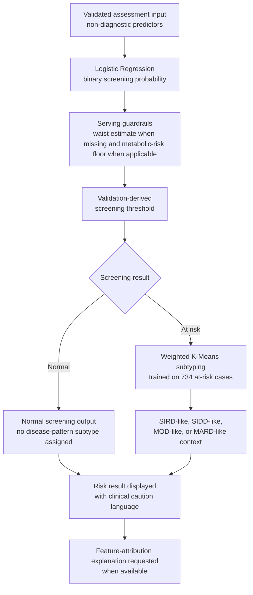

Figure 3.2 clarifies the separation between binary screening and subtype assignment. DIANA first determines whether the profile is normal or at risk. Only at-risk outputs proceed to weighted K-Means subtyping, which prevents the system from assigning disease-pattern labels to users classified as normal.

### 3.11 Model Explainability and Clinical Decision Support

Although Logistic Regression provides coefficient-level interpretability, DIANA also uses SHapley Additive exPlanations (SHAP) to provide patient-level feature attribution (Lundberg & Lee, 2017). SHAP values indicate how each feature pushes a prediction toward or away from the at-risk class. The explainability workflow supports both cohort-level interpretation, through summary visualizations, and patient-level interpretation, through waterfall-style feature-contribution displays.

Detailed SHAP outputs are generated during explanation requests and displayed in the user interface when available. They are not stored as detailed assessment fields. The database stores prediction metadata such as risk score, predicted status, model version, dataset hash, and subtype context, while detailed SHAP values remain transient explanation artifacts.

When SHAP output is unavailable, the interface displays an explanation-unavailable state and states that no feature-level SHAP values are shown. This behavior preserves the screening result while avoiding fabricated feature attributions.

In addition to model-performance evaluation, DIANA includes safety and traceability controls around the ML workflow. These controls make leakage prevention, explanation handling, drift awareness, and model lineage verifiable within the implemented system rather than leaving them as documentation-only claims.

**Table 3.8. ML Safety and Traceability Controls**

| Control | Implemented Behavior | Methodological Value |
|---|---|---|
| Leakage validation gate | Blocks diagnostic features before training | Reduces circular prediction risk |
| Feature-set documentation | Documents active clinical and clustering feature sets | Reduces training-serving mismatch |
| SHAP unavailability handling | Shows an explanation-unavailable state when SHAP is unavailable | Avoids fabricated explanations |
| Drift-monitoring support | Records drift-check status for administrative review | Supports post-deployment monitoring |
| Model lineage metadata | Stores model version, dataset hash, risk score, status, and subtype metadata | Supports result traceability |

### 3.12 System Architecture and Implementation

DIANA was implemented as a layered web application with a frontend interface, backend API, ML inference service, and persistence layer. The separation of these layers allowed the user interface, authentication and validation logic, prediction workflow, and stored assessment records to be developed and evaluated independently. Optional caching was used for repeated read-heavy views such as trends and aggregate analytics when the runtime environment supported it.

The deployment design follows a reverse-proxy pattern in which public browser traffic reaches the application through a secured gateway before application services are invoked. The backend API, ML service, and database are separated so that prediction, persistence, authentication, and explanation tasks are not exposed as a single process or direct service-port surface. This design supports either managed-service or containerized deployment while preserving the same logical system boundaries. Rate limiting is implemented separately through request-throttling controls.

**Table 3.9. Technology Stack**

| Component | Technology | Rationale |
|---|---|---|
| Frontend | React 18 + Vite | Component-based UI, efficient rendering, and fast development workflow |
| Backend | Go 1.25 + Gin | Concurrent request handling, static typing, and compiled deployment |
| ML Service | Python 3.12 + Flask | Access to scikit-learn, SHAP, and ML tooling |
| Database | PostgreSQL-compatible persistence | ACID-compliant persistence for user, assessment, model, authentication-event, and audit records |
| Cache support | Optional cache layer | Time-limited caching and targeted refresh for repeated read queries when configured |
| Authentication | Signed web-token authentication | Stateless authentication with access and refresh token support |
| Deployment | Managed or containerized deployment | Reverse-proxy ingress, separated services, and PostgreSQL-backed persistence |
| Charts | Recharts | Interactive biomarker trends and explainability visualizations |

**Figure 3.3. DIANA Four-Tier System Architecture**

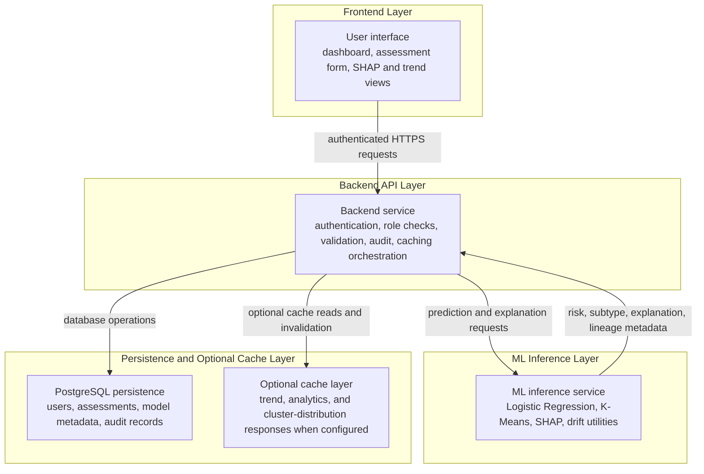

In both supported deployment variants, public traffic enters through a reverse proxy rather than direct backend, ML, or database ports. The default thesis workflow sends ML prediction and explanation traffic through the backend, which communicates with the ML layer through a service boundary and with the database through a controlled persistence connection. The Docker Nginx configuration also contains an optional `/ml/` reverse-proxy location for deployments configured to use it; therefore, the security claim is limited to direct service-port isolation and backend-mediated thesis workflow routing rather than a claim that every possible deployment exposes no public ML HTTP route.

The backend and ML service were decoupled so routine API operations remain separate from model inference and explanation generation. During assessment creation, the backend authenticates the user, validates submitted biomarkers, sends the model-relevant payload to the ML service, receives prediction and lineage metadata, stores the assessment, refreshes affected cached data when applicable, and returns the result to the interface. Prediction failures are returned as structured errors rather than silently hidden by fallback behavior.

**Figure 3.4. Assessment Prediction and Optional Explanation Sequence**

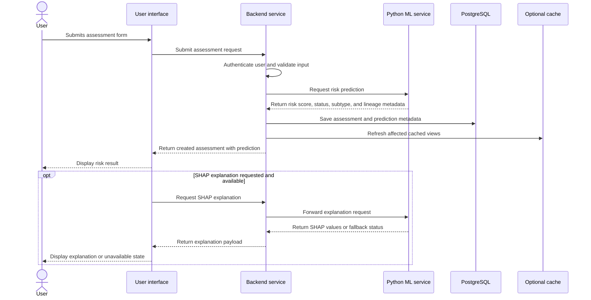

Figure 3.4 separates the required assessment-creation path from the optional explanation path. The assessment is first validated, predicted, persisted, and returned to the interface. SHAP explanation is requested separately through the explanation workflow only when the interface needs feature-attribution output.

The API design was organized around access-control boundaries rather than a single public service surface. Public access was limited to authentication and basic system-status functions. Authenticated users accessed profile, assessment, privacy, trends, analytics, and report-export workflows. Doctor and administrator roles provided controlled access to cohort insights, audit review, user management, model traceability, and drift-related monitoring. Table 3.10 summarizes these access levels without enumerating implementation-level routes.

**Table 3.10. API Access-Control Summary**

| Access Level | Main Functions | Representative Boundary |
|---|---|---|
| Public | Authentication and basic system-status checks | Public access boundary |
| Authenticated user | Profile, assessments, privacy tools, trends, and PDF export | User-owned data boundary |
| User analytics | Personal summaries and biomarker trends | Personal analytics boundary |
| ML explanation access | Model insights and SHAP explanation requests | Controlled ML-service boundary |
| Doctor or admin | Cohort insights and validation workflows | Role-restricted clinical-review boundary |
| Admin only | User management, audit logs, model traceability, and drift status | Administrative boundary |

The database schema links assessments directly to authenticated users, supporting user-owned health records and controlled deletion behavior. Stored prediction metadata includes risk score, risk label, predicted status, model lineage, dataset lineage, and subtype context where available. This design supports traceability between a displayed result and the model artifact used to generate it without requiring detailed explanation artifacts to be persisted with every assessment.

### 3.13 Security, Authorization, and Quality Evaluation

DIANA implements signed-token authentication, role-based access control, request-size limiting, rate limiting, security headers, cross-origin request filtering, and password hashing with bcrypt (Jones et al., 2015; Provos & Mazieres, 1999). Three main roles are recognized: user, doctor, and admin. Users can create assessments, view their own predictions, export reports, and review personal trends. Doctors are treated as a testing and validation role with model-locked assessment creation. Administrators can access system administration functions such as user management, audit logs, model traceability, and dashboard summaries.

**Table 3.11. Security Controls**

| Control | Implementation | Purpose |
|---|---|---|
| Token signing | Signed web tokens using HMAC-SHA256 | Preserve token integrity |
| Password hashing | bcrypt password hashing | Protect credentials at rest |
| Role-based access control | Access-control enforcement | Apply least-privilege access |
| Rate limiting | Token-bucket rate limiting | Reduce brute-force and denial-of-service risk |
| Cross-origin filtering | Cross-origin request allow-list | Restrict cross-origin access |
| TLS | TLS-capable reverse-proxy configuration | Support transport confidentiality when valid certificates are configured |
| Public ingress control | Reverse proxy handles public HTTP/HTTPS ingress | Reduce direct service exposure |
| ML service exposure control | Backend-mediated thesis workflow and no external ML container port in the production overlay | Reduce direct ML service exposure; optional `/ml/` proxy deployments require API-key and CORS controls |
| Secret management | Runtime secret configuration | Reduce accidental credential disclosure |

Software quality evaluation followed ISO/IEC 25010-informed characteristics (International Organization for Standardization, 2011). Functional suitability was evaluated through API tests, model-serving tests, and frontend unit tests. Performance efficiency was evaluated through inference benchmarks and planned load-testing methodology. Security was evaluated through authentication, role-based access, rate-limiting, and request-handling tests. Maintainability was supported through modular architecture, structured database access, and separated frontend, backend, and ML services. Formal community usability, accessibility, and reliability results require separate UAT and operational testing. The completed doctor review is reported separately as qualitative expert face-validity feedback rather than as formal clinical validation.

Because DIANA was evaluated as a research prototype, its current navigation and browser-token handling should not be interpreted as production clinical security hardening. Before clinical deployment, the system would require stronger session-management design, formal cross-site-scripting review, route-based navigation refinement, and deployment-compatible protections such as HttpOnly cookies or server-side sessions where feasible.

### 3.14 User Acceptance Testing and Expert Review Methodology

The planned community user evaluation follows an ISO/IEC 25010-informed usability framework (International Organization for Standardization, 2011). The protocol evaluates appropriateness recognizability, learnability, operability, user error protection, interface aesthetics, accessibility, and user confidence. Planned user participants will complete core tasks such as logging in, navigating the dashboard, submitting an assessment, and interpreting prediction results. If the System Usability Scale is administered during the community UAT phase, scoring and interpretation will follow established SUS guidance (Brooke, 1996; Bangor et al., 2008).

The planned user cohort consists of approximately 30 menopausal or postmenopausal Filipino women recruited from the target online community, subject to approval and consent procedures. Separately, a hands-on doctor expert review was completed with a licensed physician reviewer. The expert review evaluated the prototype's feature set, assessment workflow, risk-output presentation, explanation approach, and subtype-weighting rationale. The available review record identifies the reviewer at the licensed-physician role level only; specialty, years of practice, review date, and formal scoring results are not reported in the manuscript evidence set. Feedback was collected qualitatively rather than through a completed Likert scoring instrument; therefore, this study reports expert comments and interpretation themes, but not formal expert mean scores. Formal UAT with the target user cohort remains pending, so SUS scores, task success rates, completion times, and user quotations are not reported as completed results.

### 3.15 Data Analysis Procedure

Data analysis was conducted across three broad evidence groups: cohort and feature analysis, model-related validation, and system-evaluation evidence. Model-related validation included predictive-model performance, threshold behavior, calibration, clustering, and benchmark comparison. The NHANES analytic cohort was summarized using record counts, class distributions, survey-cycle membership, feature availability, and reference-label composition. These summaries were used to describe the analytic dataset and to verify that the final cohort matched the intended postmenopausal, fasting-laboratory population. Because the modeling objective was prediction within the analytic cohort rather than national prevalence estimation, descriptive counts were not interpreted as weighted population estimates.

Reference-label analysis compared the DIQ010-derived physician-diagnosis or borderline-diabetes labels with HbA1c-threshold labels. Agreement and discordance were interpreted descriptively to assess label consistency and uncertainty. Discordant records were not treated as errors automatically because they may reflect undiagnosed diabetes, treatment effects, recall differences, timing differences between questionnaire and laboratory data, or single-measurement biological variability.

Feature analysis used Information Gain and entropy-based relevance ranking to identify candidate predictors while excluding diagnostic glycemic variables and proxy-leakage features. Numeric predictors were discretized before Information Gain calculation, so the ranking should be interpreted as a descriptive relevance audit rather than as a direct coefficient estimate or a standalone feature-selection model. Final feature interpretation considered both quantitative relevance and clinical plausibility. During predictive validation, missing-data handling and feature scaling were fitted inside each training workflow before being applied to held-out folds, which reduced preprocessing leakage from validation or test data (Vabalas et al., 2019).

Predictive-model analysis used nested Leave-One-Group-Out validation by NHANES survey release. For each outer validation fold, one survey release served as the held-out temporal test group while the remaining releases were used for model selection and fitting. Model performance was evaluated using AUC-ROC, sensitivity, specificity, positive predictive value, negative predictive value, F1 score, and confusion-matrix counts. Bootstrap confidence intervals were reported for the headline AUC-ROC and sensitivity estimates using a fixed random seed. Screening-threshold selection was performed on training-partition out-of-fold probabilities with operating-point constraints, and the selected fold threshold was then applied to the held-out survey release. The deployment threshold artifact stores the mean selected threshold across LOGO folds rather than a manually chosen post-test cutoff. Calibration was assessed using the Brier score, expected calibration error, and Hosmer-Lemeshow statistic (Brier, 1950; Hosmer & Lemeshow, 1980; Van Calster et al., 2019).

Cluster analysis was performed on the at-risk subset using weighted K-Means. Cluster validity was assessed using silhouette score, Davies-Bouldin index, and Calinski-Harabasz index, while centroid interpretation was performed after inverse-transforming cluster centers into raw clinical units (Rousseeuw, 1987; Davies & Bouldin, 1979; Calinski & Harabasz, 1974). Benchmark analysis compared DIANA with reconstructed screening baselines under the same NHANES cohort, outcome definition, and validation framework where sufficient variables were available.

System-evaluation evidence was analyzed separately from model-validation evidence. Backend, ML-service, frontend, security, deployment-readiness, and accessibility-readiness results were summarized by test domain, evidence source, and implementation status. Community user acceptance testing was handled as a planned evaluation procedure because it had not yet been completed. The doctor expert review was analyzed qualitatively as face-validity feedback, with attention to feature usefulness, risk-output plausibility, and the requested clarification that clustering feature weights are literature-informed heuristics rather than clinically validated medical weights.

**Table 3.12. Summary of Data Analysis Procedures**

| Analysis Domain | Procedure | Primary Output |
|---|---|---|
| Cohort description | Count records, class labels, survey cycles, and feature availability | Final analytic cohort profile |
| Label consistency | Compare DIQ010-derived labels with HbA1c-threshold labels | Agreement and discordance interpretation |
| Feature relevance | Rank predictors using discretized Information Gain and leakage screening | Final predictor set and excluded-feature rationale |
| Model validation | Apply nested LOGO validation by NHANES release | Fold-level and pooled discrimination metrics |
| Threshold and calibration | Optimize threshold from training out-of-fold predictions and assess internal calibration | Screening threshold, operating metrics, and calibration statistics |
| Cluster validation | Evaluate weighted K-Means on at-risk records | Cluster validity metrics and subtype-context interpretation |
| Benchmark comparison | Reconstruct available screening baselines under the same cohort and outcome definition | Contextual comparator performance |
| System evidence | Summarize technical tests, implementation status, and planned evaluation gaps | Functional, security, deployment, and readiness findings |

For clarity, the principal formulas used in the methodology are summarized below. Table 3.13 serves as a formula index, while the equations are displayed outside the table to preserve reliable LaTeX rendering in Markdown and thesis export workflows.

**Table 3.13. Formula Index**

| Formula Area | Applied In |
|---|---|
| HbA1c reference thresholds | Reference-Label Construction |
| Waist-circumference fallback | Data Preparation, Missing Data, and Outlier Handling |
| Proxy-leakage flag | Data Leakage Prevention |
| Entropy and Information Gain | Data Leakage Prevention |
| Logistic screening probability | Predictive Model Development and Validation |
| Confusion-matrix metrics | Clinical Threshold Optimization and Serving Guardrails |
| Threshold strategy selection | Clinical Threshold Optimization and Serving Guardrails |
| Weighted K-Means distance | Cluster-Based Risk Group Identification |
| LAP-style centroid score | Cluster-Based Risk Group Identification |
| Brier score and ECE | Data Analysis Procedure and Calibration Analysis |

HbA1c reference thresholds:

| Reference status | HbA1c criterion |
|---|---|
| Diabetic | HbA1c >= 6.5% |
| Pre-diabetic | 5.7% <= HbA1c < 6.5% |
| Normal | HbA1c < 5.7% |

Waist-circumference fallback:

$$
\widehat{WC}=3.33\times BMI
$$

Proxy-leakage flag:

$$
\left|r_{x,\mathrm{HbA1c}}\right|>0.95
$$

Entropy and Information Gain:

$$
\begin{aligned}
H(Y) &= -\sum_i p_i\log_2(p_i) \\
IG(Y,X) &= H(Y)-H(Y\mid X)
\end{aligned}
$$

Logistic screening probability:

$$
\hat{p}=\frac{1}{1+e^{-(\beta_0+\sum_{j=1}^{p}\beta_jx_j)}}
$$

Confusion-matrix metrics:

$$
\begin{aligned}
\mathrm{Sensitivity} &= \frac{TP}{TP+FN} \\
\mathrm{Specificity} &= \frac{TN}{TN+FP} \\
\mathrm{PPV} &= \frac{TP}{TP+FP} \\
\mathrm{NPV} &= \frac{TN}{TN+FN} \\
\mathrm{Accuracy} &= \frac{TP+TN}{TP+TN+FP+FN} \\
F_1 &= \frac{2(\mathrm{PPV})(\mathrm{Sensitivity})}{\mathrm{PPV}+\mathrm{Sensitivity}} \\
J &= \mathrm{Sensitivity}+\mathrm{Specificity}-1 \\
G\text{-}\mathrm{Mean} &= \sqrt{\mathrm{Sensitivity}\times\mathrm{Specificity}}
\end{aligned}
$$

Threshold strategy selection:

$$
\begin{aligned}
\mathcal{T} &= \{0.10,0.11,\ldots,0.89\} \\
\mathcal{F} &= \{t\in\mathcal{T}\mid \mathrm{Sensitivity}(t)\ge 0.80
\land \mathrm{Specificity}(t)\ge 0.40\} \\
S(t) &= 0.60\cdot\mathrm{Sensitivity}(t)+0.40\cdot F_1(t) \\
G(t) &= \sqrt{\mathrm{Sensitivity}(t)\times\mathrm{Specificity}(t)} \\
C(t) &= 0.35\cdot\mathrm{Sensitivity}(t)+0.30\cdot\mathrm{Specificity}(t) \\
&\quad +0.25\cdot F_1(t)+0.10\cdot\mathrm{Accuracy}(t) \\
t_J &= \underset{t\in\mathcal{T}}{\mathrm{argmax}}\ J(t) \\
t_S &= \underset{t\in\mathcal{F}}{\mathrm{argmax}}\ S(t) \\
t_G &= \underset{t\in\mathcal{T}}{\mathrm{argmax}}\ G(t) \\
t_{\mathrm{base}} &= \underset{t\in\{t_J,t_S,t_G\}}{\mathrm{argmax}}\ C(t)
\end{aligned}
$$

Weighted K-Means distance:

$$
d_w(\mathbf{z}_i,\boldsymbol{\mu}_k)=\sqrt{\sum_{j=1}^{p}w_j(z_{ij}-\mu_{kj})^2}
$$

LAP-style centroid score:

$$
\mathrm{LAP}=(WC-58)\times TG
$$

Brier score and Expected Calibration Error:

$$
\begin{aligned}
\mathrm{Brier} &= \frac{1}{n}\sum_{i=1}^{n}(\hat{p}_i-y_i)^2 \\
\mathrm{ECE} &= \sum_{m=1}^{M}\frac{\left|B_m\right|}{n}\left|\overline{y}_{B_m}-\overline{\hat{p}}_{B_m}\right|
\end{aligned}
$$

# Chapter 4: Results and Discussion

Although Chapter 3 describes the work as eight methodological phases, Chapter 4 presents the findings by evidence domain. This organization separates model performance, feature relevance, clustering, leakage validation, functional testing, interface integration, deployment readiness, pending community UAT evidence, and completed qualitative doctor expert-review evidence.

### 4.1 Binary Screening Model Performance

The final Logistic Regression screening model demonstrated acceptable discrimination under nested LOGO validation, achieving a pooled out-of-fold AUC-ROC of **0.737** (95% CI: **0.710-0.763**) and a sensitivity of **0.748** (95% CI: **0.717-0.776**) at the optimized screening threshold of **0.465**. Specificity was **0.590**, and the F1 score of **0.710** indicates a moderate precision-recall trade-off at the selected threshold.

The reported confidence intervals were computed using 1,000 bootstrap resamples, the percentile method, and a fixed random seed of 42. Bootstrap samples containing fewer than two outcome classes were excluded from confidence-interval computation. This procedure provides distribution-free uncertainty estimates appropriate for the modest sample size and the temporal validation design (Efron & Tibshirani, 1993).

**Table 4.1. Headline Binary Screening Performance**

| Metric | Value |
|---|---:|
| Pooled AUC-ROC | 0.7366 |
| 95% CI for pooled AUC-ROC | 0.710-0.763 |
| Optimized threshold | 0.465 |
| Sensitivity | 0.7480 |
| 95% CI for sensitivity | 0.717-0.776 |
| Specificity | 0.590 |
| Positive predictive value | 0.676 |
| Negative predictive value | 0.672 |
| F1 score | 0.710 |

**Table 4.2. Confidence Interval Summary**

| Metric | Point Estimate | 95% CI Lower | 95% CI Upper | Target |
|---|---:|---:|---:|---|
| Sensitivity | 0.7480 | 0.717 | 0.776 | >= 0.70 |
| AUC-ROC | 0.7366 | 0.710 | 0.763 | >= 0.70 |

The fold-level AUC range of **0.711-0.788** across the six held-out NHANES survey releases indicates that no single temporal fold collapsed below the acceptable discrimination target. The result supports the interpretation that the classifier learned repeatable metabolic risk patterns across NHANES releases. However, because the evaluation remains internal to NHANES, the result should be interpreted as temporal validation rather than external clinical validation.

**Table 4.3. Per-Fold LOGO Validation Results for Logistic Regression**

| Fold | Test Release | Fold AUC-ROC | Sensitivity | Specificity | Threshold | Strategy |
|---:|---|---:|---:|---:|---:|---|
| 1 | 2009-2010 | 0.711 | 0.761 | 0.581 | 0.47 | Youden's J |
| 2 | 2011-2012 | 0.713 | 0.634 | 0.718 | 0.49 | Youden's J |
| 3 | 2013-2014 | 0.736 | 0.727 | 0.567 | 0.47 | Youden's J |
| 4 | 2015-2016 | 0.788 | 0.772 | 0.679 | 0.48 | Youden's J |
| 5 | 2017-2018 | 0.738 | 0.735 | 0.637 | 0.47 | Youden's J |
| 6 | 2021-2023 | 0.731 | 0.856 | 0.449 | 0.41 | Guardrail nearest feasible |
| Mean | - | 0.736 | 0.748 | 0.605 | 0.465 | - |

The AUC values in Tables 4.3 and 4.6 are mean fold AUC-ROC values averaged across the six held-out LOGO test releases. By contrast, Table 4.1 reports the pooled out-of-fold AUC-ROC computed from all held-out predictions combined, with bootstrap confidence intervals. This distinction explains why the headline pooled estimate is 0.7366 while the Logistic Regression mean fold AUC is 0.736.

The sensitivity point estimate exceeded the pre-specified screening target of 0.70, and the lower bound of the 95 percent confidence interval was 0.717. This provides evidence that the refreshed model met the target under internal temporal validation, while still requiring external or prospective validation before clinical deployment claims.

At the threshold-policy level, Youden's J was selected in 5 of 6 LOGO folds, while guardrail arbitration was activated in 1 of 6 LOGO folds through nearest-feasible threshold selection. This distribution indicates that the final threshold policy was not a simple default cutoff. It combined conventional discrimination-based selection with a safety mechanism for folds vulnerable to specificity collapse.

**Table 4.4. Threshold Mode Distribution**

| Threshold Mode | Occurrence (6 folds) | Interpretation |
|---|---:|---|
| Youden's J | 5/6 | Primary strategy for balanced sensitivity-specificity optimization |
| Guardrail Nearest Feasible | 1/6 | Fallback strategy used to reduce specificity collapse under temporal shift |
| Guardrail Shift Floor | 0/6 | Hard minimum-threshold shifting was not used by the selected Logistic Regression model |

Medically, this means that the deployed threshold policy prioritized early identification without allowing the model to classify too many normal profiles as at risk in unstable folds. Youden's J was retained when the fold-level operating point produced an acceptable sensitivity-specificity balance. In the 2021-2023 fold, guardrail arbitration selected the nearest feasible threshold to limit specificity collapse under a high-sensitivity operating point. This adjustment changed the classification threshold, not the trained model coefficients.

**Figure 4.1. ROC Curve for the Logistic Regression Screening Model**

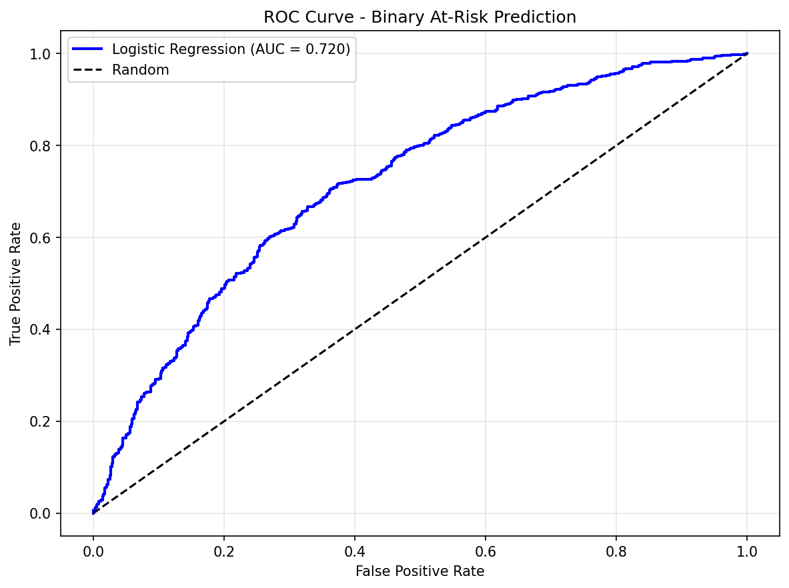

### 4.2 Feature Relevance and Feature-Selection Results

Information Gain analysis was used to examine feature relevance before final model interpretation. The final model retained triglycerides, HDL cholesterol, LDL cholesterol, BMI, waist circumference, age, smoking status, physical activity, and alcohol use. Several excluded variables had high information gain, including CRP, fasting insulin, TG/HDL ratio, blood pressure variables, and metabolic syndrome score. These variables were reviewed but excluded for methodological reasons.

**Table 4.5. Information Gain Feature Rankings**

| Rank | Feature | Type | IG | IG% | In Model? |
|---:|---|---|---:|---:|---|
| 1 | crp | Numeric | 0.502669 | 50.43% | No |
| 2 | Fasting Insulin | Numeric | 0.378539 | 37.98% | No |
| 3 | HDL | Numeric | 0.090256 | 9.05% | Yes |
| 4 | TG/HDL Ratio | Numeric | 0.086469 | 8.67% | No |
| 5 | Waist Circumference | Numeric | 0.084017 | 8.43% | Yes |
| 6 | Systolic BP | Numeric | 0.080274 | 8.05% | No |
| 7 | Triglycerides | Numeric | 0.066976 | 6.72% | Yes |
| 8 | Diastolic BP | Numeric | 0.061783 | 6.20% | No |
| 9 | BMI | Numeric | 0.058757 | 5.89% | Yes |
| 10 | Metabolic Syndrome Score | Numeric | 0.046720 | 4.69% | No |
| 11 | LDL | Numeric | 0.044970 | 4.51% | Yes |
| 12 | BMI Category | Numeric | 0.034278 | 3.44% | No |
| 13 | Total Cholesterol | Numeric | 0.028459 | 2.86% | No |
| 14 | Alcohol Use (encoded) | Ordinal | 0.018244 | 1.83% | Yes |
| 15 | Physical Activity (encoded) | Ordinal | 0.007360 | 0.74% | Yes |
| 16 | Age | Numeric | 0.004261 | 0.43% | Yes |
| 17 | Smoking Status (encoded) | Ordinal | 0.004023 | 0.40% | Yes |

Derived variables such as TG/HDL ratio and metabolic syndrome score were excluded because they duplicate information already present in selected features. Including both composites and their component variables could distort interpretation and inflate apparent feature importance. Blood pressure variables were excluded to preserve the self-screening accessibility goal of the system. This feature-selection process prioritized non-circularity, interpretability, accessibility, and practical deployment.

Alcohol use had modest non-zero univariate Information Gain in the discretized validation output but remains in the deployed feature contract primarily because coefficient analysis and clinical covariate rationale treat lifestyle exposure as a controlled behavioral predictor rather than as a standalone selector. This should be interpreted cautiously and should not be used to infer a causal protective effect.

### 4.3 Model Comparison

The candidate algorithms were compared under the same nested LOGO validation framework. Logistic Regression achieved the highest pooled AUC and the highest mean fold AUC at approximately 0.736. Random Forest achieved a mean fold AUC of 0.716, LightGBM achieved 0.712, and XGBoost achieved 0.713. Although the non-linear models produced competitive sensitivity, Logistic Regression provided the strongest discrimination with the clearest interpretability profile.

**Table 4.6. Model Comparison Under LOGO Validation**

| Algorithm | Mean Fold AUC-ROC | Pooled AUC 95% CI | Sensitivity | Sens 95% CI | Specificity | F1 | Mean Threshold |
|---|---:|---|---:|---|---:|---:|---:|
| Logistic Regression | 0.736 | 0.710-0.763 | 0.748 | 0.717-0.776 | 0.605 | 0.711 | 0.465 |
| Random Forest | 0.716 | -- | 0.732 | -- | 0.600 | 0.702 | 0.485 |
| LightGBM | 0.712 | -- | 0.724 | -- | 0.603 | 0.696 | 0.475 |
| XGBoost | 0.713 | -- | 0.730 | -- | 0.589 | 0.699 | 0.655 |

Logistic Regression was selected because it provided the most appropriate balance of performance and interpretability for a screening-support system. Its coefficients can be interpreted more directly than those of ensemble models, and its probability outputs are suitable for threshold optimization and SHAP-based explanation. It also demonstrated efficient inference: LR inference averages **0.62 ms** in the benchmarked environment, compared with **13.09 ms** for RF and **0.25 ms** for LightGBM. These timing results should be interpreted as local inference benchmarks rather than production load-test results.

### 4.4 Calibration Analysis

Calibration analysis assessed whether predicted probabilities aligned with observed outcomes. The Logistic Regression model produced a Brier score of 0.2087, an expected calibration error of 0.0563, and a Hosmer-Lemeshow statistic of 24.75 across the full analytic cohort of 1,376 records. These results provide moderate internal calibration evidence rather than proof of externally calibrated individualized probabilities (Brier, 1950; Hosmer & Lemeshow, 1980; Van Calster et al., 2019).

**Table 4.7. Calibration Metrics**

| Metric | Value | Interpretation |
|---|---:|---|
| Brier Score | 0.2087 | Moderate combined calibration/discrimination loss in the internal cohort |
| Expected Calibration Error (ECE) | 0.0563 | Approximately six percentage-point average calibration gap |
| Hosmer-Lemeshow χ² | 24.75 | Moderate calibration fit, sensitive to binning and sample size |
| Calibration sample size | 1,376 | Number of records used in calibration analysis |
| Calibration positives | 734 | Positive class count in calibration analysis |

The predicted probabilities should therefore be communicated as approximate risk-support estimates. A high predicted probability should prompt confirmatory testing, clinical review, or preventive counseling, but it should not be interpreted as a confirmed diagnosis or exact individualized disease probability.

### 4.5 Clustering Validation and Subtype Distribution

Weighted K-Means clustering with K = 4 was evaluated on the at-risk subset of 734 cases. The clustering produced a silhouette score of 0.1762, Davies-Bouldin index of 1.5950, and Calinski-Harabasz index of 154.32. These metrics indicate modest separation, which is expected in overlapping metabolic phenotypes (Rousseeuw, 1987; Davies & Bouldin, 1979; Calinski & Harabasz, 1974).

**Table 4.8. Internal Clustering Validation Metrics**

| Metric | Value | Interpretation |
|---|---:|---|
| Silhouette score | 0.1762 | Weak-to-moderate separation |
| Davies-Bouldin index | 1.5950 | Moderate distinctness |
| Calinski-Harabasz index | 154.32 | Moderate between/within variance ratio |
| K selected | 4 | Retained for Ahlqvist-inspired four-pattern interpretation |
| K optimal by silhouette | 2 | Indicates that K = 4 sacrifices separation for interpretive granularity |

The K = 4 solution was retained to preserve the Ahlqvist-inspired four-pattern interpretation. This decision prioritized clinically interpretable subtype context rather than maximizing internal clustering metrics alone. The silhouette-optimal K = 2 result should be interpreted as a coarser two-pattern partition, not as a replacement for the four-label subtype module. The modest silhouette score for K = 4 must be acknowledged as a limitation because it indicates overlapping cluster boundaries.

**Table 4.9. At-Risk Cluster Distribution and Centroids**

| Subtype | Count | Percentage | BMI | TG | LDL | HDL | Age | Waist |
|---|---:|---:|---:|---:|---:|---:|---:|---:|
| SIRD-like | 77 | 10.5% | 32.25 | 335.16 | 109.53 | 41.73 | 54.51 | 107.66 |
| SIDD-like | 199 | 27.1% | 29.01 | 148.26 | 166.15 | 52.01 | 54.95 | 98.64 |
| MOD-like | 226 | 30.8% | 42.05 | 119.64 | 113.13 | 51.95 | 54.27 | 123.53 |
| MARD-like | 232 | 31.6% | 28.25 | 97.78 | 102.55 | 62.40 | 55.42 | 94.98 |

The cluster distribution demonstrates metabolic heterogeneity within the at-risk class. MARD-like was the largest cluster, followed by MOD-like, SIDD-like, and SIRD-like. The MOD-like centroid had a BMI of approximately 42.05, indicating severe obesity in this cohort rather than moderate obesity. The SIRD-like centroid was characterized by high triglycerides, low HDL cholesterol, and elevated waist circumference and had the highest LAP-style centroid score. The SIDD-like centroid was assigned by highest LDL cholesterol among the remaining centroids and should therefore be interpreted as a lipid-driven proxy rather than true insulin deficiency. Because assignments are based on weighted distance to centroids plus deterministic post hoc centroid labeling, subtype outputs should be understood as geometric pattern assignments rather than rule-based clinical diagnoses.

The Ahlqvist-inspired interpretation should therefore be read as subtype-context support rather than as biological subtype validation. DIANA does not assign SAID because autoimmune markers are unavailable, and the SIDD-like group is interpreted as lipid-driven or atherogenic rather than as confirmed insulin-deficient diabetes. The cluster results support the presence of heterogeneous metabolic patterns among at-risk users, but they do not establish treatment categories.

**Figure 4.2. Cluster Distribution and Centroid Profiles**

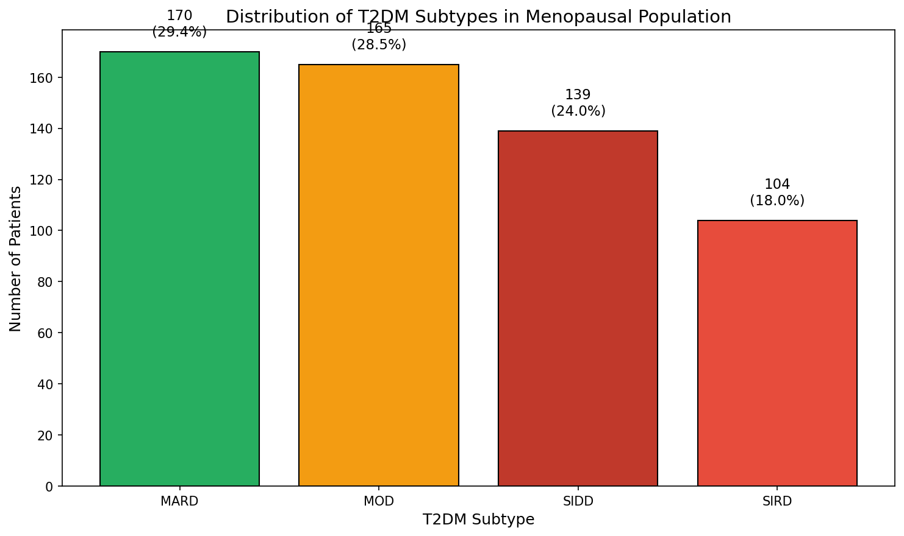

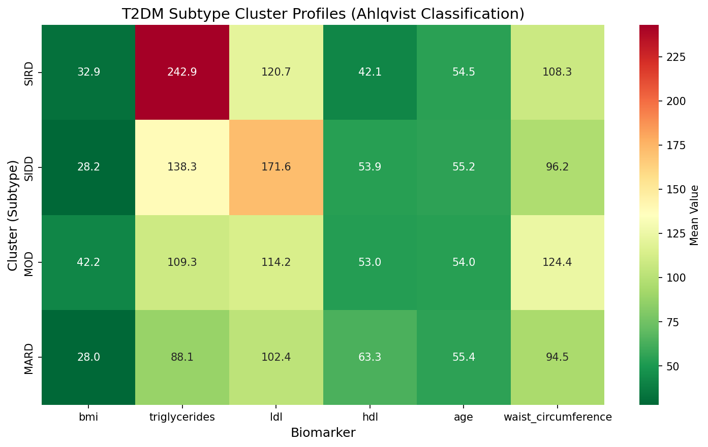

### 4.6 Preprocessing and Leakage Validation Results

Label-consistency checking showed 94.1 percent agreement between DIQ010-derived labels and HbA1c-threshold labels, corresponding to 1,295 of 1,376 records. The remaining 5.9 percent reflected discordance between self-report and a single biochemical measurement. Outlier flagging identified 35 of 1,376 records, or 2.5 percent, with at least one clinical plausibility flag; these records were retained rather than deleted.

The leakage validation pipeline confirmed that diagnostic glycemic variables were absent from the classifier and clustering feature lists. It also confirmed that no retained non-diagnostic feature exceeded the proxy-leakage threshold of absolute r greater than 0.95 with the HbA1c diagnostic threshold. The highest observed proxy correlation was triglycerides at r = 0.3241, which remained far below the leakage threshold.

This result supports the central methodological claim of the study. DIANA's discrimination was not produced by using HbA1c or fasting blood sugar as predictors. Instead, the model estimated at-risk status from metabolic, anthropometric, and lifestyle variables that were separate from the diagnostic markers used in label construction.

### 4.7 Functional Testing Results

Functional testing verified the implemented system across backend, ML service, and frontend layers. The backend test suite passed in the current verification run and covered configuration, caching behavior, API request handling, access-control checks, ML integration, service logic, PDF generation, and data persistence. Assessment tests verified critical clinical guardrails, including target age-boundary enforcement, missing waist-circumference handling for ML imputation, out-of-range HbA1c warning behavior, and successful assessment creation.

The ML service test suite passed with 275 tests. These tests covered clustering behavior, leakage prevention, feature parity, prediction behavior, service access, authentication checks, drift scheduling, SHAP background behavior, threshold optimization, production API-key configuration failure behavior, and clinical scenario validation. The frontend unit and contract coverage suite passed with 232 tests. The current frontend coverage run met the configured coverage gates, with 71.26 percent line and statement coverage, 60.55 percent branch coverage, and 44.24 percent function coverage.

**Table 4.10. Functional Validation Summary**

| Validation Area | Evidence Reviewed | Status |
|---|---|---|
| Backend services | Authentication, access control, assessment creation, clinical guardrails, persistence, and PDF report generation | Passed |
| Assessment guardrails | Age-boundary enforcement, missing waist handling, HbA1c warning propagation, and successful assessment creation | Passed |
| ML service | 275 tests covering prediction, leakage prevention, clustering, SHAP, drift monitoring, threshold optimization, production API-key configuration failure behavior, and clinical scenarios | Passed |
| Frontend workflow | 232 unit and contract tests covering authentication, forms, result display, service contracts, and UI components | Passed |
| Frontend coverage | Coverage met the configured project policy: 71.26% lines/statements, 60.55% branches, and 44.24% functions | Passed |
| Cache integration tests | Require the external cache service to be available | Environment dependent |

The function-coverage gate is lower than the statement and line gates because several interface modules contain many event-driven functions whose rendering paths are already exercised through broader component and contract tests. The 44.24 percent function result is therefore reported as a passed coverage policy, not as evidence that every interactive UI branch has been exhaustively tested.

The remaining technical-readiness gaps therefore concern environment-dependent cache integration evidence, formal UAT, broader scored expert-panel review, accessibility audit, and production load testing rather than the frontend coverage gate.

### 4.8 UI Workflow Integration

The implemented DIANA workflow begins with user authentication and proceeds to dashboard review, biomarker data entry, prediction generation, result interpretation, trend visualization, and report export. The dashboard presents recent assessments and risk summaries. The default thesis workflow uses the locked screening model and collects age, height, weight-derived BMI, lipid biomarkers, optional waist circumference, lifestyle variables, and notes. Alternate model variants are outside the default evaluation workflow.

After form submission, the backend validates the request, sends the relevant assessment payload to the ML service, receives prediction and lineage metadata, stores the assessment, refreshes affected cached views when applicable, and returns the result to the interface. The result display presents risk probability, risk category, subtype context when available, model version, dataset lineage, biomarker snapshot, clinical guardrails, and next-step guidance. SHAP explainability is supported through a separate explanation workflow when outputs are available; the user-facing result modal screenshot in this section does not display fabricated SHAP values.

The result interface presents outputs in a layered hierarchy. The first layer shows binary screening classification through risk score, risk category, and threshold context. The second layer shows metabolic subtype context only when subtype output is available. The third layer presents clinical guardrails and actionable follow-up text. Normal predictions receive neutral subtype wording so that disease-pattern labels are not assigned to users classified as normal.

The interface screenshots in Figures 4.3 through 4.6 are local evidence captures documented in `docs/07-research/thesis-drafts/screenshots/README.md`. The manifest records the capture date, local frontend and backend endpoints, 1440 x 1000 PNG dimensions, source views, and SHA-256 hashes. They are used only as interface-evidence figures; no synthetic SHAP screenshot is included in the clean draft.

**Figure 4.3. Main Dashboard Interface**

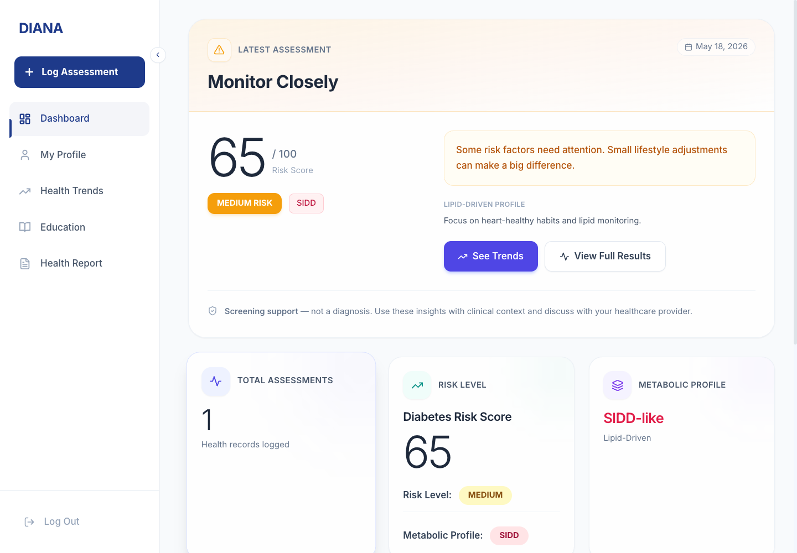

**Figure 4.4. Assessment Form With Real-Time Validation**

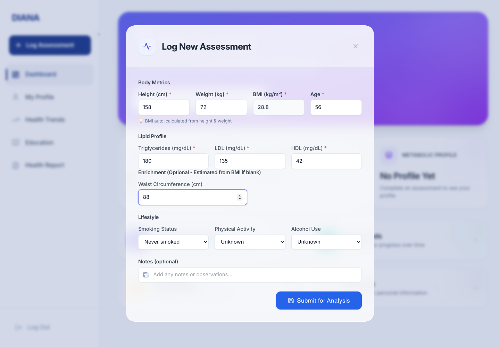

**Figure 4.5. Assessment Result Modal With Clinical Interpretation**

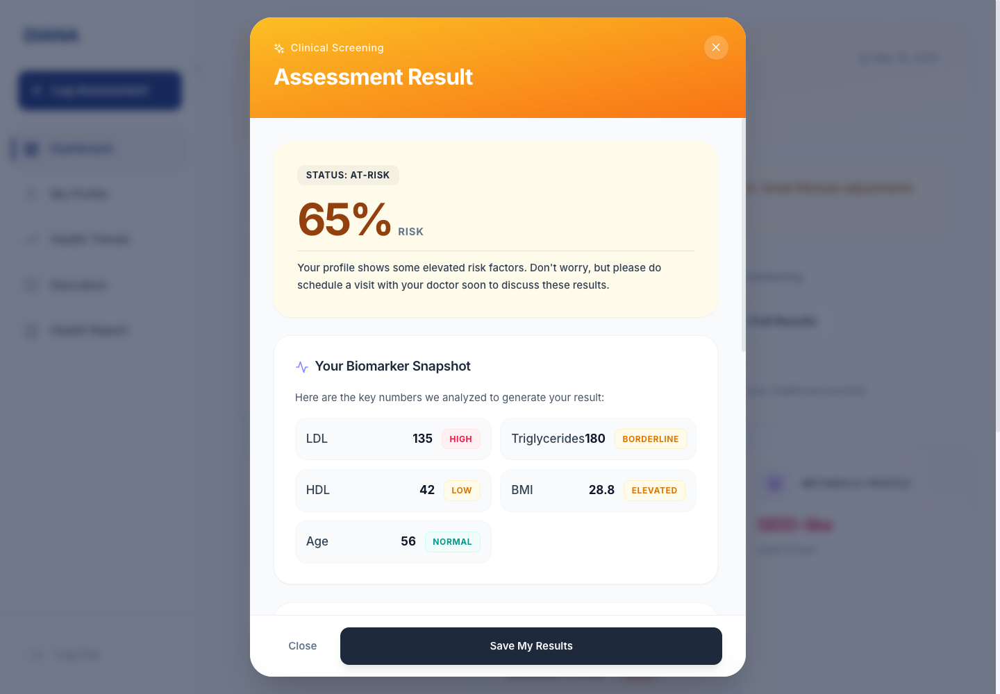

The screenshot was captured from the running application using a completed assessment. It shows the current result modal and does not include synthetic SHAP values.

**Figure 4.6. Personal Trends Visualization**

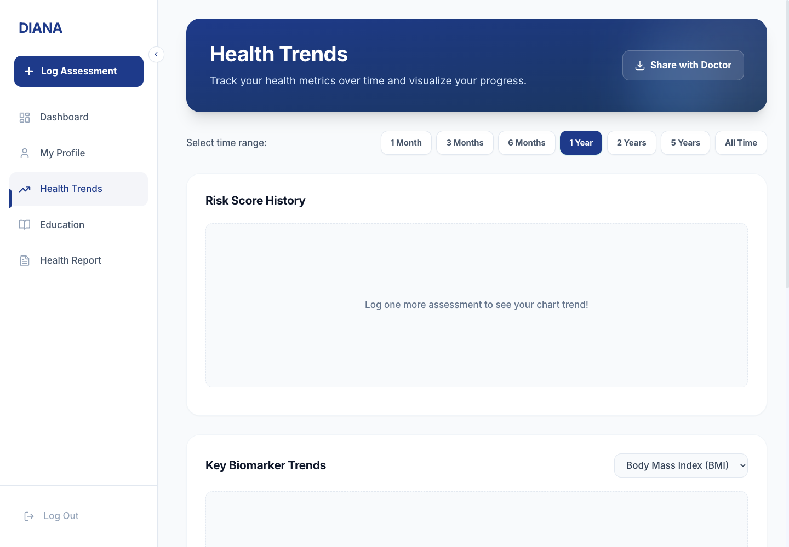

The screenshot shows the current trends view after assessment creation; multi-point trend lines require additional historical assessments.

This workflow demonstrates that the model was not evaluated only as an isolated algorithm. It was integrated into a functioning screening-support application with authentication, persistence, visualization, explainability, trends, and report-generation capabilities.

### 4.9 System Performance and Deployment Readiness

The system architecture separates routine application operations from ML inference and explanation generation. The backend manages authentication, validation, persistence, caching, and response orchestration, while the ML service performs prediction, clustering, explainability, and monitoring-related functions. This separation reduces the risk that computationally heavier ML operations will degrade ordinary application interactions.

Pure model inference benchmarks indicate that Logistic Regression averages approximately 0.62 ms per prediction in the benchmarked environment, while Random Forest averages approximately 13.09 ms and LightGBM averages approximately 0.25 ms. The available benchmark measurements also document approximate service interaction and explanation-related overhead of 205 ms in the measured environment. These measurements support interactive feasibility, but they do not replace production load testing.

Production performance claims therefore remain qualified. Concurrent load testing with authenticated users, database writes, cache refreshes, ML requests, and frontend rendering has not yet been completed; for this reason, production-scale readiness is not claimed.

Deployment readiness was first assessed at the configuration level and then checked against the live deployment on 2026-05-30. The live external and operator-level audit used the backend host `diana-v2.duckdns.org`, the configured frontend origin `https://diana-v2.vercel.app`, and the deployed VPS configuration. It verified effective public port exposure, HTTPS certificate behavior, CORS allow-list behavior, backend-to-ML proxy behavior, operational health responses, host firewall posture, database TLS behavior, and ML API-key enforcement. Sensitive operational details such as usernames, private paths, secret values, tokens, and connection strings are intentionally excluded from the manuscript evidence.

**Table 4.11. Live and Configuration-Level Deployment Readiness Summary**

| Verification Item | Evidence Reviewed | Status |
|---|---|---|
| Public ingress and host exposure | DNS resolved to `143.198.222.21`; ports 80 and 443 accepted connections, while 22, 8080, 5000, 5001, and 5432 timed out from external audit machines; operator audit showed UFW active with default incoming deny and SSH allowed only from the Tailscale address range | Live external exposure and host firewall checks passed |
| TLS certificate and HTTPS behavior | HTTP returned a redirect to HTTPS; HTTPS presented a Let's Encrypt certificate for `diana-v2.duckdns.org` valid from 2026-05-09 to 2026-08-07, with certificate verification returning OK | Live TLS check passed |
| Security headers | Live HTTPS responses included HSTS, content-type protection, frame protection, referrer policy, permissions policy, and content security policy headers | Live header check passed |
| Production CORS behavior | Preflight from `https://diana-v2.vercel.app` returned 204 with the expected allow-origin and credential headers; lookalike or unrelated origins returned 403 | Live CORS check passed |
| Backend and database health | Authenticated operations health returned healthy backend, database ping, and ML health statuses; public PostgreSQL port 5432 was not reachable externally; the backend database DSN used `sslmode=require`, and a redacted `psql` connection-info check against the same DSN reported TLS 1.3 with `TLS_AES_256_GCM_SHA384` | Live health, database exposure, and database TLS checks passed |
| ML exposure and API-key enforcement | Public `/ml` and `/predict` paths returned 404; unauthenticated `/api/v1/ml/health` returned 401; backend and ML containers were configured with `ML_API_KEY`; direct internal ML no-key and fake-key calls to `/insights/metrics` returned 401; authenticated backend `/api/v1/ml/insights/metrics` returned 200 | Live proxy-boundary and ML API-key enforcement checks passed |
| Runtime secret handling | Repository configuration injects database credentials, JWT secret, and ML API key through runtime environment variables rather than committed literals | Configuration evidence present |

This audit upgrades the earlier configuration-only deployment review for public exposure, TLS, production CORS, ML proxy behavior, database TLS, host firewall posture, and ML API-key enforcement. It does not replace production load testing, penetration testing, or a formal clinical security assessment.

### 4.10 User Acceptance Testing Status and Doctor Expert Review

The community UAT protocol was defined but had not yet been executed at the time of manuscript preparation. As a result, Chapter 4 does not report SUS scores, task-success rates, completion times, or community-user quotations. These measures remain part of the planned evaluation protocol described in Chapter 3 and will require formal participant recruitment, consent, and data collection before they can be interpreted as empirical findings.

The completed doctor expert review was conducted as a hands-on prototype evaluation. The physician reviewer used DIANA, inspected the assessment workflow, reviewed the displayed features and risk-output presentation, and discussed the basis for the subtype module. Because the review was documented qualitatively and the available evidence identifies the reviewer only as a licensed physician, the findings are treated as face-validity feedback rather than as a scored expert evaluation. Overall qualitative feedback was positive: the features were considered useful for a screening-support prototype, and no major objection was raised to the assessment workflow or risk-output presentation. The main clinical question concerned the weighted K-Means subtype module, specifically why particular features were assigned higher weights and how those weights were used during cluster assignment.

**Table 4.12. Doctor Expert-Review Summary**

| Review Area | Expert Feedback | Manuscript Response |
|---|---|---|
| Feature set and workflow | The implemented features and assessment flow were considered acceptable and useful for screening-support use. | Core workflow retained and described as screening support rather than diagnosis. |
| Feature weighting | The main clarification concerned why features such as LDL, triglycerides, waist circumference, BMI, HDL, and age were weighted differently in clustering. | Section 3.10 now clarifies that weights are literature-informed heuristic design parameters used for standardized geometric distance, not medically validated clinical weights. |
| Citation support | Additional support was requested for the rationale behind weighted features. | The manuscript strengthens the link to metabolic-syndrome, lipid-accumulation, and data-driven diabetes-subgroup literature. |
| Clinical validity boundary | The review supported face validity and perceived usefulness but did not constitute external clinical validation. | The limitations and synthesis sections explicitly state that broader clinical validation, sensitivity analysis, and prospective evaluation remain required. |

Internal walkthroughs also identified areas for improvement, including visibility of medical-history fields, SHAP legend clarity, mobile assessment-form usability, and explanation of Ahlqvist-inspired proxy subtype labels. These observations are treated as internal review notes rather than formal community UAT results.

### 4.11 UI/UX Design and Accessibility Readiness

The interface applies visual organization principles to support comprehension of clinical information. Related fields are grouped together, risk categories use consistent visual styling, and charts present longitudinal patterns through continuous visual trends. Risk status is communicated through both color and text labels to reduce dependence on color alone.

The application includes accessibility-oriented features such as accessibility labels, keyboard-accessible controls, responsive layouts, visible status text, and device-aware rendering, aligned with WCAG 2.2 accessibility guidance where applicable (World Wide Web Consortium, 2023). Higher-capability devices receive full animations and richer chart behavior, while lower-capability devices receive reduced visual complexity. However, formal automated contrast testing and assistive-technology testing have not yet been completed. Therefore, this section is framed as accessibility readiness rather than WCAG conformance certification.

**Table 4.13. Accessibility and UI Readiness Items**

| Area | Current Evidence | Status |
|---|---|---|
| Color and text risk labels | Risk states use both visual color and text labels | Implemented |
| Keyboard-accessible controls | Core interactive controls support keyboard interaction | Implemented; formal audit pending |
| Accessibility labels and status text | Alerts, dialogs, and navigation controls include accessibility-oriented labels | Implemented; formal audit pending |
| Responsive layout | Responsive design rules support mobile, tablet, laptop, and desktop layouts | Implemented |
| Device-aware rendering | Lower-capability devices receive reduced visual complexity | Implemented |
| Contrast ratios | Automated contrast-test result not yet collected | Pending formal accessibility testing |
| Assistive-technology testing | Screen-reader and assistive workflow testing not yet completed | Pending formal accessibility testing |

### 4.12 External Benchmark Comparison

DIANA was compared with reconstructed screening baselines under the same NHANES cohort, binary outcome definition, and LOGO validation framework where sufficient variables were available. The FINDRISC-like upper-bound comparator achieved the highest AUC at 0.849, but this implementation used an elevated-glucose or HbA1c proxy for the history-of-high-blood-glucose component. This makes the FINDRISC-like result an optimistic, partially circular upper-bound comparator rather than a faithful non-circular validation.

**Table 4.14. Internal Benchmark Reconstruction Results**

| Tool | AUC-ROC | Sensitivity | Specificity | Interpretation |
|---|---:|---:|---:|---|
| FINDRISC-like upper-bound | 0.849 (±0.035) | 0.842 | 0.703 | Optimistic comparator using glycemic proxy |
| DIANA | 0.737 [0.710-0.763] | 0.748 | 0.590 | Non-circular and optimized for NHANES postmenopausal cohort |
| OmniRisk (Approximated) | 0.688 (±0.025) | 0.926 | 0.289 | Very high sensitivity with low specificity |
| Simple Clinical Model | 0.677 (±0.021) | 0.944 | 0.222 | Minimal feature model with low specificity |
| ADA Risk Test reconstruction | 0.597 (±0.033) | 0.931 | 0.193 | Limited discrimination under this reconstruction |

Compared with OmniRisk, the Simple Clinical model, and the ADA Risk Test reconstruction, DIANA showed a more balanced sensitivity-specificity profile. Several comparator tools achieved high sensitivity but very low specificity, which would increase false-positive referrals in a screening workflow. These benchmark results should be interpreted as internal contextual comparisons, not as proof of superiority over published tools. Some published tools require variables unavailable in NHANES or require approximation. Therefore, the benchmark analysis supports contextual interpretation but does not replace external head-to-head validation.

### 4.13 Study Limitations

Several limitations constrain interpretation of the study. First, all model development and validation were conducted within NHANES. Although LOGO validation provides evidence of temporal robustness across survey cycles, it does not replace validation in an independent clinical cohort or prospective deployment setting. A related transferability limitation is that the planned community users are Filipino menopausal or postmenopausal women, while the model was trained on a U.S. NHANES analytic cohort. Ethnicity-related differences in diabetes risk, body composition, care access, laboratory context, and cardiometabolic prevalence may affect calibration and decision thresholds in the intended user population. Second, the reference label is operational rather than a definitive diagnostic gold standard because it combines self-reported physician diagnosis with single-measurement glycemic thresholds.

Third, the subtype module uses weighted K-Means clustering and Ahlqvist-inspired labels as heuristic descriptions rather than validated biological subtypes. True biological subtype validation would require autoimmune markers, beta-cell function markers, insulin-resistance estimates, longitudinal outcomes, and independent clinical datasets. Fourth, deployment guardrails such as waist-circumference imputation and metabolic syndrome risk floors are engineered safeguards requiring ablation, calibration, and clinical review before being treated as validated clinical rules.

Fifth, formal community UAT, accessibility testing, and production load testing remain incomplete. The completed doctor review provides initial qualitative expert face-validity support, but it did not collect formal scored ratings and does not replace external clinical validation. Sixth, although the live deployment audit verified public exposure limits, TLS, CORS, host firewall posture, database TLS behavior, and ML API-key enforcement, the interface navigation and browser-token handling still reflect prototype-stage implementation choices that would require further security and usability hardening before clinical production use. For these reasons, DIANA is presented as a screening-support prototype with promising internal validation and initial expert feedback, not as a clinically validated diagnostic system.

### 4.14 Chapter Synthesis

The results demonstrate that DIANA provides a technically implemented and methodologically conservative screening-support workflow for diabetes risk stratification among postmenopausal women. Its strongest methodological contribution is the separation of diagnostic label construction from predictor inputs, supported by an automated leakage validation pipeline. The final Logistic Regression model achieved acceptable discrimination under conservative temporal validation while preserving interpretability and deployment simplicity.

The weighted clustering module and SHAP explainability layer add clinical context to the binary risk output, but both require careful interpretation. The subtype labels are heuristic and hypothesis-generating, and SHAP values support transparency rather than causal explanation. The completed doctor review supported the perceived usefulness of the feature set and workflow while identifying the need to state the theoretical and literature-informed basis of the clustering weights more clearly. Overall, DIANA should be understood as a triage-support system that can help identify users who may benefit from confirmatory testing and clinical review. Future work should prioritize external validation, prospective evaluation, formal UAT, broader expert clinical review, accessibility assessment, production load testing, and recalibration in the intended Filipino deployment population.

## References

Ahlqvist, E., Storm, P., Karajamaki, A., Martinell, M., Dorkhan, M., Carlsson, A., ... & Groop, L. (2018). Novel subgroups of adult-onset diabetes and their association with outcomes: A data-driven cluster analysis of six variables. *The Lancet Diabetes & Endocrinology*, 6(5), 361-369. https://doi.org/10.1016/S2213-8587(18)30051-2

Alberti, K. G. M. M., Eckel, R. H., Grundy, S. M., Zimmet, P. Z., Cleeman, J. I., Donato, K. A., ... & Smith, S. C. (2009). Harmonizing the metabolic syndrome. *Circulation*, 120(16), 1640-1645. https://doi.org/10.1161/CIRCULATIONAHA.109.192644

American Diabetes Association Professional Practice Committee for Diabetes. (2026). 2. Diagnosis and classification of diabetes: Standards of Care in Diabetes--2026. *Diabetes Care, 49*(Supplement 1), S27-S49. https://doi.org/10.2337/dc26-S002

Bangor, A., Kortum, P. T., & Miller, J. T. (2008). An empirical evaluation of the System Usability Scale. *International Journal of Human-Computer Interaction*, 24(6), 574-594. https://doi.org/10.1080/10447310802205776

Breiman, L. (2001). Random forests. *Machine Learning*, 45, 5-32. https://doi.org/10.1023/A:1010933404324

Brier, G. W. (1950). Verification of forecasts expressed in terms of probability. *Monthly Weather Review*, 78(1), 1-3. https://doi.org/10.1175/1520-0493(1950)078%3C0001:VOFEIT%3E2.0.CO;2

Brooke, J. (1996). SUS: A quick and dirty usability scale. In P. W. Jordan, B. Thomas, B. A. Weerdmeester, & I. L. McClelland (Eds.), *Usability Evaluation in Industry* (pp. 189-194). Taylor & Francis.

Calinski, T., & Harabasz, J. (1974). A dendrite method for cluster analysis. *Communications in Statistics - Theory and Methods*, 3(1), 1-27. https://doi.org/10.1080/03610927408827101

Centers for Disease Control and Prevention, National Center for Health Statistics. (2024a). *NHANES questionnaires, datasets, and related documentation: August 2021-August 2023*. https://wwwn.cdc.gov/nchs/nhanes/continuousnhanes/default.aspx?Cycle=2021-2023

Centers for Disease Control and Prevention, National Center for Health Statistics. (2024b). *Brief overview of sample design, nonresponse bias assessment, and analytic guidelines for NHANES August 2021-August 2023*. https://wwwn.cdc.gov/nchs/nhanes/continuousnhanes/OverviewBrief.aspx?Cycle=2021-2023

Centers for Disease Control and Prevention, National Center for Health Statistics. (2024c). *Reproductive Health Questionnaire: Data documentation, codebook, and frequencies: RHQ_L, NHANES August 2021-August 2023*. https://wwwn.cdc.gov/Nchs/Data/Nhanes/Public/2021/DataFiles/RHQ_L.htm

Chen, T., & Guestrin, C. (2016). XGBoost: A scalable tree boosting system. *Proceedings of the 22nd ACM SIGKDD International Conference on Knowledge Discovery and Data Mining*, 785-794. https://doi.org/10.1145/2939672.2939785

Davies, D. L., & Bouldin, D. W. (1979). A cluster separation measure. *IEEE Transactions on Pattern Analysis and Machine Intelligence*, PAMI-1(2), 224-227. https://doi.org/10.1109/TPAMI.1979.4766909

Dennis, J. M., Shields, B. M., Henley, W. E., Jones, A. G., & Hattersley, A. T. (2019). Disease progression and treatment response in data-driven subgroups of type 2 diabetes compared with models based on simple clinical features: An analysis using clinical trial data. *The Lancet Diabetes & Endocrinology*, 7(6), 442-451. https://doi.org/10.1016/S2213-8587(19)30087-7

Efron, B., & Tibshirani, R. J. (1993). *An Introduction to the Bootstrap*. Chapman & Hall/CRC.

Hosmer, D. W., & Lemeshow, S. (1980). Goodness of fit tests for the multiple logistic regression model. *Communications in Statistics - Theory and Methods*, 9(10), 1043-1069. https://doi.org/10.1080/03610928008827941

International Diabetes Federation. (2006). *The IDF consensus worldwide definition of the metabolic syndrome*. https://idf.org/about-diabetes/resources/idf-consensus-worldwide-definition-of-the-metabolic-syndrome/

International Organization for Standardization. (2011). *ISO/IEC 25010:2011 Systems and software engineering - Systems and software Quality Requirements and Evaluation (SQuaRE) - System and software quality models*. https://www.iso.org/standard/35733.html

Jones, M., Bradley, J., & Sakimura, N. (2015). *JSON Web Token (JWT)* (RFC 7519). Internet Engineering Task Force. https://www.rfc-editor.org/rfc/rfc7519

Kahn, H. S. (2005). The "lipid accumulation product" performs better than the body mass index for recognizing cardiovascular risk: A population-based comparison. *BMC Cardiovascular Disorders, 5*, 26. https://doi.org/10.1186/1471-2261-5-26

Ke, G., Meng, Q., Finley, T., Wang, T., Chen, W., Ma, W., Ye, Q., & Liu, T.-Y. (2017). LightGBM: A highly efficient gradient boosting decision tree. *Advances in Neural Information Processing Systems*, 30. https://papers.nips.cc/paper/6907-lightgbm-a-highly-efficient-gradient-boosting-decision-tree

Lumley, T. (2010). *Complex Surveys: A Guide to Analysis Using R*. John Wiley & Sons.

Lundberg, S. M., & Lee, S. I. (2017). A unified approach to interpreting model predictions. *Advances in Neural Information Processing Systems*, 30. https://papers.neurips.cc/paper/7062-a-unified-approach-to-interpreting-model-predictions

Luque, A., Carrasco, A., Martin, A., & de las Heras, A. (2019). The impact of class imbalance in classification performance metrics based on the binary confusion matrix. *Pattern Recognition*, 91, 216-231. https://doi.org/10.1016/j.patcog.2019.02.023

MacQueen, J. (1967). Some methods for classification and analysis of multivariate observations. In *Proceedings of the Fifth Berkeley Symposium on Mathematical Statistics and Probability* (Vol. 1, pp. 281-297).

Powers, D. M. W. (2011). Evaluation: From precision, recall and F-measure to ROC, informedness, markedness and correlation. *Journal of Machine Learning Technologies*, 2(1), 37-63.

Provos, N., & Mazieres, D. (1999). A future-adaptable password scheme. In *Proceedings of the 1999 USENIX Annual Technical Conference*. https://www.usenix.org/conference/1999-usenix-annual-technical-conference/future-adaptable-password-scheme

Rousseeuw, P. J. (1987). Silhouettes: A graphical aid to the interpretation and validation of cluster analysis. *Journal of Computational and Applied Mathematics*, 20, 53-65. https://doi.org/10.1016/0377-0427(87)90125-7

Shreffler, J., & Huecker, M. R. (2023). Diagnostic testing accuracy: Sensitivity, specificity, predictive values and likelihood ratios. In *StatPearls*. StatPearls Publishing. https://www.ncbi.nlm.nih.gov/books/NBK557491/

Vabalas, A., Gowen, E., Poliakoff, E., & Casson, A. J. (2019). Machine learning algorithm validation with a limited sample size. *PLOS ONE*, 14(11), e0224365. https://doi.org/10.1371/journal.pone.0224365

Van Calster, B., McLernon, D. J., van Smeden, M., Wynants, L., Steyerberg, E. W., Bossuyt, P., Collins, G. S., Macaskill, P., Moons, K. G. M., & Vickers, A. J. (2019). Calibration: The Achilles heel of predictive analytics. *BMC Medicine*, 17, 230. https://doi.org/10.1186/s12916-019-1466-7

Wang, Y., Wang, X., & Zeng, L. (2024). Lipid Accumulation Product as a Predictor of Prediabetes and Diabetes: Insights From NHANES Data (1999-2018). *Journal of Diabetes Research, 2024*, Article 2874122. https://doi.org/10.1155/2024/2874122

World Health Organization. (2021). *Ethics and governance of artificial intelligence for health: WHO guidance*. https://www.who.int/publications/i/item/9789240029200

World Wide Web Consortium. (2023). *Web Content Accessibility Guidelines (WCAG) 2.2*. https://www.w3.org/TR/WCAG22/

Youden, W. J. (1950). Index for rating diagnostic tests. *Cancer*, 3(1), 32-35. https://doi.org/10.1002/1097-0142(1950)3:1%3C32::AID-CNCR2820030106%3E3.0.CO;2-3
