# Chapter 3: Methodology

## 3.1 Research Design

This study used a quantitative, system-development design to develop and evaluate DIANA, a web-based prototype for diabetes-related screening support among women aged 45 to 60 who reported no menstrual period in the prior 12 months. This is the exact model-development population: the implemented RHQ031 filter identifies a no-period or amenorrheic cohort but does not by itself confirm natural postmenopause. The quantitative component modeled a contemporaneous operational diabetes-status label from National Health and Nutrition Examination Survey (NHANES) records; it did not model future incident Type 2 Diabetes or a time-to-event outcome. The system component integrated that model into a web application that presents a screening score, metabolic-profile context, lineage, and explanation outputs.

The development-evidence boundary is narrower than the current application gate. The onboarding interface can record premenopausal, perimenopausal, postmenopausal, or surgical status, but the assessment request does not transmit reproductive status and the backend enforces age 45 to 60 rather than the no-period criterion. The current prototype can therefore score users outside the development cohort. Such outputs are out of scope for the reported evidence unless the serving gate is enforced or those groups are validated separately.

The methodological design was structured around two central requirements. First, the classifier had to estimate membership in the operational normal-versus-at-risk label without using the glycemic measurements that define that label as predictors. DIQ010 and HbA1c were used to construct the label. Fasting blood sugar (FBS) availability was only a fasting-subsample eligibility gate and a descriptive clinical field; neither HbA1c nor FBS was a screening-model input. Second, outputs had to be presented as screening support rather than diagnosis. The interface uses the product terms “risk score” and “risk category,” but scientifically the score estimates the probability of the contemporaneous hybrid label, not a future disease probability. It requires confirmatory testing and clinical interpretation, consistent with health-AI governance principles emphasizing oversight and appropriate human use (World Health Organization, 2021).

DIANA is therefore not positioned as a diagnostic device or an incident-risk model. A screen-positive result means that the profile was classified as resembling records with the current hybrid at-risk label, which includes both HbA1c-defined dysglycemia and respondents who reported an earlier professional diabetes or borderline-diabetes diagnosis. DIQ010 excludes diabetes limited to pregnancy but does not identify diabetes type. The result may support follow-up discussion or confirmatory testing, but it does not diagnose Type 2 Diabetes, predict a future onset date, or determine treatment.

### Methodological Phases

The methodology was organized into eight sequential phases. Phase 1 covered data acquisition and biomarker preparation, including NHANES file acquisition, cohort filtering, variable mapping, reference-label construction, missing-data handling, and clinical plausibility checks. Phase 2 audited feature relevance using Information Gain and entropy while enforcing diagnostic-leakage prevention. Phase 3 covered candidate-model development under nested survey-cycle-blocked validation. Phase 4 defined model testing, threshold optimization, calibration auditing, and benchmark-comparison procedures. Phase 5 implemented cluster-based profile identification for records with the operational at-risk label.

Phase 6 covered web application integration and visualization development, including frontend assessment workflows, backend API orchestration, ML-service integration, explainability output handling, trend visualization, and report-generation support. Phase 7 covered system testing and technical validation across backend, ML, frontend, security, deployment-readiness, and accessibility-readiness components. Phase 8 defined the planned community user acceptance testing (UAT) protocol and documented author-reported qualitative doctor feedback. The community protocol had not yet been executed at manuscript preparation, and no primary dated doctor-review artifact was available in the repository. Phase 8 therefore contributes a protocol plus anecdotal development feedback, not empirical usability or external clinical-validation evidence.

**Figure 3.1. Eight-Phase Methodological Framework**

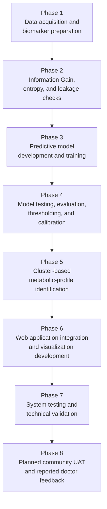

Figure 3.1 summarizes the eight methodological phases. Phase 1 begins at Section 3.2; Phase 2 at 3.7; Phase 3 at 3.8; Phase 4 begins in the validation part of 3.8 and continues through 3.9; Phase 5 begins at 3.10; Phase 6 at 3.11; Phase 7 at 3.13; and Phase 8 at 3.14. Table 3.1 maps these phases to their evidence sections.

**Table 3.1. Methodological Phase-to-Section Alignment**

| Phase | Primary Methodology Section | Corresponding Results or Evidence Section |
|---|---|---|
| Phase 1: Data acquisition and biomarker preparation | 3.2-3.6 | 4.6 |
| Phase 2: Information Gain, entropy, and leakage checks | 3.7 | 4.2 and 4.6 |
| Phase 3: Predictive model development and training | 3.8 | 4.1 and 4.3 |
| Phase 4: Model testing, evaluation, thresholding, and calibration | 3.8-3.9 | 4.1, 4.3, 4.4, and 4.12 |
| Phase 5: Cluster-based metabolic-profile identification | 3.10 | 4.5 |
| Phase 6: Web application integration and visualization development | 3.11-3.12 | 4.8 |
| Phase 7: System testing and technical validation | 3.13 | 4.7, 4.9, and 4.11 |
| Phase 8: Planned community UAT and reported doctor feedback | 3.14 | 4.10 |

Section 3.16 provides the cross-cutting data analysis procedure used to summarize the quantitative model evidence, cluster evidence, benchmark evidence, and system-evaluation evidence reported in Chapter 4.

Chapter 3 contains six design figures: the phase framework, cohort pipeline, nested leave-one-group-out (LOGO) loop, two-stage screening/profile workflow, four-tier architecture, and assessment sequence. Quantitative results and interface captures appear in Chapter 4.

**Figure 3.2. NHANES Dataset Selection and Cohort Filtering Pipeline**

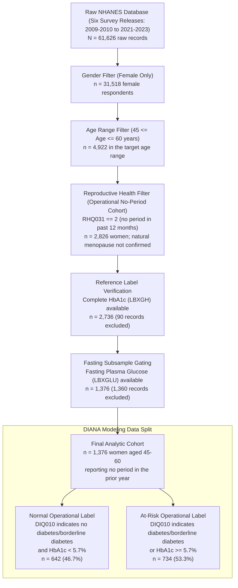

Figure 3.2 summarizes both record attrition and the final operational-label split. The exact observed attrition was 61,626 to 31,518 to 4,922 to 2,826 to 2,736 to 1,376 records. FBS availability was used only as the fasting-subsample linkage gate; it was not a second outcome-label rule and was not used as a predictor. RHQ031 established absence of menstruation in the prior year but not its cause.

**Phase 1 Start: Data Acquisition and Biomarker Preparation.** Phase 1 begins with the study locale and NHANES data source, then proceeds through population definition, data-gathering procedures, reference-label construction, missing-data handling, and clinical plausibility review.

## 3.2 Phase 1: Research Locale and Data Source

The primary data locale for model development was the NHANES public data repository maintained by the Centers for Disease Control and Prevention. NHANES was selected because it provides standardized demographic, laboratory, examination, and questionnaire data across repeated survey releases (Centers for Disease Control and Prevention, National Center for Health Statistics [CDC/NCHS], 2024a). The modeling dataset used six NHANES releases: 2009-2010, 2011-2012, 2013-2014, 2015-2016, 2017-2018, and 2021-2023. The 2019-2020 cycle was excluded because NHANES field operations were disrupted by the COVID-19 pandemic. The 2021-2023 files were treated as the August 2021-August 2023 post-pandemic release rather than as a standard biennial NHANES release (CDC/NCHS, 2024b).

Table 3.2 identifies each included release, its file suffix, and its role as a survey-cycle validation group.

**Table 3.2. NHANES Survey Releases Included in the Study**

| Release | File Suffix | Sample Design | Methodological Use |
|---|---|---|---|
| 2009-2010 | `_F` | Standard 2-year release | Earliest post-2010 glycemic-guideline period used in this study |
| 2011-2012 | `_G` | Standard 2-year release | Survey-cycle validation group |
| 2013-2014 | `_H` | Standard 2-year release | Survey-cycle validation group |
| 2015-2016 | `_I` | Standard 2-year release | Survey-cycle validation group |
| 2017-2018 | `_J` | Standard 2-year release | Pre-pandemic survey-cycle group |
| 2021-2023 | `_L` | August 2021-August 2023 post-pandemic release | Most recent available release after pandemic suspension |

For the planned community UAT, the intended recruitment locale consists of selected online communities of Filipino women discussing perimenopause and menopause-related health concerns and community-based recruitment in Nagcarlan, Laguna. The source protocol identifies the "Usapang Perimenopause at Menopause" Facebook interest group as one intended online recruitment setting. Nagcarlan, Laguna is included as a proposed local recruitment setting for usability evaluation only. Because recruitment and data collection had not been completed at manuscript preparation, these locations describe the protocol rather than an observed UAT sample.

## 3.3 Phase 1: Population of the Study

The study population consisted of distinct groups used for different research components. The primary modeling population was a secondary-data cohort of 1,376 NHANES female respondents aged 45 to 60 who reported no menstrual period during the prior 12 months and met the HbA1c and fasting-laboratory availability rules. The earlier draft called this cohort postmenopausal based only on RHQ031=2. A raw-file audit showed that this wording was too strong. WHO defines natural menopause retrospectively after 12 consecutive months without menstruation when there is no other obvious physiological or pathological cause and no clinical intervention; absent periods can also follow hysterectomy, medicines, or other treatment (World Health Organization, 2024). In the 2013-2014 through 2021-2023 cycles, where RHD043 separates reasons, 581 of 964 records self-reported menopause/change of life, 310 hysterectomy, 70 another reason, and 3 “don't know.” In 2009-2010 and 2011-2012, 402 of 412 records used a combined menopause/hysterectomy category, while 10 reported medical/treatment, other, or unknown reasons. Accordingly, the manuscript calls the full development set the **operational no-period cohort**. A menopause/change-of-life reason was reported for a subset, but it was not clinically adjudicated, and natural postmenopause cannot be inferred for every record from RHQ031 alone (CDC/NCHS, 2012, 2016, 2024c).

The multiclass operational reference distribution consisted of 642 normal, 457 pre-diabetic, and 277 diabetic labels. The deployed classifier combined the latter two into an application class called at risk, producing 734 positive and 642 normal records. This outcome is concurrent and hybrid: it reflects current HbA1c plus an “ever told” DIQ010 response, including already diagnosed respondents. The word “risk” is therefore application shorthand for screen-positive operational status, not prospective incidence.

Table 3.3 shows both the three-level reference distribution and its binary screening mapping.

**Table 3.3. Final Class Distribution**

| Operational Reference Class | Count | Proportion | Binary Screening Mapping |
|---|---:|---:|---|
| Normal | 642 | 46.7% | Normal |
| Pre-diabetic | 457 | 33.2% | At risk |
| Diabetic | 277 | 20.1% | At risk |
| Total | 1,376 | 100.0% | 642 normal; 734 at risk |

The planned second population is a community end-user sample to be recruited from selected Facebook interest groups and Nagcarlan, Laguna through non-probability purposive sampling. Eligibility criteria include self-identification as a perimenopausal, menopausal, or postmenopausal Filipino woman and willingness to participate in the evaluation. The protocol targets at least 30 participants, who would complete core DIANA tasks and answer a Likert-scale questionnaire on usability, clarity, interface understandability, and perceived usefulness for screening-risk awareness. This target is a planned sample size, not a completed cohort. Future UAT participants will not be used for model training or model validation.

The authors report that one licensed physician reviewed output plausibility, feature usefulness, explanation clarity, and workflow fit. The repository does not contain a dated review form, transcript, consent record, or credential-verification artifact. The feedback is therefore treated as anecdotal development input pending archival of primary evidence; it is not a scored expert-panel result, empirical face-validity study, or external clinical validation.

## 3.4 Phase 1: Data Gathering Tools and Procedures

This study used secondary data from NHANES. Raw Statistical Analysis System (SAS) transport (XPT) files were acquired from the CDC public repository and processed through an automated Python data pipeline using public NHANES documentation and codebooks as the source of file and variable definitions (CDC/NCHS, 2024a). The collected files included demographic records, glycohemoglobin records, fasting glucose records, total cholesterol records, HDL cholesterol records, triglyceride and LDL records, body-measurement records, blood-pressure records, reproductive-health questionnaire responses, diabetes questionnaire responses, smoking variables, physical-activity variables, alcohol-use variables, family-history variables, insulin records where available, and high-sensitivity CRP records where available.

The refreshed data pipeline used a cycle-specific active manifest containing 91 expected NHANES XPT files across the six included releases. The downloader verified that each active file was a valid transport file rather than a Hypertext Markup Language (HTML) error page or incomplete response by checking the XPT header, minimum file size, and metadata readability. A post-download verification run confirmed that all 91 active XPT files were present and readable. Thirty-one older raw XPT files from excluded 2003-2008 cycles were present in the raw-data folder but were ignored by the active manifest and were not used in the final analytic dataset.

Table 3.4 links the downloaded file groups to the variables used for cohort construction, label definition, prediction, and secondary description.

**Table 3.4. NHANES File Groups and Key Variables**

| File Group | Description | Key Variables Used |
|---|---|---|
| DEMO | Demographics | Age, sex, race/ethnicity, survey weights |
| GHB | Glycohemoglobin | HbA1c (LBXGH), used for reference-label construction |
| GLU | Fasting glucose | Fasting plasma glucose (LBXGLU), used for clinical interpretation |
| TCHOL | Total cholesterol | Total cholesterol (LBXTC) |
| HDL | HDL cholesterol | HDL cholesterol (LBDHDD) |
| TRIGLY | Triglycerides and LDL | Triglycerides (LBXTR or LBXTLG), calculated LDL cholesterol |
| BPX/BPXO | Blood pressure examination | Systolic and diastolic blood pressure where available |
| BMX | Body measurements | BMI (BMXBMI), waist circumference (BMXWAIST) |
| RHQ | Reproductive health | No-period filter using RHQ031; reason audit using RHD042/RHD043 |
| DIQ | Diabetes questionnaire | Self-reported diabetes or borderline diabetes (DIQ010) |
| SMQ | Smoking questionnaire | Smoking status derived from SMQ020 and SMQ040 |
| PAQ | Physical activity questionnaire | Activity categories derived from PAQ605, PAQ650, PAQ665, and 2021-2023 PAQ equivalents |
| ALQ | Alcohol questionnaire | Alcohol-use categories derived from ALQ101/ALQ120Q/ALQ120U/ALQ130 and 2017+ ALQ equivalents |
| MCQ | Medical conditions | Family history of diabetes where available |
| INS | Insulin | Fasting insulin, available only in subsamples |
| HSCRP | High-sensitivity CRP | Inflammation marker (LBXHSCRP) where available |

Raw NHANES records were linked through SEQN, the unique respondent identifier. After merging, the pipeline standardized NHANES variable codes into clinically interpretable feature names based on public NHANES codebooks. For example, LBXGH was mapped to HbA1c, LBXGLU to fasting blood sugar, BMXBMI to BMI, BMXWAIST to waist circumference, LBXTR or LBXTLG to triglycerides, LBDHDD to HDL cholesterol, LBDLDL to LDL cholesterol, and LBXHSCRP to high-sensitivity CRP. For the 2021-2023 release, blood-pressure variables were read from the BPXO_L file rather than the legacy BPX naming pattern used in earlier releases (CDC/NCHS, 2024a).

Lifestyle variables were derived through rule-based classification. Smoking status was derived from SMQ020 and SMQ040 and categorized as never, former, current, or unknown. Physical activity was derived from PAQ605, PAQ650, and PAQ665 in earlier releases and from the corresponding PAD790/PAD800/PAD810/PAD820/PAD680 fields in the 2021-2023 release; it was categorized as active, moderate, sedentary, or unknown. Alcohol use was derived from ALQ variables and categorized as never, light, moderate, heavy, or unknown. The physical-activity variable was treated as a simplified categorical proxy rather than as an exact measure of weekly guideline adherence because NHANES questionnaire responses do not consistently provide complete minute-level activity records for every respondent.

Table 3.5 provides the code-to-clinical-name crosswalk needed to trace the most important laboratory and examination fields through the pipeline.

**Table 3.5. Core Feature Mapping**

| NHANES Code | Clinical Name | Description |
|---|---|---|
| LBXGH | hba1c | Glycated hemoglobin (%) |
| LBXGLU | fbs | Fasting blood sugar (mg/dL) |
| BMXBMI | bmi | Body mass index (kg/m²) |
| BMXWAIST | waist_circumference | Waist circumference (cm) |
| LBXTR / LBXTLG | triglycerides | Triglycerides (mg/dL) |
| LBDHDD | hdl | HDL cholesterol (mg/dL) |
| LBDLDL | ldl | LDL cholesterol (mg/dL) |
| LBXHSCRP | crp | High-sensitivity C-reactive protein (mg/L) |
| BPXSY1 / BPXOSY1 | systolic_bp | Systolic blood pressure (mmHg), when used in secondary descriptions |
| BPXDI1 / BPXODI1 | diastolic_bp | Diastolic blood pressure (mmHg), when used in secondary descriptions |

## 3.5 Phase 1: Reference-Label Construction

Reference labels were constructed from DIQ010 and HbA1c. DIQ010 asks whether a respondent had ever been told by a doctor or health professional—other than during pregnancy—that she had diabetes, with response categories of yes, no, and borderline. A DIQ010 response of “yes” is therefore a **self-reported history of being told by a health professional** that diabetes was present; the study did not adjudicate that history against medical records. DIQ010 is **not** a reproductive-health question and supplies no evidence that the respondent is clinically postmenopausal. Reproductive-cohort eligibility came separately from RHQ031 and the later reason audit. DIQ010 also does not distinguish Type 1 from Type 2 Diabetes (CDC/NCHS, 2020). All 1,376 final records had a valid DIQ010 response of 1, 2, or 3; refused, unknown, or missing responses would otherwise have produced no questionnaire label unless the diabetic-range HbA1c override applied.

The hierarchy was implemented as follows. First, any HbA1c value of 6.5% or higher produced a diabetic label regardless of DIQ010. Otherwise, DIQ010=1 produced diabetic and DIQ010=3 produced pre-diabetic. For DIQ010=2, HbA1c from 5.7% to 6.4% produced pre-diabetic and HbA1c below 5.7% produced normal. The override reduced the chance that diabetic-range HbA1c would be labeled normal solely from self-report (American Diabetes Association Professional Practice Committee for Diabetes, 2026).

A direct source comparison mapped DIQ010 alone to normal, pre-diabetic, or diabetic and compared it with HbA1c-only categories. Agreement was 831 of 1,376 records (60.4%). The previously reported 94.1% value compared the final hybrid label—which already incorporates HbA1c—with HbA1c categories and was therefore circular; it is not used as independent agreement evidence. Discordance may reflect undiagnosed dysglycemia, recall, treatment, timing, or single-measurement variability. The final label is an operational concurrent status, not a diagnostic gold standard, confirmed Type 2 Diabetes outcome, or future incidence endpoint.

## 3.6 Phase 1: Data Preparation, Missing Data, and Outlier Handling

NHANES records contain missing values because of non-response, subsample designs, examination skip patterns, and variable availability across cycles. The defensible training pipeline used leakage-safe median imputation within the cross-validation workflow. Imputation parameters were fitted only on training folds and then applied to held-out folds, ensuring that validation or test information did not influence preprocessing. This includes BMI and waist circumference: across the six outer fits, the learned training-only BMI medians ranged from 29.60 to 29.81 kg/m² and waist medians from 99.8 to 100.1 cm. A persistent regression test also refitted the preprocessor on all 18 inner training splits and verified that each learned statistic equaled the corresponding inner-training median. After evaluation, the final full-cohort artifact learned BMI 29.80 kg/m² and waist 100.05 cm as its serving imputation medians. K-nearest-neighbor imputation was restricted to exploratory analysis and was not used for defensible model training because global imputation before cross-validation would allow the imputation procedure to see held-out fold information (Vabalas et al., 2019).

The final eligibility rule required complete HbA1c because HbA1c is used in reference-label construction. It also required fasting-laboratory availability, operationalized by the presence of fasting blood sugar in the NHANES fasting subsample, because the active DIANA model depends on measured fasting-subsample lipid predictors such as triglycerides and LDL cholesterol. FBS itself was not used as a model predictor and was not required as a second diagnostic label criterion; it functioned as the practical fasting-lab cohort gate. This produced a more complete fasting-lipid cohort than an HbA1c-only rule would provide, but it removed 1,360 of 2,736 otherwise eligible records (49.7%). Because retained and excluded records were not formally compared, fasting-subsample selection bias remains possible and “cleaner” must not be interpreted as more representative. The application accepts submitted lipid values but does not record or verify whether the user fasted, so runtime measurement conditions are not guaranteed to match the development subsample.

At inference time, the saved classifier remains a single preprocessing-and-model `Pipeline`. A missing waist value is passed as missing to that artifact, and the artifact applies the median learned during final training; it is not replaced by a post-training BMI-to-waist formula. The earlier serving rule $\widehat{WC}=3.33\times BMI$ was removed because it had not been fitted or evaluated inside nested validation and therefore created training-serving skew. BMI is required by the current assessment contract: a request without BMI is rejected rather than assigned the training median. Its missing values in NHANES development rows were nevertheless handled inside each training fold rather than by complete-case deletion.

Outlier handling used clinical plausibility ranges rather than automatic row deletion. Values outside plausible clinical bounds were flagged through a binary outlier indicator, but records were retained. This decision preserved sample size and avoided excluding genuinely extreme metabolic profiles that may be clinically meaningful. The number of flagged outlier records was documented after preprocessing.

**Table 3.6. Cohort Attrition and Exclusion Accounting**

| Stage | Source Variable | Eligibility Rule | Previous n | Excluded n | Retained n | Retained From Raw |
|---|---|---|---:|---:|---:|---:|
| Merged releases | SEQN | Six included NHANES releases | 61,626 | 0 | 61,626 | 100.00% |
| Female respondents | RIAGENDR | Value = 2 | 61,626 | 30,108 | 31,518 | 51.14% |
| Target age | RIDAGEYR | 45 to 60 years | 31,518 | 26,596 | 4,922 | 7.99% |
| Operational no-period cohort | RHQ031 | Value = 2; no period in the prior 12 months | 4,922 | 2,096 | 2,826 | 4.59% |
| Label availability | LBXGH | HbA1c observed | 2,826 | 90 | 2,736 | 4.44% |
| Fasting-laboratory cohort | LBXGLU | FBS observed as the fasting-subsample linkage gate | 2,736 | 1,360 | 1,376 | 2.23% |
| Valid operational label | DIQ010 and LBXGH | Valid hybrid label after hierarchy and override | 1,376 | 0 | 1,376 | 2.23% |

Table 3.6 makes each elimination step explicit. Records were not removed because a predictor was high or low, nor because of the final normal/at-risk label. The largest reductions came from the sex and age scope, followed by the no-period filter and fasting-subsample availability. Within the final cohort, predictor missingness was handled inside the validation pipeline rather than by complete-case deletion.

**Phase 2 Start: Information Gain, Entropy, and Leakage Checks.** Phase 2 begins after the analytic cohort, reference labels, and candidate non-diagnostic predictors have been prepared in Phase 1. Its purpose is to verify that candidate predictors are relevant to the target label while preventing diagnostic or proxy leakage before model training begins.

## 3.7 Phase 2: Information Gain, Entropy, and Leakage Checks

Phase 2 used entropy and Information Gain (IG) as a transparent univariate relevance audit before supervised model training. After the binary operational label $Y$ was prepared, target entropy, conditional entropy, IG, and normalized IG percentage were computed as:

$$
\begin{aligned}
H(Y) &= -\sum_{y\in\{0,1\}}p(y)\log_2 p(y) \\
H(Y\mid X_j) &= \sum_{b\in\mathcal{B}_j}p(b)H(Y\mid X_j=b) \\
IG(Y,X_j) &= H(Y)-H(Y\mid X_j) \\
IG\%(Y,X_j) &= 100\times\frac{IG(Y,X_j)}{H(Y)}.
\end{aligned}
$$

Here, $\mathcal{B}_j$ contains up to five quantile bins plus a separate missing-value category. Candidates with five or fewer distinct observed values, including encoded categorical variables, retained their exact categories. Quantile ties were handled by dropping duplicate bin edges; equal-width bins were the fallback if quantile binning failed. Thus, every record contributed to the conditional-entropy weighted sum.

Continuous predictors were discretized into five quantile-based bins before computation. A post-defense audit found that the earlier implementation omitted missing-value bins from the conditional-entropy sum while retaining those rows in the total denominator. That omission inflated variables with high missingness, particularly CRP, fasting insulin, and family history. The corrected analysis assigns missing observations to an explicit category and reports feature missingness beside $H(Y\mid X)$, IG, and IG%. Family-history availability was itself cycle-linked because all 265 missing values came from 2021-2023; consequently, part of its corrected IG may still reflect survey-cycle availability rather than a stable biological association. The corrected target entropy was $H(Y)=0.996773$ bits. Chapter 4 reports the corrected ranking and preserves the earlier values only as an identified calculation error, not as evidence.

IG was not the sole selection rule. Each candidate also had to pass five decision checks: (1) no diagnostic or proxy leakage; (2) acceptable availability across survey cycles and the deployed workflow; (3) no redundant duplication of retained components; (4) compatibility with the low-barrier no-blood-pressure assessment contract; and (5) a documented clinical or behavioral covariate rationale. Consequently, the final nine features are not simply the nine highest IG values. The feature contract was frozen before the reported candidate-model run, but the earlier full-cohort outcome-informed review was not nested inside LOGO. The performance estimates are therefore conditional on this fixed contract and do not incorporate feature-selection uncertainty. The corrected post-defense IG audit documents relevance and missingness; it did not reselect features or trigger a new model fit.

A three-layer leakage-prevention architecture was implemented before model training. The first layer scanned feature definitions to confirm that diagnostic markers such as HbA1c, FBS, fasting glucose, and related aliases were absent from classifier and clustering feature sets. The second layer computed Pearson correlation between each numeric or numerically encoded candidate and the binary indicator $I(\mathrm{HbA1c}\ge6.5\%)$. Features satisfying $\lvert r\rvert>0.95$ would be flagged as potential proxy leakage. This high threshold detects near-duplicates but does not prove the absence of all indirect leakage. The third layer documented univariate IG relevance and exclusion reasons.

This validation was enforced programmatically as a pre-training gate. If diagnostic variables or proxy-leakage conditions were detected, the training sequence would terminate. This made leakage prevention an executable part of the methodology rather than a post-hoc assertion. The leakage-validation findings are reported in Chapter 4.

**Phase 3 Start: Predictive Model Development and Training.** Phase 3 begins after the leakage-safe predictor set has been reviewed. This phase covers candidate algorithm selection, model specification, hyperparameter search, preprocessing within the training workflow, and training of the candidate screening classifiers.

## 3.8 Phase 3: Predictive Model Development and Training

Four candidate algorithms were evaluated under the same nested survey-cycle-blocked framework: Logistic Regression (LR), Random Forest (RF), LightGBM (LGBM), and XGBoost (XGB). LR served as the interpretable linear baseline; RF provided a non-linear ensemble baseline; and LGBM and XGB provided gradient-boosting benchmarks for structured tabular prediction (Breiman, 2001; Ke et al., 2017; Chen & Guestrin, 2016). The primary implemented comparison criterion was mean area under the receiver operating characteristic curve (AUC-ROC) across held-out survey cycles. Coefficient-level interpretability was considered only after comparative performance was known; it did not guarantee selection of LR.

All candidates used the same objective: distinguishing the current normal operational label from the combined at-risk operational label without using HbA1c, FBS, or related glycemic markers as inputs. The target included already diagnosed respondents and had no prediction horizon. Median imputation, scaling, model fitting, and hyperparameter selection were handled inside each validation fold so that these fitted operations did not learn from its held-out cycle. Feature-contract selection itself was fixed outside the folds as disclosed in Section 3.7.

For Logistic Regression, the predicted at-risk probability was modeled as:

$$
\hat{p}=\frac{1}{1+e^{-(\beta_0+\sum_{j=1}^{p}\beta_jx_j)}}
$$

Table 3.7 makes the candidate-specific search budgets and fixed class-balance assumptions explicit rather than implying that the four algorithms received identical parameter grids.

**Table 3.7. Candidate Model Search Space and Fixed Settings**

| Algorithm | Tuned Parameters | Search Values | Fixed Class-Balance Setting | Grid Size |
|---|---|---|---|---:|
| Logistic Regression | C | 0.01, 0.1, 0.3, 1.0, 3.0 | `class_weight=balanced` | 5 |
| Random Forest | n_estimators; max_depth; min_samples_leaf | 200 or 300; 4, 6, or 8; 10, 15, or 25 | `class_weight=balanced` | 18 |
| LightGBM | n_estimators; max_depth; learning_rate; min_child_samples | 200 or 400; 3, 5, or 7; 0.05 or 0.1; 20 or 30 | `is_unbalance=true` | 24 |
| XGBoost | n_estimators; max_depth; learning_rate | 200 or 300; 3 or 5; 0.05 or 0.1 | `scale_pos_weight=2.0` | 8 |

All candidate models were evaluated with the same nine-feature contract, outer LOGO survey-cycle splits, inner grouped splits, preprocessing boundaries, and AUC-ROC optimization objective. The shared preprocessing pipeline median-imputed the six continuous inputs and any remaining numeric missing values in the three ordinal columns, Z-score standardized the continuous predictors, and passed the ordinal columns without scaling; every learned transformation was fitted only within development data. Before that learned pipeline, deterministic behavioral mappings encoded smoking as never=0, former=1, current=2; physical activity as sedentary=0, moderate=1, active=2; and alcohol use as never/none=0, light=1, moderate=2, heavy=3. Missing, unknown, or unmapped behavioral categories defaulted to 1, thereby conflating unknown smoking with former smoking, unknown activity with moderate activity, and unknown alcohol use with light use. In LR, each code was one numeric term, which assumes an equal-step linear change in log odds across successive codes. No one-hot, unknown-as-separate-category, or nonlinear encoding sensitivity analysis was performed.

Hyperparameters were searched with model-appropriate grids through `GridSearchCV`. Because the grids contained 5 to 24 combinations and used different fixed class-balance mechanisms, the computational budgets and imbalance assumptions were not identical. In particular, XGBoost's fixed `scale_pos_weight=2.0` was not tuned in the primary run and exceeded the full-cohort negative-to-positive ratio of $642/734=0.875$. The comparison is therefore conditional on inherited model-specific imbalance settings. The design reduced avoidable comparison bias through shared data, splits, outcome, preprocessing, and objective, but it did not eliminate every possible source of bias or establish that the four searches received perfectly equal opportunity.

**Post-defense expanded non-circular feature sensitivity.** A separate, non-promoting experiment tested whether the requested additional measurements changed performance while holding the model family fixed as Logistic Regression. Fixing the family isolated the effect of feature content rather than repeating model-family selection. The expanded contract contained 15 non-circular concepts: age, BMI, waist circumference, triglycerides, LDL, HDL, total cholesterol, systolic pressure, diastolic pressure, fasting insulin, CRP, a binary family-history variable, smoking status, physical activity, and alcohol use. The three lifestyle concepts used the same fixed encodings as the primary run. HbA1c, FBS, DIQ010, the operational label and its derivatives, SEQN, survey cycle, the legacy reproductive-cohort field, the HbA1c/FBS-derived outlier flag, and duplicate engineered terms were explicitly forbidden as predictors.

All 1,376 rows were retained. Median imputation and scaling remained inside each grouped training pipeline, including for BMI, waist, insulin, and CRP, and no missingness indicators were added. This restriction matters because missingness was partly structural: CRP was 48.3% missing and unavailable in 2009-2010 through 2013-2014, fasting insulin was 32.0% missing and unavailable in 2009-2010 and 2011-2012, and family history was 19.3% missing and unavailable in 2021-2023. A missingness indicator could therefore reveal survey cycle. In addition to the all-cycle comparison, CRP was tested against an otherwise identical no-CRP model on the same 728 records drawn from the three cycles in which those assays were available; 16 CRP and 22 insulin values within those cycles were still missing and were fold-imputed. The experiment generated evidence tables and figures only and did not replace the active nine-feature artifact.

**Table 3.7A. Expanded Sensitivity Feature Contract and Leakage Boundary**

| Role | Fields | Treatment |
|---|---|---|
| Current-content baseline | BMI, triglycerides, LDL, HDL, age, waist, three encoded lifestyle fields | Nine-feature reference condition |
| Added raw non-circular measurements | Total cholesterol, systolic, diastolic, fasting insulin, CRP, family history | Fold-local median imputation; no missing indicators |
| Explicitly forbidden predictors | HbA1c, FBS, DIQ010, diabetes status/label/targets, SEQN, cycle, legacy reproductive-cohort field (`menopausal_status`), outlier flag | Never entered into `X` |
| Excluded duplicates | BMI category, TG/HDL ratio, metabolic-syndrome score | Omitted to avoid duplicating retained raw components |
| Evaluation | Fixed Logistic Regression; nested grouped CV; inner-only thresholds | Exploratory feature-content sensitivity, not production promotion |

**Figure 3.3. Nested LOGO Cross-Validation and Hyperparameter Optimization Loop**

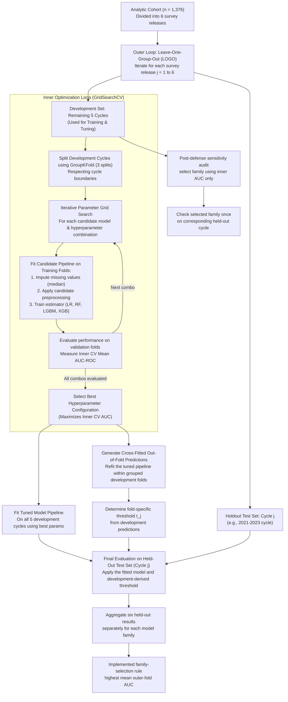

Figure 3.3 separates the two post-tuning branches. `GridSearchCV` refitted the tuned pipeline on all five development cycles for held-out-cycle prediction, while `cross_val_predict` refitted that tuned pipeline within grouped development splits to create cross-fitted out-of-fold probabilities for threshold selection. The threshold probabilities were therefore not in-sample predictions from the five-cycle fitted model.

**Phase 4 Start: Model Testing, Evaluation, Thresholding, and Calibration.** Phase 4 begins once candidate models and hyperparameter grids have been defined. This phase covers nested LOGO validation, fold-level model evaluation, final model selection, threshold optimization, calibration analysis, and later contextual benchmark comparison.

The inner loop used grouped cross-validation (CV) so that NHANES survey-cycle boundaries were respected during tuning. The outer loop used Leave-One-Group-Out (LOGO) validation, holding out one entire release at a time. This is survey-cycle-blocked validation: the development set contains every other release and may include cycles later than the held-out cycle. It evaluates between-cycle transport while preventing records from the same release from appearing in both development and test data, but it is not forward-chaining temporal validation (Vabalas et al., 2019).

Operationally, each outer LOGO iteration held out one release and used the other five for preprocessing, family-specific tuning, fitting, and threshold selection. Each tuned candidate and development-derived threshold was then evaluated once on the held-out release. Thus, a held-out cycle did not influence that fold's imputer, scaler, hyperparameters, or threshold. The implemented final family-selection rule compared mean AUC across the six outer test folds. This cross-family step can introduce selection optimism because outer results informed which family was retained; it is neither an externally nested nor preregistered selection procedure.

In this study, each NHANES survey release was treated as one validation group. Under LOGO validation, the model was trained on all but one survey release and then tested on the held-out release. This process was repeated until each release had served once as the held-out test group. The design was used because records from the same survey cycle may share collection-period, laboratory, sampling, or population characteristics.

The final family was selected by the implemented mean-outer-fold AUC rule rather than pooled AUC alone. A post-defense sensitivity audit then repeated family selection using only inner grouped-CV AUC and selected LR in all six development partitions before the corresponding held-out result was consulted. This supports, but does not preregister, the retained family. For the deployable full-cohort artifact, the most frequent fold-specific LR hyperparameter was used: $C=0.01$ in four of six folds, versus $C=0.1$ in two. The final estimator used `class_weight=balanced`, `max_iter=1500`, and random seed 42, then fit the shared preprocessing-and-model pipeline on all 1,376 records.

NHANES survey weights were not incorporated into model training. Survey weights are essential for population-level prevalence estimation and nationally representative descriptive inference, but their role in prediction-model training depends on the target deployment population and modeling objective. Here, unweighted training learned associations within the analytic cohort; a weighted sensitivity analysis remains a future extension (Lumley, 2010).

## 3.9 Phase 4: Clinical Threshold Optimization and Serving Safeguards

This section distinguishes the **three-candidate threshold rule**, its **validation-time specificity-collapse guardrail**, and the separate **runtime metabolic-risk floor**. The first two operate only on development predictions within each outer fold and determine the threshold used for that fold's reported classification metrics. The runtime floor changes a served probability after model prediction and does not contribute to the reported validation metrics.

The final classifier outputs a probability of the operational at-risk label that must be converted into a binary screening classification. Thresholding was optimized for identifying the current screen-positive status rather than defaulting to 0.50. Youden's J was included because it balances sensitivity and specificity by maximizing sensitivity plus specificity minus one (Youden, 1950). A false negative may delay confirmatory review, while a false positive may prompt unnecessary follow-up.

Three threshold strategies were evaluated using out-of-fold probabilities from the training portion of each outer LOGO fold: Youden's J, a screening-optimized rule, and the geometric mean of sensitivity and specificity. The screening-optimized rule explicitly prioritized sensitivity while preserving a minimum specificity constraint. The geometric-mean rule provided a balance-oriented alternative for folds where sensitivity and specificity moved in opposite directions, which is useful when class imbalance and uneven operating characteristics are present (Luque et al., 2019). The candidate threshold grid ranged from 0.10 to 0.89 in increments of 0.01. For each threshold $t$ in that grid, predicted labels were assigned as $\hat{y}_i(t)=1$ when $\hat{p}_i\ge t$ and $\hat{y}_i(t)=0$ otherwise. The classification-performance quantities were:

$$
\begin{aligned}
\mathrm{Sensitivity} &= \frac{TP}{TP+FN} \\
\mathrm{Specificity} &= \frac{TN}{TN+FP} \\
\mathrm{PPV} &= \frac{TP}{TP+FP} \\
\mathrm{NPV} &= \frac{TN}{TN+FN} \\
\mathrm{Accuracy} &= \frac{TP+TN}{TP+TN+FP+FN} \\
F_1 &= \frac{2(\mathrm{PPV})(\mathrm{Sensitivity})}{\mathrm{PPV}+\mathrm{Sensitivity}} \\
J &= \mathrm{Sensitivity}+\mathrm{Specificity}-1 \\
G\text{-}\mathrm{Mean} &= \sqrt{\mathrm{Sensitivity}\times\mathrm{Specificity}}
\end{aligned}
$$

The three candidate thresholds were selected from the same grid as follows:

$$
\begin{aligned}
\mathcal{T} &= \{0.10,0.11,\ldots,0.89\} \\
\mathcal{F} &= \{t\in\mathcal{T}\mid \mathrm{Sensitivity}(t)\ge 0.80
\land \mathrm{Specificity}(t)\ge 0.40\} \\
S(t) &= 0.60\cdot\mathrm{Sensitivity}(t)+0.40\cdot F_1(t) \\
G(t) &= \sqrt{\mathrm{Sensitivity}(t)\times\mathrm{Specificity}(t)} \\
t_J &= \underset{t\in\mathcal{T}}{\mathrm{argmax}}\ J(t) \\
t_S &=
\begin{cases}
\underset{t\in\mathcal{F}}{\mathrm{argmax}}\ S(t), & \mathcal{F}\ne\varnothing \\
0.50, & \mathcal{F}=\varnothing
\end{cases} \\
t_G &= \underset{t\in\mathcal{T}}{\mathrm{argmax}}\ G(t)
\end{aligned}
$$

A screening-oriented composite score was then used to select the fold-specific base strategy from the candidate thresholds $t_J$, $t_S$, and $t_G$:

$$
\begin{aligned}
C(t) &= 0.35\cdot\mathrm{Sensitivity}(t)+0.30\cdot\mathrm{Specificity}(t) \\
&\quad +0.25\cdot F_1(t)+0.10\cdot\mathrm{Accuracy}(t) \\
t_{\mathrm{base}} &= \underset{t\in\{t_J,t_S,t_G\}}{\mathrm{argmax}}\ C(t)
\end{aligned}
$$

In these equations, $\mathcal{T}$ is the full threshold grid and $\mathcal{F}$ is the subset satisfying minimum screening constraints. If $\mathcal{F}$ was empty, the implementation assigned 0.50 to the screening candidate $t_S$ before comparing it with $t_J$ and $t_G$. This **empty-feasible-set fallback** is distinct from the post-selection specificity-collapse guardrail described below. $S(t)$ emphasized sensitivity, $G(t)$ balanced sensitivity and specificity, and $C(t)$ selected the fold-specific base threshold from $t_J$, $t_S$, and $t_G$. This is an engineered operating-point rule, not a clinically validated diagnostic score.

In these formulas, TP denotes true positives, TN true negatives, FP false positives, FN false negatives, PPV positive predictive value, and NPV negative predictive value. Unlike sensitivity and specificity, PPV and NPV depend directly on outcome prevalence and case mix. The reported values are conditional on this selected analytic cohort, in which 734 of 1,376 records (53.3%) had the hybrid operational-positive label; they are not expected predictive values for a Filipino deployment population.

Sensitivity, specificity, predictive values, and related diagnostic testing measures followed the standard confusion-matrix definitions used in diagnostic accuracy evaluation (Shreffler & Huecker, 2023). F1 was included as a harmonic-mean summary of precision and sensitivity (Powers, 2011).

Each outer fold's screening threshold was derived from development predictions rather than chosen after viewing that held-out release. After $t_{\mathrm{base}}$ was selected, the implementation applied the following deterministic specificity-collapse guardrail under the study's default minimum-sensitivity setting of 0.80:

1. The guardrail triggered only when $\mathrm{Sensitivity}(t_{\mathrm{base}})\ge0.85$ and $\mathrm{Specificity}(t_{\mathrm{base}})<0.45$.
2. It first considered $t_J$, $t_S$, and $t_G$ that achieved sensitivity of at least 0.75 and specificity of at least 0.45. Eligible candidates were ranked by $C(t)$, then specificity, then the threshold value.
3. If none met both floors, it considered non-base candidates with sensitivity of at least 0.75 and ranked them by specificity, then threshold, then $C(t)$.
4. If no non-base candidate met the sensitivity floor, it scanned all of $\mathcal{T}$ for sensitivity of at least 0.75 and specificity of at least 0.45. It selected the threshold nearest to $t_{\mathrm{base}}$; ties favored a value below 0.50, then higher sensitivity, then higher $C(t)$. If no point was feasible, it used 0.50.
5. A separate severe-shift rule applied when the original sensitivity was at least 0.85, specificity was below 0.45, and $t_{\mathrm{base}}\le0.38$. If the guardrail-selected threshold was then below 0.46, it was raised to 0.46.

These constants are engineered validation rules rather than clinically derived operating points. Chapter 4 reports two distinct quantities: pooled classification metrics obtained with each record's fold-specific final threshold, and the mean of the six selected thresholds (0.465), which became the deployment cutoff. The pooled metrics were not recomputed by applying 0.465 uniformly to every held-out record.

Table 3.8 separates these validation-time safeguards from the distinct post-model heuristic used only by the serving layer.

**Table 3.8. Executable ML Safeguards and Rationale**

| Safeguard | Implementation Summary | Rationale |
|---|---|---|
| Diagnostic leakage gate | Blocks HbA1c, fasting blood sugar, and related diagnostic aliases from model features | Prevents circular prediction |
| Survey-cycle-blocked validation | Uses grouped inner validation and outer LOGO by NHANES release | Reduces same-cycle leakage; not forward-chaining validation |
| Youden's J threshold | Tests the sensitivity-specificity balance point | Provides a standard threshold baseline |
| Screening-optimized threshold | Prioritizes sensitivity with a specificity floor | Reduces missed at-risk cases |
| Geometric-mean threshold | Balances sensitivity and specificity | Handles uneven fold behavior |
| Empty-feasible-set fallback | Assigns 0.50 to $t_S$ when no grid point reaches sensitivity 0.80 and specificity 0.40 | Keeps the three-candidate comparison defined |
| Specificity-collapse guardrail | Triggers at provisional sensitivity $\ge0.85$ and specificity $<0.45$; targets sensitivity $\ge0.75$ and specificity $\ge0.45$ using the deterministic arbitration sequence above | Limits excessive false positives during validation |
| Severe-shift threshold floor | Raises a guardrail-selected value below 0.46 to 0.46 when the original threshold was $\le0.38$ with sensitivity $\ge0.85$ and specificity $<0.45$ | Prevents an extreme low-threshold operating point under the implemented rule |
| Post-model metabolic-risk floor | Raises low served risk estimates for concordant metabolic-risk profiles | Engineered runtime safeguard; not part of validated model metrics |

The serving layer also includes a rule-based metabolic-risk concordance score. It counts four non-glycemic indicators: triglycerides of at least 150 mg/dL, HDL cholesterol below 50 mg/dL, BMI of at least 25 kg/m², and waist circumference of at least 80 cm. The individual thresholds have guideline precedents, but their combination into this four-item score and the resulting probability changes are DIANA-specific engineering choices:

1. **Triglycerides ($\ge 150$ mg/dL) and HDL Cholesterol ($< 50$ mg/dL):** These thresholds align with the female-specific cutoffs defined by the National Cholesterol Education Program (NCEP) Expert Panel on Detection, Evaluation, and Treatment of High Blood Cholesterol in Adults (Adult Treatment Panel III, or ATP III) guidelines (NCEP, 2001) and the International Diabetes Federation (IDF) consensus definition of metabolic syndrome (IDF, 2006).
2. **Waist Circumference ($\ge 80$ cm):** This cutoff follows the IDF consensus recommendation for ethnic Asian women (IDF, 2006), reflecting the lower waist circumference threshold at which cardiovascular and diabetes risk escalates in Asian cohorts compared to Western cohorts.
3. **BMI ($\ge 25$ kg/m²):** This threshold follows the World Health Organization (WHO) Asia-Pacific guidelines for obesity classification (WHO, 2000), which identifies a BMI of $\ge 25$ kg/m² as the threshold for obesity in Asian populations to account for higher body fat percentages and metabolic risk at lower body weights.

Traditional metabolic-syndrome definitions evaluate five domains, including blood pressure and fasting glucose, and do not treat BMI as an interchangeable replacement for either missing domain. DIANA excludes blood pressure for the no-cuff contract and fasting glucose to avoid circular diagnostic input, then adds an Asian BMI indicator. Consequently, $c$ is a DIANA metabolic-risk indicator count ranging from 0 to 4; it must not be called a clinical metabolic-syndrome diagnosis or criteria count.

The probability rules were chosen relative to the model's deployment threshold ($t=0.465$), not calibrated from independent outcome data. When $c\ge3$, the served value is floored at 0.65; when $c=2$, 0.15 is added up to a cap of 0.95. These values guarantee that some profiles cross the screening threshold, so they may reduce false negatives but may also increase false positives and distort calibration. They are engineering heuristics requiring ablation, not guideline-derived probabilities or independently validated clinical rules.

Operationally, the floor is applied after Logistic Regression produces its base probability. Let $\hat{p}_{model}$ represent that probability and $c$ the DIANA metabolic-risk indicator count. The served value is:

$$
\hat{p}_{served}=
\begin{cases}
\max(\hat{p}_{model},0.65), & c\ge3 \\
\min(\hat{p}_{model}+0.15,0.95), & c=2 \\
\hat{p}_{model}, & c<2
\end{cases}
$$

The floor may increase the displayed value for metabolically concordant profiles, but it does not retrain the classifier, change reference labels, alter coefficients, or contribute to the held-out discrimination and classification metrics. Runtime classification uses the served value, whereas reported LOGO estimates use the base model and validation-derived threshold policy.

The discrimination and classification results reported in Chapter 4 refer to held-out LOGO predictions before the runtime metabolic-risk floor is applied. The currently available calibration summary is different: it was computed by applying the final full-data model to the same 1,376-record development cohort. It is therefore an apparent, in-sample audit and may be optimistic; it is not an out-of-fold or externally validated calibration estimate. The served-value heuristic requires separate held-out ablation and calibration analysis.

**Phase 5 Start: Cluster-Based Metabolic-Profile Identification.** Phase 5 begins after the binary operational-positive class and screening workflow have been defined. This phase uses weighted K-Means to group operational-label-positive records into interpretable metabolic-pattern clusters while keeping profile names separate from diagnostic claims.

## 3.10 Phase 5: Cluster-Based Metabolic-Profile Identification

DIANA uses a two-stage inference structure. During model development, the operational reference label defined the 734-record at-risk clustering cohort. At runtime, the Logistic Regression screening output determines whether a new user proceeds to centroid assignment. Only screen-positive users enter the weighted K-Means stage; screen-negative users receive no disease-pattern proxy label. This gating mechanism is a researcher-defined system rule rather than a discovery made by K-Means.

Weighted K-Means was fitted to all 734 at-risk records after median imputation and standardization; no complete-case deletion was applied. The six clustering features were BMI, triglycerides, LDL cholesterol, HDL cholesterol, age, and waist circumference. K-Means was selected as a centroid-based method for grouping similar metabolic profiles (MacQueen, 1967). Feature weights were applied before Euclidean distance computation. For a standardized profile $\mathbf{z}_i$ and centroid $\boldsymbol{\mu}_k$, assignment minimized:

$$
d_w(\mathbf{z}_i,\boldsymbol{\mu}_k)=\sqrt{\sum_{j=1}^{p}w_j(z_{ij}-\mu_{kj})^2}
$$

where $w_j$ is the feature-specific weight, $z_{ij}$ is the standardized patient value for feature $j$, and $\mu_{kj}$ is the corresponding standardized centroid value for cluster $k$. LDL received the highest weight as an atherogenic lipid differentiator. Triglycerides and waist circumference were strongly weighted because of their relationship to lipid dysregulation, central adiposity, and insulin-resistance patterns. BMI served as an obesity-pattern anchor, HDL as an inverse lipid marker, and age as a baseline variable.

The feature weights should be interpreted as literature-informed heuristic design parameters, not as clinically validated medical weights, causal effect sizes, treatment priorities, or regression coefficients. They were used only to shape geometric distance in standardized clustering space. The rationale draws on published metabolic-syndrome, lipid-accumulation, and data-driven diabetes-subgroup literature (Alberti et al., 2009; Ahlqvist et al., 2018; Kahn, 2005; Wang et al., 2024), but the particular numeric values were researcher choices prompted by clinical interpretation and require sensitivity analysis and broader expert validation.

Table 3.9 records the exact weights used in the frozen clustering artifact and the intended geometric emphasis of each feature.

**Table 3.9. Weighted K-Means Feature Weights**

| Feature | Weight | Interpretation |
|---|---:|---|
| LDL cholesterol | 2.5 | Atherogenic lipid differentiator |
| Triglycerides | 2.0 | Lipid dysregulation and insulin-resistance-related signal |
| Waist circumference | 2.0 | Central adiposity signal |
| BMI | 1.5 | Obesity-pattern anchor |
| HDL cholesterol | 1.2 | Inverse lipid-risk marker |
| Age | 1.0 | Baseline demographic variable |

The numeric weights represent an ordinal emphasis scale in standardized clustering space: 1.0 was treated as baseline influence, 1.2 as mild emphasis, 1.5 as moderate emphasis, 2.0 as strong emphasis, and 2.5 as the highest heuristic emphasis. Because the variables were standardized before clustering, a one-standard-deviation difference in a feature with weight 2.0 contributed twice the squared-distance contribution of a baseline-weighted feature such as age. These values were not derived from regression coefficients, clinical cutoffs, or validated treatment priorities.

The specific assignments followed a descending clinical-emphasis logic. LDL cholesterol received the highest weight of 2.5 to strengthen separation of atherogenic lipid-driven profiles after diagnostic glycemic markers and unavailable insulin-function markers were excluded. Triglycerides received a strong weight of 2.0 because elevated triglycerides are central to lipid dysregulation and waist-triglyceride accumulation patterns used in the SIRD-like centroid interpretation. Waist circumference also received a strong weight of 2.0 because central adiposity is more directly tied to metabolic risk patterning than general body size alone. BMI received a moderate weight of 1.5 because it anchors obesity-related pattern separation but overlaps partly with waist circumference. HDL cholesterol received a mild weight of 1.2 because it contributes inverse lipid-risk information, while avoiding dominance over the stronger atherogenic and central-adiposity dimensions. Age was kept at the baseline weight of 1.0 because it provides demographic context for the MARD-like interpretation but should not dominate profile assignment over metabolic biomarkers.

The number of clusters was fixed at $K=4$ to examine four interpretable metabolic profiles, not because every internal metric identified four as uniquely optimal. The weighted-geometry sensitivity scan found that $K=2$ had the highest silhouette score, while $K=4$ had the best Davies-Bouldin index among $K=2$ through $K=6$ and preserved the intended four-profile granularity. Thus, $K=4$ is a theory-informed design trade-off that must be reported alongside the coarser $K=2$ alternative.

To remove the fixed-$K$ and naming assumptions from the sensitivity evidence, a separate **anonymous, semantically unlabeled** analysis scanned $K=2$ through $K=20$ and exported anonymous centroids for every tested value. It did not write serving artifacts or apply SIRD, SIDD, MOD, MARD, risk, or treatment names. Three declared views were evaluated: (1) all 1,376 records with the six core features and equal weights; (2) the 734 operational-positive records with the current six expert weights for direct comparability; and (3) the 728 records from CRP/insulin-assayed cycles using the six core features plus fasting insulin and CRP, equal weights, and $K=2$ through $K=15$. In specification 2, the operational outcome defined the cohort filter but was never entered as a K-Means feature; the analysis is therefore unsupervised within an outcome-defined cohort, not outcome-independent. The $K=20$ and $K=15$ upper bounds were pragmatic sensitivity caps, not prespecified optimal values. The expanded view applied `log1p` to triglycerides, insulin, and CRP after cohort-fitted median imputation to reduce extreme-value dominance; every bootstrap sensitivity refitted those preprocessing steps within its resample.

Each specification reported silhouette, Davies-Bouldin, Calinski-Harabasz, inertia, minimum cluster size, Hopkins tendency, regularized Gaussian-mixture BIC as a model-form sensitivity, 30 bootstrap refits, and leave-one-cycle-out assignment ARI. Each bootstrap resampled rows and refitted the imputer, scaler, and K-Means model. This was row-level algorithmic stability analysis; it did not reproduce NHANES strata, primary sampling units, or survey weights and is not a design-based population estimate. Separation metrics were computed in the same geometry used for fitting; for weighted clustering this means multiplying standardized dimensions by $\sqrt{w_j}$. Under an implemented exploratory reporting rule, a partition was flagged when its smallest cluster contained less than 5% of the cohort or its median bootstrap ARI was below 0.70. Metric leaders were reported but no single biological $K$ was automatically selected.

After fitting, centroids were inverse-transformed into raw clinical units. Raw cluster IDs have no inherent medical meaning, so semantic naming occurred only after the centers were fixed. The primary names are **TG-waist dominant**, **LDL-dominant/atherogenic**, **obesity-dominant**, and **lower-metabolic-burden residual**. The interface retains four legacy Ahlqvist-inspired aliases: severe insulin-resistant diabetes-like (SIRD-like), severe insulin-deficient diabetes-like (SIDD-like), mild obesity-related diabetes-like (MOD-like), and mild age-related diabetes-like (MARD-like). These are names, not diagnoses.

1. **TG-waist dominant (SIRD-like alias):** Compute $(\mathrm{waist}-58)\times\mathrm{triglycerides}$ for each centroid and select the highest. The implementation uses triglycerides in mg/dL, so this is a **lipid accumulation product (LAP)-style ranking score**, not a conventional clinical LAP magnitude. Converting triglycerides to mmol/L multiplies every score by the same constant and leaves the ranking unchanged.
2. **LDL-dominant/atherogenic (SIDD-like alias):** Among the three remaining centroids, select the one with the highest LDL. This is an atherogenic proxy and does not demonstrate insulin deficiency.
3. **Obesity-dominant (MOD-like alias):** Among the two remaining centroids, select the one with the highest BMI. The observed centroid BMI is approximately 42.05 kg/m², so the legacy word “mild” should not be read as a clinical obesity grade.
4. **Lower-metabolic-burden residual (MARD-like alias):** Assign the last centroid after the first three rankings. It is a residual metabolic profile, not evidence of an age-driven biological subtype; mean age differs by only about 1.15 years across the four centroids.

This process is most accurately described as **model-clustered, researcher-named**. Weighted K-Means automatically assigned the 734 operational-label-positive profiles to raw groups $C_0$ through $C_3$ by nearest weighted centroid. Researchers chose the operational-positive gate, $K=4$, the feature weights, and the deterministic semantic names. LAP-style and biomarker rankings were applied to centroids only, never as patient-level membership thresholds. Therefore, the membership step is unsupervised conditional on the chosen design, but the complete profile-assignment pipeline is not “100% unsupervised.”

The implementation still uses `subtype` in several API, database, and interface field names. In this manuscript, that word denotes a legacy technical field carrying metabolic-profile context; it does not assert a validated biological diabetes subtype.

The term "Ahlqvist-inspired" is deliberately secondary. The original framework used glutamic acid decarboxylase (GAD) antibodies, age at diagnosis, BMI, HbA1c, updated Homeostatic Model Assessment of beta-cell function (HOMA2-B), and insulin resistance (HOMA2-IR) (Ahlqvist et al., 2018). Only BMI is directly comparable between that feature set and DIANA's clustering features; DIANA uses current age, which is not Ahlqvist's age at diagnosis. Consequently, DIANA does not replicate the Ahlqvist clusters.

The SIDD-like alias requires particular caution. True insulin-deficiency classification requires beta-cell function evidence such as HOMA2-B or C-peptide, which was unavailable. Severe autoimmune diabetes (SAID) was not assigned because autoimmune markers were unavailable. None of the aliases is a validated biological diagnosis, treatment category, or replacement for clinical judgment.

**Figure 3.4. Two-Stage Screening and Profile Assignment Workflow**

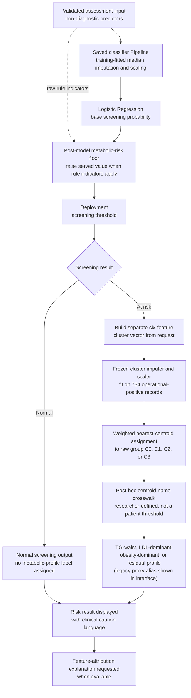

Figure 3.4 separates classifier preprocessing, the raw-input runtime heuristic, and cluster preprocessing. Missing waist follows three distinct paths, summarized in Table 3.9A. The figure also clarifies three later transitions: binary screening, algorithmic raw-cluster assignment, and researcher-defined centroid naming. Only operational-positive outputs proceed to cluster assignment, and the profile name does not change which raw centroid is nearest.

**Table 3.9A. Missing-Waist Handling by Serving Component**

| Component | Input and fitted scope | Behavior when waist is missing | Frozen waist statistic |
|---|---|---|---:|
| Logistic Regression classifier | Saved classifier `Pipeline`; final imputer fitted on all 1,376 development rows after fold-local evaluation | Applies the classifier's training-fitted median before scaling and LR | 100.05 cm |
| Post-model metabolic-risk floor | Reads the raw request indicators after the base probability | Does not impute waist; the waist indicator simply does not count | Not applicable |
| Weighted centroid assignment | Separate cluster imputer and scaler fitted on the 734 operational-label-positive records | Applies the cluster-cohort median, then the cluster scaler, before nearest-centroid assignment | 104.2 cm |

None of the three paths uses the former $3.33\times BMI$ estimate. The two medians differ because the classifier and clusterer were fitted on different cohorts; they must not be treated as one shared preprocessing object.

**Phase 6 Start: Web Application Integration and Visualization Development.** Phase 6 begins after the screening and clustering workflows have been defined. This phase integrates the trained model behavior into the web application, including assessment submission, risk-result presentation, metabolic-profile context carried by the legacy `subtype` field, SHAP-based explanation handling, biomarker trend visualization, and report-support workflows.

## 3.11 Phase 6: Visualization, Explainability, and Clinical Decision Support

Although Logistic Regression provides coefficient-level interpretability, DIANA also uses SHapley Additive exPlanations (SHAP) to provide patient-level feature attribution (Lundberg & Lee, 2017). SHAP values indicate how each feature pushes the **base Logistic Regression output** toward or away from the at-risk class. The explainability workflow supports both cohort-level interpretation, through summary visualizations, and patient-level interpretation, through waterfall-style feature-contribution displays.

Detailed SHAP outputs are generated during explanation requests and displayed in the user interface when available. They are not stored as detailed assessment fields. The database stores prediction metadata such as risk score, predicted status, model version, dataset hash, and legacy `subtype` context, while detailed SHAP values remain transient explanation artifacts. The explainer does not decompose the post-model metabolic-risk floor. When that heuristic raises the served value, the SHAP values explain the underlying LR output and cannot sum to or fully justify the displayed served score. A clinically safer interface must label this distinction or explain the rule contribution separately.

When SHAP output is unavailable, the interface displays an explanation-unavailable state and states that no feature-level SHAP values are shown. This behavior preserves the screening result while avoiding fabricated feature attributions.

In addition to model-performance evaluation, DIANA includes safety and traceability controls around the ML workflow. These controls make leakage prevention, explanation handling, drift awareness, and model lineage verifiable within the implemented system rather than leaving them as documentation-only claims.

Table 3.10 summarizes what each control actually does and the narrower methodological value it supports.

**Table 3.10. ML Safety and Traceability Controls**

| Control | Implemented Behavior | Methodological Value |
|---|---|---|
| Leakage validation gate | Blocks diagnostic features before training | Reduces circular prediction risk |
| Feature-set documentation | Documents active clinical and clustering feature sets | Reduces training-serving mismatch |
| SHAP unavailability handling | Shows an explanation-unavailable state when SHAP is unavailable | Avoids fabricated explanations |
| Drift-monitoring support | Records drift-check status for administrative review | Supports post-deployment monitoring |
| Model lineage metadata | Stores model version, dataset hash, risk score, status, and subtype metadata | Supports result traceability |

## 3.12 Phase 6: System Architecture and Implementation

DIANA was implemented as a layered web application with a frontend interface, backend API, ML inference service, and persistence layer. The separation of these layers allowed the user interface, authentication and validation logic, prediction workflow, and stored assessment records to be developed and evaluated independently. Optional caching was used for repeated read-heavy views such as trends and aggregate analytics when the runtime environment supported it.

The deployment design follows a reverse-proxy pattern in which public browser traffic reaches the application through a secured gateway before application services are invoked. The backend API, ML service, and database are separated so that prediction, persistence, authentication, and explanation tasks are not exposed as a single process or direct service-port surface. This design supports either managed-service or containerized deployment while preserving the same logical system boundaries. Rate limiting is implemented separately through request-throttling controls.

Table 3.11 identifies the technology assigned to each logical layer; Figure 3.5 then shows how those layers communicate.

**Table 3.11. Technology Stack**

| Component | Technology | Rationale |
|---|---|---|
| Frontend | React 18 + Vite | Component-based UI, efficient rendering, and fast development workflow |
| Backend | Go 1.25 + Gin | Concurrent request handling, static typing, and compiled deployment |
| ML Service | Python 3.12 + Flask | Access to scikit-learn, SHAP, and ML tooling |
| Database | PostgreSQL-compatible persistence | Atomicity, consistency, isolation, and durability (ACID) for user, assessment, model, authentication-event, and audit records |
| Cache support | Optional cache layer | Time-limited caching and targeted refresh for repeated read queries when configured |
| Authentication | Signed web-token authentication | Stateless authentication with access and refresh token support |
| Deployment | Managed or containerized deployment | Reverse-proxy ingress, separated services, and PostgreSQL-backed persistence |
| Charts | Recharts | Interactive biomarker trends and explainability visualizations |

**Figure 3.5. DIANA Four-Tier System Architecture**

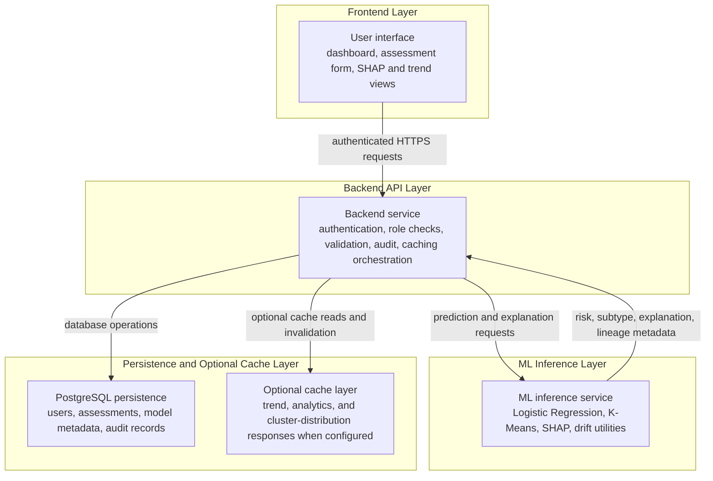

As shown in Figure 3.5, public traffic enters through a reverse proxy rather than direct backend, ML, or database ports in both supported deployment variants. The default thesis workflow sends ML prediction and explanation traffic through the backend, which communicates with the ML layer through a service boundary and with the database through a controlled persistence connection. The Docker Nginx configuration also contains an optional `/ml/` reverse-proxy location for deployments configured to use it; therefore, the security claim is limited to direct service-port isolation and backend-mediated thesis workflow routing rather than a claim that every possible deployment exposes no public ML HTTP route.

The backend and ML service were decoupled so routine API operations remain separate from model inference and explanation generation. During assessment creation, the backend authenticates the user, validates submitted biomarkers, sends the model-relevant payload to the ML service, receives prediction and lineage metadata, stores the assessment, refreshes affected cached data when applicable, and returns the result to the interface. Prediction failures are returned as structured errors rather than silently hidden by fallback behavior.

**Figure 3.6. Assessment Prediction and Optional Explanation Sequence**

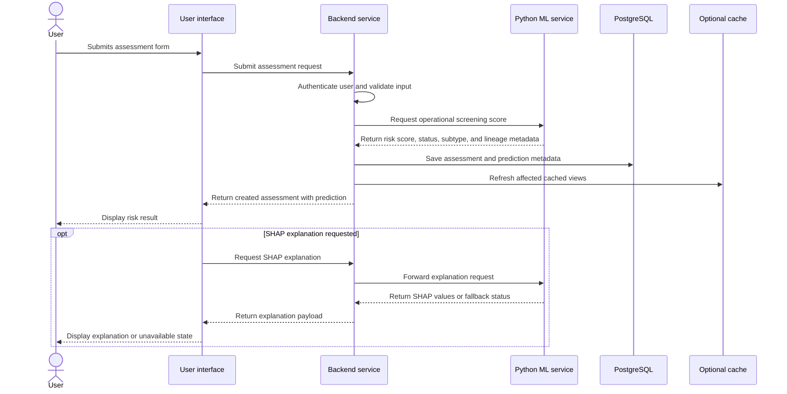

Figure 3.6 separates the required assessment-creation path from the optional explanation path. The assessment is first validated, scored, persisted, and returned to the interface. SHAP explanation is requested separately when feature-attribution output is needed.

The API design was organized around access-control boundaries rather than a single public service surface. Public access was limited to authentication and basic system-status functions. Authenticated users accessed profile, assessment, privacy, trends, analytics, and report-export workflows. Doctor and administrator roles provided controlled access to cohort insights, audit review, user management, model traceability, and drift-related monitoring. Table 3.12 summarizes these levels.

**Table 3.12. API Access-Control Summary**

| Access Level | Main Functions | Representative Boundary |
|---|---|---|
| Public | Authentication and basic system-status checks | Public access boundary |
| Authenticated user | Profile, assessments, privacy tools, trends, and PDF export | User-owned data boundary |
| User analytics | Personal summaries and biomarker trends | Personal analytics boundary |
| ML explanation access | Model insights and SHAP explanation requests | Controlled ML-service boundary |
| Doctor or admin | Cohort insights and validation workflows | Role-restricted clinical-review boundary |
| Admin only | User management, audit logs, model traceability, and drift status | Administrative boundary |

The database schema links assessments directly to authenticated users, supporting user-owned health records and controlled deletion behavior. Stored prediction metadata includes risk score, risk label, predicted status, model lineage, dataset lineage, and subtype context where available. This design supports traceability between a displayed result and the model artifact used to generate it without requiring detailed explanation artifacts to be persisted with every assessment.

**Phase 7 Start: System Testing and Technical Validation.** Phase 7 begins after the application architecture and integration workflow have been specified. This phase evaluates the implemented system through functional testing, ML-service testing, frontend coverage, security-control review, deployment-readiness checks, and accessibility-readiness assessment.

## 3.13 Phase 7: System Testing, Security, and Technical Validation

DIANA implements signed-token authentication, role-based access control, request-size limiting, rate limiting, security headers, cross-origin request filtering, and password hashing with bcrypt (Jones et al., 2015; Provos & Mazieres, 1999). Three main roles are recognized: user, doctor, and admin. Users can create assessments, view their own predictions, export reports, and review personal trends. Doctors are treated as a testing and validation role with model-locked assessment creation. Administrators can access system administration functions such as user management, audit logs, model traceability, and dashboard summaries.

Table 3.13 connects each implemented security control to its intended protection boundary.

**Table 3.13. Security Controls**

| Control | Implementation | Purpose |
|---|---|---|
| Token signing | Signed JSON Web Tokens (JWTs) using a Hash-based Message Authentication Code with SHA-256 (HMAC-SHA256) | Preserve token integrity |
| Password hashing | bcrypt password hashing | Protect credentials at rest |
| Role-based access control | Access-control enforcement | Apply least-privilege access |
| Rate limiting | Token-bucket rate limiting | Reduce brute-force and denial-of-service risk |
| Cross-origin filtering | Cross-origin request allow-list | Restrict cross-origin access |
| Transport security | Transport Layer Security (TLS)-capable reverse-proxy configuration | Support transport confidentiality when valid certificates are configured |
| Public ingress control | Reverse proxy handles public HTTP/HTTPS ingress | Reduce direct service exposure |
| ML service exposure control | Backend-mediated thesis workflow and no external ML container port in the production overlay | Reduce direct ML service exposure; optional `/ml/` proxy deployments require API-key and Cross-Origin Resource Sharing (CORS) controls |
| Secret management | Runtime secret configuration | Reduce accidental credential disclosure |

Software quality evaluation followed ISO/IEC 25010-informed characteristics (International Organization for Standardization, 2023). Functional suitability was evaluated through API tests, model-serving tests, and frontend unit tests. Performance efficiency was evaluated through inference benchmarks and planned load-testing methodology. Security was evaluated through authentication, role-based access, rate-limiting, and request-handling tests. Maintainability was supported through modular architecture, structured database access, and separated frontend, backend, and ML services. Community usability has a defined UAT protocol but had not yet been empirically evaluated; accessibility certification, long-term reliability testing, and production load testing likewise require separate operational evaluation. Author-reported doctor feedback is described separately as anecdotal development input rather than as formal clinical validation.

Because DIANA was evaluated as a research prototype, its current navigation and browser-token handling should not be interpreted as production clinical security hardening. Before clinical deployment, the system would require stronger session-management design, formal cross-site-scripting review, route-based navigation refinement, and deployment-compatible protections such as HttpOnly cookies or server-side sessions where feasible.

**Phase 8 Start: Planned User Acceptance Testing and Reported Doctor Feedback.** Phase 8 begins after prototype implementation and technical review. It defines the unexecuted community UAT protocol and documents author-reported qualitative doctor feedback while separating proposed usability measures and anecdotal development input from external clinical validation.

## 3.14 Phase 8: Planned User Acceptance Testing and Reported Doctor Feedback

The planned community evaluation follows an ISO/IEC 25010-informed usability framework (International Organization for Standardization, 2023). The protocol is designed to evaluate appropriateness recognizability, learnability, operability, user error protection, interface aesthetics, accessibility, and user confidence. Recruited participants would interact with the DIANA prototype, complete core tasks such as logging in, navigating the dashboard, submitting an assessment, and interpreting prediction results, and answer a Likert-scale questionnaire on usability, clarity, understandability, and perceived usefulness.

The community protocol targets at least 30 perimenopausal, menopausal, or postmenopausal Filipino women from selected Facebook interest groups and Nagcarlan, Laguna, subject to approval, consent, and privacy procedures. No completed community cohort or UAT result is claimed in this manuscript. Separately, the authors report hands-on qualitative feedback from one physician concerning the feature set, assessment workflow, risk-output presentation, explanation approach, profile-weighting rationale, and possible supplementary screening-support use. Because no primary dated record was available for this revision, the feedback is summarized only as anecdotal development input. It is not analyzed as a scored expert-panel result, empirical face-validity study, or external clinical validation.

## 3.15 Chronological Methodology Evolution and Pivots

This section is a provenance record of design changes, not a ninth methodological phase and not a substitute for the training loop in Figure 3.3. The DIANA development and research process underwent several methodological adjustments between December 2025 and March 2026. Documenting them makes clear which alternatives were rejected, why they were rejected, and what evidence was carried into the final model.

1. **December 2025 (Database Restructuring and B2B to B2C Platform Shift):**
   Initially, the application was designed as a business-to-business (B2B) clinical administration tool. The database schema included a legacy `patients` table meant to be managed solely by clinicians. During prototype review, it was recognized that restricting access to clinicians limited the self-screening scalability of the system. To empower menopausal women to take proactive ownership of their health metrics, the database schema was migrated (migration version 0011) to drop the `patients` table entirely and link all clinical assessment data directly to authenticated user accounts (`users.id`). This pivoted the project into a direct-to-consumer (B2C) self-screening platform.
   
2. **January 2026 (Exclusion of Blood Pressure Predictors):**
   The clinical predictor feature contract originally included blood pressure (systolic and diastolic BP) as model features. However, during validation, it was recognized that requiring a blood pressure cuff for assessment created a technical and physical barrier, undermining the primary goal of low-barrier self-screening. To maximize accessibility, blood pressure features were excluded from the final clinical predictor features (creating the `no_bp` active model contract). This ensured that a user could complete the screening at home using only basic lifestyle details and fasting lipid panel metrics.
   
3. **February–March 2026 (Target Class Reformulation and At-Risk Pooling):**
   The initial research design considered a multi-class model (Normal, Pre-diabetic, and Diabetic) or separate models predicting transition to specific glycemic states. However, the cross-sectional NHANES releases do not track within-person glycemic transitions over time. A direct transition claim would therefore be unsupported and clinically inappropriate as a diagnostic task.
   
   To address this limitation, pre-diabetic and diabetic operational labels were combined into **Normal versus At Risk**. This pivoted the system from three-class status reproduction toward binary screening support; it did not create a longitudinal risk endpoint. A runtime screen-positive user may receive centroid-based metabolic-profile context, not a confirmed clinical subtype.
   
4. **March 2026 (Refinement of Weighted K-Means Membership):**
   Early iterations of the profile-assignment module used post-hoc patient-level threshold overrides in the serving layer, such as forcing a high-LAP profile into a particular legacy subtype field. Those overrides were removed. The active runtime rule now assigns an eligible profile only by nearest weighted centroid. Feature weights remain researcher-defined within the distance geometry, and semantic names remain researcher-defined after fitting; therefore, only raw membership assignment is unsupervised.

Table 3.14 consolidates these pivots with the validation question, resulting decision, and evidence retained in the final workflow.

**Table 3.14. Predictive and Clustering Development Iterations**

| Iteration or Question | Validation or Constraint | Decision | Evidence Carried Forward |
|---|---|---|---|
| Three-class or transition prediction | NHANES releases are cross-sectional and do not observe within-person progression | Reject transition claims; combine pre-diabetic and diabetic references into an at-risk class | Binary operational target: 642 normal and 734 at risk |
| Diagnostic versus non-diagnostic predictors | DIQ010 and HbA1c construct the target; FBS only gates fasting-subsample eligibility | Exclude HbA1c/FBS and run executable leakage checks | Nine-feature non-diagnostic screening contract |
| With-BP versus no-BP assessment | Requiring a cuff conflicts with low-barrier self-screening | Remove systolic and diastolic BP from the active contract | `binary_v2_no_bp` model variant |
| Candidate model families | Same outcome, features, survey-cycle groups, and AUC objective; family-specific parameter grids | Compare LR, RF, LightGBM, and XGBoost rather than assume one winner | LR ranked first in held-out AUC in all six cycles; differences remained modest |
| Cross-family selection check | Original implemented rule used mean outer-fold AUC and can be selection-optimistic | Add post-defense inner-development-only family-selection check | Inner grouped CV also selected LR in 6/6 development partitions |
| Probability threshold | Default 0.50 was not assumed appropriate for screening | Select one threshold per outer fold; pool fold-policy metrics; store the six-threshold mean separately | Fold thresholds 0.41-0.49; deployment mean 0.465 |
| Hybrid profile overrides | Patient-level rules obscured whether membership came from clustering | Remove overrides; use weighted nearest-centroid membership only | Raw C0-C3 memberships generated by the fitted model |
| Human-readable profile names | Raw cluster IDs have no semantic meaning | Apply deterministic centroid-level waterfall after fitting | Model-clustered, researcher-named profile crosswalk |

## 3.16 Cross-Phase Data Analysis Procedure

Data analysis followed the methodology order: cohort preparation, feature and leakage review, candidate-model development, model testing and calibration auditing, cluster interpretation, system integration, technical validation, and expert-review evidence. The NHANES cohort was summarized using record counts, class distributions, survey-cycle membership, feature availability, label composition, and reasons for absent menstruation. These summaries verified the operational no-period, fasting-laboratory cohort and exposed that it was broader than confirmed natural postmenopause. Because the objective was classification within the analytic cohort rather than national prevalence estimation, descriptive counts were not interpreted as weighted population estimates.

Reference-label analysis compared DIQ010-only categories with HbA1c-only categories before describing the final hybrid label. Direct agreement was used for source comparison; agreement between the hybrid label and HbA1c was explicitly rejected as independent evidence because HbA1c is part of the hybrid. Discordance was interpreted descriptively and not automatically treated as error.

Feature analysis used IG and entropy as a full-cohort descriptive relevance audit while excluding diagnostic glycemic variables and near-duplicate proxies. It was not a nested feature selector. The nine-feature contract was fixed for the reported model comparison; missing-data handling and scaling were then fitted inside each validation workflow before application to its held-out cycle (Vabalas et al., 2019).

Predictive analysis used nested LOGO validation by survey release. One cycle was held out while the other five were used for family-specific tuning and fitting; this was blocked leave-cycle-out validation, not chronological forward validation. AUC-ROC, sensitivity, specificity, positive predictive value (PPV), negative predictive value (NPV), F1 score, and confusion-matrix counts were reported. The pooled classification metrics used fold-specific thresholds, whereas 0.465 is their mean and the deployment artifact. Row-level percentile bootstrap intervals were also reported but treated as conditional descriptive intervals because they did not resample survey cycles, refit models, or repeat family selection. Calibration metrics were apparent full-cohort diagnostics, not cross-validated calibration (Brier, 1950; Hosmer & Lemeshow, 1980; Van Calster et al., 2019).

Cluster analysis was performed on all 734 operational-label-positive records using weighted K-Means. Geometry-matched silhouette, Davies-Bouldin, and Calinski-Harabasz metrics were computed after multiplying each standardized dimension by the square root of its weight. Robustness checks varied initialization seeds and one weight at a time. Centroids were interpreted after inverse transformation into raw units (Rousseeuw, 1987; Davies & Bouldin, 1979; Calinski & Harabasz, 1974). Sensitivity analyses refitted $K=4$ on all labels and projected a period-reported comparison cohort through the frozen no-period-cohort centroids.

System-evaluation evidence was analyzed separately from model-validation evidence. Backend, ML-service, frontend, security, deployment-readiness, and accessibility-readiness results were summarized by test domain, evidence source, and implementation status. No community UAT observations were analyzed because the protocol had not been executed. Author-reported doctor comments were summarized descriptively, with attention to feature usefulness, risk-output plausibility, and the requested clarification that clustering feature weights are literature-informed heuristics rather than clinically validated medical weights. No inferential or scored expert analysis was performed.

Table 3.15 closes the methodology by mapping each phase to its analysis procedure and primary output.

**Table 3.15. Summary of Data Analysis Procedures**

| Phase | Analysis Domain | Procedure | Primary Output |
|---|---|---|---|
| Phase 1 | Cohort description | Count records, class labels, cycles, feature availability, and no-period reasons | Operational no-period cohort profile and scope boundary |
| Phase 1 | Label-source comparison | Compare DIQ010-only with HbA1c-only categories; document hybrid hierarchy | Direct source agreement and operational-label uncertainty |
| Phase 2 | Feature relevance and leakage review | Audit predictors using discretized IG, entropy, and leakage screening | Conditional fixed feature contract and exclusion rationale |
| Phase 3 | Model development and comparison | Train candidate algorithms under nested grouped validation and compare candidate models | Selected Logistic Regression model and comparative model results |
| Phase 4 | Model validation | Apply nested LOGO validation by NHANES release | Fold-level and pooled discrimination metrics |
| Phase 4 | Threshold and calibration | Optimize thresholds within development data; report current full-cohort calibration as apparent and exploratory | Screening threshold, operating metrics, and calibration audit |
| Phase 4 | Benchmark comparison | Reconstruct available screening baselines under the same cohort and outcome definition | Contextual comparator performance |
| Phase 5 | Cluster validation | Evaluate weighted K-Means on operational-label-positive records and interpret centroids in raw clinical units | Cluster validity metrics and metabolic-profile interpretation |
| Phase 6 | System-integration evidence | Summarize assessment workflow, visualization, explainability, trend, and export integration | Implemented workflow and presentation evidence |
| Phase 7 | Technical validation evidence | Summarize backend, ML-service, frontend, security, deployment-readiness, and accessibility-readiness results | Functional, security, deployment, and readiness findings |
| Phase 8 | Planned community UAT and reported doctor feedback | Define the pending UAT analysis and summarize author-reported qualitative comments separately | Planned user-acceptance measures and anecdotal development feedback pending primary documentation |

# Chapter 4: Results and Discussion

Although Chapter 3 describes the work as eight methodological phases, Chapter 4 presents the findings by evidence domain. This organization separates model performance, feature relevance, clustering, leakage validation, functional testing, interface integration, deployment readiness, the pending community UAT protocol, and author-reported doctor feedback.

The post-defense evidence has four explicit provenance paths. Core attrition, label, Information Gain, model-selection, centroid-naming, and local-stability artifacts were generated by `scripts/thesis/generate_minor_revision_evidence.py`. Expanded-feature evidence came from `Ian_ML/training/explore_expanded_non_circular.py`; anonymous broad-$K$ evidence came from `Ian_ML/training/explore_unlabeled_centroids.py`; and the ROC plus serving-cluster figures came from the dated isolated core retrain. Machine-readable outputs are stored under `docs/07-research/minor-revision-evidence/` and `docs/07-research/model-experiments/`, with invariant checks in `Ian_ML/tests/test_minor_revision_evidence.py` and `Ian_ML/tests/test_training_preprocessing_evidence.py`. These artifacts support reproducibility of the reported internal analyses; they do not replace external clinical validation.

The corrected evidence pack supersedes interpretive prose in legacy files under `models/binary_v2_no_bp/results/`, including `README.md`, `clustering_unsupervised_verification.md`, `cluster_analysis.json`, and `ablation_study_results.json`. Those older files contain stale statements about a confirmed postmenopausal cohort, “100% unsupervised” clustering, temporal validation, accurate probabilities, menopause-specific patterns, causal risk percentages, or personalized treatment. The backward-compatible `menopausal_status` dataset column no longer stores the false constant `Postmenopausal`; it now stores `Operational no-period cohort`, and its regression test checks that narrower label. Frozen numeric model objects may still serve as calculation inputs, but legacy narrative claims are not evidence for this manuscript.

## 4.1 Binary Screening Model Performance

The retained LR model achieved a pooled out-of-fold AUC-ROC of **0.737** (conditional 95% confidence interval [CI]: **0.710-0.763**) under survey-cycle-blocked LOGO validation. Using each outer fold's development-derived threshold, pooled sensitivity was **0.748** (conditional 95% CI: **0.717-0.776**), specificity was **0.590**, and F1 was **0.710**. The six fold thresholds ranged from 0.41 to 0.49 and averaged 0.465. Thus, the pooled operating metrics describe a fold-specific threshold policy; they are not estimates obtained by applying a single 0.465 cutoff to all held-out records.

The intervals were computed from 1,000 percentile bootstrap resamples of the fixed pooled held-out predictions with random seed 42; samples containing fewer than two classes were excluded. This row-level bootstrap does not resample whole survey cycles, refit preprocessing or models, or repeat model-family selection. The intervals are therefore conditional descriptive uncertainty around the saved predictions and may understate full pipeline and between-cycle uncertainty (Efron & Tibshirani, 1993).

Table 4.1 reports the headline point estimates, while Table 4.2 isolates the two conditional bootstrap intervals and their prespecified project benchmarks.

**Table 4.1. Headline Binary Screening Performance**

| Metric | Value |
|---|---:|
| Pooled AUC-ROC | 0.7366 |
| Conditional row-level bootstrap 95% CI for pooled AUC-ROC | 0.710-0.763 |
| Mean of six fold-specific thresholds; deployment cutoff | 0.465 |
| Sensitivity | 0.7480 |
| Conditional row-level bootstrap 95% CI for sensitivity | 0.717-0.776 |
| Specificity | 0.590 |
| Positive predictive value | 0.676 |
| Negative predictive value | 0.672 |
| F1 score | 0.710 |

**Table 4.2. Conditional Row-Level Bootstrap Interval Summary**

| Metric | Point Estimate | Conditional 95% CI Lower | Conditional 95% CI Upper | Project Benchmark |
|---|---:|---:|---:|---|
| Sensitivity | 0.7480 | 0.717 | 0.776 | >= 0.70 |
| AUC-ROC | 0.7366 | 0.710 | 0.763 | >= 0.70 |

Fold-level AUC ranged from **0.711 to 0.788** across the six held-out releases; none fell below the project's 0.70 benchmark. This shows consistent between-cycle ranking performance within NHANES. It is not forward temporal validation or external clinical validation.

Table 4.3 shows the held-out result and development-derived operating threshold for every cycle.

**Table 4.3. Per-Fold LOGO Validation Results for Logistic Regression**

| Fold | Test Release | Fold AUC-ROC | Sensitivity | Specificity | Threshold | Strategy |
|---:|---|---:|---:|---:|---:|---|
| 1 | 2009-2010 | 0.711 | 0.761 | 0.581 | 0.47 | Youden's J |
| 2 | 2011-2012 | 0.713 | 0.634 | 0.718 | 0.49 | Youden's J |
| 3 | 2013-2014 | 0.736 | 0.727 | 0.567 | 0.47 | Youden's J |
| 4 | 2015-2016 | 0.788 | 0.772 | 0.679 | 0.48 | Youden's J |
| 5 | 2017-2018 | 0.738 | 0.735 | 0.637 | 0.47 | Youden's J |
| 6 | 2021-2023 | 0.731 | 0.856 | 0.449 | 0.41 | Specificity-collapse nearest-feasible guardrail |
| Mean | - | 0.736 | 0.748 | 0.605 | 0.465 | - |

The AUC values in Tables 4.3 and 4.6 are mean fold AUC-ROC values averaged across the six held-out LOGO test releases. By contrast, Table 4.1 reports the pooled out-of-fold AUC-ROC computed from all held-out predictions combined, with bootstrap confidence intervals. This distinction explains why the headline pooled estimate is 0.7366 while the Logistic Regression mean fold AUC is 0.736.

The pooled sensitivity point estimate exceeded the project's 0.70 benchmark. The conditional lower bootstrap bound was 0.717, but it should not be treated as definitive target attainment because the bootstrap did not repeat cycle sampling, model fitting, or family selection. External or prospective validation remains necessary.

The pooled PPV of 0.676 and NPV of 0.672 are specific to the selected NHANES cohort and its 53.3% operational-positive fraction. They should not be transferred to a Filipino screening setting without evaluating the target population's case mix, label prevalence, threshold, and calibration.

At the threshold-policy level, Youden's J was selected in 5 of 6 LOGO folds, while the specificity-collapse nearest-feasible guardrail was selected in 1 of 6 folds. This distribution indicates that the final threshold policy was not a simple default cutoff. The selected guardrail point in the 2021-2023 fold was 0.41: the grid value nearest the provisional 0.40 threshold that met the implemented development-data floors of sensitivity at least 0.75 and specificity at least 0.45.

Table 4.4 gives the exact selection frequency for each threshold mode.

**Table 4.4. Threshold Mode Distribution**

| Threshold Mode | Occurrence (6 folds) | Interpretation |
|---|---:|---|
| Youden's J | 5/6 | Primary strategy for balanced sensitivity-specificity optimization |
| Specificity-Collapse Nearest-Feasible Guardrail | 1/6 | Nearest grid point to the provisional threshold that met sensitivity $\ge0.75$ and specificity $\ge0.45$ after the provisional point triggered the guardrail |
| Severe-Shift Threshold Floor | 0/6 | The 0.46 minimum was not used by the selected Logistic Regression model |

Operationally, the threshold policy prioritized identification of the current positive label while constraining a provisional development-data operating point with very high sensitivity and low specificity. In 2021-2023, the guardrail changed the development-derived threshold from 0.40 to 0.41. This changed the validation threshold, not the trained coefficients, and is separate from the runtime metabolic-risk floor.

Figure 4.1 provides the corresponding pooled out-of-fold receiver operating characteristic curves for all four model families; it is a discrimination view and does not encode the threshold policy.

**Figure 4.1. Pooled Out-of-Fold ROC Curves for the Four Candidate Models**

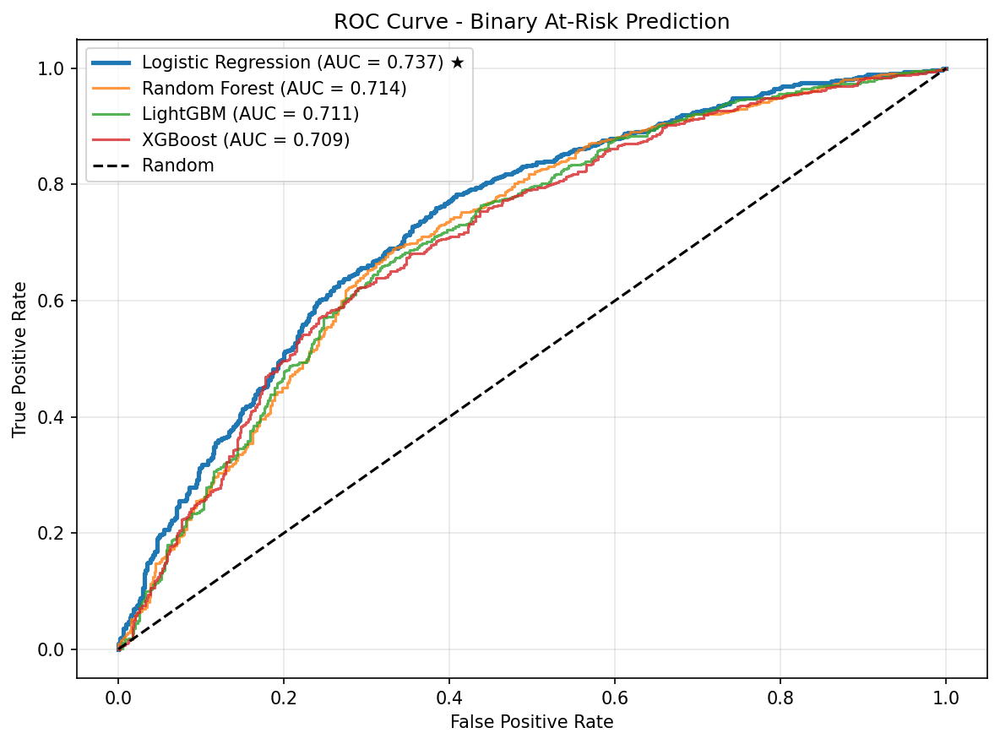

## 4.2 Feature Relevance Audit and Fixed-Contract Rationale

Information Gain analysis was used as a univariate relevance audit before final model interpretation. In the corrected missing-aware computation, the target entropy was $H(Y)=0.996773$ bits. The final model retained triglycerides, HDL cholesterol, LDL cholesterol, BMI, waist circumference, age, smoking status, physical activity, and alcohol use. Retention depended on non-circularity, availability, redundancy, accessibility, and clinical-covariate rationale as well as IG; therefore, the final feature set was not selected by taking the nine highest values.

A post-defense audit identified a defect in the earlier IG report: missing rows were omitted from the conditional-entropy contribution but remained in the total denominator. This disproportionately inflated missing-heavy estimates. Table 4.5 replaces those values with a calculation that treats missingness as an explicit category. CRP changed from the invalid value 0.502669 to 0.024212 with 48.3% missingness, fasting insulin changed from 0.378539 to 0.060456 with 32.0% missingness, and family history changed from 0.196282 to 0.014425 with 19.3% missingness. Because family-history missingness exactly identifies the 2021-2023 availability gap, even its corrected value may partly encode cycle. The earlier ranking is not used to support the final feature-selection claim.

**Table 4.5. Missing-Aware Information Gain, Entropy, and Feature Decisions**

| Rank | Candidate | Missing | $H(Y\mid X)$ | IG | IG% | Decision | Reason |
|---:|---|---:|---:|---:|---:|---|---|
| 1 | HDL | 2.0% | 0.9262 | 0.0706 | 7.08% | Retained | Non-diagnostic lipid predictor |
| 2 | Metabolic syndrome score | 0.0% | 0.9325 | 0.0643 | 6.45% | Excluded | Composite duplicate of retained components |
| 3 | Waist circumference | 2.0% | 0.9328 | 0.0640 | 6.42% | Retained | Accessible central-adiposity predictor |
| 4 | Fasting insulin | 32.0% | 0.9363 | 0.0605 | 6.07% | Excluded | Missing-heavy specialized assay; not routinely available |
| 5 | TG/HDL ratio | 2.6% | 0.9365 | 0.0603 | 6.05% | Excluded | Derived duplicate of retained TG and HDL |
| 6 | BMI | 0.8% | 0.9460 | 0.0508 | 5.10% | Retained | Accessible anthropometric predictor |
| 7 | Triglycerides | 2.6% | 0.9560 | 0.0408 | 4.09% | Retained | Non-diagnostic lipid predictor |
| 8 | BMI category | 0.8% | 0.9651 | 0.0316 | 3.17% | Excluded | Derived duplicate of continuous BMI |
| 9 | CRP | 48.3% | 0.9726 | 0.0242 | 2.43% | Excluded | Missing-heavy, cycle-limited, and absent from deployed workflow |
| 10 | Alcohol use | 0.0% | 0.9750 | 0.0218 | 2.19% | Retained | Behavioral covariate; not retained by IG alone |
| 11 | Systolic BP | 6.0% | 0.9761 | 0.0207 | 2.07% | Excluded | Removed from the cuff-free no-BP contract |
| 12 | Family history of diabetes | 19.3% | 0.9823 | 0.0144 | 1.45% | Excluded | Cycle-limited and absent from the deployed workflow |
| 13 | Total cholesterol | 2.0% | 0.9880 | 0.0088 | 0.88% | Excluded | Redundant with retained lipid components |
| 14 | Physical activity | 0.0% | 0.9886 | 0.0082 | 0.82% | Retained | Behavioral covariate; not retained by IG alone |
| 15 | LDL | 4.0% | 0.9913 | 0.0055 | 0.55% | Retained | Prespecified non-diagnostic lipid predictor |
| 16 | Age | 0.0% | 0.9925 | 0.0043 | 0.43% | Retained | Prespecified demographic covariate |
| 17 | Smoking status | 0.0% | 0.9926 | 0.0042 | 0.42% | Retained | Behavioral covariate; not retained by IG alone |
| 18 | Diastolic BP | 6.0% | 0.9946 | 0.0022 | 0.22% | Excluded | Removed from the cuff-free no-BP contract |

Derived variables such as TG/HDL ratio, BMI category, and metabolic syndrome score were excluded because they duplicate retained components. Blood pressure variables were excluded to preserve the no-cuff assessment contract. Lifestyle variables and age had low univariate IG but remained documented covariates; this choice should be assessed through future ablation and does not imply causal effects.

Figure 4.2 visualizes the corrected IG values beside missingness so that missing-heavy variables cannot appear strong without their availability being visible.

**Figure 4.2. Corrected Missing-Aware Information Gain Audit**

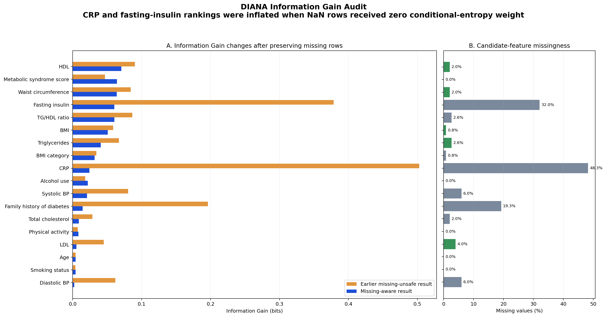

## 4.3 Model Comparison

The candidates were compared with the same outcome, nine-feature contract, survey-cycle splits, and AUC objective, although their model-specific grids had different sizes. Logistic Regression had the highest held-out AUC in each of the six survey cycles and the highest mean fold AUC at 0.7360. Random Forest averaged 0.7164, XGBoost 0.7129, and LightGBM 0.7118. Their sensitivity, specificity, and F1 values were close, so selection did not rest on claiming a clinically large separation in every metric.

The original implemented family-selection rule chose the highest mean outer-fold AUC, which selected Logistic Regression. Because using outer results to retain a family can create selection optimism, a post-defense sensitivity audit repeated the family choice inside each development partition using only inner grouped-CV AUC. Logistic Regression was again selected in all 6 of 6 development partitions before the corresponding held-out-cycle result was consulted. This consistency makes Logistic Regression the best-supported current candidate under the implemented design, but it does not make it universally superior.

**Table 4.6. Model Comparison Under LOGO Validation**

| Algorithm | Mean AUC ± Fold Standard Deviation (SD) | Mean Sensitivity | Mean Specificity | Mean F1 | AUC Wins Across 6 Cycles | Mean Threshold |
|---|---:|---:|---:|---:|---:|---:|
| Logistic Regression | 0.7360 ± 0.0277 | 0.7475 | 0.6053 | 0.7108 | 6 | 0.465 |
| Random Forest | 0.7164 ± 0.0186 | 0.7319 | 0.6004 | 0.7024 | 0 | 0.485 |
| XGBoost | 0.7129 ± 0.0132 | 0.7300 | 0.5889 | 0.6990 | 0 | 0.655 |
| LightGBM | 0.7118 ± 0.0173 | 0.7242 | 0.6030 | 0.6964 | 0 | 0.475 |

Table 4.6 contains means across the six held-out folds. It should not be mixed with the pooled out-of-fold specificity of 0.590 or pooled AUC confidence interval in Table 4.1. The two summaries answer different questions: fold means give equal weight to survey cycles, while pooled metrics give weight according to the number of records contributed by each cycle.

Table 4.7 adds paired, cycle-level evidence for the size and uncertainty of LR's AUC advantage. For each comparison, the unit was one of the six paired held-out-cycle AUC differences. The percentile interval used 50,000 bootstrap resamples of those six differences with replacement and random seed 42. The exact two-sided sign-flip test enumerated all $2^6=64$ possible sign assignments; the final column multiplies each unadjusted value by three and caps it at 1.0.

**Table 4.7. Exploratory Paired AUC Evidence for Logistic Regression**

| Paired Comparison | LR Wins | Mean AUC Difference | Six-Cycle Bootstrap 95% Percentile CI | Exact Sign-Flip p | Bonferroni-Adjusted p |
|---|---:|---:|---|---:|---:|
| LR minus Random Forest | 6/6 | 0.0196 | 0.0098 to 0.0323 | 0.0312 | 0.0938 |
| LR minus LightGBM | 6/6 | 0.0243 | 0.0080 to 0.0452 | 0.0312 | 0.0938 |
| LR minus XGBoost | 6/6 | 0.0232 | 0.0108 to 0.0396 | 0.0312 | 0.0938 |

These paired calculations are exploratory because there are only six survey-cycle units and the analysis was not preregistered. The unadjusted sign-flip result reflects LR winning every cycle, but the three-comparison Bonferroni-adjusted value of 0.0938 does not establish definitive superiority at the conventional 0.05 level. The defensible conclusion is consistent but modest discrimination improvement, not a decisive victory over all alternatives.

Coefficient-level interpretability provided a secondary reason to retain Logistic Regression after the AUC comparison. All four candidates can output probabilities; the distinctive practical advantage of LR is that its coefficients are directly inspectable. Timing did not determine selection. The archived microbenchmark timed the saved LR pipeline against separately trained synthetic-data comparison models, so it is not a fair speed comparison among the four validated candidate artifacts. The possibility that a lower-capacity linear model generalized better in this sample is a plausible interpretation, but the current evidence does not prove that the tree models overfit or that the true predictor-outcome relationship is linear.

Figure 4.3 shows that the result was not created by a single favorable release: LR ranked first in each of the six held-out cycles, although the absolute margins remained small.

**Figure 4.3. Candidate Model AUC by Held-Out Survey Cycle**

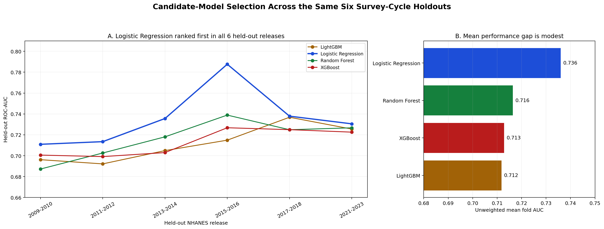

The isolated expanded-feature retrain then tested the 15-concept non-circular contract with fixed Logistic Regression. Table 4.7A reports summaries derived from all outer-cycle predictions; none of these rows replaced the active model. The complete 15-feature condition increased mean fold AUC by 0.0065 relative to the current-content baseline, from 0.7360 to 0.7426, while its between-cycle SD increased from 0.0277 to 0.0413. Removing CRP changed mean fold AUC by only -0.0002 relative to the complete condition. On the same 728 records from CRP/insulin-assayed cycles, including the within-cycle missing values handled by the pipeline, the complete and no-CRP conditions were 0.7653 and 0.7658, respectively. These differences do not demonstrate incremental CRP benefit or statistical equivalence.

**Table 4.7A. Exploratory Fixed-LR Expanded Non-Circular Feature Sensitivity**

| Cohort and Feature Condition | n | Mean Fold AUC ± SD | Aggregate ROC-AUC | Aggregate PR-AUC | Brier | Mean Fold AUC Difference From Stated Reference |
|---|---:|---:|---:|---:|---:|---:|
| All cycles: current-content baseline (9) | 1,376 | 0.7360 ± 0.0277 | 0.7366 | 0.7342 | 0.2095 | Reference |
| All cycles: expanded complete (15) | 1,376 | 0.7426 ± 0.0413 | 0.7423 | 0.7546 | 0.2060 | +0.0065 vs baseline |
| All cycles: expanded minus CRP (14) | 1,376 | 0.7423 ± 0.0413 | 0.7423 | 0.7547 | 0.2059 | +0.0063 vs baseline; -0.0002 vs complete |
| All cycles: expanded minus fasting insulin (14) | 1,376 | 0.7391 ± 0.0373 | 0.7403 | 0.7463 | 0.2068 | +0.0031 vs baseline |
| All cycles: expanded minus total cholesterol (14) | 1,376 | 0.7450 ± 0.0366 | 0.7443 | 0.7536 | 0.2055 | +0.0090 vs baseline |
| All cycles: expanded minus BMI (14) | 1,376 | 0.7435 ± 0.0407 | 0.7434 | 0.7588 | 0.2053 | +0.0075 vs baseline |
| All cycles: expanded minus waist (14) | 1,376 | 0.7431 ± 0.0377 | 0.7419 | 0.7539 | 0.2062 | +0.0071 vs baseline |
| CRP-assayed cycles: expanded complete (15) | 728 | 0.7653 ± 0.0251 | 0.7664 | 0.7502 | 0.1982 | -0.0005 vs paired no-CRP reference |
| CRP-assayed cycles: expanded minus CRP (14) | 728 | 0.7658 ± 0.0246 | 0.7664 | 0.7501 | 0.1982 | Paired reference |

The ablations should not be used to claim that BMI, waist, CRP, or another field is unimportant. BMI and waist were strongly correlated, as were LDL and total cholesterol, and survey-cycle-specific assay gaps complicate incremental interpretation. The expanded-minus-total-cholesterol row had the highest exploratory mean fold AUC (0.7450), but selecting that condition after reviewing the same outer results would be post-hoc and optimistic. No clinical materiality threshold or paired uncertainty analysis was prespecified for these feature-set contrasts. The supported conclusion is therefore narrower: the experiment did not provide locked, uncertainty-supported evidence sufficient to promote the missing-heavy 15-feature contract over the simpler current-content model.

**Figure 4.3A. Expanded Non-Circular Feature-Set AUC Comparison**

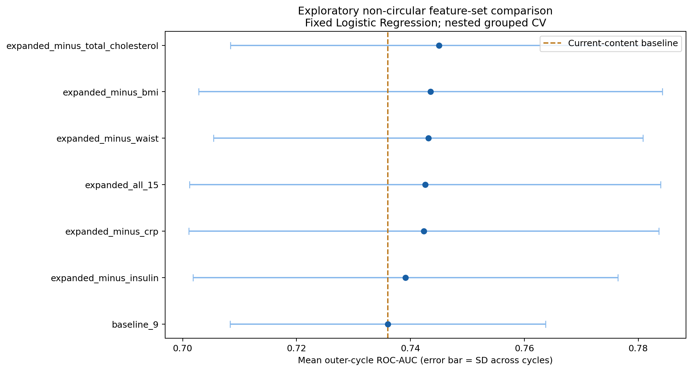

**Figure 4.3B. Expanded-Feature Missingness by NHANES Cycle**

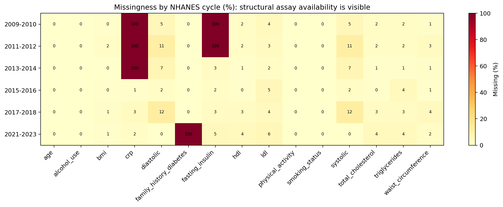

## 4.4 Calibration Analysis

The available calibration script applied the final model fitted on all 1,376 development records back to those same records. It produced a Brier score of 0.2087, expected calibration error of 0.0563, and a Hosmer-Lemeshow statistic of 24.75 using 10 quantile groups (8 degrees of freedom [df], $p\approx0.0017$). Even in sample, the latter rejects exact fit under that grouping. Because the evaluation records were also used for fitting, all three are apparent diagnostics and may still be optimistic; they are not out-of-fold, prospective, or external calibration evidence (Brier, 1950; Hosmer & Lemeshow, 1980; Van Calster et al., 2019).

**Table 4.8. Apparent Full-Cohort Calibration Diagnostics**

| Metric | Value | Interpretation |
|---|---:|---|
| Brier Score | 0.2087 | Apparent combined calibration/discrimination loss; optimistically estimated |
| Expected Calibration Error (ECE) | 0.0563 | Apparent average binwise gap; sensitive to binning |
| Hosmer-Lemeshow χ² | 24.75; 10 groups; 8 degrees of freedom; p≈0.0017 | Evidence of apparent miscalibration under this grouping |
| Evaluation sample size | 1,376 | Same cohort used to fit the final model |
| Positive records | 734 | Operational at-risk labels in that cohort |

The predicted probabilities should therefore be communicated as approximate screening-support scores, not calibrated individualized disease probabilities. The next required analysis is calibration from saved held-out or out-of-fold predictions for every candidate, followed by external recalibration in the intended Filipino population.

The diagnostics in Table 4.8 evaluate the base Logistic Regression output before the post-model metabolic-risk floor. In the deployed application, the served value may be higher for profiles meeting the heuristic indicators. A raised value is therefore a conservative screening alert rather than a recalibrated probability. Formal evaluation of the served value requires a separate held-out ablation.

## 4.5 Clustering Validation and Metabolic-Profile Distribution

Weighted K-Means with $K=4$ was evaluated on all 734 operational-label-positive records after applying the active clustering imputer and scaler. The earlier visualization that called `dropna()` represented only 686 records and is not used as proof of the active pipeline. Because the fitted objective scales each standardized dimension by the square root of its feature weight, primary metrics were recomputed in that geometry.

**Table 4.9. Weighted-Geometry K Sensitivity and Validation Metrics**

| K | Silhouette | Davies-Bouldin | Calinski-Harabasz | Interpretation |
|---:|---:|---:|---:|---|
| 2 | 0.2176 | 1.6605 | 209.03 | Highest silhouette and Calinski-Harabasz score; coarser partition |
| 3 | 0.2068 | 1.5583 | 193.21 | Intermediate granularity |
| 4 | 0.2079 | 1.3834 | 187.43 | Best Davies-Bouldin index; retained four-profile solution |
| 5 | 0.1761 | 1.4415 | 170.42 | Lower silhouette |
| 6 | 0.1632 | 1.4960 | 155.53 | Lowest silhouette in the scan |

For $K=4$, the earlier unweighted standardized-space values were silhouette 0.1762, Davies-Bouldin 1.5950, and Calinski-Harabasz 154.32. The geometry-matched values in Table 4.9 are the primary results because they evaluate the same weighted space minimized by the model. No single K dominated every metric: $K=2$ led silhouette and Calinski-Harabasz, whereas $K=4$ led Davies-Bouldin and preserved four-profile interpretability. Therefore, $K=4$ is reported as a design trade-off, not an objectively proven optimum.

The anonymous broad-$K$ analysis extended this check without forcing either $K=2$ or $K=4$ and without assigning names. Table 4.9A shows that $K=2$ supplied the clearest and most bootstrap-stable global split in all three specifications. The weighted operational-positive $K=4$ refit nevertheless remained locally stable (median bootstrap ARI 0.8732) and had a lower Davies-Bouldin value than the unflagged $K=2$, $K=3$, and $K=5$ solutions. At still larger $K$, some metrics continued to improve by isolating very small groups; those solutions were flagged rather than treated as biological discoveries. For example, the nominal best Davies-Bouldin value occurred at $K=14$ in the weighted view, but its smallest cluster contained only 3 records (0.4%).

**Table 4.9A. Anonymous Broad-$K$ Clustering Sensitivity Summary**

| Anonymous-Centroid Specification | n | K Scan | Hopkins Median | Highest-Silhouette K (Score) | Highest Bootstrap-Stability K (Median ARI) | K=4 Bootstrap ARI | Main Interpretation |
|---|---:|---:|---:|---:|---:|---:|---|
| Core 6, all records, equal weights | 1,376 | 2-20 | 0.855 | 2 (0.2264) | 2 (0.9412) | 0.6596 | Strong coarse split; all-record K=4 fell below the exploratory 0.70 reporting rule |
| Core 6, operational-positive, current weights | 734 | 2-20 | 0.841 | 2 (0.2151) | 2 (0.8989) | 0.8732 | K=4 remained locally stable, but it was not the global-separation leader |
| Core 6 + insulin + CRP, assayed cycles, equal weights | 728 | 2-15 | 0.776 | 2 (0.2212) | 2 (0.9192) | 0.5129 | Added assays supported a stable coarse split; finer solutions were unstable |

For the all-record equal-weight $K=2$ leader, anonymous centroid K02-C01 contained 772 records and had raw centers BMI 26.14 kg/m², triglycerides 97.81 mg/dL, LDL 127.01 mg/dL, HDL 65.86 mg/dL, age 54.86 years, and waist 90.69 cm. K02-C02 contained 604 records and had centers BMI 37.39 kg/m², triglycerides 163.69 mg/dL, LDL 122.30 mg/dL, HDL 49.82 mg/dL, age 54.25 years, and waist 115.33 cm. Anonymous IDs were assigned only for reproducible display; their numeric values and ordering do not imply normality, severity, risk level, diagnosis, or treatment.

Hopkins values above 0.5 indicate non-random clustering tendency, but they do not prove discrete disease entities. Bootstrap ARI evaluates sampling and refitting stability, not clinical validity. Regularized full-covariance Gaussian-mixture BIC led at $K=6$, $K=3$, and $K=2$ for the three rows, respectively, which further demonstrates that the preferred granularity depends on cohort, geometry, and model form.

**Figure 4.3C. Anonymous Weighted Operational-Positive K=2-20 Scan**

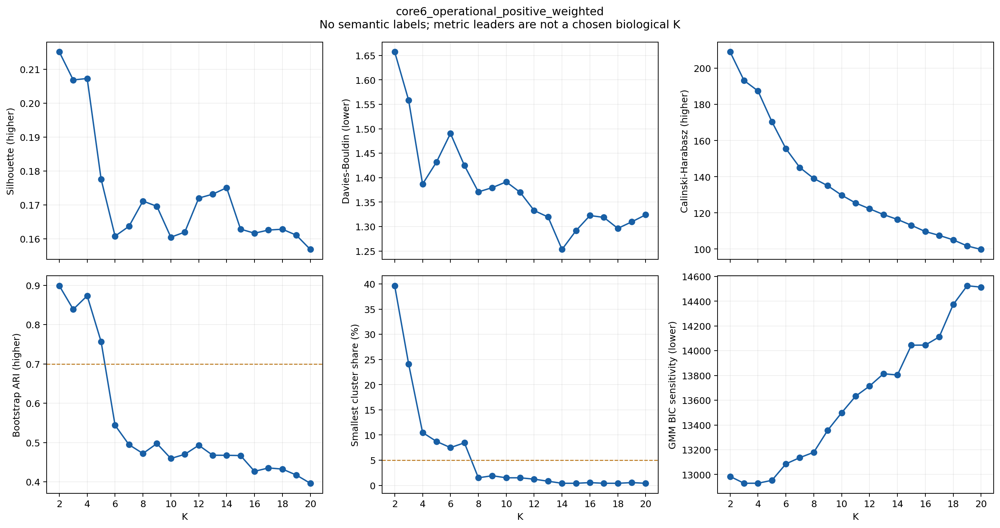

The expanded recent-cycle $K=5$ centroids provide a useful hypothesis-generating example without supporting a fifth clinical subtype. One anonymous centroid combined high triglycerides with higher insulin, while another combined much higher BMI and waist with higher CRP and insulin. For triglycerides, insulin, and CRP, the reported center is the inverse-`log1p` transformation of the K-Means center and is therefore a geometric-scale center, not the arithmetic mean of cluster members. The $K=5$ median bootstrap ARI was only 0.5263, below the implemented exploratory 0.70 reporting rule. The contrast is therefore an exploratory pattern for future replication, not a naming or treatment basis.

**Table 4.9B. Anonymous Expanded Eight-Feature K=5 Centroids (Hypothesis-Generating Only)**

| Anonymous ID | n (%) | BMI (kg/m²) | TG (mg/dL) | LDL (mg/dL) | HDL (mg/dL) | Age (years) | Waist (cm) | Fasting Insulin (µU/mL) | CRP (mg/L) |
|---|---:|---:|---:|---:|---:|---:|---:|---:|---:|
| K05-C01 | 113 (15.5%) | 23.35 | 58.87 | 111.60 | 85.77 | 55.65 | 84.51 | 4.81 | 1.11 |
| K05-C02 | 189 (26.0%) | 26.40 | 94.08 | 128.64 | 58.07 | 53.03 | 90.64 | 7.64 | 1.57 |
| K05-C03 | 161 (22.1%) | 32.52 | 95.26 | 118.89 | 60.09 | 57.74 | 105.69 | 10.36 | 5.03 |
| K05-C04 | 151 (20.7%) | 32.07 | 206.89 | 143.81 | 45.90 | 55.01 | 105.89 | 15.97 | 4.00 |
| K05-C05 | 114 (15.7%) | 43.99 | 104.79 | 110.82 | 51.84 | 52.39 | 125.68 | 21.19 | 9.20 |

**Figure 4.3D. Anonymous Expanded Eight-Feature K=5 Centroid Heatmap**

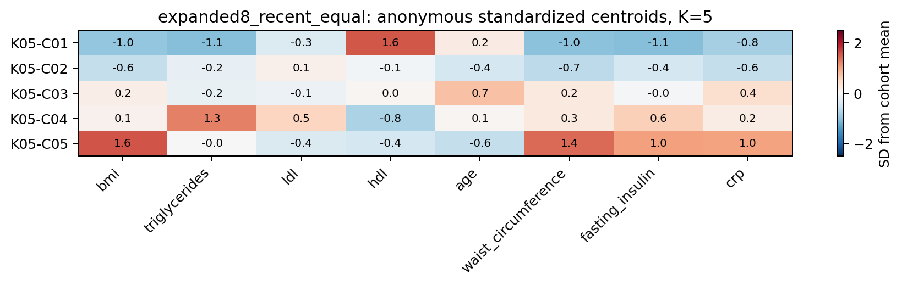

**Table 4.10. Raw Cluster, Centroid, and Researcher-Assigned Profile Crosswalk**

| Raw ID | Primary Profile (Legacy Alias) | n (%) | BMI (kg/m²) | TG (mg/dL) | LDL (mg/dL) | HDL (mg/dL) | Age (years) | Waist (cm) | Centroid Naming Evidence |
|---|---|---:|---:|---:|---:|---:|---:|---:|---|
| C2 | TG-waist dominant (SIRD-like) | 77 (10.5%) | 32.25 | 335.16 | 109.53 | 41.73 | 54.51 | 107.66 | Highest LAP-style centroid rank |
| C3 | LDL-dominant/atherogenic (SIDD-like) | 199 (27.1%) | 29.01 | 148.26 | 166.15 | 52.01 | 54.95 | 98.64 | Highest LDL among remaining centroids |
| C1 | Obesity-dominant (MOD-like) | 226 (30.8%) | 42.05 | 119.64 | 113.13 | 51.95 | 54.27 | 123.53 | Highest BMI among remaining centroids |
| C0 | Lower-metabolic-burden residual (MARD-like) | 232 (31.6%) | 28.25 | 97.78 | 102.55 | 62.40 | 55.42 | 94.98 | Final residual centroid |

Table 4.10 is the direct proof of how names were assigned. Weighted K-Means generated the raw membership IDs; the deterministic waterfall then mapped the fixed centroids to semantic names. C2's code-level LAP-style score was 16,643 because the implementation used triglycerides in mg/dL. With triglycerides converted to mmol/L, the conventional-scale value is approximately 187.9; the constant conversion leaves C2 ranked first. The C3 alias does not demonstrate insulin deficiency, the C1 centroid represents severe rather than mild obesity, and the C0 alias is not supported as age-driven because the centroid ages span only about 1.15 years.

**Figure 4.4. Operational-Label-Positive Cluster Distribution and Centroid Profiles**

**(a) Cluster distribution for all 734 records**

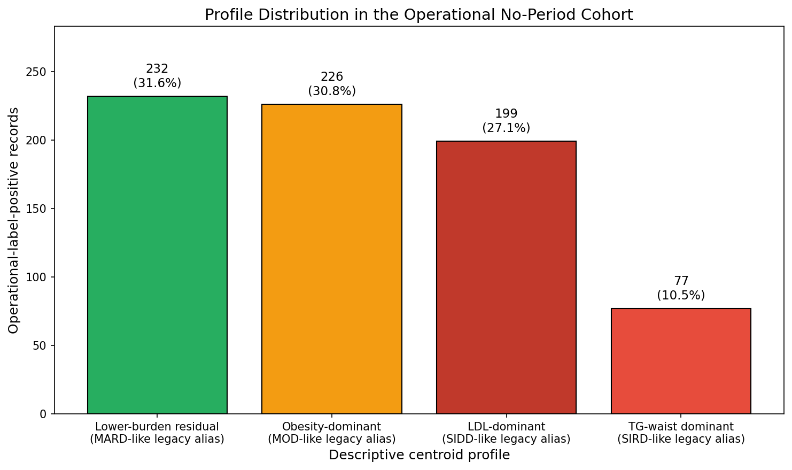

**(b) Centroid heatmap from the same frozen 734-record training artifact**

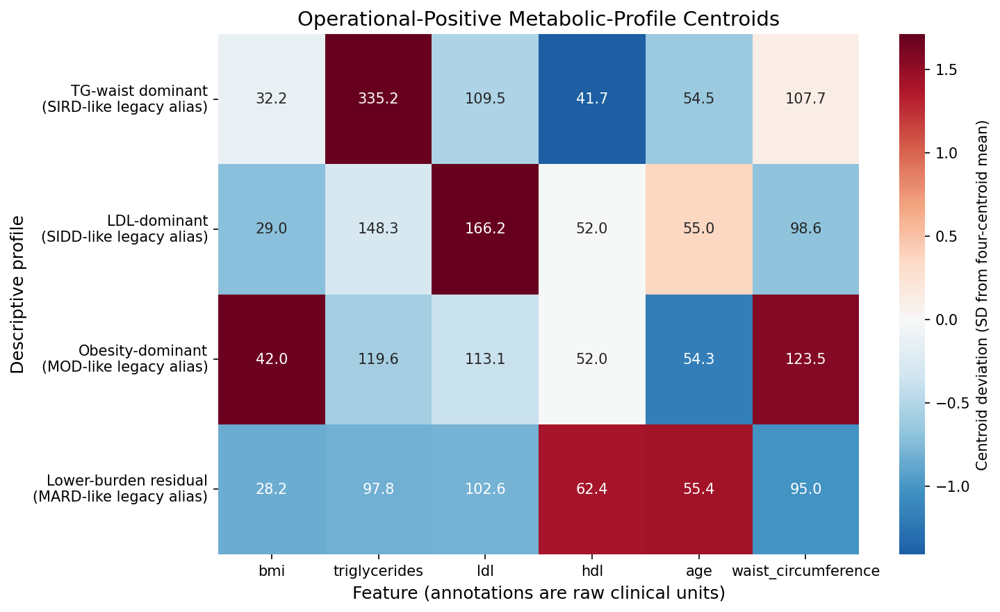

Both panels in Figure 4.4 come from the dated imputed 734-record training snapshot; neither is the rejected 686-case complete-case proof. In panel (b), color represents each feature's centroid deviation in standard-deviation units across the four centroids, while annotations retain raw clinical units. This prevents high-magnitude units such as mg/dL from dominating the visual comparison.

**Figure 4.5. Centroid-Level Naming Waterfall**

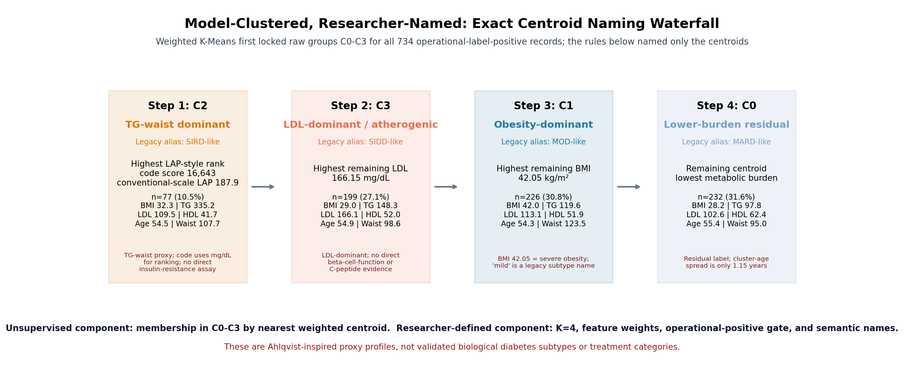

Figure 4.5 turns the crosswalk into an auditable sequence: name the highest TG-waist centroid first, then the remaining highest-LDL centroid, then the remaining highest-BMI centroid, and finally the residual centroid.

The local robustness audit used the same 734-record cohort. Across 30 initialization seeds, the minimum adjusted Rand index (ARI) relative to the frozen partition was 0.9536. Across one-feature-at-a-time weight changes of minus 20%, minus 10%, plus 10%, and plus 20%, the minimum ARI was 0.9185 and minimum semantic-label agreement was 97.0%. These results support robustness to initialization and small local weight perturbations only. They do not prove sampling stability, external reproducibility, or biological validity.

Figure 4.6 reports these two local perturbation checks separately so that seed stability is not confused with validation on a new sample.

**Figure 4.6. Full-Cohort Initialization and Weight-Perturbation Stability**

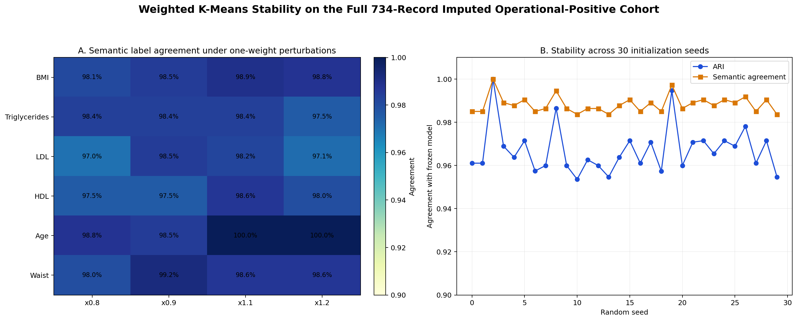

The exclusion of normal-labeled records from profile assignment was also tested empirically. When $K=4$ was refitted to all 1,376 records using the same preprocessing and weights, the assignments of the 734 operational-label-positive records had ARI 0.685 relative to the operational-positive-only solution. Matched centroids moved by a mean of 0.586 weighted standard-deviation units, and one all-cohort cluster was 67.0% normal. This demonstrates that including normals consumes cluster capacity and materially changes the operational-positive partition. It does not prove that every centroid would be “contaminated,” nor does it prove disease progression.

Figure 4.7 visualizes this normal-inclusion ablation and quantifies the changed partition rather than relying on a verbal contamination claim.

**Figure 4.7. Normal-Inclusion Clustering Ablation**

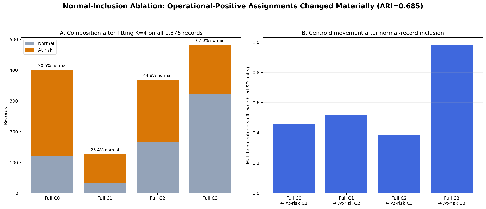

To examine whether the four profiles differed by the RHQ031 response, the frozen no-period-cohort centroids were applied to an exploratory same-NHANES female comparison group aged 45 to 60 who reported a period in the prior year. The comparison contained 591 eligible records, of which 231 met the same operational positive definition. It was not age matched, and the centroids were not refitted on this group.

Table 4.11 gives the frozen-centroid profile counts and percentage-point differences for the development and exploratory comparison groups.

**Table 4.11. Exploratory Frozen-Centroid Profile Comparison by Menstrual Status**

| Primary Profile | No Period in Prior Year, Positive n (%) | Period Reported, Positive n (%) | Difference, Percentage Points |
|---|---:|---:|---:|
| TG-waist dominant | 77 (10.5%) | 17 (7.4%) | +3.1 |
| LDL-dominant/atherogenic | 199 (27.1%) | 57 (24.7%) | +2.4 |
| Obesity-dominant | 226 (30.8%) | 79 (34.2%) | -3.4 |
| Lower-metabolic-burden residual | 232 (31.6%) | 78 (33.8%) | -2.2 |

No clear profile-distribution difference was detected ($\chi^2$ p = 0.382; Cramer's $V=0.056$). This does not establish equivalence, especially because the period-reported group was smaller and not age matched. The result gives no support for claiming that menopause caused or uniquely defined the profiles. Such a claim would require correctly phenotyped reproductive groups, prespecified adjustment or matching, and independent validation.

Figure 4.8 presents the same comparison visually; its overlapping distributions are descriptive and must not be interpreted as proof of equivalence.

**Figure 4.8. Exploratory Menstrual-Status Profile Comparison**

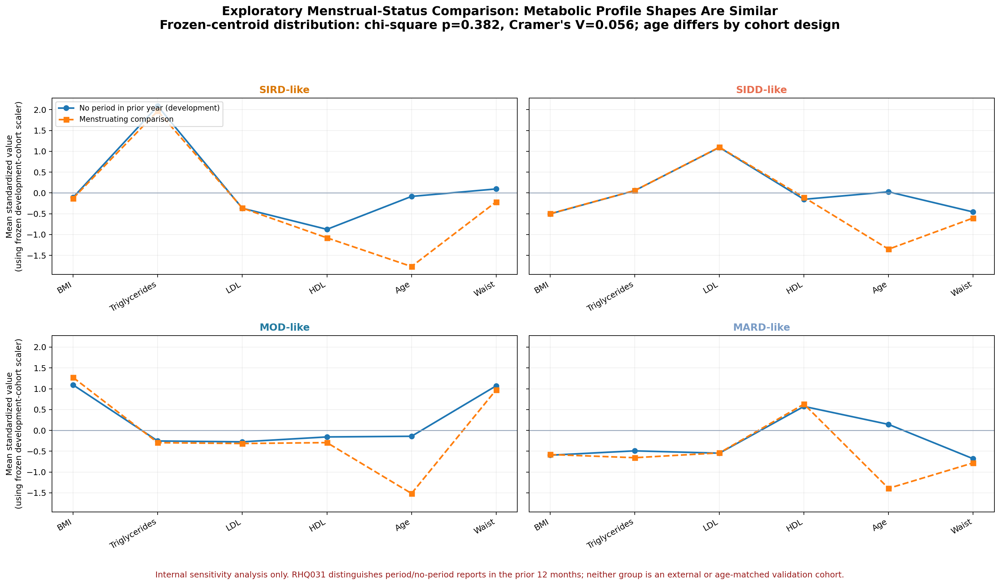

Overall, the clustering results show heterogeneous lipid-and-adiposity patterns within operational-label-positive records from the no-period cohort. They do not establish biological diabetes subtypes, treatment categories, or menopause-specific mechanisms.

## 4.6 Preprocessing and Leakage Validation Results

The attrition audit reproduced every cohort gate from the merged releases to the final analytic cohort: 61,626 raw records, 31,518 female respondents, 4,922 within ages 45 to 60, 2,826 meeting the reproductive-health criterion, 2,736 with HbA1c available, and 1,376 in the fasting-laboratory cohort. Thus, 2.23% of the merged raw records remained after all eligibility and data-availability requirements. This percentage describes analytic-cohort construction and must not be interpreted as disease prevalence.

Figure 4.9 shows both the retained count and records removed at every gate, making the elimination process reproducible rather than presenting only the final sample size.

**Figure 4.9. NHANES Cohort Attrition and Exclusion Counts**

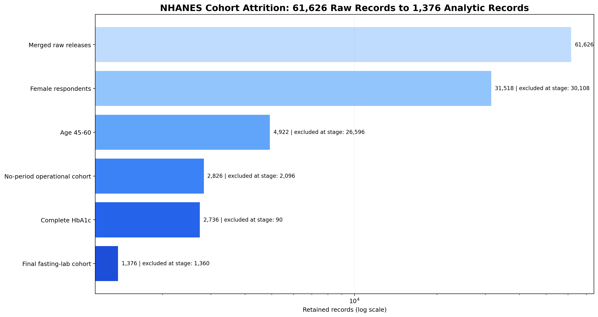

The raw reproductive-health reason audit confirms that the final set is not uniformly confirmed postmenopausal. Later cycles contained 581 self-reported menopause/change-of-life responses, 310 hysterectomy responses, 70 other reasons, and 3 “don't know” responses. Earlier cycles contained 402 combined menopause/hysterectomy responses and 10 medical, other, or unknown responses. These are descriptive questionnaire counts within the final 1,376-record cohort, not clinically adjudicated menopause diagnoses.

Figure 4.10 separates the questionnaire eras because the earlier response option combined menopause and hysterectomy, whereas later releases recorded hysterectomy separately.

**Figure 4.10. Reason for No Menstrual Period by NHANES Questionnaire Era**

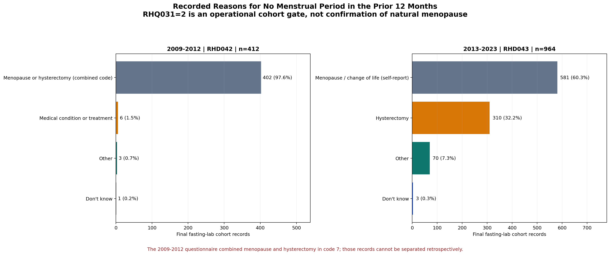

Direct DIQ010-only versus HbA1c-only categorization agreed for 831 of 1,376 records (60.4%). The hybrid operational label agreed with HbA1c-only categories for 1,295 records (94.1%), but that higher percentage is circular because HbA1c is part of the hybrid hierarchy; it is reported only to correct the earlier interpretation, not as independent validity evidence. Outlier flagging identified 35 records (2.5%) with at least one plausibility flag; they were retained.

The leakage pipeline confirmed that diagnostic glycemic variables were absent from classifier and clustering feature lists. No retained numeric or encoded feature exceeded $|r|>0.95$ with the binary $I(\mathrm{HbA1c}\ge6.5\%)$ indicator; the highest observed value was triglycerides at $r=0.3241$. This rules out a near-duplicate linear proxy under the implemented test, not every possible indirect association.

This supports the narrower methodological claim that DIANA's observed discrimination was not produced by directly entering HbA1c or FBS. It does not convert the concurrent hybrid target into a future Type 2 Diabetes outcome.

## 4.7 Functional Testing Results

Functional testing verified the implemented system across backend, ML service, and frontend layers. The backend test suite passed in the current verification run and covered configuration, caching behavior, API request handling, access-control checks, ML integration, service logic, PDF generation, and data persistence. Assessment tests verified critical clinical guardrails, including target age-boundary enforcement, missing waist-circumference handling for ML imputation, out-of-range HbA1c warning behavior, and successful assessment creation.

Using the repository-root `.venv` Python environment, the ML service test suite passed all 309 collected tests in the current verification run. These tests covered clustering behavior, clustering weight sensitivity and perturbation stability, leakage prevention, cohort-rule checks, feature parity, prediction behavior, service access, authentication checks, drift scheduling, SHAP background behavior, threshold optimization, production API-key configuration failure behavior, clinical scenario validation, minor-revision evidence invariants, 18 inner and 6 outer training-only BMI/waist imputer checks, an end-to-end six-cycle expanded LR training test with CRP and all 15 allowed concepts, all-missing CRP width preservation, corrected missing-aware IG, and anonymous broad-$K$ specifications. The reproductive-cohort test now verifies the narrower `Operational no-period cohort` value; it is a processing-contract test, while the raw RHD042/RHD043 audit in Section 4.6 supplies the relevant phenotype evidence. The most recently documented frontend unit and contract coverage suite passed with 232 tests. That recorded frontend coverage run met the configured gates, with 71.26 percent line and statement coverage, 60.55 percent branch coverage, and 44.24 percent function coverage. A fresh frontend rerun in this revision environment was blocked before test execution by a missing Rollup optional native dependency, so the older frontend counts are not presented as a new run.

Table 4.12 separates passed checks from the cache integration tests that remain dependent on an external service.

**Table 4.12. Functional Validation Summary**

| Validation Area | Evidence Reviewed | Status |
|---|---|---|
| Backend services | Authentication, access control, assessment creation, clinical guardrails, persistence, and PDF report generation | Passed |
| Assessment guardrails | Age-boundary enforcement, missing waist handling, HbA1c warning propagation, and successful assessment creation | Passed |
| ML service | 309 tests covering prediction, leakage prevention, clustering, preprocessing fit boundaries, end-to-end expanded non-circular LR training with CRP/all allowed concepts, anonymous broad-K contracts, cohort rules, SHAP, drift monitoring, threshold optimization, production API-key configuration failure behavior, clinical scenarios, and revision-evidence invariants | All 309 passed using repository-root `.venv`; operational no-period field test is not clinical phenotype proof |
| Frontend workflow | 232 unit and contract tests covering authentication, forms, result display, service contracts, and UI components | Passed in the most recently documented coverage run |
| Frontend coverage | Recorded coverage met the configured project policy: 71.26% lines/statements, 60.55% branches, and 44.24% functions | Passed in the most recently documented coverage run |
| Fresh frontend rerun | Test process did not start because the current installation lacked the Rollup optional native module | Environment blocked; prior documented result retained |
| Cache integration tests | Require the external cache service to be available | Environment dependent |

The remaining technical-readiness gaps therefore concern environment-dependent cache integration evidence, formal UAT, broader scored expert-panel review, accessibility audit, and production load testing rather than the frontend coverage gate.

## 4.8 UI Workflow Integration

The implemented DIANA workflow begins with user authentication and proceeds to dashboard review, biomarker data entry, prediction generation, result interpretation, trend visualization, and report export. The dashboard presents recent assessments and risk summaries. The default thesis workflow uses the locked screening model and collects age, height, weight-derived BMI, lipid biomarkers, optional waist circumference, lifestyle variables, and notes. Alternate model variants are outside the default evaluation workflow.

Current runtime eligibility is not identical to the development cohort. The backend checks the 45-to-60 age range but does not receive or enforce the no-period-in-prior-year criterion. Broader reproductive-status information collected during onboarding is profile data, not a prediction gate. Accordingly, a score served to a premenopausal or perimenopausal user, or to any user whose reproductive criterion is unknown, is an out-of-scope prototype output rather than evidence-backed use in the modeled population.

After form submission, the backend validates the request, sends the relevant assessment payload to the ML service, receives prediction and lineage metadata, stores the assessment, refreshes affected cached views when applicable, and returns the result to the interface. The result display presents a served screening score, category, legacy `subtype` context when available, model version, dataset lineage, biomarker snapshot, guardrail output, and next-step text. SHAP explainability is supported through a separate explanation workflow when outputs are available, but it explains the base LR component rather than any increase made by the runtime floor.

The result interface presents outputs in a layered hierarchy. The first layer shows binary screening classification through score, category, and threshold context. The second layer shows metabolic-profile context through the legacy `subtype` field only when an operational-positive output is available. The third layer presents guardrails and follow-up text. A code-to-manuscript audit found that the active cluster metadata and result components can still render Ahlqvist-style diabetes labels, fixed risk-factor statements, insulin-resistance or age-linked interpretations, cluster-specific actions, and treatment-style wording. Separate education, authentication, and administrator-rationale copy also retains claims about menopause-specific understanding, a postmenopausal cohort, future diabetes risk, or temporal generalization. Those strings are not supported by the corrected evidence and are current implementation limitations, not study findings. They must be replaced by the cohort, endpoint, profile, and blocked-validation language used in this manuscript before clinical-facing UAT.

The interface screenshots in Figures 4.11 through 4.13 are local evidence captures documented in `docs/07-research/thesis-drafts/screenshots/README.md`. The manifest records the capture date, local frontend and backend endpoints, 1440 x 1000 PNG dimensions, source views, and SHA-256 hashes. They are used only as interface-evidence figures; no synthetic SHAP screenshot is included in the clean draft. The earlier assessment-form capture was excluded because it preserved superseded “Estimated from BMI if blank” copy after the BMI-to-waist rule was removed. The current source instead states “Model-imputed if blank”; a new capture should be recorded before the final UI appendix is frozen.

**Figure 4.11. Main Dashboard Interface**

**Figure 4.12. Current Assessment Result Modal**

The screenshot was captured from the running application using a completed assessment. For the shown inputs, the displayed 65% value is the served heuristic floor triggered by the four DIANA metabolic-risk indicators; it is not the base Logistic Regression probability or a calibrated probability of future diabetes. The figure documents the current interface state and does not constitute validation of every interpretation string shown by the runtime components. It does not include synthetic SHAP values.

**Figure 4.13. Personal Trends Visualization**

The screenshot shows the current trends view after assessment creation; multi-point trend lines require additional historical assessments.

This workflow demonstrates that the model was not evaluated only as an isolated algorithm. It was integrated into a functioning screening-support application with authentication, persistence, visualization, explainability, trends, and report-generation capabilities.

## 4.9 System Performance and Deployment Readiness

The system architecture separates routine application operations from ML inference and explanation generation. The backend manages authentication, validation, persistence, caching, and response orchestration, while the ML service performs prediction, clustering, explainability, and monitoring-related functions. This separation reduces the risk that computationally heavier ML operations will degrade ordinary application interactions.

The tracked inference artifact was generated on macOS on 2026-05-15 using one fixed nine-feature row, five warm-up calls, and 100 timed single-row `predict_proba` calls per model. Mean timed call latency was approximately 0.62 ms for the saved Logistic Regression pipeline, 13.09 ms for a separately fitted Random Forest, and 0.25 ms for a separately fitted LightGBM model. The latter two were trained on 1,000 synthetic random rows for this microbenchmark rather than loaded from the validated candidate run; the values therefore are not a fair candidate-model speed comparison. The artifact does not identify the processor, include batch workloads, or measure HTTP transport, database work, SHAP generation, frontend rendering, or concurrent users. A prior draft's precise 205 ms service-and-explanation figure has no corresponding tracked benchmark artifact and is not retained as evidence. The supported claim is limited to local single-row call feasibility in that environment.

Production performance claims therefore remain qualified. Concurrent load testing with authenticated users, database writes, cache refreshes, ML requests, and frontend rendering has not yet been completed; for this reason, production-scale readiness is not claimed.

Deployment readiness was first assessed at the configuration level and then checked against the live deployment on 2026-05-30. The live external and operator-level audit used the backend host `diana-v2.duckdns.org`, the configured frontend origin `https://diana-v2.vercel.app`, and the deployed virtual private server (VPS) configuration. It verified effective public port exposure, Hypertext Transfer Protocol Secure (HTTPS) certificate behavior, CORS allow-list behavior, backend-to-ML proxy behavior, operational health responses, host firewall posture, database TLS behavior, and ML API-key enforcement. In Table 4.13, DNS means Domain Name System, UFW means Uncomplicated Firewall, SSH means Secure Shell, HSTS means HTTP Strict Transport Security, and DSN means data source name. Sensitive operational details such as usernames, private paths, secret values, tokens, and connection strings are intentionally excluded from the manuscript evidence.

Table 4.13 distinguishes live checks from configuration evidence and states the boundary of each result.

**Table 4.13. Live and Configuration-Level Deployment Readiness Summary**

| Verification Item | Evidence Reviewed | Status |
|---|---|---|
| Public ingress and host exposure | DNS resolved to `143.198.222.21`; ports 80 and 443 accepted connections, while 22, 8080, 5000, 5001, and 5432 timed out from external audit machines; operator audit showed UFW active with default incoming deny and SSH allowed only from the Tailscale address range | Live external exposure and host firewall checks passed |
| TLS certificate and HTTPS behavior | HTTP returned a redirect to HTTPS; HTTPS presented a Let's Encrypt certificate for `diana-v2.duckdns.org` valid from 2026-05-09 to 2026-08-07, with certificate verification returning OK | Live TLS check passed |
| Security headers | Live HTTPS responses included HSTS, content-type protection, frame protection, referrer policy, permissions policy, and content security policy headers | Live header check passed |
| Production CORS behavior | Preflight from `https://diana-v2.vercel.app` returned 204 with the expected allow-origin and credential headers; lookalike or unrelated origins returned 403 | Live CORS check passed |
| Backend and database health | Authenticated operations health returned healthy backend, database ping, and ML health statuses; public PostgreSQL port 5432 was not reachable externally; the backend database DSN used `sslmode=require`, and a redacted `psql` connection-info check against the same DSN reported TLS 1.3 with `TLS_AES_256_GCM_SHA384` | Live health, database exposure, and database TLS checks passed |
| ML exposure and API-key enforcement | Public `/ml` and `/predict` paths returned 404; unauthenticated `/api/v1/ml/health` returned 401; backend and ML containers were configured with `ML_API_KEY`; direct internal ML no-key and fake-key calls to `/insights/metrics` returned 401; authenticated backend `/api/v1/ml/insights/metrics` returned 200 | Live proxy-boundary and ML API-key enforcement checks passed |
| Runtime secret handling | Repository configuration injects database credentials, JWT secret, and ML API key through runtime environment variables rather than committed literals | Configuration evidence present |

This audit upgrades the earlier configuration-only deployment review for public exposure, TLS, production CORS, ML proxy behavior, database TLS, host firewall posture, and ML API-key enforcement. It does not replace production load testing, penetration testing, or a formal clinical security assessment.

## 4.10 User Acceptance Testing Status and Reported Doctor Feedback

The community UAT protocol was defined but had not yet been executed at manuscript preparation. Consequently, Chapter 4 reports no System Usability Scale (SUS) score, task-success rate, completion time, or community-user quotation.

According to the authors' summary, one physician used DIANA, inspected the assessment workflow, reviewed the displayed features and risk-output presentation, and discussed the basis for the weighted K-Means profile module. The reported comments were generally favorable about screening-support usefulness, and the main question concerned why particular clustering features had higher weights and how those weights affected assignment. However, the repository contains no primary dated form, transcript, consent record, credential-verification artifact, scoring rubric, or raw response. Table 4.14 therefore records author-reported development feedback and the manuscript response; it is not an empirical expert-review result.

Table 4.14 links each area of physician feedback to the clarification or limitation added to the manuscript.

**Table 4.14. Author-Reported Doctor Feedback and Manuscript Response**

| Review Area | Author-Reported Feedback | Manuscript Response |
|---|---|---|
| Feature set and workflow | The implemented features and assessment flow were considered acceptable and useful for screening-support use. | Core workflow retained and described as screening support rather than diagnosis. |
| Feature weighting | The main clarification concerned why features such as LDL, triglycerides, waist circumference, BMI, HDL, and age were weighted differently in clustering. | Section 3.10 now clarifies that weights are literature-informed heuristic design parameters used for standardized geometric distance, not medically validated clinical weights. |
| Citation support | Additional support was requested for the rationale behind weighted features. | The manuscript strengthens the link to metabolic-syndrome, lipid-accumulation, and data-driven diabetes-subgroup literature. |
| Evidence boundary | The authors reported a favorable usefulness impression, but no primary review record was available. | The feedback is treated as anecdotal development input and does not establish face validity or external clinical validation. |

Internal walkthroughs also identified areas for improvement, including visibility of medical-history fields, SHAP legend clarity, mobile assessment-form usability, and explanation of Ahlqvist-inspired proxy subtype labels. These observations are treated as internal review notes rather than formal community UAT results.

## 4.11 User Interface and User Experience Design and Accessibility Readiness

The interface applies visual organization principles to support comprehension of clinical information. Related fields are grouped together, risk categories use consistent visual styling, and charts present longitudinal patterns through continuous visual trends. Risk status is communicated through both color and text labels to reduce dependence on color alone.

The application includes accessibility-oriented labels, keyboard-accessible controls, responsive layouts, visible status text, and device-aware rendering aligned where applicable with the Web Content Accessibility Guidelines (WCAG) 2.2 (World Wide Web Consortium, 2023). Formal contrast and assistive-technology testing remain incomplete; this is accessibility readiness, not WCAG conformance certification.

Table 4.15 distinguishes implemented accessibility-oriented features from the formal tests that are still pending.

**Table 4.15. Accessibility and UI Readiness Items**

| Area | Current Evidence | Status |
|---|---|---|
| Color and text risk labels | Risk states use both visual color and text labels | Implemented |
| Keyboard-accessible controls | Core interactive controls support keyboard interaction | Implemented; formal audit pending |
| Accessibility labels and status text | Alerts, dialogs, and navigation controls include accessibility-oriented labels | Implemented; formal audit pending |
| Responsive layout | Responsive design rules support mobile, tablet, laptop, and desktop layouts | Implemented |
| Device-aware rendering | Lower-capability devices receive reduced visual complexity | Implemented |
| Contrast ratios | Automated contrast-test result not yet collected | Pending formal accessibility testing |
| Assistive-technology testing | Screen-reader and assistive workflow testing not yet completed | Pending formal accessibility testing |

## 4.12 Internal Benchmark Reconstruction

After reporting implementation, testing, and usability-readiness evidence, this section returns to Phase 4 model evaluation for a contextual comparison with reconstructed screening baselines. The comparison is placed here to keep it separate from the primary candidate-family selection in Section 4.3. It is an internal reconstruction, not external validation.

DIANA and the reconstructed tools used the same cohort, binary outcome, and held-out survey-cycle groups where variables were available. However, the benchmark script selected each comparator's classification threshold by maximizing F1 directly on its held-out cycle, whereas DIANA's thresholds were selected from development predictions. Comparator sensitivity and specificity are therefore test-label-tuned and are not used for head-to-head operating-point claims. Table 4.16 retains only area under the ROC curve, which is threshold-independent, while still labeling the different aggregation and uncertainty summaries. The Finnish Diabetes Risk Score (FINDRISC)-like comparator achieved mean fold AUC 0.849, but it used an elevated-glucose or HbA1c proxy for the history-of-high-blood-glucose component. It is therefore an optimistic, partially circular upper bound.

**Table 4.16. Internal Benchmark Reconstruction Results**

| Tool | AUC-ROC Estimate | AUC Uncertainty Summary | Summary Basis and Interpretation |
|---|---:|---|---|
| FINDRISC-like upper-bound | 0.849 | Fold SD 0.035 | Unweighted mean across six held-out cycles; optimistic reconstruction using a glycemic proxy |
| DIANA | 0.737 | Conditional row-bootstrap 95% CI 0.710-0.763 | Pooled held-out records; no direct glycemic predictor inputs |
| OmniRisk (Approximated) | 0.688 | Fold SD 0.025 | Unweighted mean across six held-out cycles; internal approximation |
| Simple Clinical Model | 0.677 | Fold SD 0.021 | Unweighted mean across six held-out cycles; minimal-feature reconstruction |
| ADA Risk Test reconstruction | 0.597 | Fold SD 0.033 | Unweighted mean across six held-out cycles; internal reconstruction |

The DIANA row uses pooled held-out records, whereas comparator point estimates are unweighted means across the six held-out cycles; Table 4.16 labels this difference rather than presenting the uncertainty summaries as interchangeable. The AUC results supply internal ranking context only. They do not establish operating-point superiority, because the comparator thresholds were test-label-tuned, and they do not establish published-tool superiority, because several tools required approximated or unavailable variables. A fair head-to-head study must freeze or derive every tool's threshold from development data before evaluating the held-out cycle and then validate the tools in an external target population.

## 4.13 Study Limitations

Several limitations define what can be concluded from the study.

First, RHQ031=2 identifies no period in the prior year, not natural menopause. At least 310 records explicitly reported hysterectomy, 70 reported another reason, and earlier releases combined menopause with hysterectomy. The 1,376-record development population is therefore an operational no-period cohort broader than the intended postmenopausal population. Model performance cannot be attributed specifically to menopause.

Second, the outcome is a concurrent hybrid status, not incident Type 2 Diabetes. It combines a current HbA1c measurement with an “ever told” DIQ010 response and includes already diagnosed respondents. DIQ010 excludes pregnancy-only diabetes but does not identify diabetes type. Direct DIQ010-only versus HbA1c-only agreement was 60.4%, while the previously reported 94.1% hybrid-versus-HbA1c value was circular. Treatment effects, recall, undiagnosed dysglycemia, and measurement variability further limit the label as a gold standard.

Third, all development used U.S. NHANES. LOGO held out survey cycles but was not forward-chaining; most folds trained on releases both earlier and later than the test cycle. NHANES weights were not used, and counts are not prevalence estimates. The fasting-laboratory gate excluded 49.7% of otherwise HbA1c-complete records without a retained-versus-excluded comparison, creating possible selection bias; the application also does not verify fasting status for submitted lipid values. PPV and NPV are conditional on the selected cohort's 53.3% hybrid-label-positive fraction and are not deployment estimates for Filipino users. The row-level bootstrap intervals did not resample cycles, refit models, or repeat family selection, so they underrepresent full pipeline uncertainty.

Fourth, the final family-selection rule used mean outer-fold AUC. A post-defense inner-CV family-selection check also chose LR in 6/6 development partitions, but choosing the retained family from outer results can be optimistic. Candidate grids and imbalance assumptions differed; XGBoost's fixed positive weight of 2.0 did not match the observed negative-to-positive ratio of approximately 0.875. The LR encoding also imposed equal numeric steps on behavioral categories and mapped unknown values to existing substantive categories without a sensitivity analysis. With six cycle groups, approximately 0.02 mean AUC gaps, and Bonferroni-adjusted paired $p=0.0938$, LR is the best-supported current candidate under the implemented comparison, not a universally superior algorithm.

Fifth, the corrected IG audit was conducted after defense because the earlier calculation inflated missing-heavy variables. The fixed feature contract was not selected inside LOGO, so reported performance is conditional on it and does not include feature-selection uncertainty. The expanded 15-feature sensitivity was exploratory, used fixed LR rather than a fully locked external comparison, and was complicated by structural CRP, insulin, and family-history missingness. It found only a 0.0065 mean fold AUC increase and no demonstrated incremental CRP benefit, but it was not designed to prove equivalence or rule out value in a consistently assayed external cohort. Calibration is also incomplete: full-cohort values are apparent, and the 10-group Hosmer-Lemeshow result ($p\approx0.0017$) indicates in-sample lack of fit under that grouping.

Sixth, clustering is heuristic and theory-informed. The eligibility gate, $K=4$, weights, and names were researcher-defined; only raw nearest-centroid membership was algorithmic. The broad anonymous scan showed that $K=2$ led global separation and bootstrap stability, while the weighted operational-positive $K=4$ solution remained a locally stable, researcher-chosen granularity. The expanded insulin/CRP $K=5$ pattern was unstable. Row-level bootstrap stability did not reproduce NHANES strata, primary sampling units, or survey weights. Seed, weight, bootstrap, and leave-cycle-out checks do not establish individual certainty, biological validity, or external replication. The period-reported comparison detected no clear distribution difference but was not age matched and did not establish equivalence. The profiles cannot be claimed as menopause-specific or menopause-caused.

Seventh, the earlier post-training BMI-to-waist estimate was removed. Missing waist now follows component-specific behavior: the classifier uses its saved all-cohort imputer, the clusterer uses a separate operational-positive-cohort imputer, and the post-model floor does not count a missing waist indicator. The remaining metabolic-risk floor is an engineered safeguard without held-out ablation. SHAP values explain base-model associations, not causes, behavior change, or the rule-raised served value. The current interface can place the served score beside an explanation of only the LR component. Legacy runtime `subtype` metadata, result components, education pages, authentication copy, and administrator rationale also contain unsupported fixed risk, treatment, menopause-specific, postmenopausal-cohort, future-risk, or temporal-generalization wording. These outputs should be removed or rewritten before clinical-facing evaluation.

Eighth, the application enforces age but not the no-period development criterion at prediction time. It can therefore score broader onboarding groups for which no model-performance evidence was reported. This is a training-serving population mismatch; the intended gate must be enforced or each additional reproductive group must be labeled out of scope and validated separately.

Ninth, community UAT, scored multi-expert review, accessibility testing, production load testing, and penetration testing remain incomplete. The reported single-physician feedback lacks a primary archived record and is treated as anecdotal development input only. DIANA is therefore a screening-support research prototype, not a diagnostic system, incident-risk model, or validated treatment tool.

## 4.14 Recommendations for Future Action and Research

Future work should close the demonstrated evidence gaps before expanding DIANA's clinical scope.

Table 4.17 converts each major limitation into a specific next analysis and names the evidence required before a stronger claim would be defensible.

**Table 4.17. Limitation-to-Next-Study Roadmap**

| Priority | Unresolved Question | Required Next Study or Analysis | Evidence Needed Before Stronger Claim |
|---:|---|---|---|
| 1 | What is the intended population? | Rebuild the cohort using explicit menopause-reason and relevant surgical/ovarian variables; validate the locked current model in a correctly phenotyped Filipina postmenopausal cohort; study perimenopause separately; enforce the validated population at serving time or label other outputs out of scope | Transparent inclusion flow, phenotype counts, runtime-gate tests, external discrimination, and recalibration |
| 2 | Is the endpoint current dysglycemia or future Type 2 Diabetes? | For concurrent screening, use an independent clinical reference; for incident prediction, exclude prevalent diabetes and define a prospective horizon and type-specific outcome | Prespecified estimand, index date, outcome window, and adjudicated reference |
| 3 | Is LR retained under a fully locked analysis? | Preregister features, grids, class-balance settings, behavioral encodings, cycle-aware uncertainty, and selection rule; compare ordinal coding with one-hot and explicit-unknown alternatives; use externally nested selection; save all candidate out-of-fold probabilities; derive every reconstructed tool's threshold from development data before comparison | Reproducible selection frequency, encoding sensitivity, fair threshold policy, paired uncertainty, decision curves, and out-of-fold calibration |
| 4 | Are the four profiles reproducible and biologically meaningful? | Treat $K=2$ as the leading coarse alternative; independently replicate anonymous $K=2$, $K=4$, and hypothesis-generating higher-$K$ centroids; use consensus clustering; collect consistently assayed CRP, insulin, GAD, C-peptide or HOMA2-B, and insulin-resistance measures; derive weights through multi-expert review | Replicated centroids, sampling-stability intervals, and biological-marker separation |
| 5 | Are profiles associated specifically with menopause? | Compare correctly phenotyped and age-matched or adjusted reproductive groups in an independent cohort | Effect estimates and uncertainty without causal or equivalence overclaiming |
| 6 | Do serving safeguards and presentation language support safe interpretation? | Validate saved-pipeline missing-input behavior in the intended population; ablate the metabolic-risk floor on held-out predictions; explain base-model and rule contributions separately; remove treatment-style cluster metadata and stale result, education, authentication, and administrator copy; blind clinicians to review changed cases | Changes in errors, calibration, explanation reconciliation, copy audit, net benefit, and clinician agreement |
| 7 | Can people use the system safely and feasibly? | Execute community UAT; conduct scored multi-physician review, accessibility audit, security testing, and authenticated load testing | Task success, System Usability Scale scores, accessibility findings, expert agreement, and service performance |
| 8 | Is deployment economically and behaviorally useful? | Measure total workflow cost, confirmatory testing and referral; then conduct a longitudinal impact study | Cost-effectiveness, referral yield, follow-up completion, behavior, and health outcomes |

The no-blood-pressure design may reduce one access barrier, but lipid panels, confirmatory testing, clinician review, infrastructure, and participant time still carry costs. Cost claims should therefore be measured rather than described as near zero. Cardiovascular-scope expansion should follow, not precede, validation of the current diabetes-screening contract.

## 4.15 Chapter Synthesis

This study demonstrated a functioning prototype trained on 1,376 NHANES women aged 45 to 60 who reported no period in the prior year, with HbA1c and FBS excluded from nine predictor inputs. DIQ010 “yes” denoted a self-reported history of being told by a health professional that diabetes was present and did not establish menopause. The target was a current hybrid operational status—not future Type 2 Diabetes—and the cohort was not uniformly confirmed postmenopausal. Under blocked leave-cycle-out validation, LR produced pooled AUC 0.7366 and fold-policy sensitivity 0.748. It ranked first in all six held-out cycles and all six post-defense inner-CV family-selection checks. This supports retaining LR under the current design without establishing universal superiority; the gaps were modest and the comparison retained conditional intervals, unequal search and imbalance settings, and selection limitations. The expanded 15-feature LR sensitivity improved mean fold AUC by only 0.0065 and showed no demonstrated incremental CRP benefit; it was retained as exploratory evidence rather than promoted.

The clustering audit documented how 734 operational-label-positive records were assigned to raw weighted-centroid groups and how researchers mapped C0-C3 to TG-waist dominant, LDL-dominant/atherogenic, obesity-dominant, and lower-metabolic-burden residual profiles. A separate anonymous scan reported every centroid through $K=20$ for the two core-feature specifications and through $K=15$ for the expanded insulin/CRP specification, without imposing names. It identified $K=2$ as the strongest global and bootstrap-stable split; the current weighted $K=4$ remained locally stable but was not uniquely optimal. A possible insulin/TG-versus-adiposity/CRP split at expanded $K=5$ was unstable and hypothesis-generating only. None of these findings validates Ahlqvist biological subtypes or individual treatment categories. The exploratory period-reported comparison detected no clear distribution difference and provides no evidence that the profiles were caused by or unique to menopause.

The study did not demonstrate a correctly phenotyped postmenopausal development cohort, future Type 2 Diabetes prediction, external Filipino validity, calibrated individualized probability, biological subtype validity, treatment benefit, causal or served-score-complete SHAP effects, completed community acceptance, or production clinical readiness. DIANA's defensible current role is a research screening-support prototype whose positive output may prompt confirmatory review only within its stated evidence boundary. Cohort redefinition, runtime-gate enforcement, explicit endpoint design, external prospective validation, locked model comparison with out-of-fold calibration, independent cluster replication, safeguard ablation, UI language cleanup, and formal user and expert evaluation are required before stronger claims.

# References

Ahlqvist, E., Storm, P., Karajamaki, A., Martinell, M., Dorkhan, M., Carlsson, A., ... & Groop, L. (2018). Novel subgroups of adult-onset diabetes and their association with outcomes: A data-driven cluster analysis of six variables. *The Lancet Diabetes & Endocrinology*, 6(5), 361-369. https://doi.org/10.1016/S2213-8587(18)30051-2

Alberti, K. G. M. M., Eckel, R. H., Grundy, S. M., Zimmet, P. Z., Cleeman, J. I., Donato, K. A., ... & Smith, S. C. (2009). Harmonizing the metabolic syndrome. *Circulation*, 120(16), 1640-1645. https://doi.org/10.1161/CIRCULATIONAHA.109.192644

American Diabetes Association Professional Practice Committee for Diabetes. (2026). 2. Diagnosis and classification of diabetes: Standards of Care in Diabetes--2026. *Diabetes Care, 49*(Supplement 1), S27-S49. https://doi.org/10.2337/dc26-S002

Bangor, A., Kortum, P. T., & Miller, J. T. (2008). An empirical evaluation of the System Usability Scale. *International Journal of Human-Computer Interaction*, 24(6), 574-594. https://doi.org/10.1080/10447310802205776

Breiman, L. (2001). Random forests. *Machine Learning*, 45, 5-32. https://doi.org/10.1023/A:1010933404324

Brier, G. W. (1950). Verification of forecasts expressed in terms of probability. *Monthly Weather Review*, 78(1), 1-3. https://doi.org/10.1175/1520-0493(1950)078%3C0001:VOFEIT%3E2.0.CO;2

Brooke, J. (1996). SUS: A quick and dirty usability scale. In P. W. Jordan, B. Thomas, B. A. Weerdmeester, & I. L. McClelland (Eds.), *Usability Evaluation in Industry* (pp. 189-194). Taylor & Francis.

Calinski, T., & Harabasz, J. (1974). A dendrite method for cluster analysis. *Communications in Statistics - Theory and Methods*, 3(1), 1-27. https://doi.org/10.1080/03610927408827101

Centers for Disease Control and Prevention, National Center for Health Statistics. (2012). *Reproductive Health Questionnaire: Data documentation, codebook, and frequencies: RHQ_F, NHANES 2009-2010*. https://wwwn.cdc.gov/Nchs/Data/Nhanes/Public/2009/DataFiles/RHQ_F.htm

Centers for Disease Control and Prevention, National Center for Health Statistics. (2016). *Reproductive Health Questionnaire: Data documentation, codebook, and frequencies: RHQ_H, NHANES 2013-2014*. https://wwwn.cdc.gov/Nchs/Data/Nhanes/Public/2013/DataFiles/RHQ_H.htm

Centers for Disease Control and Prevention, National Center for Health Statistics. (2020). *Diabetes Questionnaire: Data documentation, codebook, and frequencies: DIQ_J, NHANES 2017-2018*. https://wwwn.cdc.gov/Nchs/Data/Nhanes/Public/2017/DataFiles/DIQ_J.htm

Centers for Disease Control and Prevention, National Center for Health Statistics. (2024a). *NHANES questionnaires, datasets, and related documentation: August 2021-August 2023*. https://wwwn.cdc.gov/nchs/nhanes/continuousnhanes/default.aspx?Cycle=2021-2023

Centers for Disease Control and Prevention, National Center for Health Statistics. (2024b). *Brief overview of sample design, nonresponse bias assessment, and analytic guidelines for NHANES August 2021-August 2023*. https://wwwn.cdc.gov/nchs/nhanes/continuousnhanes/OverviewBrief.aspx?Cycle=2021-2023

Centers for Disease Control and Prevention, National Center for Health Statistics. (2024c). *Reproductive Health Questionnaire: Data documentation, codebook, and frequencies: RHQ_L, NHANES August 2021-August 2023*. https://wwwn.cdc.gov/Nchs/Data/Nhanes/Public/2021/DataFiles/RHQ_L.htm

Chen, T., & Guestrin, C. (2016). XGBoost: A scalable tree boosting system. *Proceedings of the 22nd ACM SIGKDD International Conference on Knowledge Discovery and Data Mining*, 785-794. https://doi.org/10.1145/2939672.2939785

Davies, D. L., & Bouldin, D. W. (1979). A cluster separation measure. *IEEE Transactions on Pattern Analysis and Machine Intelligence*, PAMI-1(2), 224-227. https://doi.org/10.1109/TPAMI.1979.4766909

Dennis, J. M., Shields, B. M., Henley, W. E., Jones, A. G., & Hattersley, A. T. (2019). Disease progression and treatment response in data-driven subgroups of type 2 diabetes compared with models based on simple clinical features: An analysis using clinical trial data. *The Lancet Diabetes & Endocrinology*, 7(6), 442-451. https://doi.org/10.1016/S2213-8587(19)30087-7

Efron, B., & Tibshirani, R. J. (1993). *An Introduction to the Bootstrap*. Chapman & Hall/CRC.

Hosmer, D. W., & Lemeshow, S. (1980). Goodness of fit tests for the multiple logistic regression model. *Communications in Statistics - Theory and Methods*, 9(10), 1043-1069. https://doi.org/10.1080/03610928008827941

International Diabetes Federation. (2006). *The IDF consensus worldwide definition of the metabolic syndrome*. https://idf.org/news-and-resources/resources/idf-consensus-worldwide-definition-of-the-metabolic-syndrome/

International Organization for Standardization. (2023). *ISO/IEC 25010:2023 Systems and software engineering - Systems and software Quality Requirements and Evaluation (SQuaRE) - Product quality model*. https://www.iso.org/standard/78176.html

Jones, M., Bradley, J., & Sakimura, N. (2015). *JSON Web Token (JWT)* (RFC 7519). Internet Engineering Task Force. https://www.rfc-editor.org/rfc/rfc7519.html

Kahn, H. S. (2005). The "lipid accumulation product" performs better than the body mass index for recognizing cardiovascular risk: A population-based comparison. *BMC Cardiovascular Disorders, 5*, 26. https://doi.org/10.1186/1471-2261-5-26

Ke, G., Meng, Q., Finley, T., Wang, T., Chen, W., Ma, W., Ye, Q., & Liu, T.-Y. (2017). LightGBM: A highly efficient gradient boosting decision tree. *Advances in Neural Information Processing Systems*, 30. https://papers.nips.cc/paper/6907-lightgbm-a-highly-efficient-gradient-boosting-decision-tree

Lumley, T. (2010). *Complex Surveys: A Guide to Analysis Using R*. John Wiley & Sons.

Lundberg, S. M., & Lee, S. I. (2017). A unified approach to interpreting model predictions. *Advances in Neural Information Processing Systems*, 30. https://papers.neurips.cc/paper/7062-a-unified-approach-to-interpreting-model-predictions

Luque, A., Carrasco, A., Martin, A., & de las Heras, A. (2019). The impact of class imbalance in classification performance metrics based on the binary confusion matrix. *Pattern Recognition*, 91, 216-231. https://doi.org/10.1016/j.patcog.2019.02.023

MacQueen, J. (1967). Some methods for classification and analysis of multivariate observations. In *Proceedings of the Fifth Berkeley Symposium on Mathematical Statistics and Probability* (Vol. 1, pp. 281-297).

National Cholesterol Education Program (NCEP) Expert Panel on Detection, Evaluation, and Treatment of High Blood Cholesterol in Adults. (2001). Third Report of the National Cholesterol Education Program (NCEP) Expert Panel on Detection, Evaluation, and Treatment of High Blood Cholesterol in Adults (Adult Treatment Panel III) final report. *Circulation*, 106(25), 3143-3421.

Powers, D. M. W. (2011). Evaluation: From precision, recall and F-measure to ROC, informedness, markedness and correlation. *Journal of Machine Learning Technologies*, 2(1), 37-63.

Provos, N., & Mazieres, D. (1999). A future-adaptable password scheme. In *Proceedings of the 1999 USENIX Annual Technical Conference*. https://www.usenix.org/conference/1999-usenix-annual-technical-conference/future-adaptable-password-scheme

Rousseeuw, P. J. (1987). Silhouettes: A graphical aid to the interpretation and validation of cluster analysis. *Journal of Computational and Applied Mathematics*, 20, 53-65. https://doi.org/10.1016/0377-0427(87)90125-7

Shreffler, J., & Huecker, M. R. (2023). Diagnostic testing accuracy: Sensitivity, specificity, predictive values and likelihood ratios. In *StatPearls*. StatPearls Publishing. https://www.ncbi.nlm.nih.gov/books/NBK557491/

Vabalas, A., Gowen, E., Poliakoff, E., & Casson, A. J. (2019). Machine learning algorithm validation with a limited sample size. *PLOS ONE*, 14(11), e0224365. https://doi.org/10.1371/journal.pone.0224365

Van Calster, B., McLernon, D. J., van Smeden, M., Wynants, L., Steyerberg, E. W., Bossuyt, P., Collins, G. S., Macaskill, P., Moons, K. G. M., & Vickers, A. J. (2019). Calibration: The Achilles heel of predictive analytics. *BMC Medicine*, 17, 230. https://doi.org/10.1186/s12916-019-1466-7

Wang, Y., Wang, X., & Zeng, L. (2024). Lipid Accumulation Product as a Predictor of Prediabetes and Diabetes: Insights From NHANES Data (1999-2018). *Journal of Diabetes Research, 2024*, Article 2874122. https://doi.org/10.1155/2024/2874122

World Health Organization. (2000). *The Asia-Pacific perspective: Redefining obesity and its treatment*. World Health Organization Western Pacific Region.

World Health Organization. (2021). *Ethics and governance of artificial intelligence for health: WHO guidance*. https://www.who.int/publications/i/item/9789240029200

World Health Organization. (2024, October 16). *Menopause*. https://www.who.int/news-room/fact-sheets/detail/menopause

World Wide Web Consortium. (2023). *Web Content Accessibility Guidelines (WCAG) 2.2*. https://www.w3.org/TR/WCAG22/

Youden, W. J. (1950). Index for rating diagnostic tests. *Cancer*, 3(1), 32-35. https://doi.org/10.1002/1097-0142(1950)3:1%3C32::AID-CNCR2820030106%3E3.0.CO;2-3
