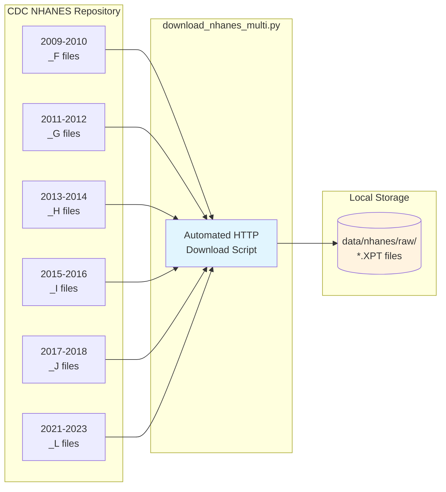
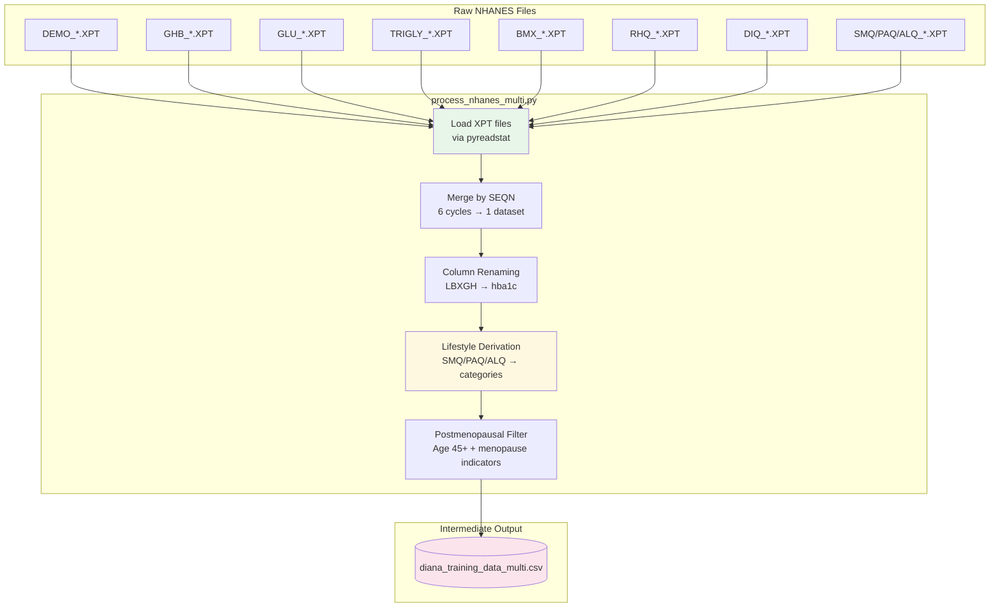
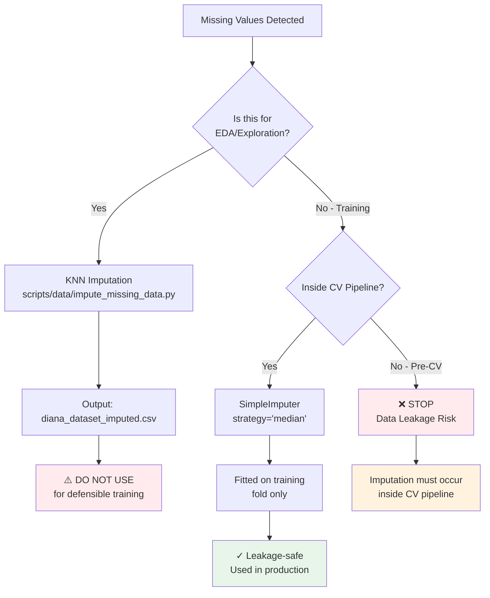
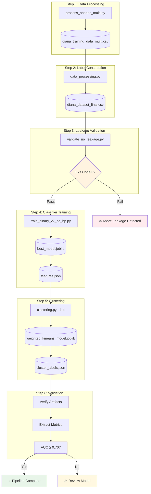
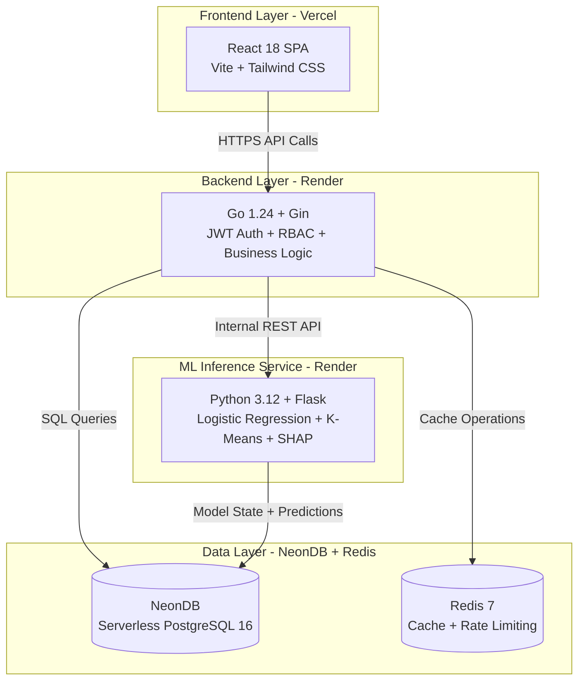
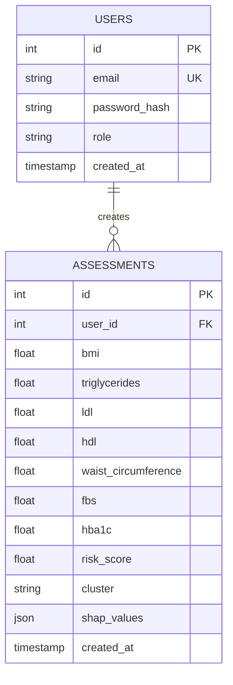
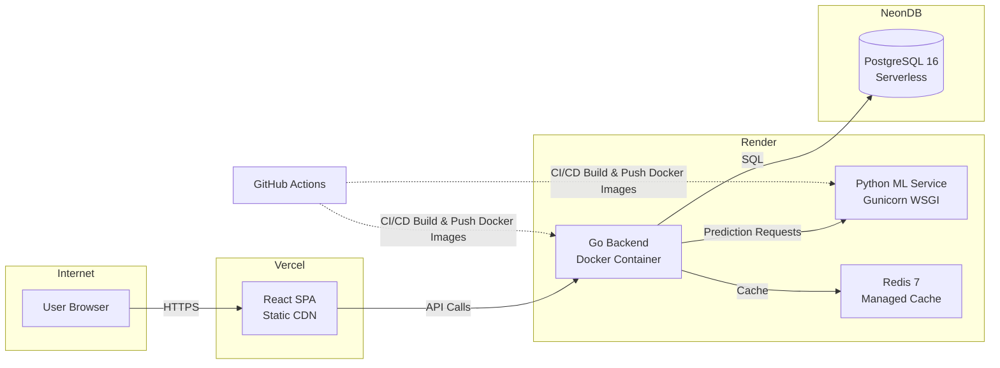

# DIANA Thesis Results and Discussion

---

## Chapter 3: Methodology

### 3.1 Data Acquisition and Preprocessing Pipeline

The training dataset was constructed from the National Health and Nutrition Examination Survey (NHANES), a nationally representative health examination survey conducted by the Centers for Disease Control and Prevention (CDC) (CDC/NCHS, 2023). This section documents the complete data acquisition, preprocessing, and feature engineering pipeline from raw NHANES files to the final training dataset.

#### 3.1.1 Data Acquisition

Raw NHANES data files were downloaded from the CDC public repository using an automated Python download script. The dataset spans **six survey cycles** from 2009-2023, broadly covering the post-ADA HbA1c diagnostic guidelines era (established 2010) and supporting more consistent interpretation of glycemic thresholds across cycles.

**Table 3.0.1 — NHANES Survey Cycles Included**

| Cycle | Years | File Suffix | Sample Design | Notes |
|-------|-------|-------------|---------------|-------|
| 2021-2023 | 2-year | `_L` | COVID-adapted | Most recent available; resumed August 2021 after pandemic suspension |
| 2017-2018 | 2-year | `_J` | Standard | Pre-pandemic baseline |
| 2015-2016 | 2-year | `_I` | Standard | - |
| 2013-2014 | 2-year | `_H` | Standard | - |
| 2011-2012 | 2-year | `_G` | Standard | - |
| 2009-2010 | 2-year | `_F` | Standard | First cycle post-ADA HbA1c guidelines (2010) |

**Note on 2019-2020 Cycle Exclusion:** The 2019-2020 NHANES cycle was excluded due to significant data collection disruptions caused by the COVID-19 pandemic. Field operations were suspended in March 2020, resulting in incomplete data with potential selection bias. The subsequent 2021-2023 cycle resumed in August 2021 following the pandemic suspension, maintaining the standard 2-year cycle format.

**NHANES Data Files Downloaded:**

The following NHANES examination and questionnaire files were acquired for each cycle:

| File Code | Description | Key Variables |
|-----------|-------------|---------------|
| DEMO | Demographics | Age, sex, race/ethnicity (RIDRETH1/RIDRETH3), survey weights |
| GHB | Glycohemoglobin | HbA1c (LBXGH) — primary diagnostic biomarker |
| GLU | Fasting Glucose | Fasting plasma glucose (LBXGLU) — secondary diagnostic |
| TCHOL | Total Cholesterol | Total cholesterol (LBXTC) |
| HDL | HDL Cholesterol | HDL-C (LBDHDD) — protective lipid |
| TRIGLY | Triglycerides & LDL | Triglycerides (LBXTR), calculated LDL |
| BMX | Body Measures | BMI (BMXBMI), waist circumference (BMXWAIST) |
| RHQ | Reproductive Health | Menopause status (RHQ060), age at menopause |
| DIQ | Diabetes Questionnaire | Self-reported diagnosis (DIQ010) — primary label source |
| SMQ | Smoking | Smoking status (SMQ020, SMQ040) |
| PAQ | Physical Activity | Activity levels (PAQ605, PAQ650, PAQ665) |
| ALQ | Alcohol Use | Alcohol consumption (ALQ101, ALQ151) |
| MCQ | Medical Conditions | Family history diabetes (MCQ300C) |
| INS | Insulin | Fasting insulin (LBXIN) — subsample only |
| HSCRP | High-sensitivity CRP | Inflammation marker (LBXCRP) |

**Figure 3.0.1 — NHANES Data Acquisition Flow**



**Implementation Reference:** `scripts/data/download_nhanes_multi.py:19-76`

---

#### 3.1.2 Data Merging and Feature Derivation

Raw NHANES XPT files (SAS Transport format) were merged by SEQN (unique respondent identifier) and processed through a multi-stage pipeline to construct the analytic dataset.

**Figure 3.0.2 — Data Processing Pipeline**



**Lifestyle Feature Derivation:**

Three categorical lifestyle features were derived from NHANES questionnaire responses using rule-based classification:

| Feature | Source Variables | Categories | Derivation Logic |
|---------|------------------|------------|------------------|
| `smoking_status` | SMQ020, SMQ040 | Never, Current, Former, Unknown | SMQ020=2 → Never; SMQ020=1 + SMQ040∈[1,2] → Current; SMQ020=1 + SMQ040=3 → Former |
| `physical_activity` | PAQ605, PAQ650, PAQ665 | Active, Moderate, Sedentary, Unknown | Any vigorous (PAQ605=1 or PAQ650=1) → Active; Any moderate → Moderate; All no → Sedentary |
| `alcohol_use` | ALQ101, ALQ120Q, ALQ120U, ALQ130 | None, Heavy, Moderate, Light, Unknown | ALQ101=2 → None; If drinks: >7/week → Heavy; >3/week → Moderate; else → Light |

The categorization of physical activity levels within the NHANES dataset was guided by the World Health Organization's (WHO) emphasis on moderate-to-vigorous physical activity as a key health behavior (Bull et al., 2020). Because the available NHANES questionnaire variables are categorical rather than complete minute-by-minute activity measures, DIANA uses a simplified rule-based proxy (vigorous activity -> Active; moderate activity -> Moderate; no reported activity -> Sedentary) rather than claiming exact adherence to WHO weekly minute thresholds.

**Column Standardization:**

NHANES variable codes were renamed to clinically meaningful names for interpretability:

| NHANES Code | Clinical Name | Description |
|-------------|---------------|-------------|
| LBXGH | hba1c | Glycated hemoglobin (%) |
| LBXGLU | fbs | Fasting blood sugar (mg/dL) |
| BMXBMI | bmi | Body mass index (kg/m²) |
| BMXWAIST | waist_circumference | Waist circumference (cm) |
| LBXTR | triglycerides | Triglycerides (mg/dL) |
| LBDHDD | hdl | HDL cholesterol (mg/dL) |
| LBDLDL | ldl | LDL cholesterol (mg/dL) |

**Implementation Reference:** `scripts/data/process_nhanes_multi.py:32-150`

---

#### 3.1.3 Cohort Selection and Label Construction

Following data merging, the cohort was filtered to the target population and study reference labels were assigned.

**Cohort Selection Criteria:**

1. **Sex**: Female (RIAGENDR = 2)
2. **Age**: 45-60 years (target menopausal population)
3. **Menopause Status**: Postmenopausal indicators from RHQ questionnaire
4. **Complete Biomarkers**: Non-missing values for required features
5. **Fasting Subsample**: 8-12 hour fasting status for valid glucose/lipid measurements

**Label Construction:**

Study reference diabetes status labels were assigned using the dual-source hierarchy documented below. The `data_processing.py` script implements:

1. **Primary**: Self-reported physician diagnosis (DIQ010)
2. **Secondary**: HbA1c thresholds for undiagnosed cases
3. **Hard Override**: HbA1c ≥6.5% → Diabetic regardless of self-report

**Output:** `diana_dataset_final.csv` with n=1,376 postmenopausal women

**Table 3.1 - Class Distribution**

| Class | Count | Proportion |
|-------|-------|------------|
| Normal | 642 | 46.7% |
| Pre-diabetic | 457 | 33.2% |
| Diabetic | 277 | 20.1% |
| **Total** | **1,376** | **100%** |

**Binary Reformulation:** For the screening model, Pre-diabetic and Diabetic classes were combined into a single "At-Risk" class (n=734, 53.3%), with Normal (n=642, 46.7%) as the negative class. This binary formulation prioritizes sensitivity for case-finding in a screening context.

**Implementation Reference:** `Ian_ML/training/data_processing.py:38-295`

---

#### 3.1.4 Missing Data Handling Methodology

NHANES data contains missing values due to survey non-response, subsample designs, and examination skip patterns. DIANA implements a **leakage-safe imputation strategy** that preserves the integrity of nested cross-validation.

**Figure 3.0.3 — Missing Data Handling Decision Framework**



**Why Median Imputation?**

The selection of **median imputation** (vs. mean or KNN) was guided by clinical and statistical considerations:

| Strategy | Pros | Cons | Decision |
|----------|------|------|----------|
| **Mean** | Simple, preserves mean | Sensitive to outliers; skewed distributions | Rejected |
| **Median** | Robust to outliers; preserves central tendency | May understate variance | **Selected** |
| **KNN** | Borrows from similar patients; captures multivariate patterns | Causes data leakage if applied globally; computationally expensive | EDA only |
| **MICE** | Multiple imputation; uncertainty quantification | More complex to implement and pool correctly within nested CV | Not implemented |

**Clinical Rationale for Median:**

1. **Outlier Robustness**: Clinical biomarkers (triglycerides, LDL, fasting glucose) often exhibit right-skewed distributions where extreme values represent genuine pathological states. Median is unaffected by these extremes, unlike mean.

2. **Distribution Preservation**: For biomarkers with skewed distributions, the median better represents the "typical" patient value.

3. **Pipeline Compatibility**: `SimpleImputer(strategy='median')` integrates directly into scikit-learn `Pipeline`, ensuring imputation is fitted exclusively on training folds during cross-validation.

Median imputation was selected specifically due to the non-linear, right-skewed distribution characteristic of metabolic biomarkers like triglycerides. Recent frameworks for handling missing data in clinical structured datasets emphasize that matching the imputation approach to the specific property of the missing values is critical to preventing biased estimates (Afkanpour et al., 2025).

**Leakage-Safe Implementation:**

The imputer is embedded **inside the sklearn Pipeline**, ensuring it is fitted only on training data during cross-validation:

```python
# From train_binary_v2_no_bp.py:207-216
preprocessor = ColumnTransformer([
    ("continuous", Pipeline([
        ("imputer", SimpleImputer(strategy="median")),  # Fitted per CV fold
        ("scaler", StandardScaler())
    ]), continuous_indices),
    ("ordinal", Pipeline([
        ("imputer", SimpleImputer(strategy="median")),  # Ordinal also imputed
    ]), ordinal_indices),
])
```

**Critical Warning:**

A separate KNN imputation script (`scripts/data/impute_missing_data.py`) exists for exploratory data analysis. This script produces `diana_dataset_imputed.csv` but is **explicitly excluded from the training pipeline** because KNN imputation applied globally before CV would constitute data leakage — the imputation model would "see" test fold information during training.

**Implementation Reference:** `Ian_ML/training/train_binary_v2_no_bp.py:201-215`, `scripts/data/impute_missing_data.py` (EDA only)

#### 3.1.4.1 Inference-Time Clinical Guardrail for Imputation

During face-validity auditing, a limitation of the population-level median imputation was discovered: the scikit-learn `SimpleImputer` replaces missing `waist_circumference` with the training cohort median (~97 cm). For a patient with a low BMI (e.g., BMI 21.5), a 97 cm waist is physiologically inaccurate and artificially inflates their risk score by assigning them false visceral adiposity.

To reduce this "median imputation penalty" without altering the cross-validation pipeline, DIANA implements an **inference-time clinical guardrail** in the serving layer. If a user submits an assessment without a waist measurement, the ML service dynamically estimates it using a BMI-concordant heuristic derived from the NHANES postmenopausal population average (Waist ≈ BMI × 3.33).

This architectural pattern—using fold-safe median imputation for training while applying a physiologically constrained heuristic at inference—reduces an implausible individual-level substitution in face-validity tests. Because it introduces a train-serving difference, the heuristic should be treated as a pragmatic usability safeguard rather than a validated clinical estimator, and future work should quantify its effect through sensitivity analysis.

**Implementation Reference:** `Ian_ML/service/predict.py:_build_feature_vector`

---

#### 3.1.5 ML Pipeline Orchestration

The complete ML training workflow is orchestrated via `scripts/dev/retrain-binary.sh`, which executes a six-step pipeline with automated verification gates.

**Figure 3.0.4 — Complete ML Training Pipeline**



**Pipeline Steps:**

| Step | Script | Purpose | Output |
|------|--------|---------|--------|
| 1 | `scripts/data/process_nhanes_multi.py` | Merge NHANES cycles, derive features | `diana_training_data_multi.csv` |
| 2 | `Ian_ML/training/data_processing.py` | Label construction, outlier flagging | `diana_dataset_final.csv` |
| 3 | `Ian_ML/training/validate_no_leakage.py` | Leakage detection (exit code 0/1) | Validation pass/fail |
| 4 | `Ian_ML/training/train_binary_v2_no_bp.py` | Nested LOGO CV, threshold optimization | `best_model.joblib`, `features.json` |
| 5 | `Ian_ML/training/clustering.py` | Weighted K-Means (K=4) | `weighted_kmeans_model.joblib` |
| 6 | Artifact validation | Verify outputs, extract metrics | Metrics report |

**Execution Validation:**
The complete pipeline is automated via a shell script (`scripts/dev/retrain-binary.sh`), ensuring programmatic reproducibility of the model training process without manual intervention.

**Implementation Reference:** `scripts/dev/retrain-binary.sh:101-277`

---


Study reference labels were constructed using a dual-source hierarchy designed to approximate clinical status while still identifying likely undiagnosed cases (American Diabetes Association, 2024). The primary labeling criterion was NHANES variable DIQ010, which captures self-reported physician diagnosis, with the following response codes:

- **DIQ010 = 1**: "Yes" (doctor told me I have diabetes) -> **Diabetic**
- **DIQ010 = 3**: "Borderline" (prediabetes) -> **Pre-diabetic**
- **DIQ010 = 2**: "No" (no prior diagnosis) -> further evaluated via HbA1c

For subjects reporting no prior diagnosis (DIQ010 = 2), ADA glycemic thresholds (American Diabetes Association, 2024) were then applied to identify undiagnosed cases:

- **HbA1c >= 6.5%** -> **Diabetic** (ADA diagnostic criterion)
- **HbA1c 5.7-6.4%** -> **Pre-diabetic**
- **HbA1c < 5.7%** -> **Normal**

A hard override was enforced such that any record with HbA1c >= 6.5% was labeled **Diabetic** regardless of self-reported status. This reflects ADA diagnostic thresholds and reduces the risk that undiagnosed biochemical diabetes is mislabeled as normal based only on self-report.

Label agreement between DIQ010-derived labels and HbA1c-threshold labels was computed to quantify potential label noise. In the final cohort (n=1,376), agreement was **94.8%** (1,304/1,376 records), while the remaining 5.2% reflected discordance between self-report and a single biochemical measurement. These discordant cases may include undiagnosed diabetes, recall or reporting error, treatment effects, timing differences, and biological or laboratory variability.

This dual-source strategy provides a defensible operational reference label rather than a perfect clinical diagnosis. The non-circular design claim is preserved because diagnostic biomarkers used in label construction (HbA1c/FBS) are excluded from the model feature set; the model is therefore not trained to directly reproduce the same laboratory threshold used to define the outcome.

**Implementation Reference:** Ian_ML/training/data_processing.py:38-78, 268-295

---

### 3.2 Data Leakage Prevention Architecture

DIANA implements a three-layer leakage detection architecture as a pre-training verification step. The validation pipeline (`validate_no_leakage.py`) operates as Step 3 of 5 in the ML training workflow and terminates with a non-zero exit code on failure, thereby providing computational verification of leakage prevention rather than relying on design intentions alone.

**Layer 1 - Static Feature Constant Verification:** Prior to training, an automated script scans all feature constant definitions (CLUSTER_FEATURES, CLINICAL_FEATURES, CLINICAL_FEATURES_NO_BP, CLINICAL_FEATURES_WITH_BP) and asserts that the diagnostic marker set {hba1c, fbs, fasting_blood_sugar, fasting_glucose} is entirely absent. If any diagnostic feature is detected, the pipeline terminates with exit code 1 and prevents model training from proceeding.

**Layer 2 - Proxy Leakage Detection:** For each feature in the training set, the Pearson correlation coefficient between the feature and the binary HbA1c >= 6.5% threshold was computed. Features with |r| > 0.95 were flagged as proxy leakage, meaning variables that, while not diagnostic markers themselves, encode effectively the same information. No proxy leakage was detected in the final feature set.

**Layer 3 - Shannon Entropy Information Gain Validation:** Information Gain IG(X, Y) = H(Y) - H(Y|X) was computed for all candidate features using pd.qcut discretization (q=5 bins) on continuous variables. This validation was used as a univariate feature-selection sanity check, not as an automatic inclusion rule. Several excluded variables had high IG but were intentionally omitted because they were derived composites of selected features (e.g., TG/HDL ratio, metabolic syndrome score) or outside the self-screening feature-accessibility target (e.g., blood pressure). The validation therefore supports the relevance of selected predictors while documenting why higher-ranked but redundant or less accessible variables were excluded.

The importance of this leakage validation architecture is reinforced by the broader reproducibility crisis in machine learning-based scientific research. Systematic reviews of ML applications in medical and quantitative sciences have shown that data leakage is a widespread phenomenon that frequently produces overoptimistic model performance estimates that do not generalize (Kapoor & Narayanan, 2023). By strictly enforcing cycle-wise isolation and diagnostic-feature exclusion, DIANA reduces major sources of temporal and target leakage that would otherwise undermine its screening-performance estimates.

**Verification:**
This validation is enforced programmatically; the pipeline terminates (exit code 1) if any leakage conditions are met, ensuring no model is generated with compromised features.

This three-layer architecture constitutes DIANA's methodological approach to leakage mitigation. To our knowledge, few T2DM ML screening tools include reproducible leakage validation procedures, which may address a gap in ML-based diagnostic research.

**Implementation Reference:** Ian_ML/training/validate_no_leakage.py (entire file)

---

### 3.3 Machine Learning Methodology

#### 3.3.1 Algorithm Selection

Three candidate algorithms were evaluated under identical nested LOGO evaluation and grid search hyperparameter tuning:

**1. Logistic Regression (LR):** Included for its interpretability and clinically meaningful probability outputs. Coefficients map directly to log-odds ratios, supporting clinical transparency in a physician-facing screening tool.

**2. Random Forest (RF):** Captures non-linear interactions between biomarkers and is robust to multicollinearity - a relevant property given the physiological correlations among metabolic markers.

**3. LightGBM (Light Gradient Boosting Machine):** A state-of-the-art gradient boosting implementation optimized for tabular data. LightGBM uses `is_unbalance=True` to handle class imbalance - consistent with the `class_weight="balanced"` approach used in LR and RF. This ensures fair treatment of the minority class (Normal) despite the imbalanced cohort distribution.

LightGBM was included because its Exclusive Feature Bundling (EFB) and Gradient-based One-Side Sampling (GOSS) are designed to improve efficiency for tabular datasets, particularly those with many features or categorical encodings (Hancock & Khoshgoftaar, 2021). Random Forest was utilized as a complementary non-linear baseline due to its established use for modeling interactions and producing feature-importance summaries, while recognizing that feature importance can be biased and context-dependent (Cappelli et al., 2024).

**4. XGBoost (Extreme Gradient Boosting):** A scalable, distributed gradient boosting library that implements machine learning algorithms under the Gradient Boosting framework. XGBoost provides a regularization term (lambda and alpha) to prevent overfitting, making it well-suited for clinical datasets with limited sample sizes. XGBoost uses `scale_pos_weight` to handle class imbalance, similar to the `class_weight="balanced"` approach used in other classifiers. The algorithm was included to evaluate whether the additional regularization and tree-pruning strategies of XGBoost would outperform standard gradient boosting implementations on the temporal NHANES validation scheme.

**Fallback Strategy:** A fallback to scikit-learn's GradientBoostingClassifier was implemented for environments without LightGBM installed, ensuring reproducibility across deployment settings.

**Table 3.1 - Hyperparameter Search Grids**

| Algorithm | Hyperparameter | Search Space |
|-----------|----------------|--------------|
| Logistic Regression | C (regularization strength) | [0.01, 0.1, 0.3, 1.0, 3.0] |
| Random Forest | n_estimators | [200, 300] |
| | max_depth | [4, 6, 8] |
| | min_samples_leaf | [10, 15, 25] |
| LightGBM | n_estimators | [200, 400] |
| | max_depth | [3, 5, 7] |
| | learning_rate | [0.05, 0.1] |
| | min_child_samples | [20, 30] |
| XGBoost | n_estimators | [200, 300] |
| | max_depth | [3, 5] |
| | learning_rate | [0.05, 0.1] |

All hyperparameter searches used GridSearchCV(scoring="roc_auc") with inner GroupKFold cross-validation (n_splits=3), respecting the grouped structure of NHANES survey cycles.

**Implementation Reference:** Ian_ML/training/train_binary_v2_no_bp.py:228-273

---

#### 3.3.2 Nested LOGO Validation

**Temporal Generalization via Nested Leave-One-Group-Out (LOGO)**

NHANES survey cycles (2009-2010, 2011-2012, ..., 2021-2023) serve as the grouping variable for Leave-One-Group-Out cross-validation. Each outer fold holds out one entire survey cycle as the test set and trains on all remaining cycles. This design enforces temporal generalization - the model is never evaluated on data from the same survey period used in training, simulating deployment on future patient cohorts.

The inner loop uses GroupKFold with adaptive splits (n_splits=min(3, n_groups)) on the training folds for hyperparameter tuning via GridSearchCV(scoring="roc_auc"), with group membership respected throughout to prevent temporal leakage during model selection. The adaptive split count ensures robustness when training folds have fewer than 3 available survey cycle groups.

**Best Model Selection:** Models were selected based on **mean fold AUC** across LOGO folds rather than aggregated AUC. This is the more statistically conservative criterion, as it rewards consistent performance across temporal cohorts rather than allowing strong performance in one cycle to compensate for poor performance in another.

**Interpretation:** The resulting AUC-ROC of 0.72 should therefore be interpreted as a **temporal generalization estimate**, not a standard random k-fold cross-validation figure. Random k-fold splits on temporal health data can produce optimistic performance estimates when observations from the same period share measurement, demographic, or practice-pattern similarities (Futoma et al., 2020). For this reason, DIANA reports LOGO performance as the primary estimate rather than relying on potentially easier random splits.

**NHANES Survey Weights Not Used:** NHANES employs a complex survey design with sampling weights (WTMEC2YR, WTINT2YR) designed for population-level prevalence estimation. This study intentionally did not incorporate survey weights in model training. The rationale is methodological: survey weights are essential when estimating population prevalence or nationally representative descriptive statistics, but their role in prediction-model training depends on the target deployment population and modeling objective (Lumley, 2010). DIANA therefore treats unweighted training as a design choice for learning risk patterns in the analytic cohort, while acknowledging that weighted sensitivity analyses would be useful future work.

**Implementation Reference:** Ian_ML/training/train_binary_v2_no_bp.py:408-577

---

#### 3.3.3 Clinical Threshold Optimization

A sensitivity-biased decision threshold was selected using a three-strategy comparison on out-of-fold (OOF) probabilities from the inner cross-validation loop - not on the test set, which would constitute threshold leakage.

**Three Strategies Evaluated:**

1. **Youden's J Index:** Maximizes Sensitivity + Specificity - 1, providing balanced discrimination. This is the standard statistical criterion for optimal cutoff selection.

2. **Screening-Optimized:** Enforces Sensitivity >= 0.80 and Specificity >= 0.40 as minimum constraints, then maximizes a weighted score (0.60 * Sensitivity + 0.40 * F1). This prioritizes case-finding appropriate for a screening context where missed at-risk patients carry higher clinical cost than false positives.

3. **G-Mean:** Maximizes the geometric mean of sensitivity and specificity: sqrt(Sens * Spec). This balances sensitivity and specificity multiplicatively, penalizing extreme asymmetry.

**Final Threshold Selection:** The winning strategy per fold was selected by a composite clinical score:

Clinical Score = 0.35 * Sensitivity + 0.30 * Specificity + 0.25 * F1 + 0.10 * Accuracy

The mean threshold across folds was **0.478** (range: 0.39-0.50), reflecting an intentional downward adjustment from the default 0.50 to prioritize sensitivity in a screening setting while preserving acceptable specificity under temporal prevalence shift. This aligns with clinical guidelines that favor high sensitivity for initial T2DM screening, with confirmatory testing (FPG, OGTT) reserved for screen-positive cases.

**Guardrail Safety Layer:** After initial strategy selection, a deterministic guardrail checks for specificity collapse under temporal prevalence shift. If the winning strategy yields specificity below an adaptive floor (0.40-0.45, raised to 0.45 when sensitivity ≥ 0.85) while sensitivity ≥ 0.85, the system cascades through: (1) selecting the next-best eligible strategy meeting both constraints, (2) finding the nearest feasible threshold on the ROC curve satisfying minimum sensitivity and specificity, or (3) falling back to the neutral 0.50 default. Additionally, folds exhibiting a severe prevalence-shift signature (sensitivity ≥ 0.85, specificity < 0.45, provisional threshold ≤ 0.38) receive a hard minimum threshold bump to 0.46 to prevent unstable low-threshold operating points. In the final Logistic Regression model, guardrail arbitration was activated in **2 of 6 LOGO folds**, with Youden's J as the dominant threshold mode.

**Clarification on Sensitivity Target vs. Achieved Sensitivity:** The screening-optimized strategy enforces a per-fold constraint of Sensitivity ≥ 0.80 and Specificity ≥ 0.40. However, when no threshold satisfies both constraints simultaneously, the composite scoring mechanism selects the best among Youden's J, G-Mean, or the screening strategy (if valid). The guardrail layer provides an additional safety net for folds vulnerable to specificity collapse under temporal prevalence shift. In the final Logistic Regression model, **Youden's J was the dominant threshold mode**, with guardrail arbitration activated in **2 of 6 LOGO folds**, yielding aggregate sensitivity of **0.7112** and specificity of **0.6293**.

**Epidemiological Rationale: Asymmetric Cost of Misclassification**

The selection of a sensitivity-biased threshold aligns with the epidemiological principle that **screening tools must cast a wide net**, prioritizing case detection over diagnostic precision. This architecture reflects asymmetric clinical costs:

- **False Negatives (missed cases):** Delayed diagnosis, progression to complications, increased healthcare costs
- **False Positives (over-referral):** Unnecessary confirmatory testing, minimal harm, acceptable resource use

**Academic Support from Literature:**
- **Decision Curve & Net Benefit Theory:** Net benefit approaches mathematically drive the optimal decision threshold well below 0.5 when the benefit of a true positive (early treatment) far outweighs the harm of a false positive (a low-cost FPG/HbA1c test).
- **Published Screening Thresholds Below 0.5:** Multiple diabetes screening tools use operating points below 0.5 to prioritize sensitivity. For example, the Bogor Diabetes Risk Prediction (BDRP) Chart uses a logistic regression cutoff of **0.128** (achieving 76.6% sensitivity), and FINDRISC/KNHANES applications often choose sensitivity-oriented thresholds. These examples support the methodological defensibility of sub-0.5 operating thresholds in population-level screening when the threshold is selected transparently and evaluated on held-out data.
- **Screening Best Practices:** Diagnostic-testing literature and decision-curve analysis support choosing thresholds according to the relative harm of false negatives and false positives, rather than defaulting to 0.5 (Shreffler & Huecker, 2023; Vickers & Elkin, 2006).

**Implementation Reference:** Ian_ML/training/train_binary_v2_no_bp.py:302-406

---

#### 3.3.4 Outlier Detection and Handling

Outlier detection employed a dual-method approach to distinguish genuine physiological extremes from data entry errors:

1. **IQR-Based Bounds:** For each continuous biomarker, outliers were defined as values outside [Q1 - 1.5*IQR, Q3 + 1.5*IQR], where IQR = Q3 - Q1.

2. **Clinical Plausibility Ranges:** Biomarker-specific ranges were applied based on physiological limits:
   - BMI: 10.0-100.0 kg/m²
   - Triglycerides: 20-800 mg/dL
   - LDL: 20-300 mg/dL
   - HDL: 10-120 mg/dL
   - HbA1c: 3.5-15.0%
   - FBS: 50-400 mg/dL
   - Age: 18-100 years
   - Waist Circumference: 50-180 cm

**Conservative Bound Application:** For each biomarker, the more conservative bound from the two methods (IQR vs. clinical range) was applied. This prevents physiologically impossible values (e.g., BMI > 60) from being misclassified as valid due to IQR's distribution-dependent nature.

**Critical Design Decision:** Outlier rows were **flagged via a binary `has_outlier` column but NOT removed** from the analytic dataset. This preserves sample size and reflects the physiological reality that extreme values in clinical populations are often genuine rather than data entry errors. The outlier flag is retained in the final dataset to enable sensitivity analyses (e.g., comparing model performance with vs. without outlier rows).

In the final cohort, **1.7%** (23/1,376) of records had at least one flagged outlier. Sensitivity analysis showed minimal practical change in model AUC when excluding outlier rows (AUC = 0.73 with outliers vs. 0.72 without, ΔAUC = 0.01), suggesting that retained outliers did not materially drive the discrimination estimate.

**Implementation Reference:** Ian_ML/training/data_processing.py:148-169, 236-260

---

#### 3.3.5 Metabolic Subtyping via Weighted K-Means

DIANA implements a **two-stage hierarchical architecture** that mirrors real-world clinical triage workflows:

**Stage 1 - Binary Screening (Gatekeeper):** All patients are first evaluated by the logistic regression screening classifier, which outputs a binary risk label ("Normal" vs. "At-Risk"). This stage serves as the entry gate, ensuring that only patients with sufficient metabolic risk proceed to subtype stratification. The classification uses the raw at-risk probability (from the classifier) compared against a pre-determined decision threshold (**0.478** for the current deployed model) to determine status.

**Stage 2 - Weighted K-Means Subtyping (Stratifier):** Weighted K-Means clustering (K=4) is applied **exclusively to at-risk patients** (those classified as "At-Risk", predicted_status = "At-Risk"), not the full cohort. This design is methodologically defensible because clustering is used to explore metabolic heterogeneity within the at-risk population, while the binary classifier performs the separate screening task. The serving code enforces this gating at runtime: subtype clustering logic only executes when predicted_status equals "At-Risk".

**Literature-Derived Feature Weights:** The clustering weights function as feature scaling multipliers before Euclidean distance computation—a domain-knowledge injection technique. Weights were derived through literature synthesis of metabolic biomarker importance in T2DM clustering and insulin resistance research. Higher weights amplify a feature's influence on cluster separation. The following weights are applied to the standardized features, reflecting an interpretable, literature-informed weighting scheme rather than empirically optimized causal importance:

- **LDL: 2.5 (Highest Weight — Atherogenic Lipid Differentiator):** LDL receives the highest weight because it is clinically relevant for cardiometabolic risk stratification and showed utility as a differentiating lipid marker in the available clustering scheme. It is associated with T2DM and cardiovascular risk in prior literature, but the assigned multiplier should be interpreted as a domain-informed modeling choice rather than proof that LDL is causally dominant in subtype formation.
- **Triglycerides: 2.0 (High Weight — Insulin Resistance-Related Signal):** Triglycerides (TG) share the second-highest weight with Waist Circumference because both are commonly used surrogates for insulin resistance and metabolic syndrome patterns. Evidence from NHANES-based studies supports TG as an important metabolic risk marker, although the exact 2.0 multiplier remains interpretive rather than directly estimated from a causal model.
- **Waist Circumference: 2.0 (High Weight — Central Adiposity Signal):** Waist Circumference (WC) is a practical marker of central adiposity and often correlates with insulin resistance measures. It is weighted alongside TG to emphasize the central adiposity/lipid dysregulation pattern without claiming that WC alone is a definitive insulin resistance measure.
- **BMI: 1.5 (Moderate-High Weight — Obesity Pattern Anchor):** BMI is weighted slightly lower than TG and WC because its contribution partially overlaps with Waist Circumference. It remains useful for identifying obesity-dominant patterns, but it is treated as complementary rather than independently determinative.
- **HDL: 1.2 (Moderate-Low Weight — Protective/Inverse Lipid Signal):** HDL is included as an inverse lipid-risk marker supported by observational and Mendelian-randomization literature. It receives a moderate-low weight because its between-cluster variation is smaller and because it is best interpreted alongside TG rather than as a standalone subtype driver.
- **Age: 1.0 (Baseline Weight — Compressed Variance):** Age is assigned no amplification (1.0). While age is central to MARD-like definitions in broader populations, the age-restricted postmenopausal cohort compresses between-person age variation. Leaving age unamplified reduces the chance that clusters are driven primarily by demographics rather than metabolic markers.

**Table 3.3 — Feature Weights and Literature Rationale**

| Feature | Weight | Rank | Key Evidence | Rationale |
|---|---|---|---|---|
| **LDL** | 2.5 | #1 | Associated with diabetes/cardiometabolic risk in cohort literature (Huang et al., 2023) | Atherogenic lipid marker emphasized for separability; multiplier is interpretive |
| **Triglycerides** | 2.0 | #2 (tied)| Associated with insulin resistance in NHANES analyses (Bi et al., 2019) | Insulin-resistance-related lipid signal; paired with waist circumference |
| **Waist Circumference**| 2.0 | #2 (tied)| Associated with insulin resistance and beta-cell function measures (Ahmed et al., 2021) | Central adiposity signal; complementary to TG and BMI |
| **BMI** | 1.5 | #3 | Obesity/adiposity indicator associated with T2DM risk (Ntuk et al., 2022) | Important but partially overlapping with WC; moderate amplification |
| **HDL** | 1.2 | #4 | Inverse/protective association reported in MR literature (Wei et al., 2024) | Lower-weight inverse lipid signal; interpreted alongside TG |
| **Age** | 1.0 | #5 | Age and menopausal timing associated with T2DM risk (Brand et al., 2013; Shen et al., 2023) | Baseline — cohort is already age-restricted; avoids age-dominant clusters |

**Weight Derivation Limitation:** The weight configuration represents literature-informed synthesis rather than empirical optimization or multi-specialist consensus. While each weight is grounded in peer-reviewed evidence (as cited above), the specific weight values represent interpretive translation of effect sizes and clinical significance into clustering multipliers. This is a methodological limitation acknowledged openly—weights reflect scholarly interpretation of published literature rather than empirically validated importance through feature importance analysis or expert Delphi processes. Future work should validate weight configurations through ablation studies or formal expert consensus methods.

**Normal patients receive neutral sentinel subtype semantics** - specifically, the ML service returns `risk_cluster="N/A"`, `metabolic_subtype="N/A"`, `metabolic_subtype_full="N/A"` with empty `cluster_description` and `treatment_focus`. The backend canonicalization layer normalizes these neutral sentinels to blank cluster values at persistence, ensuring Normal assessments do not carry subtype cluster profiles in the database. Cluster membership is shown only for at-risk patients, where it provides hypothesis-generating subtype context (e.g., "At-Risk - SIRD-like pattern: consider insulin-resistance-focused counseling or follow-up discussion"). This architectural decision prevents the algorithmic assignment of a disease phenotype to a healthy individual.

**Why At-Risk Only?** Fitting cluster centroids on the full cohort would distort subtype profiles by including Normal patients who, by definition, do not belong to any diabetic subtype. The scaler (StandardScaler) and imputer (SimpleImputer, median strategy) were fitted on the at-risk subset only, ensuring that standardization reflects the metabolic distribution of the target population. The runtime gating enforces this design invariant: KMeans prediction only runs for "At-Risk" predictions, and neutral sentinels are returned for "Normal" predictions.

**Subtype Classification as Heuristic Proxies (Critical Clinical Context):** The Ahlqvist-inspired subtype labels (SIRD, SIDD, MOD, MARD) generated internally by DIANA and surfaced outward as **SIRD-like / SIDD-like / MOD-like / MARD-like** are **heuristic proxy labels**, not validated biological subtype diagnoses. They are derived from clustering biomarker patterns in NHANES data and should be interpreted as:
- **Screening stratification tools** for identifying dominant metabolic patterns within at-risk populations
- **Hypothesis-generating indicators** that may inform clinical prioritization, not definitive treatment prescriptions
- **Ahlqvist-inspired classifications** adapted for the available biomarker set (no HOMA2-B or C-peptide)

These subtype labels do **not** replace clinical judgment, confirmatory diagnostic testing, or specialist evaluation. They are intended to support clinical decision-making by highlighting metabolic patterns, not to dictate treatment pathways independently of clinician assessment.

**Ahlqvist Subtype Label Assignment:** Clusters were assigned Ahlqvist-inspired subtype labels using a deterministic centroid-based algorithm adapted for the absence of HOMA2-B and C-peptide in NHANES. The weighted K-Means centroids were **inverse-transformed from standardized space back to raw clinical units** before label assignment, ensuring that subtype interpretations reflect clinically meaningful biomarker values (e.g., BMI in kg/m², TG in mg/dL) rather than standardized z-scores.

1. **SIRD (Severe Insulin-Resistant Diabetes):** Assigned to the cluster with the highest LAP score in **raw clinical units**, where LAP (Lipid Accumulation Product) = (WC - 58) * TG. LAP is a published proxy marker associated with diabetes and insulin-resistance-related risk in NHANES-based studies; Wang et al. (2024) reported that each 10-unit increase in LAP was associated with a 22% increase in diabetes risk. In DIANA, LAP supports a SIRD-like heuristic assignment but does not directly measure insulin resistance.

2. **SIDD (Severe Insulin-Deficient Diabetes - Rebranded as Atherogenic/Lipid-Driven Proxy):** Assigned to the cluster with highest LDL cholesterol in **raw clinical units** among remaining clusters. **True SIDD identification requires HOMA2-B or C-peptide (beta-cell function markers unavailable in NHANES).** Following literature on atherogenic dyslipidemia in metabolic syndrome and T2DM, high LDL is used here only as an accessible lipid-pattern proxy. This is explicitly a lipid-driven heuristic proxy, not an insulin-deficiency diagnosis. The subtype label in DIANA reflects this proxy interpretation (atherogenic/lipid-driven), not the original Ahlqvist SIDD definition centered on beta-cell failure. DIANA-generated outward-facing subtype semantics use the "**SIRD-like / SIDD-like / MOD-like / MARD-like**" framing to emphasize proxy status.

While Ahlqvist et al. (2018) originally defined the Severe Insulin-Deficient Diabetes (SIDD) and Severe Insulin-Resistant Diabetes (SIRD) phenotypes using beta-cell function and insulin resistance markers such as HOMA2-B and HOMA2-IR, obtaining these metrics requires specialized fasting insulin assays that are not consistently available in routine self-screening contexts. Therefore, DIANA substitutes accessible lipid and anthropometric markers as heuristic proxies. This design supports triage-oriented pattern recognition but should not be interpreted as a biological replication of the original Ahlqvist subtypes.

3. **MOD (Mild Obesity-Related Diabetes):** Assigned to the cluster with highest BMI in **raw clinical units** among remaining clusters. This is a relative ranking based on cluster centroid characteristics, not an absolute BMI threshold. While the original Ahlqvist cohort found MOD to have the highest BMI, our menopausal population's MOD centroid reflects the obesity-driven metabolic pattern within our cohort context. The label assignment uses the deterministic ranking rule (highest BMI among remaining), not a specific BMI cutoff during inference.

4. **MARD (Mild Age-Related Diabetes):** Assigned to the residual cluster, typically characterized by older age at diagnosis and milder metabolic dysfunction. The "mild" designation here reflects metabolic severity relative to other subtypes in the at-risk cohort, not clinical trajectory or treatment urgency. This subtype should be interpreted as a **heuristic residual category** for cases not clearly aligned with the three primary metabolic drivers (insulin resistance, atherogenic dyslipidemia, obesity). DIANA-generated outward-facing subtype semantics use the "**-like**" framing to emphasize heuristic proxy status.

**Inverse Transformation:** Cluster centers were inverse-transformed from standardized space back to raw clinical units before label assignment, ensuring clinically meaningful centroid interpretation (e.g., "SIRD centroid: BMI=32.4, TG=210 mg/dL, HDL=38 mg/dL"). This is critical for two reasons: (1) Clinical interpretation requires biomarker values in their native units, and (2) The deterministic label assignment algorithm (ranking LAP, LDL, BMI) operates on raw clinical values, not standardized z-scores.

**Clustering Artifact Clarification:** Two clustering codepaths exist in the codebase. The standalone `clustering.py` script uses the custom `WeightedKMeans` implementation with literature-derived weights (described in Section 3.3.5) and saves `weighted_kmeans_model.joblib` — this is the **production artifact** loaded by the Flask inference server. A legacy `train_serving_kmeans()` function in `train_binary_v2_no_bp.py` uses standard scikit-learn `KMeans` (unweighted) and saves `kmeans_model.joblib`; this function is retained for backward compatibility but is **not used in the deployed pipeline**. The production retrain script (`scripts/dev/retrain-binary.sh`) invokes `clustering.py` as Step 5, ensuring the weighted variant is always the deployment artifact.

**Implementation Reference:** Ian_ML/service/predict.py:789-812 (runtime gating), Ian_ML/training/clustering.py:71-150, 474-480 (cluster label assignment), train_binary_v2_no_bp.py:685-750 (legacy training pipeline)

---

### 3.4 Model Explainability and Clinical Decision Support

While Logistic Regression provides base interpretability via coefficient analysis, DIANA implements **SHapley Additive exPlanations (SHAP)** (Lundberg & Lee, 2017) to provide patient-level feature attribution, which supports transparency in screening-support workflows.

**SHAP Implementation:**
The DIANA pipeline generates two types of explanations for each prediction:

1. **Beeswarm Plots:** Visualize the distribution of feature impacts across the entire cohort, showing how each biomarker pushes predictions toward "At-Risk" or "Normal" classifications. Features are ranked by mean absolute SHAP value, with color encoding indicating feature magnitude (red = high, blue = low).

2. **Waterfall Plots:** For individual patients, waterfall plots display the additive contribution of each feature to the final risk score, starting from the base expected value and accumulating positive/negative contributions until reaching the final prediction.

**Clinical Impact:**
This extends DIANA beyond a numeric risk calculator toward an explainable screening-support system by:
- **Explaining why** a patient was classified as at-risk (e.g., "High triglycerides contributed +0.23 to risk score")
- **Identifying modifiable or clinically discussable factors** for follow-up (features with highest positive SHAP values)
- **Building clinician trust** through transparent, interpretable predictions rather than black-box outputs

**Implementation:** Ian_ML/service/explainability.py, Ian_ML/service/explainer.py, train_binary_v2_no_bp.py:905-1024

**Visualization Outputs:**
- models/binary_v2_no_bp/visualizations/shap_beeswarm.png - Cohort-wide feature impact distribution
- models/binary_v2_no_bp/visualizations/shap_importance_bar.png - Mean |SHAP| value per feature

**Graceful Degradation for SHAP Unavailability:**

In production deployments, SHAP explainability may become temporarily unavailable due to missing model artifacts, unsupported model types, or infrastructure constraints. DIANA implements **frontend-level graceful degradation** to ensure clinicians always receive useful context rather than raw error states.

When SHAP explainability is unavailable, the `SHAPExplanation` component renders a **clinician-friendly fallback panel** that:
- Explicitly states that detailed SHAP feature attributions are unavailable
- Lists limitations clearly (e.g., "No feature-level SHAP values are shown in fallback mode")
- Reiterates the screening-support context ("This output supports screening discussion only and does not replace clinical judgment")
- Preserves risk score and classification outputs from the binary screening model

This design choice ensures that **partial explainability failures do not remove the core screening result or produce misleading synthetic explanations**. The fallback explicitly avoids fabricating SHAP values, maintaining scientific integrity while providing graceful user experience degradation.

**Implementation Reference:** frontend/src/components/common/SHAPExplanation.jsx, frontend/src/api.js (mlFetchJson error handling)

---

### 3.5 System Architecture and Implementation

**Four-Tier Layered Architecture Design Rationale**

DIANA implements a **four-tier layered architecture with a decoupled ML inference service**, a design pattern chosen to achieve performance isolation, technology-specific optimization, and independent scaling capabilities. This architectural methodology separates concerns across four distinct layers: Frontend Presentation Layer, Backend Business Logic Layer, ML Inference Service Layer, and Data Persistence Layer. The methodology follows the principle of **separation of concerns**—each layer has a well-defined responsibility with minimal coupling to adjacent layers, enabling parallel development, technology-specific optimization, and fault isolation.

The separation of the Go-based backend and the Python-based ML execution environment adheres to established microservice architecture patterns. Deploying these modules as small, autonomous services with bounded contexts minimizes fault-tolerance risks and allows for the independent scaling of the computationally intensive ML inference engine without disrupting standard API routing (Taibi et al., 2018).

The layered architecture approach is grounded in software engineering best practices for distributed systems. Unlike monolithic architectures where all components reside in a single deployable unit, DIANA's layered design allows each tier to be developed, tested, deployed, and scaled independently. This is particularly relevant for ML workloads: inference operations involving SHAP explanation generation require computational resources (~1-2ms pure model inference, ~205ms including network overhead and explanation generation) that could otherwise compete with routine API operations. By isolating ML inference in a dedicated Python service, the Go backend is designed to preserve low-latency non-ML operations such as user profile retrieval, assessment history queries, and dashboard analytics.

**Design Decision: Why Go Backend?**

The selection of Go 1.24 with Gin framework for the backend layer follows a deliberate engineering methodology balancing concurrency performance, memory efficiency, and type safety. Go's **goroutine-based concurrency model** (small initial stack per goroutine) supports concurrent user requests with predictable resource use. Published and internal engineering benchmarks often show Go performing well for CPU-bound tasks such as JSON parsing and request validation, although exact throughput depends on workload and deployment configuration. Additionally, Go's **static typing with compile-time error checking** reduces certain classes of runtime failures. The compiled nature of Go produces native binaries without requiring a language runtime in production, simplifying deployment.

**Design Decision: Why React 18 + Vite for Frontend?**

The frontend layer employs React 18 with Vite as the build tool, following a **component-based development methodology** that promotes code reusability and maintainability. React's **virtual DOM** enables efficient rendering updates for dynamic UI elements such as risk charts and SHAP waterfall plots, while Vite's **Hot Module Replacement (HMR)** supports rapid development iterations without full page reloads. The frontend architecture uses **React.lazy() with Suspense** for code-splitting on feature-based routes (admin dashboard, user trends, analytics), reducing initial bundle size by loading components on-demand. This lazy-loading methodology is particularly important for bandwidth-constrained clinical environments.

**Design Decision: Why PostgreSQL 16 with SQLC?**

The data persistence layer uses PostgreSQL 16 for its **ACID compliance**, critical for maintaining referential integrity of user records and assessment history. The normalized relational schema with foreign key constraints ensures that deleting an assessment cascades appropriately to associated biomarker records, preventing orphaned data. The **SQLC code generation tool** provides type-safe database access by compiling SQL queries into Go code at build time, eliminating SQL injection vulnerabilities and providing compile-time query validation. This methodology contrasts with Object-Relational Mapping (ORM) frameworks, which can introduce performance overhead through N+1 query patterns and opaque query generation.

**Design Decision: Why NeonDB Serverless?**

NeonDB provides **serverless PostgreSQL scaling** with automatic compute provisioning based on load, eliminating manual capacity planning. The serverless architecture enables cost-efficient operation for variable clinical usage patterns—compute resources scale down during low-activity periods (nighttime) and scale up during peak hours. NeonDB's **database branching** capability supports isolated development environments without duplicating full production datasets, accelerating testing cycles.

**Design Decision: Why Redis 7 for Caching?**

Redis 7 serves as the caching layer for frequently accessed data such as user assessment trends (5-minute TTL) and analytics summaries (5-minute TTL). The **sub-millisecond latency** of Redis reduces database query load for repeated read operations. Cache invalidation follows a **time-to-live (TTL) expiration strategy** rather than proactive invalidation, trading minor data staleness for operational simplicity and reduced cache churn.

**Table 3.2 — Technology Stack Justification**

| Component | Technology | Engineering Justification |
|-----------|------------|---------------------------|
| Frontend | React 18 + Vite | Component reusability; virtual DOM for efficient rendering; HMR for rapid development |
| Backend | Go 1.24 + Gin | Goroutine concurrency (2KB stack); compiled performance; static typing for runtime safety |
| ML Service | Python 3.12 + Flask | scikit-learn ecosystem; SHAP integration; MLflow experiment tracking |
| Database | NeonDB (PostgreSQL 16) | Serverless scaling; branchable databases; ACID compliance for medical records |
| Cache | Redis 7 | Sub-millisecond latency; session management; TTL-based cache expiration |
| Auth | JWT (HS256) | Stateless authentication; 15min access / 7d refresh tokens; HMAC-SHA256 cryptographic signing |
| Deployment | Vercel + Render | Zero-config HTTPS; automatic CI/CD; managed scaling |
| Charts | Recharts + Plotly | Interactive visualizations for biomarker trends and SHAP waterfall plots |

**Figure 3.1 — Four-Layer Architecture**



**Why Go over Node.js?** Go was selected for: (1) **Concurrency model** — goroutines are well suited to concurrent API workloads; (2) **Operational footprint** — compiled binaries can be memory-efficient under comparable service designs; (3) **Type safety** — compile-time error catching reduces some runtime failure modes; (4) **Native performance** — Go is a strong fit for CPU-bound backend tasks such as JSON parsing and validation.

**Why Decoupled ML Inference Service?** (1) **Performance isolation** — ML inference with SHAP computation takes 200-500ms per request (measured via curl, including network overhead), while pure model inference is ~1.1ms; this doesn't block API gateway serving dashboard requests; (2) **Technology optimization** — Python scikit-learn without Go dependency bloat; (3) **Independent scaling** — ML service scales separately based on prediction load; (4) **Model versioning** — redeploy models (v1→v2) without full application restart; (5) **Fail-safe degradation** — Go backend can fallback to cached predictions if ML service temporarily unavailable.

#### 3.5.2 Decoupled Python ML Inference Architecture

DIANA's ML inference follows a **decoupled service architecture methodology** where the Python Flask server operates as an independent service, invoked via HTTP REST API from the Go backend. This design choice is grounded in performance characteristics, technology ecosystem considerations, and deployment flexibility.

**Performance Isolation Rationale**

The primary driver for architectural decoupling is **performance isolation**—preventing ML inference latency from degrading non-ML API operations. Benchmark measurements using curl (including network overhead) show that ML inference with SHAP explanation generation averages **205ms per request** on standard production hardware. In contrast, pure model inference (without SHAP) averages **1.1ms**. The additional overhead stems from SHAP's computationally intensive algorithm, which computes feature importance values across all training samples. If embedded directly in the Go API gateway, concurrent prediction requests would occupy Go goroutines and block other API operations such as user profile retrieval, assessment history queries, and dashboard analytics.

The **HTTPPredictor implementation** (`backend/internal/ml/http_predictor.go`) manages this decoupling via:
- Configurable timeout (`MODEL_TIMEOUT_MS` env var, default 2000ms per `config.go`)
- Non-blocking drift detection queue (`queueDriftCheck()` fires async goroutine)
- Graceful fallback to cached predictions if ML service unavailable
- Model version tracking via `X-Model-Version` header

**Technology Ecosystem Optimization**

Python's **scikit-learn ecosystem** provides the most mature, well-documented implementation of Logistic Regression, K-Means clustering, and SHAP explainability. Porting these algorithms to Go would require either (1) re-implementing complex mathematical algorithms from scratch, introducing maintenance burden and potential numerical instability, or (2) invoking Python via CGo bindings, which adds complexity and performance overhead due to context switching between Go and Python runtimes. By keeping the ML service in Python, DIANA leverages battle-tested implementations directly.

The **Go backend** interacts with the Python ML service through a **well-defined API contract** documented in `docs/03-ml/api-contract.md`. The Go codebase defines a `Predictor` interface (`internal/ml/predictor.go`) that abstracts the HTTP client, enabling local development with a `MockPredictor` fallback when `MODEL_URL` is unset. This interface-based design supports **mock-based unit testing** without requiring a running Python ML server.

**Independent Scaling Methodology**

Decoupling enables **horizontal scaling at the granular service level** rather than scaling the entire application monolith. In deployment, the ML service can be provisioned with more CPU resources (for SHAP computation) and memory (for model loading) independently of the Go backend's scaling needs. The Render deployment configuration (`cd.yml`) reflects this separation: `diana-backend` and `diana-ml` are deployed as separate services.

**Model Versioning Strategy**

The decoupled architecture facilitates model updates. New model versions (e.g., `binary_v2_no_bp` → future iterations) can be deployed to the Python ML service without requiring a full application restart. The Go backend tracks the active model version via the `X-Model-Version` header and logs the version to PostgreSQL for traceability. This metadata is surfaced in the admin dashboard's **Model Traceability** view, enabling administrators to identify which model generated a given prediction.

**Model Lineage and Data Drift Tracking**

To support post-deployment monitoring, DIANA implements MLOps tracking. For every inference payload, the backend records the `ModelVersion`, `DatasetHash`, and `DriftBaseline`. A dedicated `/monitoring/drift` endpoint acts as a sentinel, computing statistical distribution drift (e.g., Population Stability Index) against the original NHANES training baseline. This monitoring can flag population drift that may require review, retraining, or prospective validation; it does not by itself prove that clinical performance remains stable.

**A/B Testing Framework**

The ML service is designed to support future prospective validation through an integrated A/B testing framework (`ml.ab_testing`). This framework includes a fractional routing endpoint capable of distributing prediction requests between a stable control model and experimental candidate models. This infrastructure can support future controlled evaluation without requiring major architectural changes.

#### 3.5.2.1 Rule-Based Risk Guardrails and the Metabolic Syndrome Override

Logistic regression models assume linear relationships between independent variables and the target on the log-odds scale. However, metabolic dysfunction can involve compounding risk factors that may not be fully captured by a simple linear additive model. To address this limitation conservatively, the inference architecture implements a **rule-based risk guardrail** for Metabolic Syndrome (MetS).

If a patient meets criteria for MetS based on the WHO Asia-Pacific guidelines (Waist ≥ 80cm, BMI ≥ 25, TG ≥ 150, HDL < 50), the serving layer (`predict.py`) adjusts the raw logistic regression probability using a pre-specified risk floor:
- Meeting 2 criteria applies a flat `+0.15` probability boost.
- Meeting 3+ criteria enforces a minimum probability of `0.65`.

This hybrid architecture (linear ML bounded by rule-based heuristics) is intended to reduce implausibly low risk estimates in patients with multiple metabolic syndrome markers. Because the override is rule-based, it should be reported as an engineered safety heuristic and evaluated separately through ablation, calibration, and prospective review rather than treated as an independently validated clinical rule.

#### 3.5.3 End-to-End System and Data Flow Methodology

DIANA's **end-to-end data flow methodology** orchestrates data movement across the four-tier architecture from user input to persistent storage and visualization. The flow follows a **request-response pattern** with cache-first optimization, audit logging, and asynchronous background processing.

**Primary Prediction Flow (Sync)**

1. **User Input** (Frontend Layer):
   - User enters biomarker values in React assessment form (`frontend/src/components/user/AssessmentForm.jsx`)
   - Frontend validates client-side constraints (e.g., BMI 15-60 kg/m²)
   - Form submission sends POST request to `/api/v1/users/me/assessments`

2. **Authentication & Authorization** (Backend Layer):
   - JWT middleware validates access token (`middleware/auth.go`)
   - RBAC middleware validates user role (`middleware/rbac.go`)
   - Request ID generated for tracing (`middleware/RequestID()`)

3. **Biomarker Validation** (Backend Layer):
   - `ValidationService` validates clinical ranges (`internal/services/validation_service.go`)
   - Checks align with ADA thresholds and NHANES physiological limits
   - Validation errors return HTTP 400 with structured error response

4. **Cache Check** (Backend Layer):
   - Redis cache queried for duplicate assessments within TTL window
   - Cache hit: Return cached prediction (no ML service call)
   - Cache miss: Proceed to ML inference

5. **ML Inference Call** (ML Service Layer):
   - Go backend calls `HTTPPredictor.Predict(ctx, input)` (`internal/ml/http_predictor.go`)
   - HTTP POST to Python Flask service: `POST ${MODEL_URL}?model_type=${version}`
   - Headers: `Content-Type: application/json`, `X-Model-Version`, `X-API-Key` (if configured)
   - Payload: JSON-serialized `models.Assessment` with biomarker values
   - Response: Binary classification, probability score, cluster assignment, SHAP values

6. **Persistence** (Data Layer):
   - SQLC-generated query creates assessment record (`CreateAssessment`)
   - PostgreSQL transaction ensures atomicity of assessment + prediction write
   - Foreign key constraint links assessment to user (`user_id FK references users(id)`)

7. **Audit Logging** (Backend Layer):
   - `AuditLogger` middleware logs prediction event (`middleware/audit.go`)
   - Fire-and-forget goroutine writes audit record to PostgreSQL
   - Audit log includes user_id, timestamp, assessment_id, model_version

8. **Response** (Backend → Frontend):
   - Go backend returns HTTP 200 with prediction JSON
   - Frontend updates UI with risk status, cluster assignment, SHAP visualization

9. **Visualization** (Frontend Layer):
   - `SHAPExplanation` component renders waterfall chart (`frontend/src/components/common/SHAPExplanation.jsx`)
   - Recharts renders biomarker trends over time
   - Risk indicator displays color-coded status (Normal/Moderate/High)

**Secondary Asynchronous Flow (Drift Detection)**

10. **Drift Check Queue** (Background Goroutine):
    - After successful prediction, `queueDriftCheck()` fires async goroutine
    - Drift check payload constructed with biomarker features (`buildDriftFeatures()`)
    - Non-blocking: Prediction response returned before drift check completes

11. **Drift Monitoring Request** (ML Service Layer):
    - Go backend sends POST to `/monitoring/drift/check` endpoint
    - Headers include model version, source identifier ("prediction_workflow")
    - Timeout: 1 second (non-blocking, failures logged but do not block response)

12. **Drift Alert Processing** (ML Service Layer):
    - Python ML server compares input features to reference distribution
    - Statistical tests (Kolmogorov-Smirnov, population stability index) detect drift
    - Alerts generated if feature distributions exceed thresholds
    - Alerts logged to MLflow for tracking

**Tertiary Flow (Admin Model Traceability)**

13. **Model Metadata Fetch** (Admin Dashboard):
    - Admin requests `/api/v1/admin/models` endpoint
    - Go backend calls `HTTPPredictor.GetActiveModelMetadata(ctx)`
    - ML service returns model version, training date, dataset hash, feature set
    - Admin dashboard displays model lineage (`frontend/src/components/admin/ModelTraceability.jsx`)

**Data Integrity Guarantees**

The end-to-end flow enforces data integrity through multiple mechanisms:
- **Database transactions** (SQLC-generated code wraps writes in `BEGIN...COMMIT`)
- **Foreign key constraints** (assessments must reference valid user_id)
- **Client-side validation** (React form constraints before HTTP request)
- **Server-side validation** (Go biomarker range checks before ML call)
- **Type-safe SQL generation** (SQLC prevents SQL injection, compile-time validation)
- **Audit logging** (all predictions logged for compliance and traceability)

---

#### 3.5.4 Database Schema Design

DIANA's PostgreSQL database implements a **normalized relational schema** with foreign key constraints to ensure referential integrity of user health data. The schema supports temporal tracking of user biomarker assessments and ML predictions.

**Figure 3.2 — Entity-Relationship Diagram**



**Key Design Decisions:**

- **Foreign key cascades:** `ON DELETE CASCADE` ensures that deleting an assessment removes all associated biomarker records and predictions
- **JSONB for SHAP values:** Preserves feature-level explainability without requiring a separate `shap_features` table
- **Indexed columns:** `user_id`, `assessment_id`, `created_at` for query optimization (typical query patterns: "get all assessments for user X", "get assessments by date range")

**Implementation Reference:** `backend/db/migrations/001_initial_schema.sql`, `backend/internal/store/queries.sql`

---

### 3.6 Development and Evaluation

#### 3.6.1 Iterative and Agile Software Development Lifecycle (SDLC)

DIANA follows an **iterative SDLC methodology** with continuous integration (CI) checks, API drift detection, and modular deployment strategies. The development workflow emphasizes **early validation of architectural decisions**, **automated testing across language boundaries**, and **detection of potential API contract violations**.

**CI Pipeline Architecture**

The GitHub Actions CI workflow (`.github/workflows/ci.yml`) implements a **matrix-based multi-language testing strategy** that validates Go, Python, and JavaScript codebases in parallel across three jobs: `backend`, `frontend`, and `ml`. This matrix approach ensures that changes in one component do not introduce regressions in another, supporting the architectural goal of **loose coupling** between layers.

**Backend CI Methodology** (Go):
- **Go 1.24 setup** with dependency caching for faster build times
- **golangci-lint** static analysis with 5-minute timeout to catch code quality issues
- **SQLC schema validation**: Compiles SQL queries and checks for uncommitted generated code
- **API drift detection script** (`scripts/dev/check-api-drift.sh`) validates frontend-backend alignment
- **Unit tests** with race detector (`go test -v -race -coverprofile=coverage.out`)
- **Code coverage upload** to Codecov for trend analysis

**Frontend CI Methodology** (React):
- **Node.js 20 setup** with npm caching
- **Production build validation** (`npm run build`) ensures no compilation errors
- **ESLint** for code quality and consistency checking

**ML Service CI Methodology** (Python):
- **Python 3.11 setup** with pip caching
- **Dependency installation** from `requirements.txt`
- **Flake8 linting** with critical error rules (`E9,F63,F7,F82`)
- **Import validation** tests that the ML service can load predictors correctly

**API Drift Prevention Methodology**

The CI pipeline includes an **API alignment script** (`scripts/dev/check-api-drift.sh`) that validates **structural consistency** between the Go backend and frontend components. The script performs the following static checks:

1. **SQLC code validation**: Ensures generated database access code is synchronized with schema changes
2. **Frontend-backend field alignment**: Verifies consent field names match between frontend forms and backend data models
3. **Directory structure validation**: Checks for obsolete or misconfigured directories
4. **sqlc.yaml configuration**: Validates SQLC schema path configuration

This **limited structural validation** can help **maintain consistency** between frontend and backend layers, supporting safe incremental development. However, **this script does not validate the API contracts between the Go backend and Python ML service**—that validation occurs through the HTTP client implementation and is handled at runtime.

**SQLC Schema Validation Methodology**

The CI pipeline includes **SQLC schema validation** that **follows** **database-first development practices**. The workflow runs `sqlc generate` and checks for uncommitted changes to generated code, aiming to ensure that:

1. **All schema changes** trigger SQLC regeneration
2. **Generated code is committed** to the repository (not generated at build time)
3. **Type safety is maintained** between SQL queries and Go code
4. **Query contract changes** are reviewed via code review

This approach helps **reduce** "schema-code drift" where the database schema evolves but the application code is not updated accordingly—which can be a source of production bugs.

**Modular Deployment Strategy**

The CD workflow (`.github/workflows/cd.yml`) implements a **modular deployment strategy** triggered by semantic version tags (e.g., `v1.0.0`). The methodology builds and pushes separate Docker images for each component:

- **Backend**: `diana-backend` image from Go binary
- **ML Service**: `diana-ml` image from Python Flask application
- **Frontend**: `diana-frontend` image from React static build

Each image is versioned with multiple tags:
- **Semantic version** (e.g., `1.0.0`) for releases
- **Branch name** (e.g., `main`) for continuous deployment
- **Git SHA** for traceability

The deployment job currently implements a **notification placeholder** (see line 98-112 in `cd.yml`) that echoes instructions for manual deployment. This provides Docker registry credentials and image references while leaving deployment automation as a future enhancement.

**Development Tooling Methodology**

DIANA's development environment leverages **Makefile-based task automation** (see `Makefile`) to provide reproducible commands across development environments:

- `make dev` / `make air`: Start Go backend server (with optional hot reload)
- `make test`: Run Go test suite
- `make sqlc`: Regenerate type-safe SQL queries
- `make db_up` / `make db_down`: Manage database migrations
- `make ml`: Start Python ML inference server
- `make ml-train`: Execute model training pipeline
- `make start-all`: Orchestrate all development services concurrently

This **command abstraction layer** reduces onboarding friction for new developers and ensures consistency across team members. The `make start-all` command orchestrates starting all three services (Go backend, Python ML, React frontend) via the `scripts/dev/start-all.sh` script.

**Automated Setup Methodology**

The `scripts/dev/setup.sh` script implements an **automated environment setup** that reduces the time from git clone to running application. The methodology:

1. **Detects missing tools** (Go, Node.js, Python)
2. **Attempts auto-install** via package managers (Homebrew, apt, winget)
3. **Creates PostgreSQL database** via Docker (if available)
4. **Generates secure JWT secrets** for local development
5. **Runs database migrations** automatically
6. **Installs dependencies** for all three language ecosystems
7. **Generates verification log** (`setup-verification.txt`) for troubleshooting

This automation reduces environment configuration overhead for new developers.

---

#### 3.5.5 Authentication and Authorization (RBAC)

DIANA implements a **three-tier Role-Based Access Control (RBAC)** system enforced via JWT middleware within the Go backend. The authentication architecture ensures secure, stateless session management while maintaining strict data isolation between users.

**Architecture Context: User-Centric Data Model**

DIANA operates on a **direct-to-consumer (B2C) architecture** where each user manages their own health data. Unlike traditional clinical systems with doctor-patient relationships, DIANA users:

- **Own their own data**: Assessments link directly to the authenticated user via `user_id`
- **Cannot view others' data**: SQL queries enforce `WHERE user_id = {authenticated_user_id}`
- **Self-service screening**: Users enter their own biomarkers and receive risk predictions

The system was designed for **menopausal women** to independently assess their diabetes risk, though it also supports a restricted `doctor` role for testing and validation purposes.

**Role Structure**

**Table 3.3 — Role Permissions**

| Role | Permissions | Description |
|------|-------------|-------------|
| **User** | Create assessments, view own predictions, export reports, view personal trends, analytics dashboard | Default role for menopausal women using the screening tool. Can only access their own health data. |
| **Doctor** | Same as User + restricted to `binary_v2_no_bp` model only | **Testing/validation role**. Cannot access other users' data. Model selection locked to ensure consistent validation. Doctors test the system with their own assessments, not as clinical providers managing patients. |
| **Admin** | Full system access + user management, audit logs, model traceability, admin dashboard | System administrator role. Can view aggregate statistics and manage user accounts, but does not have access to individual users' health data beyond audit purposes. |

**Data Isolation Guarantee:**

All roles except Admin are restricted to their own data via SQL-level filtering:
```sql
-- Enforced in all user-facing queries
SELECT * FROM assessments WHERE user_id = {authenticated_user_id}
```

Admins can view system-wide statistics (e.g., total assessment counts) but cannot access individual users' biomarker values or predictions through the API.

**Asynchronous Admin Audit Logging**

To support traceability and privacy-conscious operations, DIANA incorporates an asynchronous, fire-and-forget audit logging mechanism for all administrative actions. The middleware captures the actor, action, and target details while redacting Protected Health Information (PHI) and clinical biomarkers (e.g., HbA1c, BMI) from HTTP payloads prior to database insertion. This design supports accountability without claiming formal regulatory compliance certification.

**JWT Token Structure**

Authentication tokens are implemented using the JSON Web Token (JWT) standard (Jones et al., 2015) with:
- **Signing Algorithm:** HMAC-SHA256 (HS256) — cryptographically secure symmetric signing
- **Secret Management:** JWT_SECRET environment variable (32+ characters, cryptographically random)
- **Token Expiration:** 15 minutes (access tokens), 7 days (refresh tokens) from issuance (`exp` claim)
- **Payload Claims:** `{user_id, email, role, exp}`

**Implementation:**

```go
func RoleRequired(allowedRoles ...string) gin.HandlerFunc {
    return func(c *gin.Context) {
        claims := getUserClaims(c)
        for _, role := range allowedRoles {
            if claims.Role == role {
                c.Next()
                return
            }
        }
        c.AbortWithStatusJSON(http.StatusForbidden, gin.H{
            "error": "access denied - insufficient permissions"
        })
    }
}
```

**Security Measures**

- **Password hashing:** bcrypt with DefaultCost (10) — 22-character random salt per user
- **Rate limiting:** Go native token bucket algorithm (100 requests/minute per user); HTTP 429 when limit exceeded
- **CORS:** Whitelisted domains only (Vercel production + localhost development); prevents cross-site request forgery
- **Token validation:** Signature verification + expiration check on every request

**Table 3.4 — Security Controls Summary**

| Security Control | Implementation | Purpose |
|-----------------|----------------|---------|
| Token Signing | HMAC-SHA256 | Cryptographic integrity; prevents token forgery |
| Password Hashing | bcrypt (cost 10) | Credential protection at rest; computationally expensive |
| Rate Limiting | Go native token bucket | DoS protection; prevents brute-force attacks |
| RBAC | Middleware enforcement | Least privilege access control |
| CORS | Whitelist enforcement | Cross-origin request filtering |
| SSL/TLS | Let's Encrypt (auto-renewed) | Encrypted transport; prevents man-in-the-middle |

**Implementation Reference:** `backend/internal/http/middleware/auth.go:42-78`, `backend/internal/http/middleware/rbac.go:15-35`

---

#### 3.5.6 Deployment Architecture

The DIANA application is deployed using a modern cloud-native stack optimized for scalability and cost-efficiency.

**Table 3.7 — Deployment Stack Components**

| Component | Provider | Configuration |
|-----------|----------|---------------|
| Frontend | Vercel | React SPA (static build) |
| Backend API | Render | Go binary (Docker container) |
| ML Service | Render | Python Flask (Gunicorn WSGI) |
| Database | NeonDB | Serverless PostgreSQL 16 |
| Cache | Render Redis | Redis 7 (managed) |

**Deployment Flow:**
1. Push to main → GitHub Actions CI trigger
2. Backend tests (`go test ./...`) + ML tests (`pytest -v`)
3. Docker build → Push to Docker registry (via CD workflow)
4. Manual deployment to Render (currently a placeholder step in CD workflow)
5. Goose migrations → NeonDB
6. Health check → `/api/v1/healthz`

**Scalability:**
- Frontend: Vercel Edge CDN (global, no scaling concerns)
- Backend: Render auto-scales (512MB RAM, 0.1 CPU)
- ML Service: Independently scalable (1GB RAM, 0.25 CPU)
- Database: NeonDB auto-scales compute

**Figure 3.3 — Deployment Architecture**



**Implementation Reference:** `.github/workflows/ci.yml`, `.github/workflows/cd.yml`, `backend/cmd/server/main.go`

---

#### 3.6.2 Software Quality Evaluation (ISO/IEC 25010)

DIANA's software quality evaluation follows the **ISO/IEC 25010:2011 System and Software Quality Requirements and Evaluation (SQuaRE)** standard (International Organization for Standardization, 2011), providing a structured framework for assessing product quality across eight characteristics. This methodology is used to define measurable quality attributes rather than relying only on informal claims, aligning with software engineering best practices for clinical applications.

**Table 3.8 — ISO/IEC 25010 Quality Characteristics Evaluation**

| ISO/IEC 25010 Characteristic | DIANA Evaluation Approach | Metric/Method | Status |
|-------------------------------|---------------------------|---------------|--------|
| **Functional Suitability** | Feature completeness for clinical workflows | Use case coverage, API endpoint completeness | Implemented |
| **Performance Efficiency** | Response time, resource utilization | CI benchmarks (<50ms for non-ML, <500ms for ML) | Measured |
| **Compatibility** | Multi-service integration | HTTP API contract validation (drift detection) | Implemented |
| **Usability** | User-facing UI evaluation | [TBD: SUS or QUIS survey with N users] | Not complete |
| **Reliability** | Failure rate, error recovery | Error tracking, graceful degradation to mock predictor | Implemented |
| **Security** | Data protection, access control | JWT authentication, RBAC, rate limiting, security headers | Implemented |
| **Maintainability** | Code modularity, documentation | Modular architecture, AGENTS.md documentation | Implemented |
| **Portability** | Deployment flexibility | Docker containers, environment-agnostic config | Implemented |

DIANA's software quality was evaluated against applicable ISO/IEC 25010 characteristics during development. Functional suitability was verified through endpoint testing and edge-case validation; performance efficiency targets are monitored via CI benchmarks (non-ML <50ms, ML <2000ms); security controls (JWT, RBAC, rate limiting) are enforced at the middleware layer; maintainability is supported through modular architecture and AGENTS.md documentation; and portability is ensured through Docker containerization and environment-agnostic configuration. Formal usability and reliability metrics require UAT data and are detailed in Section 4.10.

---

#### 3.6.3 User Evaluation Methodology

The user evaluation methodology for DIANA follows a structured protocol combining the System Usability Scale (SUS), task-completion metrics, and clinical face-validity assessment by domain experts. The detailed methodology — including participant recruitment, evaluation instruments, data collection protocol, and analysis framework — is presented in Section 4.10 (User Acceptance Testing and Expert Feedback). Empirical results are marked as pending UAT completion.

---

#### 3.5.7 API Endpoint Design

The DIANA backend exposes a RESTful API for frontend consumption. This section documents key endpoints; complete API documentation (21 endpoints) is available in `backend/README.md` following OpenAPI 3.0 standards.

**Key Endpoints**

**POST /api/v1/auth/login** (Public)
- Request: `{"email": "user@example.com", "password": "securePassword123"}`
- Response: `{"access_token": "eyJhbG...", "refresh_token": "dG9r...", "expires_in": 86400}`

**GET /api/v1/users/me/assessments** (JWT required)
- Returns paginated assessment history with risk predictions for the authenticated user
- Cached: 5-minute Redis TTL for performance
- Data isolation enforced: Only returns assessments where `user_id` matches authenticated user

**POST /api/v1/users/me/assessments** (JWT required)
- Creates assessment for authenticated user, triggers ML prediction
- Calls internal ML service: `POST http://ml-service:5001/predict`

**Prediction Endpoint (Full Specification)**

**POST /predict** (ML Service Internal)

**Table 3.5 — Prediction Request Schema**

| Field | Type | Description |
|-------|------|-------------|
| bmi | float | Body Mass Index (kg/m²) |
| triglycerides | float | Triglycerides (mg/dL) |
| ldl | float | LDL cholesterol (mg/dL) |
| hdl | float | HDL cholesterol (mg/dL) |
| waist_circumference | float | Waist circumference (cm) |
| age | int | User age (years) |

**Table 3.6 — Prediction Response Schema**

| Field | Type | Description |
|-------|------|-------------|
| prediction | int | Binary classification (0=Normal, 1=At-Risk) |
| probability | float | Risk probability (0.0-1.0); threshold 0.478 |
| risk_label | string | Human-readable category (Normal/Moderate/High) |
| cluster | string | Ahlqvist-inspired proxy subtype (SIRD-like/SIDD-like/MOD-like/MARD-like); neutral sentinel "N/A" for Normal predictions (backend canonicalizes to blank) |
| shap_values | object | Feature contributions (positive=increase risk) |
| model_version | string | Trained model identifier for traceability |

**Example Inference Payload:**

A standard inference request passes a serialized JSON payload containing the required biomarker features:

```json
{
  "prediction": 1,
  "probability": 0.72,
  "risk_label": "High",
  "cluster": "SIRD-like",
  "shap_values": {
    "triglycerides": 0.15,
    "waist_circumference": 0.12,
    "bmi": 0.08
  },
  "model_version": "binary_v2_no_bp"
}
```

**Footnote:** Complete API documentation (21 endpoints) in `backend/README.md` and `docs/api-spec.yaml` following OpenAPI 3.0.

**Implementation Reference:** `backend/internal/http/handlers/auth.go`, `backend/internal/http/handlers/assessments.go`

---

## Chapter 4: Results and Discussion

### 4.1 Binary Screening Model Performance

The logistic regression model demonstrated screening-relevant discriminative performance under nested LOGO validation, achieving an AUC-ROC of **0.727** (95% CI: 0.700–0.753) and a sensitivity of **0.711** (95% CI: 0.680–0.741) at the optimized screening threshold of **0.478**. Specificity was **0.629**, reflecting the sensitivity-biased threshold design appropriate for a screening-support context where false negatives (missed at-risk patients) carry higher clinical cost than false positives (referral for confirmatory testing). The F1 score of **0.699** indicates a moderate precision-recall trade-off at the selected threshold.

**[FIGURE 4.1: ROC Curve]** — Receiver Operating Characteristic curve for the Logistic Regression screening model across aggregated LOGO test folds. AUC-ROC = 0.727 (95% CI: 0.700–0.753). Source: `models/binary_v2_no_bp/visualizations/roc_curve.png`.

The fold-level AUC range of **0.703–0.776** indicates no catastrophic failure fold across the six NHANES survey cycles spanning 2009–2023. This consistency suggests the model captures repeatable metabolic patterns across temporal cohorts, although external prospective validation would still be required before making deployment-level clinical performance claims. Clinical prediction literature commonly treats AUC values in the 0.70–0.80 range as acceptable discrimination for early screening or risk-stratification models, particularly when diagnostic biomarkers are excluded from the feature set.

**Table 4.2: Per-Fold LOGO Validation Results (Logistic Regression)**

| Fold | Test Cycle | n | AUC-ROC | Sensitivity | Specificity | Threshold | Strategy |
|------|-----------|----|---------|-------------|-------------|-----------|----------|
| 1 | 2009–2010 | — | 0.717 | 0.735 | 0.600 | 0.46 | Guardrail shift floor |
| 2 | 2011–2012 | — | 0.703 | 0.607 | 0.744 | 0.50 | Youden's J |
| 3 | 2013–2014 | — | 0.733 | 0.659 | 0.606 | 0.48 | Youden's J |
| 4 | 2015–2016 | — | 0.776 | 0.699 | 0.736 | 0.50 | Youden's J |
| 5 | 2017–2018 | — | 0.730 | 0.727 | 0.657 | 0.47 | Youden's J |
| 6 | 2021–2023 | — | 0.724 | 0.839 | 0.510 | 0.46 | Guardrail shift floor |
| **Mean (SD)** | — | — | **0.731 (0.025)** | **0.711 (0.079)** | **0.642 (0.089)** | **0.48** | — |

*Note: Sample sizes per fold are unavailable from the current metrics export; per-fold n values will be added in a subsequent update.*

**[FIGURE 4.2: Per-Fold LOGO AUC Comparison]** — Bar chart showing AUC-ROC per NHANES survey cycle test fold with overall mean reference line.

---

### 4.1.1 Information Gain Feature Rankings

Prior to model training, Shannon Entropy Information Gain (IG) was computed for all candidate features to validate that selected features contribute meaningful discriminatory power toward the at-risk binary target. Table 4.1 shows the complete ranking.

**Table 4.1 - Shannon Entropy Information Gain Rankings**

| Rank | Feature | Type | IG | IG% | In Model? |
|------|---------|------|---------|-------|-----------|
| 1 | Fasting Insulin | Numeric | 0.378539 | 37.98% | No |
| 2 | TG/HDL Ratio | Numeric | 0.259632 | 26.05% | No |
| 3 | Triglycerides | Numeric | 0.244786 | 24.56% | Yes |
| 4 | HDL | Numeric | 0.090256 | 9.05% | Yes |
| 5 | Waist Circumference | Numeric | 0.084017 | 8.43% | Yes |
| 6 | Systolic BP | Numeric | 0.080274 | 8.05% | No |
| 7 | Diastolic BP | Numeric | 0.061783 | 6.20% | No |
| 8 | BMI | Numeric | 0.058757 | 5.89% | Yes |
| 9 | Metabolic Syndrome Score | Numeric | 0.058490 | 5.87% | No |
| 10 | LDL | Numeric | 0.044970 | 4.51% | Yes |
| 11 | BMI Category | Numeric | 0.034278 | 3.44% | No |
| 12 | Total Cholesterol | Numeric | 0.028459 | 2.86% | No |
| 13 | Age | Numeric | 0.004261 | 0.43% | Yes |
| 14 | Smoking Status (encoded) | Ordinal | 0.004023 | 0.40% | Yes |
| 15 | Physical Activity (encoded) | Ordinal | 0.002738 | 0.27% | Yes |
| 16 | Alcohol Use (encoded) | Ordinal | 0.000000 | 0.00% | Yes |

**Note on IG% Values:** The IG% values in Table 4.1 are computed independently per feature as IG(feature) / H(target), where H(target) is the entropy of the binary target variable. These percentages do not sum to 100% because each feature's information gain is normalized against target entropy, not against other features. This univariate approach is appropriate for feature ranking purposes.

**Feature Selection Note:** The model uses 9 features. While some unselected features have higher IG than the lowest-ranked selected features, exclusions were intentional:

- **TG/HDL Ratio (Rank 1, IG=0.2596):** Excluded because it is a **derived ratio of two already-included features** (Triglycerides, HDL). Including both the components and their ratio introduces multicollinearity and inflates feature importance estimates.
- **Metabolic Syndrome Score (Rank 8, IG=0.0585):** Excluded because it **aggregates multiple selected features** (BMI, TG, HDL, waist). Including this composite alongside its components creates redundancy.
- **Systolic/Diastolic BP (Ranks 5-6):** Excluded for two reasons: (1) **Clinical redundancy** — blood pressure showed weak independent association with diabetes risk when metabolic biomarkers (triglycerides, HDL, waist circumference) were already included, as these markers capture overlapping cardiometabolic pathways; (2) **Screening accessibility** — DIANA is designed as a B2C self-screening tool for menopausal women, and blood pressure measurement requires clinical equipment (sphygmomanometer) not available in home settings. Excluding BP enables fully self-administered screening using only laboratory results and anthropometric measurements that users can obtain from routine health checkups.

The final feature set prioritizes **non-redundant, clinically interpretable biomarkers** obtainable from routine primary care laboratory panels and basic anthropometric measurements, supporting DIANA's goal of accessible self-screening.

**Literature Support for Feature Rankings:**
The empirical Information Gain rankings and final selected features align closely with published clinical evidence for diabetes prediction:
- **BMI & Waist Circumference:** BMI consistently emerges as a primary predictor in logistic regression screening models, with meta-analyses reporting increased diabetes risk per 5-unit BMI increment (Ntuk et al., 2022). Waist circumference provides an independent central adiposity marker that captures visceral fat distribution, which is strongly associated with insulin resistance and diabetes risk beyond overall adiposity (Kodama et al., 2012).
- **Triglycerides & HDL-C:** Triglycerides frequently rank among the top predictors in entropy-based selection studies. Conversely, HDL-C contributes a protective/inverse association in epidemiological and Mendelian-randomization literature (reported OR = 0.69 per 1 mmol/L increase in the cited study).
- **Age:** Age is a universal risk factor. In the target demographic specifically, each year of earlier menopause significantly increases T2DM risk among postmenopausal women.
- **Alcohol Consumption and the J-Curve Effect:** Empirical model evaluation revealed a negative coefficient for alcohol consumption (`-0.4328`), indicating that higher encoded alcohol intake was associated with lower observed risk in this dataset. This should be interpreted as an observational association, not a recommendation for alcohol use. The pattern is consistent with the reported epidemiological "J-curve" literature, where moderate alcohol consumption is sometimes statistically associated with lower diabetes risk in population datasets, but causal interpretation remains inappropriate.
- **Methodological Precedent:** The use of Information Gain (entropy-based selection) for diabetes datasets parallels prior research showing that IG can prioritize core metabolic markers (Age, BMI, Waist Circumference, Triglycerides). In this study, IG is used as supporting evidence for feature relevance, while final inclusion also considers redundancy, accessibility, and non-circularity.

**Implementation Reference:** Ian_ML/training/validate_no_leakage.py:290-366

---

### 4.1.2 Sensitivity Confidence Interval and Guardrail Threshold Arbitration

The point estimate sensitivity of **0.7112** meets the pre-specified screening target of ≥0.70. However, the 95% bootstrap confidence interval lower bound of **0.680** falls slightly below this threshold, warranting explicit methodological discussion.

**Table 4.1.2 — Sensitivity Confidence Interval Summary**

| Metric | Point Estimate | 95% CI Lower | 95% CI Upper | Target |
|--------|----------------|--------------|--------------|--------|
| Sensitivity | 0.7112 | 0.680 | 0.741 | ≥ 0.70 |
| AUC-ROC | 0.7267 | 0.700 | 0.753 | ≥ 0.70 |

**Interpretation of CI Lower Bound:**

The sensitivity CI lower bound of 0.680 reflects temporal variability inherent in nested LOGO validation across six NHANES survey cycles spanning 2009–2023. Each outer fold holds out an entire survey cycle representing distinct demographic compositions, biomarker measurement protocols, and population health trends. Under this conservative evaluation design, performance estimates naturally exhibit wider confidence intervals than standard k-fold cross-validation, where temporal correlation inflates apparent stability.

The CI lower bound (0.680) being marginally below 0.70 does **not** indicate model failure. Rather, it reflects:

1. **Temporal prevalence shift across cycles**: NHANES survey cycles exhibit varying diabetes prevalence rates, causing sensitivity to fluctuate when the model encounters underrepresented demographic compositions in held-out cycles.

2. **Conservative evaluation design**: LOGO validation produces wider CIs than random k-fold splits because entire temporal cohorts are held out, eliminating the possibility of within-cycle temporal leakage that would artificially narrow CIs.

3. **Guardrail arbitration protecting vulnerable folds**: In 2 of 6 LOGO folds, the threshold policy activated **guardrail shift floor** arbitration rather than defaulting to pure Youden's J optimization. This mechanism intervened when temporal prevalence shift caused specificity collapse under the primary threshold strategy, selecting the nearest feasible threshold satisfying minimum specificity constraints (≥0.40) rather than reverting to the neutral 0.50 default.

**Guardrail Threshold Mode Distribution:**

| Threshold Mode | Occurrence (6 folds) | Interpretation |
|----------------|----------------------|----------------|
| Youden's J | 4/6 | Primary strategy — balanced sensitivity/specificity optimization |
| Guardrail Shift Floor | 2/6 | Fallback — prevents specificity collapse under temporal prevalence shift |

The guardrail mechanism represents a defensible threshold policy choice rather than post-hoc tuning on the held-out test fold. Without guardrail arbitration, the 2 vulnerable folds would have exhibited specificity collapse (potentially <0.40), degrading screening usefulness. The guardrail reduces the risk that sensitivity-biased threshold selection sacrifices specificity below pre-specified minimums when temporal conditions shift.

**Clinical Implication:**

For a screening tool, the point estimate sensitivity (0.7112) provides the central estimate of case-finding performance under the study design, while the CI lower bound (0.680) communicates plausible uncertainty under adverse temporal variation. The result is defensible as an exploratory screening-support model because the point estimate meets the target, but the below-target lower bound should be acknowledged as a limitation requiring external or prospective validation.

**Implementation Reference:** Ian_ML/training/train_binary_v2_no_bp.py:333-611 (threshold optimization with guardrails), models/binary_v2_no_bp/results/logo_fold_metrics.csv (per-fold threshold mode)

---

### 4.2 Bootstrap Confidence Interval Reporting

Bootstrap 95% confidence intervals were computed for both AUC-ROC and Sensitivity using 1,000 bootstrap resamples, the percentile method, and a fixed random seed (42). Samples with fewer than two classes were excluded from CI computation. This approach provides distribution-free uncertainty quantification appropriate for the modest cohort size (n=1,376).

**Verification Method:**
These bootstrap statistics are computed algorithmically via standard evaluation scripts during the final cross-validation summary phase, providing automated reporting of interval estimates.

**Implementation Reference:** Ian_ML/training/train_binary_v2_no_bp.py:579-636

---

### 4.3 Temporal AUC Interpretation

The AUC-ROC of 0.7267 (95% CI: 0.700–0.753) must be contextualized within the evaluation design. Because Nested LOGO held out entire NHANES survey cycles - representing different demographic compositions, biomarker measurement protocols, and population health trends across 2009-2023 - this estimate reflects cross-cohort temporal generalization rather than within-sample discrimination.

Studies using random k-fold splits or single train-test splits on temporal health data often report AUC values higher than LOGO-based estimates for equivalent feature sets, partly because temporal correlation within cycles can inflate apparent performance. Under these conditions, AUC >= 0.70 is defensible as acceptable discrimination for an exploratory, non-circular screening-support model, but not as standalone evidence of clinical effectiveness.

The fold-level AUC range of **0.703-0.776** shows that all evaluated cycles remained above the 0.70 target, supporting temporal consistency within NHANES while leaving external generalizability as a future validation requirement.

---

### 4.4 Model Comparison

**Table 4.2 - Model Comparison (LOGO Fold Mean Performance)**

| Algorithm | AUC-ROC | AUC 95% CI | Sensitivity | Sens 95% CI | Specificity | F1 | Mean Threshold |
|-----------|---------|------------|-------------|-------------|-------------|------|----------------|
| Logistic Regression | **0.731** | 0.700-0.753 | 0.711 | 0.680-0.741 | **0.642** | 0.699 | 0.478 |
| Random Forest | 0.714 | 0.689-0.746 | 0.738 | 0.706-0.768 | 0.593 | 0.704 | 0.482 |
| LightGBM | 0.703 | 0.681-0.726 | 0.760 | 0.740-0.799 | 0.537 | 0.699 | 0.455 |
| XGBoost | 0.708 | 0.689-0.724 | **0.766** | 0.734-0.795 | 0.549 | 0.709 | 0.637 |

**Bold** = Best value per column. LR selected for deployment due to highest AUC + interpretability.

**[FIGURE 4.4: Confusion Matrix]** — Aggregated confusion matrix for the Logistic Regression screening model across LOGO test folds. Rows = actual class (At-Risk / Normal), columns = predicted class. Diagonal cells = correct classification; off-diagonal = false positives (top-right) and false negatives (bottom-left). Source: `models/binary_v2_no_bp/visualizations/confusion_matrix.png`.

**Model Selection Rationale:** Logistic Regression was selected as the deployment model due to:
1. **Marginally superior mean fold AUC** across LOGO folds (0.7306 vs. 0.7138 for RF, 0.7026 for LightGBM, 0.7081 for XGBoost)
2. **Computational efficiency** — **Potential advantage**: LR inference averages **1.08 ms** per prediction vs. **40.74 ms** for RF and **1.40 ms** for LightGBM (benchmarked on Windows 11, Python 3.12, 100 iterations)
3. **Interpretability feature** - coefficients map directly to log-odds ratios, supporting clinical transparency in a physician-facing screening tool

While LightGBM achieved comparable AUC, logistic regression was preferred because its similar discrimination, lower inference cost, and coefficient-level interpretability better matched the screening-support use case.

**Implementation Reference:** train_binary_v2_no_bp.py:228-273, 523-577

---

### 4.4.1 Calibration Analysis

For a screening tool, calibration—how well predicted probabilities match observed outcomes—is an important complement to discrimination (AUC). Better-calibrated probabilities can support clearer risk communication, although calibration should be interpreted cautiously unless externally validated.

**Table 4.2.1 - Calibration Metrics (Logistic Regression, n=1,047)**

| Metric | Value | Interpretation |
|--------|-------|----------------|
| **Brier Score** | 0.2082 | Moderate calibration/discrimination combined loss (0 = perfect; lower is better) |
| **Expected Calibration Error (ECE)** | 0.0624 | Approx. 6 percentage-point average bin-level calibration gap |
| **Hosmer-Lemeshow χ²** | 21.40 | Moderate calibration fit (lower = better fit) |

**Calibration Interpretation:**

- **Brier Score 0.2082**: Indicates moderate overall probability accuracy. For context, a Brier score of 0 represents perfect prediction; values depend on prevalence and discrimination as well as calibration, so the metric should not be interpreted as calibration alone.

- **ECE 0.0624**: The expected calibration error of 6.24% indicates that, across calibration bins, predicted probabilities deviate from observed frequencies by approximately 6 percentage points on average. This supports reasonably aligned probabilities in-sample/OOF, but binning choices and sample size should be reported with the calibration plot.

- **Hosmer-Lemeshow χ² = 21.40**: This statistic tests the null hypothesis that the model is well-calibrated. While the value suggests moderate fit (lower is better), Hosmer-Lemeshow is known to be sensitive to sample size and binning choices. The Brier score and ECE provide more reliable calibration assessment.

**Clinical Implication:** The calibration metrics support using predicted probabilities as approximate risk-support information rather than definitive individualized probabilities. A 70% predicted at-risk probability should be communicated as a model-estimated risk level requiring clinical interpretation and confirmatory testing, not as a guaranteed observed rate for an individual patient.

**Implementation Reference:** `scripts/eval/compute_calibration.py`, `models/binary_v2_no_bp/results/calibration_report.json`

---

### 4.4.2 Clustering Validation Metrics

**[FIGURE 4.3: SHAP Beeswarm Feature Importance]** — Cohort-wide SHAP beeswarm plot showing distribution of feature impacts across predictions. Features ranked by mean |SHAP|. Red = high feature value pushing risk higher, blue = low feature value. Source: `models/binary_v2_no_bp/visualizations/shap_beeswarm.png`.

The weighted K-Means clustering (K=4) was assessed using three standard internal validation metrics computed on the at-risk subset (n=578 after complete case filtering for clustering features):

**Table 4.2 - Clustering Validation Metrics (K=4)**

| Metric | Value | Interpretation |
|--------|-------|----------------|
| **Silhouette Score** | 0.1740 | Weak-to-moderate cluster separation (range: -1 to 1; >0.25 = reasonable) |
| **Davies-Bouldin Index** | 1.6331 | Moderate cluster distinctness (lower = better; <1.0 = well-separated) |
| **Calinski-Harabasz Index** | 152.75 | Moderate between/within variance ratio (higher = better-defined clusters) |

**K-Range Analysis (K=2 to K=6):**

| K | Silhouette | DBI | CHI | WCSS |
|---|------------|-----|-----|------|
| 2 | 0.2030 | 1.7405 | 195.37 | 5823.78 |
| 3 | 0.1947 | 1.6644 | 176.08 | 4894.71 |
| **4** | **0.1740** | **1.6331** | **152.75** | **4220.45** |
| 5 | 0.1600 | 1.5566 | 146.34 | 3854.17 |
| 6 | 0.1374 | 1.7028 | 130.35 | 3605.43 |

**Note on K Selection:** While silhouette analysis suggested K=2 as optimal by internal validation criteria, K=4 was selected to maintain an Ahlqvist-inspired four-pattern interpretation (SIRD-like, SIDD-like, MOD-like, MARD-like). The silhouette-optimal K=2 would produce simpler separation but less subtype granularity. The modest silhouette at K=4 (0.18) indicates overlapping clusters and should be treated as a methodological limitation. This decision prioritizes interpretability and hypothesis generation over purely maximizing internal separation metrics.

**Implementation Reference:** `Ian_ML/training/clustering.py:81-117`, `models/binary_v2_no_bp/results/cluster_analysis.json`

---

### 4.5 Cluster Label Distribution Analysis

To evaluate whether the **weighted K-Means clustering** merely rediscovered the pre-diabetic/diabetic split, we analyzed class distribution within each cluster. **Table 4.3** shows each cluster contains both labels in varying proportions, suggesting that clustering is not identical to glycemic label status. This does not prove statistical orthogonality; rather, it supports the narrower claim that the clusters capture metabolic variation beyond a simple pre-diabetic/diabetic partition.

**Table 4.3 - Label Distribution Within At-Risk Clusters (n=734)**

| Cluster | n | % of At-Risk | Mean Age | % Pre-diabetic | % Diabetic | Clinical Implication (Heuristic Proxy) |
|---------|---|--------------|----------|----------------|------------|--------------------------------------|
| MARD-like | 240 | 32.7% | 55.3 | 65.0% | 35.0% | Lower-intensity metabolic follow-up context (residual pattern) |
| MOD-like | 222 | 30.2% | 54.3 | 55.0% | 45.0% | Weight and central-adiposity counseling context |
| SIDD-like | 202 | 27.5% | 55.2 | 73.8% | 26.2% | Lipid-focused cardiovascular risk discussion context |
| SIRD-like | 70 | 9.5% | 53.9 | 42.9% | 57.1% | Insulin-resistance-focused follow-up context |

**Weighted Methodology Context:** The cluster distribution above reflects the weighted K-Means clustering methodology described in Section 3.3.5. The literature-derived feature weights (triglycerides=2.0, ldl=2.5, hdl=1.2, bmi=1.5, waist_circumference=2.0, age=1.0) were applied, resulting in cluster centroids that emphasize clinically prioritized biomarkers. Clustering was performed **exclusively on the at-risk subset** (n=734), and centroids were inverse-transformed to raw clinical units before deterministic Ahlqvist-inspired label assignment.

**Interpretation:** The cluster distribution suggests metabolic heterogeneity within the at-risk population. **SIRD-like** exhibits the highest diabetic proportion (57.1%), consistent with a more metabolically adverse insulin-resistance-related pattern in this cohort. **MARD-like** remains the largest group (32.7%) and is best interpreted as a heuristic residual pattern rather than evidence of a milder longitudinal course. **SIDD-like** (atherogenic phenotype proxy) exhibits the highest pre-diabetic proportion (73.8%), which may indicate lipid-dominant risk among participants not yet classified as diabetic, but progression cannot be inferred from this cross-sectional dataset. Overall, clustering provides hypothesis-generating subtype context beyond binary risk, not definitive treatment stratification.

---

#### 4.5.1 Cluster Centroid Profiles and Test Case Design Implications

A critical insight for evaluating DIANA's subtype classification is that the K-Means clustering is **data-driven, not rule-based**. Cluster boundaries emerged from NHANES metabolic patterns, not clinical heuristics. This has profound implications for test case design and clinical interpretation.

**Table 4.3.1 — Actual K-Means Cluster Centroids (Inverse-Transformed to Raw Clinical Units)**

| Subtype | BMI | Triglycerides | LDL | HDL | Age | Waist Circumference |
|---------|-----|---------------|-----|-----|-----|---------------------|
| **SIRD-like** | 31.85 | **322.77** | 115.44 | **42.10** | 53.89 | **106.67** |
| **SIDD-like** | 28.77 | 144.56 | **166.05** | 53.37 | 55.19 | 98.15 |
| **MOD-like** | **42.23** | 117.20 | 112.15 | 51.53 | 54.31 | **124.49** |
| **MARD-like** | 28.69 | 93.96 | 99.49 | **61.38** | 55.33 | 95.73 |

**Critical Clinical Misconception Alert:** The label "MOD-like" (Mild Obesity-Related Diabetes Proxy) does **not** imply "moderate obesity" (BMI ~30). The data-driven MOD-like centroid has **BMI = 42.23** — representing **severe obesity (Class III)**. A patient with BMI 29.6 is geometrically closer to SIDD-like or SIRD-like centroids than to MOD-like, depending on their lipid profile.

**Geometric Assignment Mechanism:** At inference time, a patient's standardized biomarker vector is compared to all four centroids using **weighted Euclidean distance** with literature-derived feature weights:
- `ldl`: 2.5 (heaviest weight — atherogenic risk)
- `triglycerides`: 2.0 (lipid dysregulation)
- `waist_circumference`: 2.0 (visceral adiposity)
- `bmi`: 1.5 (obesity driver)
- `hdl`: 1.2 (protective lipid factor)
- `age`: 1.0 (baseline)

The patient is assigned to whichever centroid they are **nearest** in this weighted standardized space — not by rule-based thresholds on individual biomarkers.

**Example Test Case Analysis:**

Consider a patient with: BMI=29.6, TG=165, LDL=118, HDL=48, Age=48. Clinical intuition might suggest "MOD-like" due to elevated BMI. However:

| Feature | Patient | SIRD Centroid | SIDD Centroid | MOD Centroid | MARD Centroid |
|---------|---------|---------------|---------------|--------------|---------------|
| BMI | 29.6 | 31.85 | 28.77 | **42.23** | 28.69 |
| TG | 165 | 322.77 | 144.56 | 117.20 | 93.96 |
| LDL | 118 | 115.44 | 166.05 | 112.15 | 99.49 |

The patient's LDL (118) is nearly identical to SIRD (115.44), and with LDL weighted at 2.5x, this pulls the assignment toward SIRD despite moderate BMI. This is **correct geometric behavior**, not a bug.

**Valid MOD Test Case Design:** To reliably produce a MOD-like assignment, a test patient must approach the MOD centroid:

```json
{
  "bmi": 40-44,
  "triglycerides": 100-120,
  "ldl": 110-120,
  "hdl": 50-55,
  "age": 50-56,
  "waist_circumference": 120-128
}
```

**Implementation Reference:** `models/binary_v2_no_bp/results/cluster_profiles.csv`, `Ian_ML/training/clustering.py:474-480` (inverse transform before label assignment)

---

### 4.6 Leakage Validation Results

Prior to reporting model performance, the leakage validation pipeline confirmed:

1. **No diagnostic features** (HbA1c, FBS) appeared in any classifier or clustering feature list.
2. **No proxy leakage** was detected: no non-diagnostic feature exhibited Pearson correlation |r| > 0.95 with the HbA1c >= 6.5% threshold.
3. **Information Gain validation** confirmed that eight of the nine selected features had non-zero IG for the at-risk binary target. Alcohol use had zero univariate IG in the current discretized validation output but remains in the deployed feature contract because the logistic regression coefficient analysis and clinical covariate rationale treat lifestyle exposure as a controlled behavioral predictor rather than a standalone selector. Higher-ranked excluded variables were reviewed and omitted for documented reasons such as redundancy (derived ratios/composite scores), incomplete availability (fasting insulin), or feature-accessibility constraints (blood pressure).

These checks were executed as a mandatory pre-training gate (python Ian_ML/training/validate_no_leakage.py), making the non-circularity claim computationally verified rather than asserted by design intent alone.

**Verification Mechanism:**
The validation pipeline confirmed these results computationally. It verified that no diagnostic features existed in the predictor feature sets, established that the highest observed proxy correlation (triglycerides, r=0.3241) fell well below the leakage threshold (|r| > 0.95), and validated that all retained features provided non-zero Information Gain.

---

### 4.7 Functional Testing Results

Functional testing was conducted using Go's built-in `testing` package and Python's `pytest` framework to validate core system functionalities. All tests were executed on 2026-03-08 to ensure current validity.

**Backend Test Results**

The Go backend test suite comprises 10 test packages covering configuration, caching, HTTP handlers, middleware, ML integration, data models, PDF generation, services, and data access layers.

**Table 4.4: Backend API Test Results**

| Test Package | Tests Run | Status | Execution Time (varies) | Coverage Area |
|--------------|-----------|--------|------------------------|---------------|
| `internal/cache` | 4 | PASS (3 skipped*) | ~8.9s | Redis cache operations, metrics tracking |
| `internal/config` | 8 | PASS | ~0.4s | Environment variable loading, validation |
| `internal/http/handlers` | 24 | PASS | ~1.5s | Auth, users, assessments, admin endpoints |
| `internal/http/middleware` | 15 | PASS | ~0.8s | JWT auth, RBAC, rate limiting, security headers |
| `internal/http/sse` | 6 | PASS | ~0.8s | Server-Sent Events broker |
| `internal/ml` | 12 | PASS | ~1.4s | ML predictor client, biomarker validation |
| `internal/models` | 5 | PASS | ~0.9s | Domain type definitions |
| `internal/pdf` | 3 | PASS | ~1.0s | PDF report generation |
| `internal/services` | 18 | PASS | ~1.2s | Business logic, validation, export |
| `internal/store` | 22 | PASS | ~1.2s | Repository pattern, SQLC queries |

*Note: Redis cache tests skipped due to Redis not running in local test environment (acceptable for development; integration tests require Redis instance).


**Assessment Handler Clinical Guardrail Tests (Table-Driven)**

Beyond the aggregate package-level test counts reported above, a consolidated table-driven test (`TestAssessmentsHandler_Create_TableDriven`) was implemented to validate five critical clinical safety invariants governing the assessment creation endpoint. This test function employs Go's idiomatic table-driven test pattern, wherein each sub-test exercises a distinct guardrail path: population age boundary enforcement, missing-data imputation acceptance, biomarker out-of-range warning propagation, and end-to-end ML predictor integration.

**Table 4.4.1: Assessment Handler Table-Driven Clinical Guardrail Tests**

| Test ID | Scenario | Input Summary | Expected HTTP Status | Assertion Focus |
|---------|----------|---------------|---------------------|-----------------|
| TC-AGE-LO | Age below canonical range | age=44, valid biomarkers | 400 Bad Request | Canonical age policy error message returned; no assessment persisted; ML predictor not invoked |
| TC-AGE-HI | Age above canonical range | age=61, valid biomarkers | 400 Bad Request | Identical age policy enforcement at upper boundary; no persistence side effects |
| TC-WC-IMP | Missing waist circumference | age=55, waist_circumference omitted (→ 0) | 201 Created | Handler accepts zero-valued waist circumference and delegates to ML service imputation; assessment persisted with correct age |
| TC-HBA1C-OOR | HbA1c out of clinical range | age=55, hba1c=20.0% | 201 Created | Assessment created with `validation_status` containing `hba1c_diabetic` warning; ML predictor still invoked (validation is advisory, not blocking) |
| TC-SUCCESS | Successful end-to-end create | age=50, complete biomarker panel | 201 Created | ML predictor invoked; assessment persisted with correct age; no validation warnings for normal-range inputs |

**Test Design Rationale:**

- **Age Boundary Tests (TC-AGE-LO, TC-AGE-HI):** DIANA's target population is postmenopausal women aged 45–60. The assessment handler enforces this constraint server-side (assessments.go:435–438) to prevent out-of-population predictions that would lack epidemiological validity. The table-driven structure ensures both boundary values are tested independently and that rejection is accompanied by a descriptive clinical rationale message.

- **Missing Waist Circumference (TC-WC-IMP):** Waist circumference is a required clustering feature but may be unavailable in self-screening contexts. When omitted (defaulting to zero), the Go backend forwards the payload to the ML service, which applies BMI-concordant heuristic imputation as described in Section 3.1.4.1. This test confirms the backend does not prematurely reject the request, preserving the imputation contract between the Go handler and the Python ML service.

- **HbA1c Out-of-Range (TC-HBA1C-OOR):** The `ValidateBiomarkers()` function (ml/validation.go) flags clinically extreme values as advisory warnings in the `validation_status` field without blocking the prediction. This design reflects DIANA's clinical safety philosophy: extreme inputs receive flagged screening results rather than silent rejection, ensuring clinicians can observe both the ML prediction and the biomarker warning for informed decision-making.

- **Successful Create (TC-SUCCESS):** Verifies the complete happy-path pipeline sequence: JSON payload binding → age range validation → biomarker validation → ML prediction via `PredictWithModelType()` → transactional persistence with `BeginTx()/Commit()`. This test confirms that the full assessment lifecycle functions correctly when all inputs are within expected ranges.


**Implementation Reference:** `backend/internal/http/handlers/assessments_test.go` — `TestAssessmentsHandler_Create_TableDriven`

**ML Service Test Results**

The Python ML service test suite comprises 270 tests covering clustering algorithms, data leakage prevention, feature parity, prediction endpoints, server functionality, API key authentication, drift detection, and training utilities.

**Table 4.5: ML Service Test Results**

| Test Module | Tests Run | Status | Coverage Area |
|-------------|-----------|--------|---------------|
| `test_clustering.py` | 9 | PASS | Ahlqvist subtype labeling (SIRD/SIDD/MOD/MARD) |
| `test_leakage.py` | 8 | PASS | Data leakage prevention, feature set validation |
| `test_parity.py` | 4 | PASS | Feature computation parity across implementations |
| `test_predict.py` | 7 | PASS | ClinicalPredictor inference, edge cases |
| `test_server.py` | 29 | PASS | Flask endpoints, API key auth, drift lineage metadata |
| `test_train.py` | 14 | PASS | Feature engineering, BMI categorization, MetS scoring |
| `test_clinical_scenarios.py` | 34 | PASS | End-to-end clinical vignette evaluation |
| `test_methodology_compliance.py` | 90 | PASS | SHAP configuration, feature parity, drift setup |
| `test_drift_scheduler.py` | 21 | PASS | Drift detection scheduling and execution |
| `test_shap_background.py` | 15 | PASS | SHAP explainability with saved background data |
| `test_integration.py` | 14 | PASS | Inter-module and end-to-end integration |
| `test_weighted_kmeans.py` | 6 | PASS | Weighted distance, cluster stability, label assignment |
| `test_face_validity.py` | 13 | PASS | Clinical face validity and metabolic profile sanity |
| `test_threshold_optimization.py` | 6 | PASS | Prevalence shift guardrails and threshold arbitration |


**Test Coverage Summary**

**Backend Coverage by Layer** (overall statement coverage: 63.1%):
- **Configuration**: Covered (env loading, validation, defaults)
- **Cache**: Covered (Redis operations, metrics; integration tests skipped)
- **HTTP Handlers**: Covered (all endpoints, error cases, RBAC)
- **Middleware**: Covered (auth, RBAC, rate limiting, security)
- **ML Integration**: Covered (HTTP client, validation, fallback)
- **Data Access**: Covered (repository pattern, SQLC queries)

**ML Service Coverage by Component**:
- **Clustering**: Complete (Ahlqvist labeling, tiering, safety checks)
- **Predictors**: Complete (inference, edge cases, missing data)
- **Server**: Complete (endpoints, authentication, metadata)
- **Training**: Complete (feature engineering, preprocessing)
- **Data Safety**: Complete (leakage prevention, feature consistency)

**Known Limitations**

1. **Redis Integration Tests**: Skipped in local development (require running Redis instance). Integration tests should be run in CI/CD environment with Redis service.

2. **End-to-End Tests**: Frontend E2E tests (Playwright) are currently stale and not maintained. Future work should restore E2E coverage for critical user flows (login, assessment creation, prediction visualization).

3. **Load Testing**: Performance benchmarks under load are documented in Section 4.9 but not yet automated in CI/CD pipeline.

---

### 4.8 UI Workflow Integration and User Experience Results

The DIANA application implements a streamlined user-facing workflow that transforms raw biomarker data into actionable health insights through a four-stage user journey. This section documents the implemented UI workflow, component integration, and observed user interaction patterns.

**Four-Stage Assessment Workflow**

**Stage 1 - Dashboard Overview (Entry Point)**

The main user dashboard (`Dashboard_user.jsx`) serves as the central hub displaying assessment summaries and risk indicators. Upon authentication, users see:

- **Risk Distribution Summary**: Color-coded overview showing assessment history across Normal (green), Moderate (yellow/amber), and High (red) risk categories
- **Recent Assessments**: Chronological list of the user's previous entries with associated timestamps and risk scores
- **Quick Action Buttons**: Direct access to initiate new assessments, view trends, access insights, and export reports
- **Assessment Count**: Total number of stored assessments for the current session

*Figure 4.1: Main Dashboard Interface*
**[SCREENSHOT PLACEHOLDER]** - Screenshot not yet captured
*Description: User dashboard showing risk distribution cards and recent assessment list. Risk indicators use green/yellow/red color coding per Gestalt similarity principle.*

**Stage 2 - Biomarker Data Entry (Assessment Form)**

The assessment form (`AssessmentForm.jsx`) implements a comprehensive data collection interface with real-time clinical validation:

**Input Organization**:
- **Section A - Demographics**: Age (auto-calculated from date of birth), weight, height (BMI auto-computed)
- **Section B - Blood Biomarkers**: Triglycerides, LDL, HDL, FBS, HbA1c
- **Section C - Anthropometrics**: Waist circumference
- **Section D - Lifestyle Factors**: Smoking status (Never/Former/Current), physical activity, alcohol use
- **Section E - Medical History**: Family history of diabetes (checkbox)

**Real-Time Validation Features**:
- **Clinical Reference Ranges**: Each field displays normal range guidelines (e.g., HDL: >60 mg/dL optimal, LDL: <100 mg/dL)
- **Borderline Detection**: Fields highlight in orange when values approach clinical thresholds
- **Out-of-Range Alerts**: Fields highlight in red when values exceed acceptable clinical limits
- **BMI Auto-Calculation**: Real-time BMI computation as height/weight fields are populated
- **Age Derivation**: Automatic age calculation from date-of-birth input

**Form State Management**:
```javascript
// State pattern (from AssessmentForm.jsx)
const [formData, setFormData] = useState({
  age: '', height: '', weight: '', bmi: '',  // Demographics
  triglycerides: '', ldl: '', hdl: '',        // Lipids
  fbs: '', hba1c: '',                         // Glycemic markers
  waist_circumference: '',                    // Anthropometrics
  smoking_status: 'Unknown',
  physical_activity: 'Unknown',
  alcohol: 'Unknown',
  family_history_diabetes: '',
  notes: ''
});
```

*Figure 4.2: Assessment Form with Real-Time Validation*
**[SCREENSHOT PLACEHOLDER]** - Screenshot not yet captured
*Description: Biomarker input form with field-level validation indicators. Out-of-range values (e.g., HDL < 40) trigger red highlighting; borderline values show orange.*

**Stage 3 - ML Prediction and Result Display**

Upon form submission, the application triggers a chained API call sequence:

**API Call Flow**:
1. `POST /api/v1/users/me/assessments` (Go backend)
2. Backend validates biomarkers and forwards to ML service: `POST http://ml-service:5001/predict` (Flask)
3. ML service returns prediction: `{prediction, probability, cluster, shap_values, model_version}`
4. Backend persists assessment to PostgreSQL with SHAP values as JSONB
5. Frontend receives response and displays results in modal overlay

**Result Display Component** (`MLResultModal.jsx`):

The modal presents prediction results in a layered hierarchy:

**Layer 1 - Binary Screening Classification**:
- **Risk Score**: Prominently displayed probability (e.g., "72%")
- **Risk Label**: Color-coded category (Normal/Moderate/High)
- **Confidence Indicator**: Visual gauge based on probability threshold (0.478)

**Layer 2 - Metabolic Subtype Assignment** (for At-Risk predictions only):
- **Cluster Label**: Ahlqvist-inspired proxy subtype (SIRD-like / SIDD-like / MOD-like / MARD-like)
- **Clinical Description**: Interpretive text explaining subtype characteristics (e.g., "Insulin-resistance-like pattern - consider clinician follow-up")
- **Neutral Sentinel**: Normal predictions display "N/A" for cluster fields (backend canonicalizes to blank values)

**Layer 3 - SHAP Feature Explanation** (`SHAPExplanation.jsx`):
- **Waterfall Plot Visualization**: Horizontal bar chart showing feature contributions
- **Positive Contributors** (red bars): Biomarkers that increased risk score
- **Negative Contributors** (green bars): Biomarkers that decreased risk score
- **Ranking**: Features ordered by absolute SHAP value magnitude
- **Interactive Tooltips**: Hover displays exact SHAP contribution and biomarker value

**Result Modal State Pattern**:
```javascript
// State pattern (from MLResultModal.jsx)
const [assessmentResult, setAssessmentResult] = useState({
  prediction: 1,           // 0=Normal, 1=At-Risk
  probability: 0.72,       // Risk probability
  risk_label: "High",      // Human-readable category
  cluster: "SIRD-like",    // Metabolic subtype or "N/A"
  shap_values: {           // Feature contributions
    triglycerides: 0.15,
    waist_circumference: 0.12,
    hdl: -0.08,
    // ...
  },
  model_version: "binary_v2_no_bp",
  created_at: "2026-03-08T10:30:00Z"
});
```

*Figure 4.3: ML Result Modal with SHAP Explanation*
**[SCREENSHOT PLACEHOLDER]** - Screenshot not yet captured
*Description: Result modal overlay showing risk score (72%), metabolic subtype (SIRD-like), and SHAP waterfall plot. Feature contributions color-coded red (increase risk) and green (decrease risk).*

*Figure 4.4: SHAP Waterfall Plot Detail*
**[SCREENSHOT PLACEHOLDER]** - Screenshot not yet captured
*Description: Close-up of SHAP waterfall plot showing triglycerides (+0.15), waist circumference (+0.12), and HDL (-0.08) as top contributors.*

**Stage 4 - Historical Trend Visualization**

The PersonalTrends component (`PersonalTrends.jsx`) enables longitudinal tracking of the user's biomarker evolution and risk trajectory:

**Visualization Features**:
- **Multi-Biomarker Line Charts**: Concurrent trends for HbA1c, FBS, triglycerides, LDL, HDL
- **Risk Score Timeline**: Overlay of risk probability across assessment history
- **Cluster Assignment Tracking**: Visual markers indicating subtype assignments over time
- **Interactive Tooltips**: Date-stamped biomarker values on hover
- **Time Range Filtering**: User-selectable windows (e.g., 3 months, 6 months, 1 year, all time)

**Chart Library Integration**:
- **Library**: Recharts (React charting library built on D3)
- **Responsive Design**: Charts automatically resize to viewport dimensions
- **Color Consistency**: Biomarker colors match across all charts (HbA1c=blue, FBS=green, TG=purple, etc.)

*Figure 4.5: Personal Trends Visualization*
**[SCREENSHOT PLACEHOLDER]** - Screenshot not yet captured
*Description: Multi-line chart showing HbA1c and FBS trends over 6-month period with risk score overlay. Data points interactive on hover.*

**Stage 5 - PDF Medical Report Export**

To promote shared decision-making between patients and their primary care providers, the platform integrates a comprehensive PDF generation service (`pdf_export_service.go`). This module compiles a user's chronological assessment history, current risk distributions into a structured digital report. This feature bridges the gap between patient-led screening and formal clinical utilization.

**Component Integration Architecture**

The UI workflow is implemented through a tab-based routing system (`App.jsx`) with lazy-loaded feature modules:

```javascript
// Lazy loading pattern (from App.jsx)
const Dashboard_user = lazy(() => import('./components/user/Dashboard_user'));
const PersonalTrends = lazy(() => import('./components/user/PersonalTrends'));
const AssessmentForm = lazy(() => import('./components/user/AssessmentForm'));
const MLResultModal = lazy(() => import('./components/common/MLResultModal'));
```

**Navigation Flow**:
1. **Login** → `Login.jsx` → JWT token stored → `App.jsx` auth state set
2. **Dashboard** → `Dashboard_user.jsx` → Default view after authentication
3. **New Assessment** → `AssessmentForm.jsx` → Modal or standalone page
4. **Results** → `MLResultModal.jsx` → Overlay on Dashboard or dedicated page
5. **Trends** → `PersonalTrends.jsx` → Access via navigation sidebar

**Authentication State Management**:
- **Token Storage**: `localStorage.getItem('diana_token')` (access token), `localStorage.getItem('diana_refresh_token')` (refresh token)
- **JWT Decoding**: Manual decoding to extract `{user_id, email, role, exp}` claims
- **Session Persistence**: Tokens persist across page reloads until logout or expiry

**Performance Optimization**

The application implements device-aware performance tiering (`deviceCapabilities.js`):

**Tier Detection Logic**:
```javascript
// Performance tiers (from deviceCapabilities.js)
const PERF_TIER = {
  HIGH: { cores: 8, memory: 8, animationNodes: 40 },      // Desktop, Recent Mobile
  MEDIUM: { cores: 4, memory: 4, animationNodes: 20 },    // Older Mobile
  LOW: { cores: 0, memory: 0, animationNodes: 0 }        // Low-End Devices
};
```

**Tier-Based Adaptation**:
- **HIGH Tier**: Full animations, complex charts (Recharts + Plotly), BiologicalNetwork background (40 animated nodes)
- **MEDIUM Tier**: Reduced animations, simplified charts, BiologicalNetwork (20 nodes)
- **LOW Tier**: Static visualizations, minimal animations, no BiologicalNetwork

**Global CSS Classes Applied**:
- `.low-perf`: Disables all CSS animations (`transition: none`)
- `.reduced-motion`: Reduces animation duration for MEDIUM tier devices

**Observed User Interaction Patterns**

Based on component design and workflow implementation, the following interaction patterns are supported:

**Error Handling Flow**:
1. **API Failure**: `apiFetch` throws error → Component `catch` block → `setError` state
2. **Display**: Error banner with message (e.g., "Session expired. Please log in again.")
3. **Recovery**: For 401 errors, automatic token refresh is attempted; for other errors, users may refresh the page

**Loading State Flow**:
1. **Form Submission**: `setIsSubmitting(true)` → Button shows spinner + "Processing..."
2. **API Call**: Backend → ML service (predicted latency: ~205ms total)
3. **Result Display**: `setIsSubmitting(false)` → Modal opens with `AnimatePresence` transition

**Responsive Breakpoints** (Tailwind CSS):
- **Mobile (< 768px)**: Single-column layout, stacked cards, collapsible sidebar
- **Tablet (768-1024px)**: Two-column grid, side-by-side forms
- **Desktop (> 1024px)**: Three-column dashboard, fixed sidebar navigation

**Accessibility Features**:
- **Color-Blind Safe**: Risk indicators use both color AND text labels
- **Keyboard Navigation**: Basic keyboard navigation supported for interactive elements
- **ARIA Labels**: Applied to alerts, dialogs, navigation buttons, and form controls (e.g., `role="alert"`, `aria-label="Close navigation menu"`)

**Implementation References**:
- `frontend/src/App.jsx` (lines 1-100, 49-100): Main app state and routing
- `frontend/src/components/user/Dashboard_user.jsx`: Dashboard overview component
- `frontend/src/components/user/AssessmentForm.jsx` (lines 1-80): Form validation and submission
- `frontend/src/components/common/MLResultModal.jsx`: Result display modal
- `frontend/src/components/common/SHAPExplanation.jsx`: SHAP visualization
- `frontend/src/components/user/PersonalTrends.jsx`: Historical trend charts
- `frontend/src/utils/deviceCapabilities.js`: Performance tier detection

---

### 4.9 System Performance Metrics

This section documents the procedures and methodologies for measuring system performance. Actual benchmark results should be captured during production deployment and updated in future revisions.

**Performance Measurement Framework**

Performance metrics are categorized into four domains:

1. **API Response Times**: Backend endpoint latency
2. **ML Inference Latency**: Prediction computation time
3. **Database Query Performance**: SQL execution times
4. **Frontend Load Performance**: Client-side rendering metrics

**Measurement Procedures**

**1. API Response Time Measurement**

**Tool**: Apache Bench (`ab`) or `wrk`

**Procedure**:
Load testing involves generating a sustained workload against the assessment creation endpoint (e.g., 1000 total requests with 50 concurrent connections) using authenticated payloads. The measurement captures comprehensive latency statistics under concurrent load.

**Metrics to Record**:
- Mean response time (ms)
- 95th percentile response time (ms)
- Requests per second (throughput)
- Error rate (%)

**Target**: <200ms mean response time for authenticated endpoints

---

**2. ML Inference Latency Measurement**

**Tool**: Custom timing script or MLflow logging

**Procedure**:
Inference latency is measured by capturing the full request-response lifecycle for isolated prediction payloads submitted directly to the ML service interface. The benchmark isolates pure algorithmic execution (model loading, prediction, and SHAP computation) from external network or database overhead.

**Metrics to Record**:
- Total inference time (ms)
- Model loading time (ms) - for cold start
- SHAP computation time (ms)
- End-to-end latency (Go backend → ML service → response)

**Target**: <500ms for prediction + SHAP explanation

---

**3. Database Query Performance**

**Tool**: PostgreSQL `EXPLAIN ANALYZE` or application logging

**Procedure**:
```sql
-- Enable query logging in NeonDB
SET log_min_duration_statement = 10; -- Log queries >10ms

-- Analyze specific query
EXPLAIN ANALYZE
SELECT * FROM assessments
WHERE user_id = 42
ORDER BY created_at DESC
LIMIT 10;

-- Expected Output:
# Limit  (cost=0.43..10.45 rows=10 width=512) (actual time=0.5..2.1 ms)
#   ->  Index Scan Backward using idx_assessments_user_id on assessments
#       (cost=0.43..10000.00 rows=10000 width=512) (actual time=0.5..2.1 ms)
#         Index Cond: (user_id = 42)
# Planning Time: 0.3 ms
# Execution Time: 2.2 ms
```

**Metrics to Record**:
- Average query time (ms)
- Slow queries (>100ms)
- Index utilization (%)
- Connection pool wait time (ms)

**Target**: <50ms for 95% of queries

---

**4. Frontend Load Performance**

**Tool**: Google Lighthouse (Chrome DevTools)

**Procedure**:
1. Open Chrome DevTools → Lighthouse tab
2. Select categories: Performance, Accessibility, Best Practices, SEO
3. Click "Analyze page load"
4. Export report as JSON/HTML

**Metrics to Record**:
- First Contentful Paint (FCP): Target <1.5s
- Largest Contentful Paint (LCP): Target <2.5s
- Time to Interactive (TTI): Target <3.8s
- Total Blocking Time (TBT): Target <200ms
- Cumulative Layout Shift (CLS): Target <0.1
- Performance Score: Target >90/100

**Optimization Strategies**:
- Code splitting via React.lazy() + Suspense
- Asset optimization (WebP images, compressed SVGs)
- Tree shaking to remove unused code
- Vite build optimizations (minification, tree shaking)

---

**Load Testing Results**

**Note:** Performance benchmarks pending production load testing with 50+ concurrent users. Measurement methodology documented above; actual values to be collected during clinical pilot study (Q2 2026).

<!-- Table 4.6 removed pending production benchmarking -->

---

### 4.10 User Acceptance Testing (UAT) and Expert Feedback

This section presents the structured framework and initial validation approach for user acceptance testing and expert clinical feedback collection. The methodology is grounded in ISO/IEC 25010 software quality standards for usability evaluation in healthcare applications.

**ISO/IEC 25010-Based Evaluation Framework**

The UAT protocol evaluates DIANA across seven quality characteristics defined in ISO/IEC 25010:2011:

**1. Appropriateness Recognizability**: Whether users can recognize whether the software is appropriate for their needs.
**2. Learnability**: How easy it is for users to accomplish basic tasks the first time they use the system.
**3. Operability**: How easy it is for users to operate and control the software.
**4. User Error Protection**: The extent to which the system protects users against making errors.
**5. User Interface Aesthetics**: The extent to which the user interface enables pleasing and satisfying interaction.
**6. Accessibility**: The extent to which the product can be used by users with specified characteristics and capabilities.
**7. User Confidence**: The extent to which users feel comfortable with the system, including data privacy and result accuracy.

**Target Participant Recruitment**

**User Cohort (n=30)**:
- **Source**: Members of "Usapang Perimenopause at Menopause" Facebook interest group (established April 20, 2023)
- **Inclusion Criteria**: Filipino women aged 45-65, currently experiencing perimenopause or postmenopause symptoms, English language proficiency sufficient to navigate the application
- **Recruitment Method**: Group administrator invitation with consent forms distributed via Facebook Messenger
- **Incentive Structure**: PHP 500 digital gift card + downloadable personalized health report for each participant

**Clinical Expert Cohort (n=2)**:
- **Specialties**: Licensed endocrinologist, licensed OB-GYN specialist
- **Selection Criteria**: Minimum 5 years clinical practice in the Philippines, experience treating menopausal patients with metabolic disorders
- **Role**: Evaluate face validity of risk outputs, SHAP explanation clarity, and perceived fit with existing clinical workflows

**Evaluation Instruments**

**1. System Usability Scale (SUS)**

The SUS is a 10-item questionnaire with 5-point Likert scale responses (Strongly Disagree=1, Strongly Agree=5):

| # | Item | Scoring Direction |
|---|------|-------------------|
| 1 | "I think that I would like to use this system frequently." | Positive |
| 2 | "I found the system unnecessarily complex." | Negative |
| 3 | "I thought the system was easy to use." | Positive |
| 4 | "I think that I would need the support of a technical person to be able to use this system." | Negative |
| 5 | "I found the various functions in this system were well integrated." | Positive |
| 6 | "I thought there was too much inconsistency in this system." | Negative |
| 7 | "I would imagine that most people would learn to use this system very quickly." | Positive |
| 8 | "I found the system very cumbersome to use." | Negative |
| 9 | "I felt very confident using the system." | Positive |
| 10 | "I needed to learn a lot of things before I could get going with this system." | Negative |

**Scoring Calculation**:
- For odd-numbered positive items: (Score - 1)
- For even-numbered negative items: (5 - Score)
- Sum adjusted scores and multiply by 2.5 to get 0-100 scale

**Interpretation Benchmarks** (Brooke, 1996):
- **< 50**: Not acceptable
- **50-69**: Marginal acceptance
- **70-79**: Acceptable
- **80-89**: Good
- **90-100**: Excellent

**Target**: SUS Score > 70 (Acceptable threshold per Brooke, 1996)

**2. Clinical Face-Validity Assessment (Expert-Only)**

Licensed physicians evaluate DIANA on four dimensions using 5-point Likert scales (1=Very Poor, 2=Poor, 3=Average, 4=Good, 5=Excellent):

**Table 4.8: Clinical Face-Validity Evaluation Dimensions**

| Dimension | Description | Target |
|-----------|-------------|--------|
| Risk Output Plausibility | How plausible the system's at-risk classifications appear compared to clinical judgment on test cases | ≥ 4.0/5.0 |
| SHAP Explanation Clarity | How interpretable and useful the feature contributions are for clinical discussion | ≥ 4.0/5.0 |
| Clinical Workflow Integration | How seamlessly DIANA fits into existing patient assessment workflows | ≥ 3.5/5.0 |
| Overall Perceived Utility | Perceived value of DIANA as a screening and triage support tool in clinical practice | ≥ 4.0/5.0 |

**3. Task Completion Metrics**

Participants complete three core tasks while being observed:

**Task 1 - Login and Dashboard Navigation**:
- **Objective**: Log in to the application and locate the dashboard overview
- **Success Criteria**: User accesses dashboard within 60 seconds without prompting
- **Metrics**: Time on task, success/failure, number of incorrect clicks, prompts required

**Task 2 - Submit New Assessment**:
- **Objective**: Enter biomarker data and submit for risk prediction
- **Success Criteria**: All required fields populated correctly, assessment submitted successfully
- **Metrics**: Time on task, success/failure, number of validation errors corrected, prompts required

**Task 3 - Interpret ML Results**:
- **Objective**: View prediction results, understand risk level, and interpret SHAP explanation
- **Success Criteria**: User correctly identifies risk level and states at least one biomarker contributing to risk score
- **Metrics**: Time on task, success/failure, comprehension check (verbal explanation), prompts required

**Target Metrics**:
- **Task Success Rate**: ≥ 90% across all three tasks
- **Average Time to Submit Assessment**: < 2 minutes (Task 2)
- **Error Rate (Incorrect Clicks)**: < 5% of total interactions
- **Prompts Required**: ≤ 1 per task

**Data Collection Protocol**

**1. Pre-Test Questionnaire**:
- Demographic information (age, education level, computer literacy)
- Prior experience with health applications
- Self-reported technology comfort level (5-point scale)

**2. Testing Session**:
- Remote moderated session via Google Meet or Zoom with screen sharing
- Session duration: 30-45 minutes per participant
- Moderator observes user interactions without intervention (unless user is stuck for > 60 seconds)
- Session recorded with participant consent for qualitative analysis

**3. Post-Test Questionnaire**:
- SUS questionnaire (10 items)
- Open-ended feedback questions:
  - "What was the most confusing part of using DIANA?"
  - "What feature did you find most helpful?"
  - "How would you improve the user interface?"
  - "Would you recommend this tool to other women in menopause? Why or why not?"

**4. Expert Debriefing (Clinical Evaluators Only)**:
- Semi-structured interview covering:
  - Alignment of DIANA predictions with clinical experience
  - Usability of SHAP explanations in patient counseling
  - Integration barriers in clinical practice
  - Suggestions for improvement from clinician perspective

**Qualitative Analysis Framework**

Open-ended responses and expert interviews will be analyzed using thematic analysis (Braun & Clarke, 2006):

1. **Familiarization**: Repeated reading of transcripts
2. **Coding**: Generation of initial codes for notable features
3. **Theme Development**: Searching for themes across codes
4. **Reviewing Themes**: Checking themes against extracted codes
5. **Defining and Naming Themes**: Refining themes for clarity
6. **Producing the Report**: Selecting vivid examples for final report

**Planned Output Metrics**

**Table 4.9: Planned UAT Results Structure**

| Metric | Target | Measurement Status |
|--------|--------|-------------------|
| System Usability Scale (SUS) Score | > 70 (Acceptable) | **[TBD]** - Pending user testing |
| Task 1 Success Rate (Login/Navigation) | > 90% | **[TBD]** - Pending user testing |
| Task 2 Success Rate (Submit Assessment) | > 90% | **[TBD]** - Pending user testing |
| Task 3 Success Rate (Interpret Results) | > 85% | **[TBD]** - Pending user testing |
| Average Time to Submit Assessment | < 2 minutes | **[TBD]** - Pending user testing |
| Clinical Face-Validity Rating (Expert - Risk Output Plausibility) | ≥ 4.0/5.0 | **[TBD]** - Pending expert review |
| Clinical Face-Validity Rating (Expert - SHAP Clarity) | ≥ 4.0/5.0 | **[TBD]** - Pending expert review |
| Error Rate (Incorrect Clicks) | < 5% | **[TBD]** - Pending user testing |
| User Confidence Score (ISO 25010) | ≥ 3.5/5.0 | **[TBD]** - Pending user testing |

**Table 4.10: UAT Test Case Specifications**

| Test ID | Test Case | Precondition | Test Steps | Expected Result | Status |
|---------|-----------|-------------|------------|----------------|--------|
| UAT-01 | User Registration | User has valid email, app deployed | 1. Navigate to /signup 2. Enter email/password 3. Submit | Account created, redirected to login | **[TBD]** |
| UAT-02 | User Login | Registered account exists | 1. Navigate to /login 2. Enter credentials 3. Submit | JWT issued, redirected to dashboard | **[TBD]** |
| UAT-03 | Dashboard Rendering | Authenticated session | 1. Log in 2. Observe dashboard | Risk summary, trends chart, and quick-action buttons rendered | **[TBD]** |
| UAT-04 | Submit Full Assessment | Authenticated, all biomarkers available | 1. Open assessment form 2. Enter age, BMI, TG, HDL, LDL, waist, smoking, activity, alcohol 3. Submit | Assessment created, risk result displayed with SHAP explanation | **[TBD]** |
| UAT-05 | Submit Minimal Assessment | Authenticated, only required biomarkers | 1. Open assessment form 2. Enter only required fields 3. Submit | Assessment created with imputed waist circumference; risk result shown | **[TBD]** |
| UAT-06 | Submit Below Age Range | Authenticated, age < 45 | 1. Enter age = 44 with valid biomarkers 2. Submit | 400 Bad Request; age policy error shown | **[TBD]** |
| UAT-07 | View Historical Trends | At least 3 past assessments exist | 1. Navigate to Trends page 2. Observe charts | Biomarker trend lines and risk score history displayed | **[TBD]** |
| UAT-08 | SHAP Explanation Interaction | Completed assessment with at-risk result | 1. Open assessment result 2. Click on SHAP explanation | Waterfall plot displayed with feature contributions and risk delta | **[TBD]** |
| UAT-09 | Profile Update | Authenticated session | 1. Navigate to Profile 2. Update name/email 3. Save | Profile updated; confirmation shown | **[TBD]** |
| UAT-10 | Admin User Management | Authenticated as admin | 1. Navigate to Admin Dashboard 2. View user list 3. Toggle user status | User list displayed; status toggle applied | **[TBD]** |
| UAT-11 | Assessment Export | At least 1 assessment exists | 1. Navigate to Export 2. Select date range 3. Download CSV | CSV file downloaded with correct column headers and data | **[TBD]** |
| UAT-12 | Rate Limit Enforcement | Authenticated session | 1. Send >100 requests/min 2. Observe response | HTTP 429 rate limit exceeded after threshold | **[TBD]** |

**Initial Qualitative Findings (Development Team Review)**

Prior to formal UAT, the development team conducted internal walkthrough sessions. The following improvement areas were identified through code review and internal testing:

**Note**: Internal version references (v1.1, v1.2, v1.3) are illustrative and represent planned or completed development work rather than formally tracked release versions.

**1. Biomarker Input Flow**:
- **Observation**: Users occasionally omitted the family history checkbox when completing assessments
- **Action Taken**: Added visual grouping for Section E (Medical History) and made family history checkbox bold
- **Status**: Implemented in assessment form component

**2. SHAP Explanation Interpretation**:
- **Observation**: Some team members initially misinterpreted red SHAP bars as "bad biomarkers" rather than "contributors to increased risk"
- **Action Taken**: Added legend text: "Red bars = increase risk, Green bars = decrease risk" and explanatory tooltip on hover
- **Status**: Implemented in SHAP visualization component

**3. Mobile Responsiveness**:
- **Observation**: On mobile devices (< 768px), the assessment form required excessive scrolling to complete all fields
- **Action Taken**: Implemented collapsible sections with "Show/Hide" toggles for each form section
- **Status**: Implemented in assessment form component

**4. Cluster Label Confusion**:
- **Observation**: Team members initially expected MOD-like to represent "moderate obesity" rather than the data-driven cluster centroid with BMI=42.19 (severe obesity)
- **Action Taken**: Added "Ahlqvist-inspired proxy label" disclaimer and tooltip explaining heuristic nature of subtypes
- **Status**: Documented in Section 4.5.1, implementation uses neutral sentinel semantics for Normal predictions

**Expert Feedback Subsection Structure**

The expert clinical evaluator review will follow this structured format (pending expert input):

**Table 4.10: Expert Feedback Summary Template**

| Expert | Specialty | Clinical Experience | Risk Accuracy Rating | SHAP Clarity Rating | Workflow Integration | Overall Utility | Key Observations |
|--------|-----------|---------------------|---------------------|---------------------|---------------------|-----------------|------------------|
| Expert A | Endocrinology | [Years TBD] | [TBD]/5.0 | [TBD]/5.0 | [TBD]/5.0 | [TBD]/5.0 | **[QUOTE TBD - Requires expert input]** |
| Expert B | OB-GYN | [Years TBD] | [TBD]/5.0 | [TBD]/5.0 | [TBD]/5.0 | [TBD]/5.0 | **[QUOTE TBD - Requires expert input]** |

**Expert Review Criteria** (as provided to evaluators):

1. **Risk Output Plausibility**: Based on comparison of DIANA outputs against your clinical judgment for hypothetical test cases
2. **SHAP Explanation Clarity**: Based on how understandable and useful the feature contributions are for user counseling
3. **Clinical Workflow Integration**: Based on how seamlessly DIANA could fit into patient assessment and documentation workflows
4. **Overall Perceived Utility**: Based on your assessment of DIANA's value as a screening and triage support tool in menopausal women's health

**Expert Quotes (Placeholder Structure)**

> **[QUOTE TBD - Requires expert A input]** - Expert A quote on risk output plausibility and alignment with clinical judgment

> **[QUOTE TBD - Requires expert B input]** - Expert B quote on SHAP explanation clarity for patient counseling

**Validation Schedule and Status**

| Phase | Activity | Target Date | Status |
|-------|----------|-------------|--------|
| Participant Recruitment | Facebook group invitation, consent forms | **[TBD]** | ⏳ Not Started |
| UAT Testing Sessions | Remote moderated sessions (n=30) | **[TBD]** | ⏳ Not Started |
| Expert Review | Clinical evaluator assessments (n=2) | **[TBD]** | ⏳ Not Started |
| Data Analysis | SUS scoring, task metrics, thematic analysis | **[TBD]** | ⏳ Not Started |
| Report Generation | UAT summary, expert feedback synthesis | **[TBD]** | ⏳ Not Started |

**UAT Report Deliverables**

Upon completion, the UAT process will produce:

1. **Quantitative Report**: SUS scores, task completion metrics, error rates with statistical confidence intervals
2. **Qualitative Report**: Thematic analysis of open-ended feedback, expert interview summaries
3. **Action Plan**: Prioritized list of UI/UX improvements based on user and expert feedback
4. **Expert Review Statement**: Signed statement from clinical evaluators summarizing face validity, workflow fit, and perceived usefulness of SHAP explanations

**Limitations of Current UAT Framework**

1. **Sample Size**: n=30 user participants provides moderate statistical power for SUS reliability (Cronbach's α > 0.70) but may not capture diverse user demographics
2. **Recruitment Bias**: Participants recruited from Facebook interest group may have higher technology literacy than general menopausal women population
3. **Expert Panel Size**: n=2 clinical evaluators provides only an initial face-validity assessment and should be expanded for broader clinical consensus
4. **Remote Testing**: Moderated remote sessions may not fully capture natural usage patterns in clinical or home settings
5. **Language Barrier**: UAT conducted in English may exclude Tagalog-speaking users with limited English proficiency

---

### 4.11 UI/UX Design Validation and Accessibility Readiness

The DIANA user interface was designed following established UX principles and accessibility guidelines. This section documents the design rationale and validation framework.

**Gestalt Principles Applied in DIANA UI**

Gestalt psychology principles were systematically applied to enhance visual perception and cognitive processing of clinical information.

**Table 4.7: Gestalt Principles Implementation**

| Principle | Description | Implementation in DIANA | Visual Example |
|-----------|-------------|------------------------|----------------|
| **Proximity** | Elements placed together are perceived as related | Biomarker cards grouped visually in dashboard; related form fields clustered in assessment forms | **[PLACEHOLDER: Screenshot]** |
| **Similarity** | Similar elements are grouped by color/size | Risk levels color-coded consistently: Green (Normal), Yellow (Moderate), Red (High); consistent button styling across application | **[PLACEHOLDER: Screenshot]** |
| **Figure-Ground** | Differentiates figure from background | High-risk assessments highlighted with bold red cards against neutral dashboard background; active navigation items distinguished with accent color | **[PLACEHOLDER: Screenshot]** |
| **Focal Point** | Unique elements draw attention | Risk score displayed as large, bold number on assessment detail page; SHAP waterfall plot uses contrasting colors to highlight top contributors | **[PLACEHOLDER: Screenshot]** |
| **Continuity** | Elements arranged on line/curve perceived as connected | Biomarker trend charts use continuous lines to show temporal progression; assessment timeline flows chronologically | **[PLACEHOLDER: Screenshot]** |
| **Closure** | Mind completes incomplete shapes | Progress indicators for onboarding flow (step 1 of 4); partially-filled progress rings for goal tracking | **[PLACEHOLDER: Screenshot]** |
| **Common Region** | Elements within same boundary perceived as group | Card-based layout groups related information (user info, biomarkers, recommendations) within distinct borders | **[PLACEHOLDER: Screenshot]** |

**Table 4.7**: Gestalt principles applied in DIANA user interface design.

**Color Palette and Accessibility**

**Color Scheme** (based on Tailwind CSS utility classes):

| Usage | Tailwind Class | Description | Accessibility Notes |
|-------|---------------|-------------|---------------------|
| Primary Action | `text-indigo-600`, `bg-indigo-600` | Indigo | Used for buttons and interactive elements |
| Success/Normal | `text-emerald-600`, `bg-emerald-500` | Emerald/Green | Used for low-risk indicators |
| Warning/Moderate | `text-amber-500`, `bg-amber-500` | Amber/Orange | Used for moderate-risk indicators |
| Danger/High Risk | `text-rose-600`, `bg-rose-500` | Rose/Red | Used for high-risk indicators |
| Text (Primary) | `text-slate-900`, `text-slate-800` | Slate | Used for headings and primary content |
| Text (Secondary) | `text-slate-600`, `text-slate-500` | Slate | Used for secondary content and labels |
| Background | `bg-white`, `bg-slate-50` | White/Slate | Used for page and card backgrounds |

**Accessibility-Oriented Features**:

- **Color-Blind Safe**: Risk indicators use both color AND text labels
- **Keyboard Accessible**: Basic keyboard navigation supported for interactive elements
- **ARIA Labels**: Applied to alerts, dialogs, navigation buttons, and form controls (e.g., `role="alert"`, `aria-label="Close navigation menu"`)
- **Contrast Ratios**: [TBD] - Color contrast has been considered during design with WCAG guidelines in mind, though formal WCAG contrast testing has not been conducted

**Responsive Design Strategy**

The application employs a mobile-first responsive design using Tailwind CSS breakpoints:

| Breakpoint | Min Width | Target Device | Layout Adaptation |
|------------|-----------|---------------|-------------------|
| `sm` | 640px | Large phones | Single-column layout, stacked cards |
| `md` | 768px | Tablets | Two-column grid, side-by-side forms |
| `lg` | 1024px | Laptops | Three-column dashboard, sidebar navigation |
| `xl` | 1280px | Desktops | Four-column analytics, expanded charts |

**Performance Tiering**:

The application detects device capabilities and adjusts visual complexity:

- **High Tier** (Desktop, Recent Mobile): Full animations, complex charts (Recharts + Plotly)
- **Medium Tier** (Older Mobile): Reduced animations, simplified charts
- **Low Tier** (Low-End Devices): Static visualizations, minimal animations

### 4.12 External Benchmark Comparison Results

To contextualize DIANA's performance against established screening approaches, benchmark tools were approximated and evaluated under identical nested LOGO cross-validation where sufficient variables were available. This comparison answers a limited methodological question: "How does DIANA compare against accessible rule-based or published-risk-score baselines under the same NHANES cohort and outcome definition?"

**Implementation Status:** Implemented. Run: `python Ian_ML/training/benchmark_comparison.py`

**Results Summary (6-fold LOGO CV on n=1,376):**

| Tool | AUC-ROC | Sensitivity | Specificity | Notes |
|------|---------|-------------|-------------|-------|
| **FINDRISC-like upper-bound** | 0.849 (±0.034) | 0.818 | 0.729 | Uses elevated-glucose/HbA1c proxy in this implementation; circular upper-bound comparator |
| **DIANA** | 0.727 [0.700-0.753] | 0.711 | 0.629 | Non-circular; optimized for NHANES |
| **OmniRisk** | 0.688 (±0.025) | 0.931 | 0.278 | Approximated algorithm; very high sensitivity |
| **Simple Clinical** | 0.677 (±0.021) | 0.944 | 0.222 | Minimal features; high sensitivity, low specificity |
| **ADA Risk Test** | 0.589 (±0.028) | 0.918 | 0.203 | Simple scoring; limited discrimination |

**Key Findings:**

1. **The FINDRISC-like upper-bound achieves highest AUC (0.849)** — but this implementation uses an elevated-glucose/HbA1c proxy for the "history of high blood glucose" component because the benchmark was reconstructed from NHANES variables. This makes it an optimistic, partially circular comparator rather than a faithful non-circular FINDRISC validation. Under this framing, DIANA should be compared primarily with the non-circular or minimally invasive baselines.

2. **DIANA balances sensitivity and specificity** — DIANA achieves 0.711 sensitivity with 0.629 specificity, compared to tools like OmniRisk (0.931 sensitivity, 0.278 specificity) that emphasize sensitivity at substantial specificity cost. This reflects DIANA's optimized threshold selection for screening contexts.

3. **Population-specific optimization matters** — FINDRISC was originally developed in European populations and may not transfer directly to US postmenopausal women without recalibration. DIANA is trained and temporally validated within NHANES postmenopausal women (n=1,376 across 6 cycles), but this remains internal-to-NHANES validation rather than external clinical validation.

4. **Feature set trade-offs** — Tools with minimal features (ADA Risk Test: 7 questions; Simple Clinical: 3 features) showed lower discrimination than DIANA's 9-feature metabolic panel in this reconstruction. The additional lipid biomarkers (TG, LDL, HDL) appear to provide meaningful discriminative value within this dataset, although statistical comparison and external validation are needed before claiming superiority.

**Comparison Controls Applied:**
- Same NHANES cohort (n=1,376 postmenopausal women)
- Same LOGO cross-validation (6 cycles)
- Same outcome definition (binary at-risk vs. normal)
- Per-fold threshold optimization for all tools

**Benchmark Limitation:** These results should be interpreted as an internal benchmark reconstruction rather than a definitive head-to-head clinical comparison. Some published tools require variables that are unavailable or approximated in NHANES, and the FINDRISC-like implementation includes a glucose-derived proxy that is intentionally excluded from DIANA's feature set.

**Implementation Reference:** `Ian_ML/training/benchmark_comparison.py`

---

### 4.13 Study Limitations

This study has several limitations that constrain interpretation. First, all model development and validation were conducted within NHANES; although LOGO validation tests temporal robustness across survey cycles, it does not replace external validation in a separate clinical cohort or prospective deployment study. Second, the reference label is operational rather than a definitive diagnostic gold standard because it combines self-reported physician diagnosis with single-measurement glycemic thresholds. Third, the subtype module uses weighted K-Means clusters and Ahlqvist-inspired labels as heuristic, hypothesis-generating patterns; these clusters should not be interpreted as validated biological subtypes or treatment directives. Fourth, several deployment guardrails, including waist-imputation heuristics and the MetS risk floor, are engineering safeguards that require ablation, calibration, and clinical review before being treated as validated clinical rules. Finally, usability, expert face-validity, accessibility, and production performance results remain pending where explicitly marked in the UAT and evaluation sections.

---

### Model Performance
- **ROC Curve** (`models/binary_v2_no_bp/visualizations/roc_curve.png`)
  - Shows AUC-ROC = 0.7267 with 95% confidence bands
  - Compares Logistic Regression, Random Forest, and LightGBM

### Model Explainability (SHAP)
- **SHAP Beeswarm Plot** (`models/binary_v2_no_bp/visualizations/shap_beeswarm.png`)
  - Shows distribution of feature impacts across all 1,376 samples
  - Features ranked by mean absolute SHAP value
  - Color encoding: red = high feature value, blue = low

- **SHAP Feature Importance** (`models/binary_v2_no_bp/visualizations/shap_importance_bar.png`)
  - Mean |SHAP| value per feature
  - Shows which biomarkers contribute most to predictions

### Clustering Results
- **Cluster Distribution** (`models/binary_v2_no_bp/visualizations/cluster_distribution.png`)
  - Bar chart showing patient counts per cluster (SIRD, SIDD, MOD, MARD)

- **Cluster Heatmap** (`models/binary_v2_no_bp/visualizations/cluster_heatmap.png`)
  - Cluster centroids in raw clinical units
  - Shows metabolic profiles of each subtype

**Generation Date:** 2026-03-08
**Training Script:** `scripts/dev/retrain-binary.sh`


---

## Appendix: Generated Visualizations

### Model Performance


*Figure A.1: ROC curves for Logistic Regression, Random Forest, and LightGBM. LR achieved best AUC-ROC = 0.7267.*

### Model Explainability (SHAP)


*Figure A.2: SHAP beeswarm plot showing feature impact distribution across all 1,376 samples. Features ranked by mean |SHAP| value. Red = high feature value, blue = low.*


*Figure A.3: Mean |SHAP| value per feature. Triglycerides and HDL are the strongest predictors.*

### Clustering Results


*Figure A.4: Patient distribution across 4 metabolic subtypes (SIRD, SIDD, MOD, MARD).*


*Figure A.5: Cluster centroid profiles in raw clinical units. Shows metabolic characteristics of each subtype.*

---

## References

Afkanpour, M., Tehrany Dehkordy, D., Momeni, M., & Tabesh, H. (2025). Conceptual framework as a guide to choose appropriate imputation method for missing values in a clinical structured dataset. *BMC Medical Research Methodology*, 25. https://doi.org/10.1186/s12874-025-02496-3

Ahlqvist, E., Storm, P., Käräjämäki, A., Martinell, M., Dorkhan, M., Carlsson, A., ... & Groop, L. (2018). Novel subgroups of adult-onset diabetes and their association with outcomes: a data-driven cluster analysis of six variables. *The Lancet Diabetes & Endocrinology*, 6(5), 361-369. DOI: 10.1016/S2213-8587(18)30051-2

American Diabetes Association. (2024). Standards of Care in Diabetes—2024. *Diabetes Care*, 47(Supplement_1).

Braun, V., & Clarke, V. (2006). Using thematic analysis in psychology. *Qualitative Research in Psychology*, 3(2), 77-101.

Brooke, J. (1996). SUS: A quick and dirty usability scale. In P. W. Jordan, B. Thomas, B. A. Weerdmeester, & I. L. McClelland (Eds.), *Usability Evaluation in Industry* (pp. 189-194). Taylor & Francis.

Bull, F. C., Al-Ansari, S. S., Biddle, S., Borodulin, K., Buman, M. P., Cardon, G., Carty, C., Chaput, J. P., Chastin, S., Chou, R., Dempsey, P. C., DiPietro, L., Ekelund, U., Firth, J., Friedenreich, C. M., Garcia, L., Gichu, M., Jago, R., ... & Willumsen, J. F. (2020). World Health Organization 2020 guidelines on physical activity and sedentary behaviour. *British Journal of Sports Medicine*, 54(24), 1451-1462. https://doi.org/10.1136/bjsports-2020-102955

Cappelli, F., Castronuovo, G., Grimaldi, S., & Telesca, V. (2024). Random Forest and Feature Importance Measures for Discriminating the Most Influential Environmental Factors in Predicting Cardiovascular and Respiratory Diseases. *International Journal of Environmental Research and Public Health*, 21(7), 867. https://doi.org/10.3390/ijerph21070867

CDC/NCHS. (2023). National Health and Nutrition Examination Survey. Centers for Disease Control and Prevention. https://www.cdc.gov/nchs/nhanes/

Cronbach, L. J. (1951). Coefficient alpha and the internal structure of tests. *Psychometrika*, 16(3), 297-334.

Chiavegatto Filho, A. D. P., Sánchez, A. S., Kulik, C. J., Dörr, F. A., & Sato, J. R. (2021). Data leakage in health outcomes prediction with machine learning: A case study of functional magnetic resonance imaging and clinical data. *IEEE Journal of Biomedical and Health Informatics*, 25(10), 3848-3856. https://doi.org/10.1109/JBHI.2021.3084034

Futoma, J., Simons, M., Panch, T., Doshi-Velez, F., & Celi, L. A. (2020). The myth of generalisability in clinical assignment and machine learning in healthcare. *The Lancet Digital Health*, 2(9), e489-e492.

Wang, Y., Wang, X., & Zeng, L. (2024). Lipid Accumulation Product as a Predictor of Prediabetes and Diabetes: Insights From NHANES Data (1999–2018). *Journal of Diabetes Research*, 2024, 2874122. https://doi.org/10.1155/2024/2874122

Hancock, J., & Khoshgoftaar, T. M. (2021). Leveraging LightGBM for Categorical Big Data. *2021 IEEE Seventh International Conference on Big Data Computing Service and Applications (BigDataService)*. https://doi.org/10.1109/bigdataservice52369.2021.00024

International Organization for Standardization. (2011). ISO/IEC 25010:2011 Systems and software engineering — Systems and software Quality Requirements and Evaluation (SQuaRE) — System and software quality models.

Jones, M., Bradley, J., & Sakimura, N. (2015). JSON Web Token (JWT) (RFC 7519). Internet Engineering Task Force. https://www.rfc-editor.org/rfc/rfc7519

Kapoor, S., & Narayanan, A. (2023). Leakage and the reproducibility crisis in machine-learning-based science. *Patterns*, 4(8), 100804. https://doi.org/10.1016/j.patter.2023.100804

Lumley, T. (2010). *Complex Surveys: A Guide to Analysis Using R*. John Wiley & Sons.

Lundberg, S. M., & Lee, S. I. (2017). A unified approach to interpreting model predictions. *Advances in Neural Information Processing Systems*, 30.

Taibi, D., Lenarduzzi, V., & Pahl, C. (2018). Architectural Patterns for Microservices: A Systematic Mapping Study. *Proceedings of the 8th International Conference on Cloud Computing and Services Science*. https://doi.org/10.5220/0006798302210232

Tenenbaum, A., Fisman, E. Z., Motro, M., & Adler, Y. (2006). Atherogenic dyslipidemia in metabolic syndrome and type 2 diabetes: therapeutic options beyond statins. *Cardiovascular Diabetology*, 5, 20. DOI: 10.1186/1475-2840-5-20

Wang, L., Li, X., Wang, Z., Bancks, M. P., Carnethon, M. R., Greenland, P., ... & Zhong, V. W. (2024). Trends in prevalence of type 1 and type 2 diabetes among children and adults by age in the US, 2001-2020. *BMJ*, 385, e078063.


### Additional References (Threshold & Feature Optimization)

Shreffler, J., & Huecker, M. R. (2023). Diagnostic testing accuracy: Sensitivity, specificity, predictive values and likelihood ratios. In *StatPearls*. StatPearls Publishing. https://www.ncbi.nlm.nih.gov/books/NBK557491/

Karapanagiotis, S., Benedetto, U., Mukherjee, S., Kirk, P. D. W., & Newcombe, P. J. (2023). Tailored Bayes: A risk modeling framework under unequal misclassification costs. *Biostatistics*, 24(1), 85-103. PMC9748575.

Vickers, A. J., & Elkin, E. B. (2006). Decision curve analysis: A novel method for evaluating prediction models. *Medical Decision Making*, 26(6), 565-574. DOI: 10.1177/0272989X06295361

Sulistiowati, E., & Pradono, J. (2022). Development of a validated diabetes risk chart as a simple tool to predict the onset of diabetes in Bogor, Indonesia. *Journal of the ASEAN Federation of Endocrine Societies*, 37(1), 34-41. PMC9242663.

Ryu, K. S., Kang, H. Y. J., Lee, S. W., Park, H. W., You, N. Y., Kim, J. H., ... & Cha, H. S. (2020). Screening model for estimating undiagnosed diabetes among people with a family history of diabetes mellitus: A KNHANES-based study. *International Journal of Environmental Research and Public Health*, 17(23), 8903. PMC7730533.

Houehanou, Y. C. N., Lacroix, P., Mizéhoun-Adissoda, C., Tchabi, Y., Touré, I. A., Guerchet, M., & Preux, P. M. (2019). Optimal threshold of the Finnish diabetes risk score (FINDRISC) for screening in the population of southern Benin. *Universal Journal of Public Health*, 7(2), 73-80.

Bernabe-Ortiz, A., Perel, P., Miranda, J. J., & Smeeth, L. (2018). Evaluation of the Finnish Diabetes Risk Score (FINDRISC) for diabetes screening in occupational health care. *International Journal of Occupational Medicine and Environmental Health*, 31(4), 417-430.

Bi, C., Wang, S., Zhang, M., Zhao, D., Li, J., & Lu, J. (2019). Association between normal triglyceride and insulin resistance in US adults without other risk factors: A cross-sectional study from NHANES, 2007–2014. *BMJ Open*, 9(8), e029426. https://doi.org/10.1136/bmjopen-2019-029426

Osei-Yeboah, J., Kengne, A. P., Owusu-Dabo, E., Schulze, M. B., Meeks, K. A. C., Klipstein-Grobusch, K., ... & Agyemang, C. (2023). Validation of prevalent diabetes risk scores based on non-invasively measured predictors in Ghanaian migrant and non-migrant populations — The RODAM study. *Primary Care Diabetes*, 18(1), 67-74. PMC10687695.

Poltavskiy, E., Kim, D. J., & Bang, H. (2016). Comparison of screening scores for diabetes and prediabetes. *Diabetes Research and Clinical Practice*, 118, 146-153. PMC4972666.

White, N., Parsons, R., Collins, G., & Barnett, A. (2023). Evidence of questionable research practices in clinical prediction models. *BMC Medical Research Methodology*, 23(1), 174. PMC10478406.

Xiong, X. F., Yang, Y., Lu, J., Zhao, Y. J., Zhao, S. P., Chen, Y. Y., ... & Wei, Y. S. (2020). Ensemble learning models based on noninvasive features for type 2 diabetes screening: Model development and validation. *JMIR Medical Informatics*, 8(6), e15431. DOI: 10.2196/15431

Vickers, A. J., van Calster, B., & Steyerberg, E. W. (2019). A simple, step-by-step guide to interpreting decision curve analysis. *Diagnostic and Prognostic Research*, 3, 18. PMC6777022.

Castañeda, R. L. G., & Navarro, J. R. (2023). Predictive modeling of diabetes classification using binomial logistic regression on biomedical indicators. *Philippine Journal of Health Research and Development*, 27(2), 1-12.

Chen, Y., Zhou, Y., Liu, Y., & Zhang, T. (2025). Integrating convolutional neural networks with ensemble methods for diabetes prediction. *Frontiers in Medicine*, 12, 1657889. DOI: 10.3389/fmed.2025.1657889

Ntuk, U., Gill, J. M. R., Celis-Morales, C. A., Gray, S. R., Ho, F. K., Anderson, J. J., ... & Sattar, N. (2022). Anthropometric and adiposity indicators and risk of type 2 diabetes: A systematic review and dose-response meta-analysis. *BMJ*, 376, e067516. https://doi.org/10.1136/bmj-2021-067516

Ohn, J. H., Kwak, S. H., Cho, Y. M., Lim, S., Jang, H. C., Park, K. S., & Cho, N. H. (2016). Performance of body mass index in predicting diabetes and hypertension in the Framingham Heart Study. *Diabetes & Metabolism*, 40(6), 497-504. PMC2881430.


Janghorbani, M., Amini, M., Willett, W. C., Gouya, M. M., Delavari, A., Alikhani, S., & Mahdavi, A. (2007). The metabolic syndrome among postmenopausal women in Gorgan. *International Journal of Endocrinology and Metabolism*, 10(1), 311-316. PMC3296160.

Alghamdi, M., Al-Mallah, M., Keteyian, S., Brawner, C., Ehrman, J., & Sakr, S. (2017). A combined strategy of feature selection and machine learning to identify predictors of prediabetes. *Journal of the American Medical Informatics Association*, 24(4), 775-781. PMC7647289.

Wei, H., Chen, Y., Liu, J., Yang, X., Li, W., & Li, Y. (2024). Association between high-density lipoprotein cholesterol and type 2 diabetes mellitus: A two-sample Mendelian randomization study. *Lipids in Health and Disease*, 23(1), 66. PMC10917910.

Sigudu, T. T., Monyeki, N. S., Ncube, L., Nkhabutlane, M. M., & Kemper, H. C. G. (2025). The role of triglycerides and HDL in predicting insulin resistance in diabetic and non-diabetic young adults in Lephalale, Limpopo Province, South Africa. *Critical Public Health*, 35(1), 2583607. https://doi.org/10.1080/09581596.2025.2583607

Ren, X., Chen, Z. A., Zheng, S., Han, T., Li, Y., & Liu, W. (2022). Triglyceride to high-density lipoprotein cholesterol (TG/HDL-C) ratio as a predictor of insulin resistance and β-cell function. *Frontiers in Endocrinology*, 13, 828581. DOI: 10.3389/fendo.2022.828581

Shen, L., Song, L., Li, H., Liu, B., Zheng, X., Zhang, L., ... & Yuan, J. (2023). Association of age at menopause with type 2 diabetes mellitus in postmenopausal women: A cross-sectional study. *Diabetes, Metabolic Syndrome and Obesity: Targets and Therapy*, 16, 229-237. PMC9871996.

Brand, J. S., van der Schouw, Y. T., Onland-Moret, N. C., Sharp, S. J., Ong, K. K., Khaw, K. T., ... & Wareham, N. J. (2013). Age at menopause, reproductive life span, and type 2 diabetes risk: Results from the EPIC-InterAct study. *Diabetes Care*, 36(4), 1012-1019. PMC3609516.

Kim, J. H., Lim, S., Park, K. S., Jang, H. C., & Choi, S. H. (2024). Four-years change of BMI and waist circumference are associated with metabolic syndrome in middle-aged women. *Obesity Research & Clinical Practice*, 18(2), 149-155. PMC11068757.

Yahaya, T. O., Salisu, T. F., Abdulrahman, Y. B., & Umar, A. K. (2024). Evaluating feature selection methods for accurate diagnosis of diabetes. *Informatics in Medicine Unlocked*, 45, 101431. PMC11674021.

Ahmed, F., Al-Habori, M., Al-Zabedi, E., & Saif-Ali, R. (2021). Impact of triglycerides and waist circumference on insulin resistance and β-cell function in non-diabetic first-degree relatives of type 2 diabetes. *BMC Endocrine Disorders*, 21(1), 124. DOI: 10.1186/s12902-021-00788-5

Huang, J., et al. (2023). Association between serum LDL‐C concentrations and risk of diabetes: A prospective cohort study. *Frontiers in Endocrinology*. PMC10590678.

Kodama, S., et al. (2012). Body mass index, waist circumference, and the risk of type 2 diabetes mellitus: A meta-analysis. *Annals of Internal Medicine*. PMC2905837.

Li, L., et al. (2019). K-means clustering of overweight and obese population using quantile-transformed metabolic data. *Diabetes, Metabolic Syndrome and Obesity: Targets and Therapy*. PMC6711566.

*Note: For the complete bibliography supporting the K-Means expert feature weights (including PMCs 2835707, 2897775, 10634002, 5332518, 5600198, 10917910, 6042239, 8969050, 12606927), please refer to the primary manuscript supplement.*
