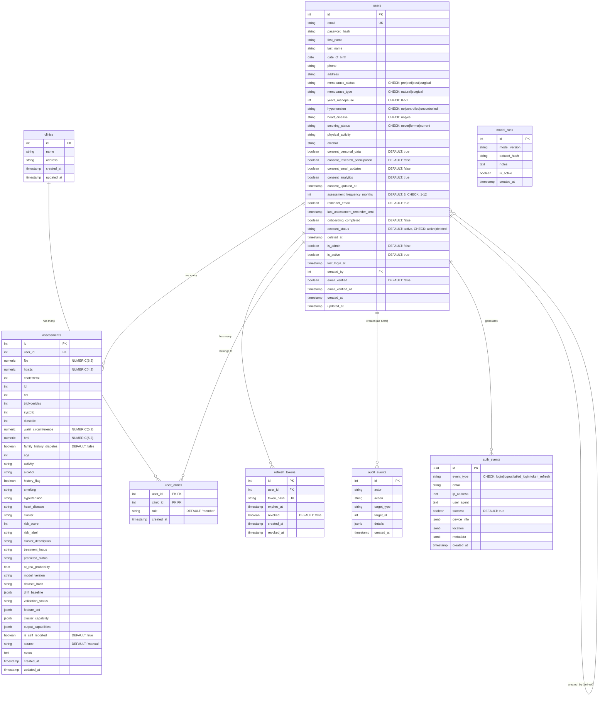

# Diana Database ERD

## Entity Relationship Diagram

---

## Table Definitions

### users
The central entity representing platform users. After migration 0011, this table combines authentication and health profile data (previously split between users and patients tables).

**Key Fields:**
- **menopause_status**: Clinical stage (pre/peri/post/surgical)
- **account_status**: Soft delete support (active/deleted)
- **is_admin**: Legacy boolean role flag
- **role**: Extended roles (user/admin/doctor) from migration 0014
- **created_by**: Self-referential FK for admin-created accounts

### assessments
ML prediction records linked to users. Contains both input biomarkers and ML output fields.

**Key Fields:**
- **cluster**: Ahlqvist diabetes subtype (SIRD, SIDD, MOD, MARD)
- **risk_score**: Numeric risk score from ML model
- **model_version**: Tracks which ML model version generated the prediction
- **dataset_hash**: For model lineage and drift detection
- **is_self_reported**: Distinguishes user-entered vs device-synced data

### refresh_tokens
JWT refresh token storage for session management. Tokens are hashed before storage.

### clinics & user_clinics
Multi-tenant support allowing users to belong to multiple clinics with different roles.

### model_runs
Tracks ML model training runs for reproducibility and audit trails.

### audit_events
Admin action logging with JSONB details for flexible schema.

### auth_events
Real-time authentication monitoring with geolocation and device parsing (SSE streaming support).

---

## Indexes

### Performance Indexes

| Table | Index | Purpose |
|-------|-------|---------|
| users | idx_users_email | Login lookups |
| users | idx_users_menopause_status | Cohort filtering |
| users | idx_users_account_status | Soft delete filtering |
| users | idx_users_role | Admin queries |
| users | idx_users_is_active | Active user filtering |
| assessments | idx_assessments_user_id_created | User timeline queries |
| assessments | idx_assessments_created_at | Time-series analysis |
| assessments | idx_assessments_cluster | Cluster analytics |
| assessments | idx_assessments_risk_score | Risk filtering |
| refresh_tokens | idx_refresh_tokens_user_id | User session lookup |
| refresh_tokens | idx_refresh_tokens_token_hash | Token validation |
| refresh_tokens | idx_refresh_tokens_expires_at | Cleanup queries |
| auth_events | idx_auth_events_created_at | Recent events |
| auth_events | idx_auth_events_email | User audit |
| auth_events | idx_auth_events_type | Event filtering |
| audit_events | idx_audit_events_created_at | Chronological sorting |
| audit_events | idx_audit_events_actor | Admin action queries |
| user_clinics | idx_user_clinics_user | User clinic lookup |
| user_clinics | idx_user_clinics_clinic | Clinic member lookup |

---

## Constraints

### Check Constraints

| Table | Column | Constraint |
|-------|--------|------------|
| users | menopause_status | IN ('pre', 'peri', 'post', 'surgical') |
| users | menopause_type | IN ('natural', 'surgical') |
| users | years_menopause | >= 0 AND <= 50 |
| users | hypertension | IN ('no', 'controlled', 'uncontrolled') |
| users | heart_disease | IN ('no', 'yes') |
| users | smoking_status | IN ('never', 'former', 'current') |
| users | assessment_frequency_months | >= 1 AND <= 12 |
| users | account_status | IN ('active', 'deleted') |
| users | role | IN ('user', 'admin', 'doctor') |
| auth_events | event_type | IN ('login', 'logout', 'failed_login', 'token_refresh') |

### Foreign Keys

| Table | Column | References | On Delete |
|-------|--------|------------|-----------|
| assessments | user_id | users(id) | CASCADE |
| refresh_tokens | user_id | users(id) | CASCADE |
| user_clinics | user_id | users(id) | CASCADE |
| user_clinics | clinic_id | clinics(id) | CASCADE |
| users | created_by | users(id) | - |

---

## Schema Evolution Notes

### Migration 0011: The Great Refactor
- **Removed**: `patients` table
- **Changed**: Assessments now link directly to `users` via `user_id`
- **Added**: All health profile fields moved to `users` table
- **Impact**: B2B clinician-patient model → B2C direct-to-consumer platform

### Migration 0014: Role Extension
- Added `role` column with extended roles (user/admin/doctor)
- Maintains backward compatibility with `is_admin` boolean

### Migration 0019: Assessment Enrichment
- Added `waist_circumference` for metabolic syndrome indicators
- Added `family_history_diabetes` for genetic risk factors

### Migration 0020: Privacy Compliance
- Removed `race_ethnicity` column from assessments

### Migration 0021: Cleanup
- Removed unused tables: `notification_queue`, `email_verification_tokens`, `password_reset_tokens`

---

## Data Types Reference

| Type | PostgreSQL | Usage |
|------|------------|-------|
| Primary Keys | SERIAL | Auto-incrementing integers |
| UUID | UUID | auth_events.id (gen_random_uuid()) |
| Numeric | NUMERIC(p,s) | Precise decimal values (biomarkers) |
| JSONB | JSONB | Flexible metadata storage |
| Timestamps | TIMESTAMPTZ | UTC timestamps with timezone |
| IP Address | INET | auth_events.ip_address |
| Boolean | BOOLEAN | Flags and status fields |
| Text | TEXT | Variable-length strings |
| Integers | INT/SMALLINT | Whole numbers and enums |

---

## Generation Timestamp
Generated: 2026-03-16
Schema Version: 0021
