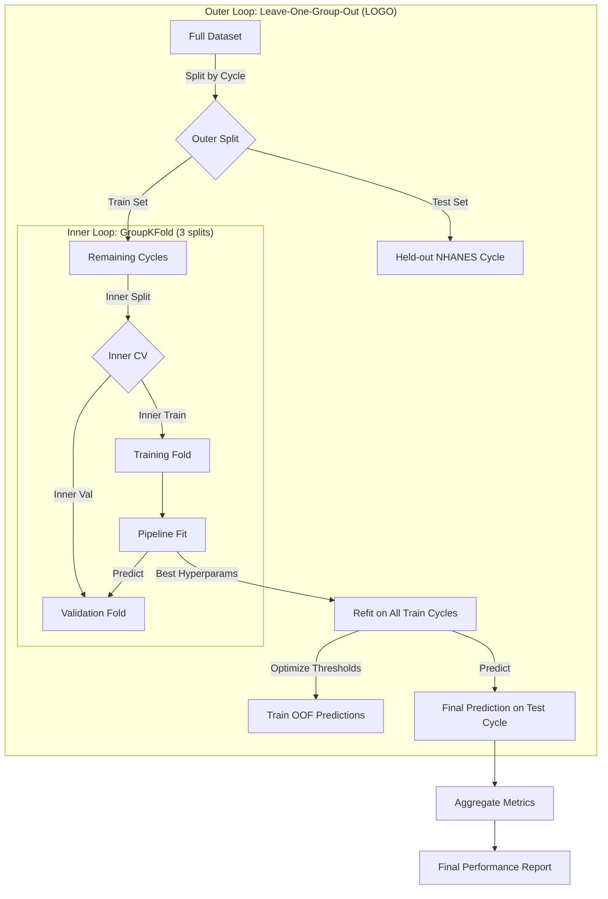

# LOCO Implementation Details: Technical Documentation

This document details the **Leave-One-Cycle-Out (LOCO)** cross-validation strategy implemented in `Ian_ML/training/train_binary_v2_no_bp.py`. This approach is designed to simulate temporal generalization and provide a defensible evaluation of the Diana V2 binary screening model.

## 1. High-Level Strategy: Nested Cross-Validation

The implementation uses a **Nested Cross-Validation** design to ensure unbiased performance estimation and hyperparameter tuning.

### Why Nested CV?
- **Outer Loop (Performance Estimation):** Estimates how well the model generalizes to unseen data (new NHANES cycles).
- **Inner Loop (Model Selection):** Selects the best hyperparameters for the model using only the training data available in that outer fold.

### Why LOCO?
- **Temporal Generalization:** By holding out an entire NHANES survey cycle (e.g., 2017-2018), we test if the model learns robust biological signals rather than batch effects specific to a single survey year.
- **Group Independence:** Prevents data leakage that could occur if random splitting separated patients from the same survey cycle.

## 2. Architecture Diagram



## 3. Leakage Prevention Mechanisms

To ensure the evaluation is defensible, strict leakage prevention is implemented:

### A. Pipeline Encapsulation
Data preprocessing steps are wrapped inside a `scikit-learn` Pipeline. This ensures that statistics (mean, median, variance) are calculated **only** on the training split of each fold.

```python
pipeline = Pipeline([
    ("imputer", SimpleImputer(strategy="median")),  # Fit on train only
    ("scaler", StandardScaler()),                   # Fit on train only
    ("model", cfg["estimator"])                     # Fit on train only
])
```

### B. Group-Aware Splitting
Both outer and inner loops respect group boundaries:
- **Outer Loop:** `LeaveOneGroupOut` prevents a cycle from being in both train and test.
- **Inner Loop:** `GroupKFold` prevents a cycle from being in both inner-train and inner-validation.

### C. Threshold Optimization on OOF
The decision thresholds for "at-risk" classification are tuned using **Out-Of-Fold (OOF)** predictions from the inner cross-validation.
- **Crucial:** The test set (held-out cycle) is **NEVER** used to tune thresholds.
- **Mechanism:** `cross_val_predict` generates predictions for the training data as if they were unseen, allowing us to find optimal thresholds without touching the true test set.

## 4. Threshold Optimization Logic

The model optimizes a single probability threshold for **At-Risk** classification (combining Pre-diabetic and Diabetic) to prioritize sensitivity for screening.

### Multi-Strategy Evaluation
The optimization evaluates the target metric across three distinct strategies on the Out-Of-Fold (OOF) predictions:
1. **Youden's J** ($\text{Sensitivity} + \text{Specificity} - 1$): The standard clinical threshold for balanced accuracy.
2. **Screening**: Maximizes a weighted sum of sensitivity ($60\%$) and F1 ($40\%$), subject to keeping specificity $\ge 0.40$ and sensitivity $\ge 0.75$.
3. **G-mean** ($\sqrt{\text{Sensitivity} \times \text{Specificity}}$): Penalizes extreme imbalances.

### Optimization Objective: `composite score`
After finding the best threshold for each of the three strategies, the overall winner is selected by maximizing a composite score that ensures we value recall highly but still reward meaningful specificity:

$$
\text{Composite Score} = 0.35 \times \text{Sensitivity} + 0.30 \times \text{Specificity} + 0.25 \times \text{F1} + 0.10 \times \text{Accuracy}
$$

### Algorithm
1. **Grid Search:** Iterate through possible thresholds from 0.10 to 0.90 in 0.01 increments.
2. **Evaluate Strategies:** Find the optimal threshold for Youden, Screening, and G-mean.
3. **Select Best:** Evaluate the composite score for the three proposed thresholds, and select the one that yields the highest score.

## 5. Final Model & Serving

After the evaluation is complete, the final model for production is trained on **all available data**.
- **Hyperparameters:** Re-tuned using the same internal GroupKFold strategy.
- **Calibration:** Probability calibration (Sigmoid) is applied to ensure predicted probabilities match observed risk.
- **Thresholds:** Re-optimized using LOCO OOF predictions on the full dataset.

## 6. Verification Trace

The implementation in `train_binary_v2_no_bp.py` has been verified against these principles:
- [x] **Outer Loop:** Verified use of `LeaveOneGroupOut` (lines 396, 412).
- [x] **Inner Loop:** Verified use of `GroupKFold` (lines 199, 417).
- [x] **Pipeline:** Verified `Imputer` and `Scaler` are inside Pipeline (lines 422-425).
- [x] **No Leakage:** Verified thresholds tuned on `train_oof_proba` (line 461), applied to `test_proba` (line 466).

This robust design ensures that reported metrics are a realistic estimate of how the model will perform on future patient populations.
