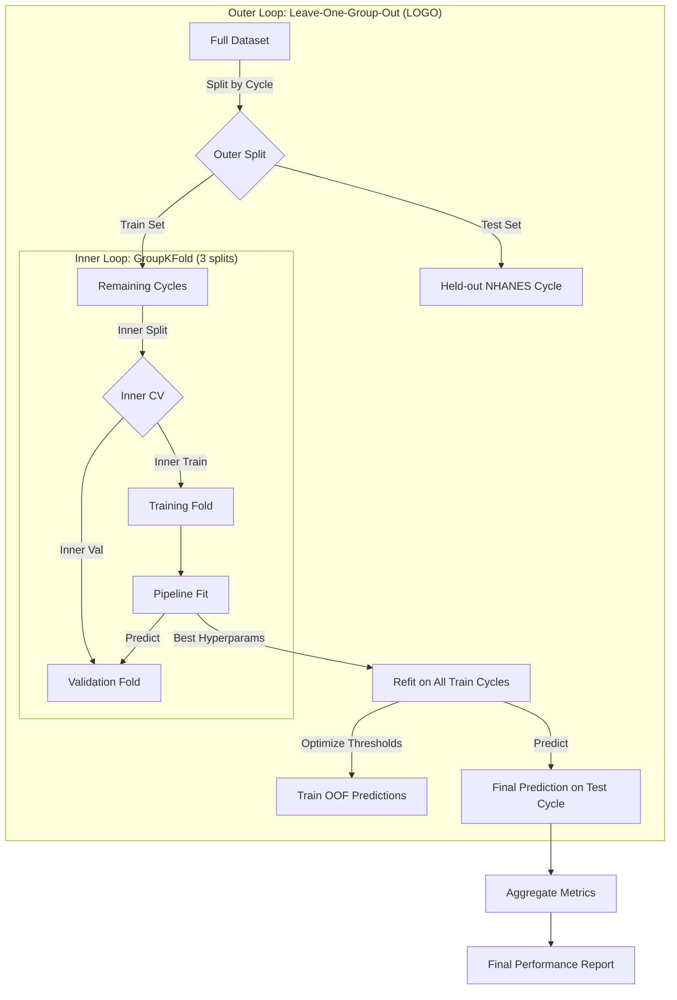

# LOCO Implementation Details: Technical Documentation

This document details the **Leave-One-Cycle-Out (LOCO)** cross-validation strategy implemented in `Ian_ML/training/train_v2.py`. This approach is designed to simulate temporal generalization and provide a defensible evaluation of the Diana V2 clinical model.

## 1. High-Level Strategy: Nested Cross-Validation

The implementation uses a **Nested Cross-Validation** design to ensure unbiased performance estimation and hyperparameter tuning.

### Why Nested CV?
- **Outer Loop (Performance Estimation):** Estimates how well the model generalizes to unseen data (new NHANES cycles).
- **Inner Loop (Model Selection):** Selects the best hyperparameters for the model using only the training data available in that outer fold.

### Why LOCO?
- **Temporal Generalization:** By holding out an entire NHANES survey cycle (e.g., 2017-2018), we test if the model learns robust biological signals rather than batch effects specific to a single survey year.
- **Group Independence:** Prevents data leakage that could occur if random splitting separated patients from the same survey cycle.

## 2. Architecture Diagram



## 3. Leakage Prevention Mechanisms

To ensure the evaluation is defensible, strict leakage prevention is implemented:

### A. Pipeline Encapsulation
Data preprocessing steps are wrapped inside a `scikit-learn` Pipeline. This ensures that statistics (mean, median, variance) are calculated **only** on the training split of each fold.

```python
pipeline = Pipeline([
    ("imputer", SimpleImputer(strategy="median")),  # Fit on train only
    ("scaler", StandardScaler()),                   # Fit on train only
    ("model", cfg["estimator"])                     # Fit on train only
])
```

### B. Group-Aware Splitting
Both outer and inner loops respect group boundaries:
- **Outer Loop:** `LeaveOneGroupOut` prevents a cycle from being in both train and test.
- **Inner Loop:** `GroupKFold` prevents a cycle from being in both inner-train and inner-validation.

### C. Threshold Optimization on OOF
The decision thresholds for "at-risk" classification are tuned using **Out-Of-Fold (OOF)** predictions from the inner cross-validation.
- **Crucial:** The test set (held-out cycle) is **NEVER** used to tune thresholds.
- **Mechanism:** `cross_val_predict` generates predictions for the training data as if they were unseen, allowing us to find optimal thresholds without touching the true test set.

## 4. Threshold Optimization Logic

The model optimizes distinct probability thresholds for **Pre-diabetic** and **Diabetic** classes to prioritize sensitivity (recall) for at-risk patients.

### Optimization Objective: `selection_score`
The optimization maximizes a weighted score that heavily penalizes missing an at-risk patient:

$$
\text{Score} = 0.45 \times \text{Recall}_{\text{Diabetic}} + 0.30 \times \text{Recall}_{\text{Pre-diabetic}} + 0.20 \times \text{AUC} + 0.05 \times \text{MacroF1}
$$

### Algorithm
1. **Grid Search:** Iterate through possible threshold combinations:
   - Pre-diabetic threshold: 0.25 to 0.65
   - Diabetic threshold: 0.20 to 0.60
2. **Apply Logic:**
   - If $P(\text{Diabetic}) \ge T_{\text{diab}} \rightarrow$ Predict **Diabetic**
   - Else if $P(\text{Pre-diabetic}) \ge T_{\text{pre}} \rightarrow$ Predict **Pre-diabetic**
   - Else $\rightarrow$ Predict **Normal**
3. **Select Best:** Choose thresholds that maximize the `selection_score` on the training OOF data.

## 5. Final Model & Serving

After the evaluation is complete, the final model for production is trained on **all available data**.
- **Hyperparameters:** Re-tuned using the same internal GroupKFold strategy.
- **Calibration:** Probability calibration (Sigmoid) is applied to ensure predicted probabilities match observed risk.
- **Thresholds:** Re-optimized using LOCO OOF predictions on the full dataset.

## 6. Verification Trace

The implementation in `train_v2.py` has been verified against these principles:
- [x] **Outer Loop:** Verified use of `LeaveOneGroupOut` (lines 926, 943).
- [x] **Inner Loop:** Verified use of `GroupKFold` (line 145).
- [x] **Pipeline:** Verified `Imputer` and `Scaler` are inside Pipeline (lines 952-958).
- [x] **No Leakage:** Verified thresholds tuned on `train_oof_proba` (line 988), applied to `test_proba` (line 992).

This robust design ensures that reported metrics are a realistic estimate of how the model will perform on future patient populations.
